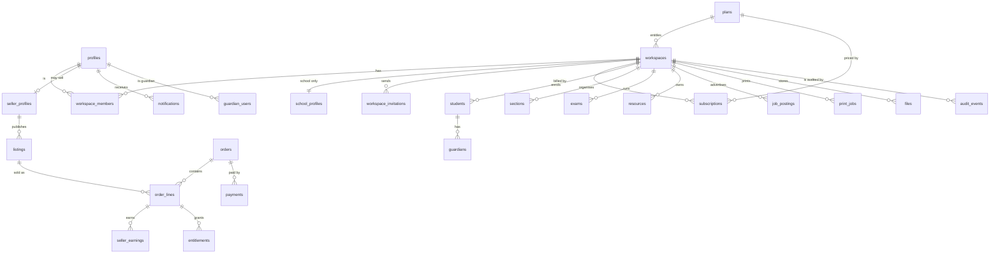
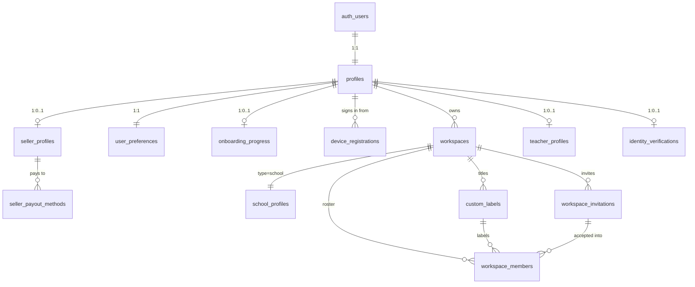
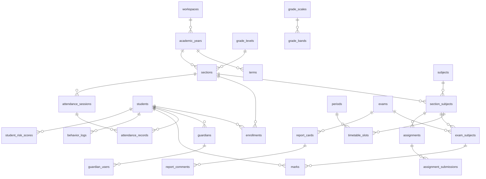
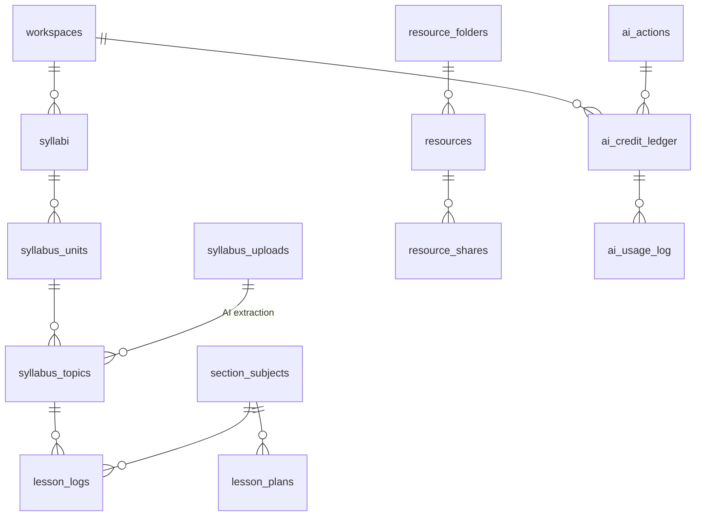
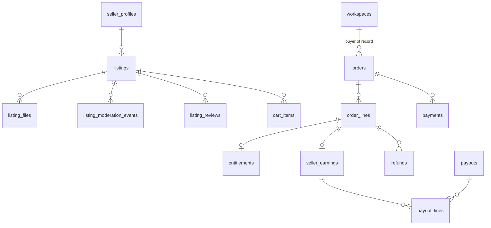
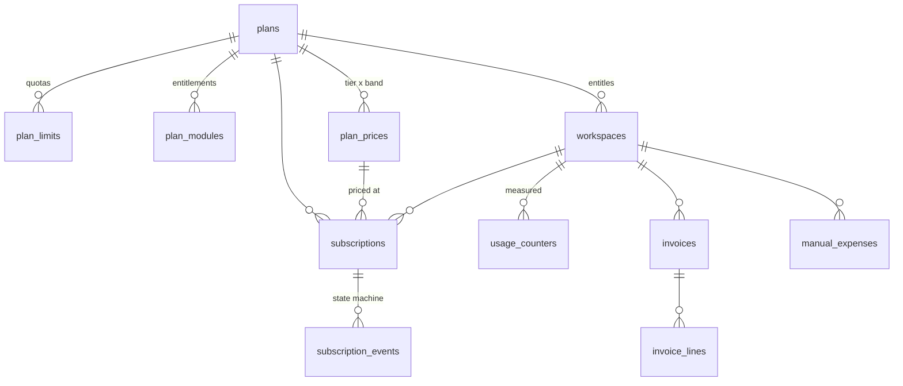
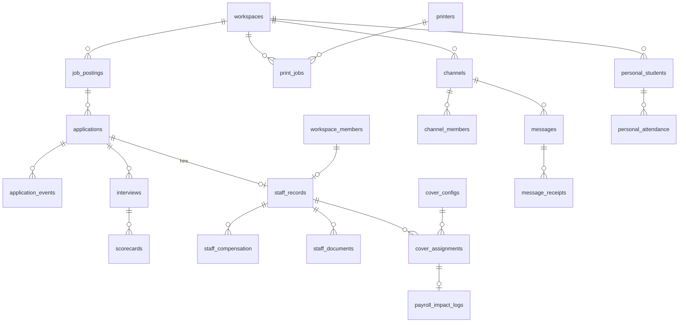

# Acadigma Campus — Data Model

The canonical schema. `ARCHITECTURE.md` fixes _how_ we build; `PRODUCT-DECISIONS.md` fixes _what_; this document is the single answer to _where does this fact live and who may read it_. If a feature needs a table or a column that is not here, this document changes in the same PR.

Related: `docs/product/PRODUCT-DECISIONS.md` · `docs/architecture/ARCHITECTURE.md` (§3 tenancy and §4 data conventions are binding on everything below) · `docs/architecture/MIGRATION-FROM-BASE44.md` (what each of the 64 prototype entities became) · `supabase/migrations/` · `supabase/tests/`.

---

## 0. The rules everything obeys

| Rule                                                                                                                                                                                                                                                                                          | Consequence                                                                                                      |
| --------------------------------------------------------------------------------------------------------------------------------------------------------------------------------------------------------------------------------------------------------------------------------------------- | ---------------------------------------------------------------------------------------------------------------- |
| **One tenant key.** Every tenant-scoped table has `workspace_id uuid not null references workspaces`. No `school_id`, no `teacher_id`, no `'default'`.                                                                                                                                        | One RLS helper, one policy template, one test. PRODUCT-DECISIONS 1.6.                                            |
| **Membership is the only truth.** `workspace_members(workspace_id, user_id, role, status)`. RLS never reads a client-supplied value.                                                                                                                                                          | `app.member_role()` returns NULL for `pending` and `removed`, so access dies the moment status changes.          |
| **Policies check membership _and_ role**, never the tenant id alone.                                                                                                                                                                                                                          | A parent can never read a row an admin gates. This is the single correction the Base44 security review demanded. |
| **Ids.** `id uuid primary key default gen_random_uuid()` for domain rows; `bigint generated always as identity` for high-volume append-only logs (`audit_events`, `file_access_log`, `notifications`, `email_log`, `app.jobs`, `app.inbound_events`) where insert order is the natural order. |
| **Money.** `bigint` **paisa** + `currency char(3)` (always `BDT` in v1). ৳2,999 is `299900`. Never `numeric`, never float.                                                                                                                                                                    |
| **Rates.** Basis points as `integer`. 30 % commission is `3000`; 75 % attendance minimum is `7500`.                                                                                                                                                                                           |
| **Time.** `timestamptz` for instants; `date` for calendar dates (attendance date, exam date, billing period); `time` for wall-clock (period start, attendance cutoff). "Today" = `(now() at time zone school_profiles.timezone)::date`.                                                       |
| **Audit.** `app.tg_audit()` on every tenant table, in the same transaction as the mutation. `audit_events` has no UPDATE/DELETE for any role.                                                                                                                                                 |
| **`updated_at`.** `app.tg_set_updated_at()` on every table with the column. Never set from the client.                                                                                                                                                                                        |
| **Tenant freeze.** `app.tg_freeze_workspace()` on every tenant table: `workspace_id` is immutable.                                                                                                                                                                                            |
| **Soft delete** only where users expect undo — `students`, `resources`, `listings`, `files`, `lesson_plans`, `manual_expenses`. Everywhere else, hard delete plus the audit row.                                                                                                              |
| **Enums** are Postgres enums, mirrored in `packages/contracts` and compared by a parity test.                                                                                                                                                                                                 |

### 0.1 Naming

**Identifiers are American English.** `behavior_logs`, `behavior_categories`, `behavior_term_scores`, `enrollments`, `catalog` — in table names, column names, enum values and TypeScript alike. British spelling belongs only in UI copy, where Bangladeshi schools expect it ("Behaviour", "Enrolment"). Mixing the two inside identifiers produces the failure mode where half the team greps for `behaviour_` and finds nothing, and a migration ships with both spellings live. The rule is worth more than the aesthetics of either side. (ARCHITECTURE §4 carries the same rule.)

Tables are plural snake_case. Join tables are `<left>_<right>` (`guardian_users`, `channel_members`). Boolean columns read as assertions (`is_sensitive`, `auto_renew`). Money columns end in `_paisa`; rate columns end in `_bp`. Every FK column is `<referenced_table_singular>_id`.

### 0.2 Policy classes

RLS is repetitive by design. Rather than restate it 105 times, every table below names one of these classes plus its deviations. The literal SQL for each class is in §11.

| Class                  | SELECT                                                                               | INSERT                                                      | UPDATE                          | DELETE                                |
| ---------------------- | ------------------------------------------------------------------------------------ | ----------------------------------------------------------- | ------------------------------- | ------------------------------------- |
| **T1** tenant-standard | active members `{owner,admin,teacher,staff}`                                         | `{owner,admin,teacher}`                                     | `{owner,admin,teacher}`         | `{owner,admin}`                       |
| **T2** tenant-admin    | active members (any role except `parent`)                                            | `{owner,admin}`                                             | `{owner,admin}`                 | `{owner,admin}`                       |
| **T3** owner-of-row    | active members `{owner,admin,teacher,staff}`                                         | `{owner,admin,teacher,staff}` and `created_by = auth.uid()` | row creator, or `{owner,admin}` | row creator, or `{owner,admin}`       |
| **T4** parent-visible  | **T1**, plus `app.is_guardian_of(student_id)` when the row is flagged parent-visible | as T1                                                       | as T1                           | as T1                                 |
| **U1** user-scoped     | `user_id = (select auth.uid())`                                                      | same                                                        | same                            | same                                  |
| **P1** platform        | a public slice to `anon, authenticated`; every write `app.is_platform_admin()`       |                                                             |                                 |                                       |
| **A1** append-only     | narrow read (owner / platform)                                                       | _no policy_ — rows come from a `security definer` writer    | _refused by trigger_            | _refused by trigger_                  |
| **S1** server-only     | RLS enabled, **zero policies**, no grants to `anon`/`authenticated`                  |                                                             |                                 |                                       |
| **M1** marketplace     | `status='published'` to `anon, authenticated`, plus own rows, plus platform          | seller owns the row                                         | seller (own) or platform        | seller (own, pre-publish) or platform |

Two mechanics to keep in mind when reading these:

- `TO authenticated` alone is authentication without authorization. Every class above pairs it with a predicate.
- Every UPDATE policy carries both `USING` and `WITH CHECK`; without `WITH CHECK` a row can be reassigned to another tenant. Where the rule needs to compare OLD against NEW (self-role edits, `is_platform_admin`, tenant moves), a `BEFORE` trigger does it, because a policy cannot see both.

### 0.3 Module map

| Module     |  Tables | Shipped |
| ---------- | ------: | ------- |
| identity   |      13 | 9       |
| academics  |      29 | 4       |
| teaching   |      15 | —       |
| commerce   |      15 | —       |
| billing    |      11 | 7       |
| fees       |       9 | —       |
| operations |      24 | —       |
| platform   |      11 | 9       |
| jobs       |       4 | 4       |
| **total**  | **129** | **33**  |

"Shipped" = present in `supabase/migrations/` today (the four foundation migrations). The rest are specified here and land with their feature migrations.

### 0.5 Three documented exceptions to the tenant rule

The rule in §0 is "every tenant-scoped table has `workspace_id`". Three groups are deliberately _not_ tenant-scoped, and each is a decision rather than an oversight.

| Group                                                                                                                                                | Scope                       | Why                                                                                                                                                                                                                                                                                                       |
| ---------------------------------------------------------------------------------------------------------------------------------------------------- | --------------------------- | --------------------------------------------------------------------------------------------------------------------------------------------------------------------------------------------------------------------------------------------------------------------------------------------------------- |
| `profiles`, `user_preferences`, `device_registrations`, `onboarding_progress`                                                                        | **user**                    | A person, their theme, their phones and their in-progress onboarding exist independently of any workspace. Preferences that reset when you switch schools would be a bug, and onboarding runs before a workspace_id is even resolvable.                                                                   |
| `seller_profiles`, `seller_kyc_submissions`, `seller_payout_methods`, `listings`, `listing_files`, `seller_earnings`, `payouts`, `seller_statements` | **user** (`seller_user_id`) | Selling is a per-user capability, not a workspace feature (PRODUCT-DECISIONS 1.8). There is no seller workspace, and a teacher who leaves a school keeps their storefront. Policies key on `seller_user_id = (select auth.uid())` plus a platform-admin branch; published listings are globally readable. |
| `plans`, `plan_limits`, `plan_modules`, `plan_prices`, `ai_actions`, `credit_packs`, `platform_settings`                                             | **global**                  | A catalogue: one row set read by every tenant, written only by platform staff.                                                                                                                                                                                                                            |

Buyer-side commerce is the mirror image and _is_ tenant-scoped: `orders`, `order_lines`, `payments`, `entitlements`, `purchase_approvals` and `download_log` all carry `workspace_id`, because the buyer of record is either a school workspace (school-funded) or the buyer's own personal workspace. `buyer_user_id` records who clicked.

### 0.4 Overview



---

## 1. Identity

Thirteen tables. Eight ship in `0002_identity.sql`; `onboarding_progress` lands with F-ID-05 Part 2; `seller_profiles`, `seller_payout_methods`, `teacher_profiles` and `identity_verifications` land with commerce and hiring.



### 1.1 `profiles` — public identity for an `auth.users` row

Not tenant-scoped: a person exists independently of any workspace.

| Column                      | Type                                   | Null | Default |
| --------------------------- | -------------------------------------- | ---- | ------- |
| `id`                        | uuid **PK** → `auth.users(id)` cascade | no   | —       |
| `full_name`                 | text                                   | no   | `''`    |
| `display_name`              | text                                   | yes  | —       |
| `email`                     | text, `check email = lower(email)`     | yes  | —       |
| `phone`                     | text                                   | yes  | —       |
| `avatar_url`                | text                                   | yes  | —       |
| `bio`                       | text                                   | yes  | —       |
| `locale`                    | text, `in ('en','bn')`                 | no   | `'en'`  |
| `is_platform_admin`         | boolean                                | no   | `false` |
| `last_active_workspace_id`  | uuid → `workspaces` set null           | yes  | —       |
| `onboarding_completed_at`   | timestamptz                            | yes  | —       |
| `suspended_at`              | timestamptz                            | yes  | —       |
| `last_seen_at`              | timestamptz                            | yes  | —       |
| `created_at` / `updated_at` | timestamptz                            | no   | `now()` |

**Tenant key** — none (user-scoped).
**Indexes** — `unique (email) where email is not null`: invitations and "invite an existing teacher" resolve a person by address, and this guarantees one profile per address. `(id) where is_platform_admin`: `app.is_platform_admin()` runs in nearly every platform policy; a partial index over a handful of rows keeps it index-only.
**RLS** — SELECT: self, **or** platform staff, **or** `app.shares_active_workspace(id)` — which requires the _viewer_ to be `{owner,admin,teacher,staff}` in a shared workspace, so a parent can never enumerate a school's staff. INSERT: `id = (select auth.uid())`. UPDATE: self, plus a separate platform-staff policy. No DELETE policy — profiles die with their `auth.users` row.
**Triggers** — `app.tg_set_updated_at`; `app.tg_profiles_guard` (SECURITY INVOKER) refuses any self-change of `is_platform_admin` or `suspended_at`; audit with `phone`/`email` redacted.
**Soft delete** — no.

> `last_active_workspace_id` is a UX hint and **never** an authorization input. Writing a workspace id into the user's own record was the Base44 root cause; here the server re-derives context in `app.set_workspace_context()`.

### 1.2 `workspaces` — the tenant

| Column                                     | Type                                                 | Null | Default                      |
| ------------------------------------------ | ---------------------------------------------------- | ---- | ---------------------------- |
| `id`                                       | uuid **PK**                                          | no   | `gen_random_uuid()`          |
| `type`                                     | `workspace_type` (`school`,`personal`)               | no   | —                            |
| `name`                                     | text, 1–160 chars                                    | no   | —                            |
| `slug`                                     | text, `^[a-z0-9][a-z0-9-]{1,78}$`                    | no   | —                            |
| `owner_id`                                 | uuid → `profiles` **restrict**                       | no   | —                            |
| `status`                                   | `workspace_status` (`active`,`suspended`,`archived`) | no   | `'active'`                   |
| `access_mode`                              | `access_mode` (`normal`,`read_only`)                 | no   | `'normal'`                   |
| `access_mode_reason`                       | text                                                 | yes  | —                            |
| `access_mode_set_at`                       | timestamptz                                          | yes  | —                            |
| `plan_id`                                  | uuid → `plans` restrict                              | yes  | set by the billing bootstrap |
| `trial_ends_at`                            | timestamptz                                          | yes  | —                            |
| `invite_code`                              | text, school only                                    | yes  | generated on insert          |
| `invite_code_rotated_at`                   | timestamptz                                          | yes  | —                            |
| `logo_url`                                 | text                                                 | yes  | —                            |
| `hidden_modules`                           | text[]                                               | no   | `{}`                         |
| `settings`                                 | jsonb                                                | no   | `{}`                         |
| `created_at` / `updated_at` / `created_by` |                                                      |      |                              |

**Tenant key** — `id` _is_ the tenant key; the audit trigger falls back to it.
**Indexes** — `unique (slug)`. `unique (invite_code) where invite_code is not null`: join-by-code probes this on every attempt and two schools must never share a code. `unique (created_by) where type='personal'` (`workspaces_one_personal_per_creator`, F-ID-05 Part 1): exactly one personal workspace per creator, ever (PRODUCT-DECISIONS 1.2) — `created_by` rather than `owner_id` because ownership can be transferred (`app.transfer_ownership()`, school workspaces only) while `created_by` is the "who this was made for" fact recorded at registration. **Not sufficient alone**: `created_by` must also be immutable and personal-type inserts must be blocked for authenticated clients (both below), or `NULL`-ing a row's `created_by` then inserting a fresh `type='personal'` row defeats the index entirely (a real gap, closed in the same migration that added the index, `20260925000100_personal_workspace_uniqueness.sql`). `(owner_id)`: FK column, "workspaces I own", ownership transfer. `(plan_id) where not null`: FK column, /platform plan breakdown. `(trial_ends_at) where trial_ends_at is not null and status='active'`: the nightly trial-expiry job scans only live trials. `(created_by, type, created_at) where created_by is not null` (`workspaces_created_by_type_created_idx`, D-100): the 3-schools-per-day count inside `create_school_workspace`.
**RLS** — SELECT `app.member_role(id) is not null` or platform. INSERT: **none, and no INSERT grant** (D-100): a school is created only by `public.create_school_workspace(jsonb)` and a personal workspace only by `app.handle_new_user()`, both SECURITY DEFINER. (F-ID-05 Part 1 had narrowed the client policy to `type = 'school'`; Part 4 removed it because a direct insert skipped the per-day limit, suspension check and membership cap.) UPDATE `{owner,admin}`, plus a platform policy. DELETE platform only — tenants archive.
**Triggers** — `tg_workspace_defaults` (BEFORE INSERT: invite code for schools, none for personal); `tg_workspace_billing_defaults` (BEFORE INSERT, D-59: sets `plan_id` — Free for personal, Pro for schools — and, for schools, `trial_ends_at`, directly on `NEW`, no `UPDATE` statement); `tg_workspace_bootstrap` (AFTER INSERT: owner membership + `school_profiles` row); `tg_workspace_billing_bootstrap` (AFTER INSERT, narrowed by D-59: creates the school's `subscriptions` + `subscription_events` rows only, reading `plan_id`/`trial_ends_at` already set by `tg_workspace_billing_defaults` — no longer performs any `UPDATE` against `workspaces`); `tg_workspaces_guard` (BEFORE UPDATE: `type`, `owner_id`, `invite_code`, `created_by` immutable for everyone — `created_by` since F-ID-05 Part 1; `plan_id`, `trial_ends_at`, `status` platform-only). Before D-59, the billing bootstrap's nested `UPDATE` of `plan_id`/`trial_ends_at` tripped this very check for any workspace INSERT made as `authenticated` — see `20260925000200_billing_bootstrap_vs_workspace_guard.sql` and `supabase/tests/16_billing_bootstrap_guard.sql`; `updated_at`; audit.
**Soft delete** — no (`status = 'archived'`).

`owner_id` is `ON DELETE RESTRICT` on purpose: deleting an account that still owns a workspace must fail loudly. Account deletion transfers ownership (`app.transfer_ownership`) or archives the workspace first.

**Read-only mode is workspace-level, and RLS does not enforce it** — a write-only trigger does (D-300, below). When a trial expires or dunning fails, the job calls `app.set_access_mode(workspace_id, 'read_only', reason)`. Server actions check `access_mode` before any write and return `PLAN_READ_ONLY`; the UI shows the banner and the upgrade path. RLS is deliberately left out of it for two reasons: an over-quota school must still be able to read, export and _pay_, and a billing state encoded into a hundred policies is both a per-row cost on every query and the worst possible place to put a billing bug. The mode is cleared in the same transaction as the successful upgrade payment, so a school is never left paid-but-locked.

**D-300 — the database refuses writes too (`20260925300100_require_writable_guard.sql`).** `app.tg_require_writable()`, a `security definer` BEFORE INSERT/UPDATE/DELETE row trigger named `require_writable`, raises `PLAN_READ_ONLY` (`42501`, the reason in `DETAIL`) when the row's workspace is `read_only` — so a direct PostgREST write is refused even when no server action runs. It never touches reads, so the reasons above for keeping billing out of RLS still hold. Privileged callers (service role, the billing tick, the seed) and platform staff pass, so `app.set_access_mode(..., 'normal')` can always lift the mode. Removing access always passes: a member's `status` set to `removed` (nothing else changed), deleting a membership, deleting or revoking a capability, and revoking/declining an invitation. Only an active member is refused by the trigger; a non-member's write is always left to RLS, so a stranger gets the same refusal whatever the mode and never learns it (D-301, `20260925300201_readonly_join_check.sql`). Joining a read-only school is refused inside `app.accept_invitation()` and `app.join_workspace_by_code()` themselves, after the token/binding or code is verified, with `PLAN_READ_ONLY` and "Ask the owner to upgrade." Attached with `app.attach_require_writable(table, column)` (idempotent, trigger `require_writable_<schema>_<table>`, granted to nobody) to: `workspaces` (column `'id'`), `school_profiles`, `custom_labels`, `workspace_invitations`, `workspace_members`, `workspace_member_capabilities`, `files`, `staff_records`, `staff_compensation`, `staff_documents`. **Every new table with a `workspace_id` column adds `select app.attach_require_writable('public.<t>');`**, or is added to the exempt list in `supabase/tests/50_require_writable.sql` with its reason; that file's invariant fails CI otherwise. Exempt today: `audit_events`, `file_access_log`, `email_log` (system logs a read can write), `subscriptions`, `subscription_events`, `usage_counters` (billing — the upgrade must write them), `consent_records`, `legal_acceptances`, `data_requests` (the individual's own legal/PDPA records), `notifications` (the recipient's own inbox).

### 1.3 `school_profiles` — 1:1 with `workspaces` where `type='school'`

PK **is** `workspace_id`, so there is no second index. A primary key is still UPDATE-able in Postgres, though — an earlier version of this line claimed the row therefore "cannot move tenants", which is wrong; `app.attach_freeze_workspace()` is what actually makes it immutable (added by F-ID-03 Part 1's `20260917020300_tenancy_hardening.sql`, closing a real gap: an owner/admin of two workspaces could otherwise `UPDATE` this row's `workspace_id` to merge one school's profile onto another they also control, since the `with check` role predicate alone is satisfied on both ends).

Typed columns: **identity** (`legal_name`, `eiin`, `board`, `school_type`, `medium`, `motto`) · **address** (`address_line1/2`, `city` default `Dhaka`, `district`, `postal_code`, `country` default `BD`) · **contact** (`contact_email`, `contact_phone`, `website`) · **calendar** (`timezone` default `Asia/Dhaka`, `working_days smallint[]` default `{6,7,1,2,3,4}` = Sat–Thu in ISO day numbers, `date_format`) · **finance** (`currency` `BDT`, `bin_number`, `vat_number`) · **AI** (`ai_billing_model` — `shared_pool` or `individual_allocation`, owner-changeable per 5.3).

Check constraints keep `working_days` non-empty and inside `{1..7}`, and every policy blob an object.

**The five policy blobs are `jsonb`, not typed columns**, and the Zod schema in `packages/contracts` is the schema of record. One `resolve()` function merges a school's overrides onto the defaults, so exactly one place in the system knows what "unset" means. Typed columns would put that knowledge in three places — column default, Zod default, UI fallback — and they would drift the first time a default changed.

| Blob                | Zod schema               | Keys (default)                                                                                                                                                                                                                                                                                            |
| ------------------- | ------------------------ | --------------------------------------------------------------------------------------------------------------------------------------------------------------------------------------------------------------------------------------------------------------------------------------------------------- |
| `attendance_policy` | `SchoolAttendancePolicy` | `mode` = `daily` or `period` (`daily`), `cutoff` (`"09:15"`), `late_counts_present` (true), `half_day_counts_present` (true), `min_attendance_bp` (7500), `block_exam_on_shortfall` (false); `edit_window_days` (2) is read by `app.attendance_edit_window_days` (D-104) but not yet editable in Settings |
| `academic_settings` | `SchoolAcademicSettings` | `grade_scale_code` (`BD_GPA5`), `pass_mark_percent` (33), `fail_any_subject_zero_gpa` (true), `rank_by` (`gpa_then_total`), `exam_weights` (`{}`)                                                                                                                                                         |
| `cover_policy`      | `SchoolCoverPolicy`      | `missed_punch_grace_minutes` (30), `enable_missed_punch` (false), `cover_credited` (true), `unpaid_absence` (false)                                                                                                                                                                                       |
| `messaging_policy`  | `SchoolMessagingPolicy`  | `parents_can_reply` (true), `announcement_roles` (`["owner","admin"]`), `quiet_hours` (`{}`)                                                                                                                                                                                                              |
| `branding`          | `SchoolBranding`         | `logo_file_id`, `header_line_1`, `header_line_2`, `accent`, `report_footer` — drives every report header, so no report ever hardcodes a school name                                                                                                                                                       |

**RLS** — class **T2**, with SELECT widened to every active member (a teacher needs the timezone and the working week). **Triggers** — `updated_at`, audit, `app.tg_freeze_workspace()` (F-ID-03 Part 1). **Soft delete** — no (cascades from `workspaces`).

**Indexes (F-ID-05 Part 3, D-66)** — `unique (eiin) where eiin is not null` (`school_profiles_eiin_unique`, `20260925000700_school_eiin_availability.sql`): §5's "EIIN ... unique across the platform," partial because most schools have none yet and personal workspaces have no row here at all. A caller filling in the create-school wizard is, by definition, a member of nothing yet, so this class's own SELECT policy (above) gives them no RLS path to "does anyone already have this EIIN" — `public.check_eiin_available(eiin text) returns boolean` (SECURITY DEFINER, same migration) is the boolean-only probe the wizard's step 1 calls instead, same shape as `public.throttle_status` (§1.8a). Granted to `authenticated` only, not `anon` — onboarding requires a signed-in, verified account (§2 of the spec). **Clients cannot change `eiin` by UPDATE** (`app.tg_school_profiles_eiin_guard`, D-100): the unique index would otherwise be an unthrottled EIIN oracle; only the transaction that created the row (i.e. `create_school_workspace`, whose attempts are throttled) may set it.

### 1.4 `workspace_members` — the only source of membership

| Column                                     | Type                                                       | Null | Default             |
| ------------------------------------------ | ---------------------------------------------------------- | ---- | ------------------- |
| `id`                                       | uuid **PK**                                                | no   | `gen_random_uuid()` |
| `workspace_id`                             | uuid → `workspaces` cascade                                | no   | —                   |
| `user_id`                                  | uuid → `profiles` cascade                                  | no   | —                   |
| `role`                                     | `member_role` (`owner`,`admin`,`teacher`,`staff`,`parent`) | no   | `'teacher'`         |
| `status`                                   | `member_status` (`pending`,`active`,`removed`)             | no   | `'pending'`         |
| `label_id`                                 | uuid → `custom_labels` set null                            | yes  | —                   |
| `employee_code`                            | text (`app.next_id(ws,'staff')`)                           | yes  | —                   |
| `department`                               | text                                                       | yes  | —                   |
| `subjects`                                 | text[]                                                     | no   | `{}`                |
| `phone`                                    | text                                                       | yes  | —                   |
| `invitation_id`                            | uuid → `workspace_invitations` set null                    | yes  | —                   |
| `invited_by` / `removed_by`                | uuid → `profiles` set null                                 | yes  | —                   |
| `joined_at` / `removed_at`                 | timestamptz                                                | yes  | —                   |
| `created_at` / `updated_at` / `created_by` |                                                            |      |                     |

**Indexes** — `unique (workspace_id, user_id)`: one membership per person per workspace, and the exact index `app.member_role()`/`app.has_role()` probe on _every_ policy evaluation in the product. `(user_id, workspace_id) where status='active'`: "my workspaces" at login and `app.shares_active_workspace()`. `(workspace_id, role) where status='active'`: role rosters, "notify all admins", the last-owner count. `(workspace_id, status, created_at desc)`: the pending-approvals tab. `unique (workspace_id, employee_code) where employee_code is not null`: TCH-2026-0031 is unique inside a school. `(label_id) where not null`: FK column.

**RLS** —

- SELECT: `user_id = (select auth.uid())` **or** `app.has_role(workspace_id, '{owner,admin,teacher,staff}')` **or** platform. `parent` is deliberately absent: a parent reads their own row and nothing else.
- INSERT: `app.has_role(workspace_id,'{owner,admin}')` only. Self-service never goes through RLS — `app.join_workspace_by_code()` and `app.accept_invitation()` are the only self-service paths and both force role and status. This closes Base44 finding 2 (`WorkspaceMember.create` was `{}`).
- UPDATE: two policies — `{owner,admin}` for managing others, and `user_id = (select auth.uid())` so a member can maintain their own phone/department/subjects. The guard trigger makes the second one unusable for escalation.
- DELETE: **no policy, and no grant.** Rows are never deleted (PRODUCT-DECISIONS 1.14).

**Triggers** — `app.tg_workspace_members_guard` (BEFORE INSERT OR UPDATE, SECURITY INVOKER):

1. `workspace_id` and `user_id` are immutable.
2. Lifecycle stamps (`removed_at`/`removed_by`, `joined_at`) are written server-side, never accepted from the client.
3. For client statements only: nobody changes **their own** role or status; only `{owner,admin}` change anyone's; only an `owner` grants or removes ownership.
4. For **every** caller including the server: a workspace must always keep at least one active owner (`23514`).

Plus `tg_workspace_members_no_delete` (raises unless the statement is a referential cascade), `updated_at`, audit.
**Soft delete** — yes, by design: `status='removed'` _is_ the tombstone.

### 1.5 `workspace_invitations`

Email/phone invitations (PRODUCT-DECISIONS 1.3a). The invite-code path (1.3b) does not create a row here; it creates a `pending` membership.

Columns: `id`, `workspace_id`, `channel` (`email`|`phone`), `email` (lower-cased), `phone`, `role`, `label_id`, **`token_hash bytea`**, **`token_prefix text`**, `status` (`pending`,`accepted`,`declined`,`expired`,`revoked`), `message` (≤500), `invited_by`, `accepted_by`, `accepted_at`, `declined_at`, `revoked_at`, `revoked_by`, `expires_at` (default `now() + 14 days`), `resent_count`, `last_sent_at`, timestamps.

The raw token exists exactly once — in the email or SMS. Only its SHA-256 digest is stored; `token_prefix` (8 chars) exists so support can identify an invitation without ever handling the token.

**Indexes** — `unique (token_hash)`: the redeem path's only lookup. `(token_prefix)`: support/debug. `unique (workspace_id, email) where status='pending' and email is not null`: one live invitation per address, which makes "resend" an UPDATE instead of a duplicate. `(workspace_id, status, created_at desc)`: the admin inbox (also the policy column). `(email) where status='pending'`: the invitee-side branch of the SELECT policy. `(expires_at) where status='pending'`: the expiry sweeper.
**RLS** — SELECT `{owner,admin}` **or** `email = (select app.current_email())` **or** platform. INSERT `{owner,admin}` and `invited_by = auth.uid()` and `status='pending'`. UPDATE/DELETE `{owner,admin}` (revoke, resend). Accept and decline never touch these policies.
**Triggers** — tenant freeze, `updated_at`, audit with `token_hash` and `token_prefix` redacted.
**Soft delete** — no (`status` carries the lifecycle).

### 1.6 `custom_labels`

`id`, `workspace_id`, `base_role` (`member_role`, `check <> 'parent'`), `name` (1–60), `color` (`^#[0-9A-Fa-f]{6}$`), `sort_order`, timestamps, `created_by`.

Principal, Vice-Principal and Coordinator are labels over a base role; permissions come only from the base role (PRODUCT-DECISIONS 1.4).

**Indexes** — `unique (workspace_id, lower(name))`: tenant key plus natural key; prevents two "Principal" labels and serves every per-workspace listing.
**RLS** — class **T2**, SELECT widened to all members (everyone sees titles). **Triggers** — tenant freeze, `updated_at`, audit. **Soft delete** — no.

### 1.6a `workspace_member_capabilities`

PK `(workspace_id, user_id, capability)`, foreign key to `workspace_members (workspace_id, user_id)` on cascade, plus `granted_by`, `granted_at`, `revoked_by`, `revoked_at`, `note`.

Roles stay at five (PRODUCT-DECISIONS 1.5), because a permission matrix you cannot hold in your head is one nobody tests. But some duties are narrower than any role: `fees.cashier` has to let one named person take cash at the front desk **without** making them an admin, and without inventing a sixth role that every future policy would then have to reason about. Capabilities are the additive escape hatch, read through `app.has_capability(workspace_id, capability)`.

Two properties make them safe. First, the helper joins back to `workspace_members` and requires `status = 'active'`, so removing someone revokes every capability they hold in the same instant — there is no second list to remember. Second, the write policy is `app.has_role(workspace_id, '{owner,admin}')`, which a teacher cannot satisfy for their own row, so a capability can never be self-granted.

**Indexes** — `(workspace_id, capability) where revoked_at is null`: "who can take cash at this school", which is both the admin screen's question and the fee module's policy column. `(user_id) where revoked_at is null`: "what am I allowed to do here", read once per session.
**RLS** — SELECT: self, `{owner,admin}`, or platform. ALL: `{owner,admin}`.
**Soft delete** — `revoked_at`; the grant history is the point.

### 1.7 `user_preferences` — 1:1 with `profiles`

`user_id` **PK**, `theme_mode` (`light`|`dark`|`system`), `palette`, `density`, `language` (`en`|`bn`), `timezone`, `email_digest` (`off`|`instant`|`daily`|`weekly`), `push_enabled`, `channels jsonb` (per-category in-app/push switches), `ui_mode` (`full`|`basic`, F-ID-10 §3, D-403/D-404), `text_size` (`normal`|`large`|`xlarge`, F-ID-10 §5.2), timestamps.

Deliberately has **no** `workspace_id`: preferences follow the person across school PC and phone (PRODUCT-DECISIONS 1.10). `localStorage` is a cache only.

`ui_mode`/`text_size` were added by F-ID-10 Part 1 (`20260925300315_user_preferences_ui.sql`) — the table already existed (this row is unchanged since F-ID-02's earlier demo-cut work), so that migration only adds the two columns, not the table (D-404). `ui_mode` is global to the user, never per workspace; a member whose role is `staff` in the active workspace does not see the basic-mode switch or shell there regardless of this value — enforced in application routing (`(school)/app/page.tsx`), not RLS, because it is a layout choice, never a permission (F-ID-10 §2 note 4).

**Indexes** — PK only. **RLS** — class **U1** (select/insert/update/delete, own row only, no platform read) — `ui_mode`/`text_size` ride this unchanged; F-ID-10 §3's own text says "no delete grant" for this table, which was written before Part 1 discovered the table already shipped with a delete grant (D-404) — this section is the one that wins. **Triggers** — `updated_at`. **Soft delete** — no.

### 1.7a `onboarding_progress` _(F-ID-05 Part 2, `20260925000300_onboarding_progress.sql`)_

`user_id` **PK** → `profiles`, `path` (`onboarding_path` enum: `undecided`|`create_school`|`join_school`), `step smallint` (1–5), `draft jsonb` (nullable — see below), `started_at`, `updated_at`, `completed_at`.

One row per user so a wizard abandoned mid-session is resumable later (F-ID-05 §4.7). User-scoped like `user_preferences` immediately above, for the same reason: onboarding runs before the caller has any `workspace_id` to key a row on.

**Indexes** — PK only. **RLS** — class **U1**, with two deviations: **no DELETE at all** (neither policy nor grant — the row is cleared by setting `completed_at` and nulling `draft`, never removed), and **SELECT additionally allows platform staff** (`app.is_platform_admin()`), for support. **Triggers** — `updated_at` only; no `app.attach_audit()` (see below). **Soft delete** — `completed_at` + `draft = null` is the tombstone, same idea as `device_registrations`' `revoked_at`.

`draft` is nullable, unlike every other `jsonb` column in this section — F-ID-05 §4.7's "cleared ... by setting completed_at and nulling draft" is a literal `NULL`, not `'{}'`, so the column has to be able to hold one.

No `app.attach_audit()` trigger: the generic trigger's `row_id` is read off an `id` column (§10) this table, like `user_preferences` and `device_registrations`, deliberately does not have — its PK is `user_id`. `draft` is documented as never containing secrets, but it is still a user's in-progress form data, not a business event worth a redacted copy in a platform-staff-browsable audit trail. `app.create_school_workspace()` (Part 4) is what actually needs audit rows (`workspace.created` etc.), per D-58.

### 1.8 `device_registrations`

`id`, `user_id`, `platform` (`web`|`android`|`windows`|`ios`), `device_id`, `device_name`, `push_token`, `app_version`, `os_version`, `last_seen_at`, `revoked_at`, timestamps.

**Indexes** — `unique (user_id, device_id)`: a re-install upserts. `unique (platform, push_token) where push_token is not null and revoked_at is null`: an FCM token maps to one live registration, otherwise a handed-down phone receives someone else's notifications. `(user_id) where revoked_at is null`: the push fan-out.
**RLS** — class **U1**. **Triggers** — `updated_at`. **Soft delete** — `revoked_at`.

### 1.8a `auth_throttle` _(F-ID-01 Parts 1-4)_

`key text` **PK**, `window_started_at`, `attempts`, `blocked_until`. Not `user_id`-scoped: the key is a salted hash of an email, phone or IP (`login-email:sha256(...)`, `register:sha256(...)`), computed in `apps/web/lib/request-context.ts`, so a rate-limit bucket exists for attempts against an address that has no account yet — the case a `user_id` foreign key cannot express.

**Tenant key** — none (pre-membership; F-ID-01 §3). **Indexes** — `(blocked_until) where blocked_until is not null`: the pg_cron sweep. **RLS** — class **S1**: RLS enabled, zero policies, no grants to `anon`/`authenticated` at all — reachable only through `public.throttle_status`, `public.throttle_record_failure` and `public.throttle_reset` (SECURITY DEFINER, migration `20260917020000_identity_auth.sql`). **Soft delete** — no; `throttle_reset` deletes the row outright on a successful attempt. **Per-user keys (D-101, `20260925300303_throttle_per_user_keys.sql`):** a key starting `user:` is rewritten inside all three functions to `user:<bucket>:<auth.uid()>` (`app.throttle_key`), and the per-user buckets (`changePassword`, `eiinCheck`, `createSchool`) ignore the caller's key entirely — so a caller only ever reads, bumps or clears their own row, and anon cannot use the namespace. Client-keyed buckets still take the app's salted key.

These three functions live in `public`, not `app`, unlike the rest of this feature's helpers: `supabase/config.toml` exposes only `public` (and `graphql_public`) through PostgREST, so an `app.*` function is unreachable from `supabase-js`. `public.log_auth_event` (same migration) is the same shape — a narrow, action-allowlisted wrapper around `app.log_audit_event` (§7.1) for the seven account-level events this feature writes (`account.registered`, `account.email_verified`, `account.login`, `account.logout`, `account.password_reset`, `account.password_changed`, `session.revoked_all`).

### 1.9 `seller_profiles` _(commerce migration)_

1:1 with `profiles`. Selling is a per-user capability; there is no seller workspace (PRODUCT-DECISIONS 1.8), so this table and everything hanging off it are **user-scoped, not tenant-scoped** (§0.5).

`user_id` **PK**, `display_name`, `slug unique`, `bio`, `seller_type` (`individual` or `institution`), `professional_type`, `professional_link`, `avatar_url`, `banner_url`, `subjects text[]`, `kyc_status` (`not_started`,`submitted`,`approved`,`rejected`), `kyc_reviewed_by`, `kyc_reviewed_at`, `kyc_rejection_reason`, `is_verified` (= KYC approved, the only badge in v1), `total_listings`, `total_sales`, **`rating_avg_milli`**, `review_count`, `suspended_at`, timestamps.

Ratings are stored as thousandths — `rating_avg_milli = 4650` is 4.65 stars. Not basis points, because a rating is not a rate and `_bp` next to `commission_bp` is exactly how a units bug gets written. The suffix names the unit, so a misread is a compile-time-obvious mistake rather than a 100x error in a storefront.

**Indexes** — `unique (slug)`; `(kyc_status, created_at) where kyc_status='submitted'` for the platform review queue (2-business-day SLA).
**RLS** — SELECT: public slice (`is_verified` or own or platform); UPDATE: own, except `kyc_status`/`is_verified` which a trigger restricts to platform staff; counters are trigger-maintained.

### 1.10 `seller_payout_methods` _(commerce migration)_

`id`, `seller_id` → `seller_profiles`, `method` (`bank`|`bkash`|`nagad`), `account_name`, `account_masked` (last 4 only, shown to the seller), `details_encrypted bytea` (Supabase Vault / `pgsodium`), `is_default`, `verified_at`, `verified_by`, timestamps.

Sensitive financial PII. **RLS** — SELECT: own seller row gets `account_masked` via a `security_invoker` view; the full record is readable only by platform staff. No client ever selects `details_encrypted`; a `security definer` function decrypts it inside the payout job.
**Indexes** — `(seller_id)`; `unique (seller_id) where is_default`.

### 1.11 `teacher_profiles` _(hiring migration)_

1:1 with `profiles` (PRODUCT-DECISIONS 6.2). `user_id` **PK**, `headline`, `bio` (≤500), `subjects text[]`, `grade_levels text[]`, `curriculum text[]`, `languages text[]`, `years_experience`, `education jsonb` (`{degree, institution, year}[]`), `preferred_work_type`, `preferred_school_types text[]`, `preferred_locations text[]`, `salary_min_paisa`, `salary_max_paisa`, `currency`, `availability` (`available_now`|`available_30_days`|`not_looking`), `open_to_work boolean`, `intro_video_url`, `profile_score smallint` (completeness %, computed by trigger), `verified_identity`, `verified_degree`, `verified_certificate` (platform-set), timestamps.

CVs, certificates and marksheets are rows in `files` with `is_sensitive = true` and `visibility='private'` — never columns here. Schools browse only `open_to_work` profiles.
**RLS** — SELECT: own, platform, or (`open_to_work` and the viewer is `{owner,admin}` in some workspace). UPDATE: own; verification flags platform-only via trigger.

### 1.12 `identity_verifications` _(commerce migration)_

KYC. `id`, `user_id`, `document_type` (`nid`|`passport`|`drivers_license`), `document_file_id` → `files`, `selfie_file_id` → `files`, `status`, `reviewed_by`, `reviewed_at`, `rejection_reason`, timestamps.

The most sensitive table in the product and the worst Base44 finding (no RLS at all on government ID scans). **RLS** — SELECT: `user_id = (select auth.uid())` **or** platform staff. Nothing else, ever. The image bytes live in the private bucket behind `files`, reachable only through a signed URL that logs the access.

---

## 2. Academics

27 tables. The spine is `grade_levels → sections → section_subjects`, with students **enrolled** into one section per academic year (PRODUCT-DECISIONS 2.3).



| Table                     | Purpose                                                     | Key columns beyond the conventions                                                                                                                                                                                                                                                                               | Tenant         | Policy                                                                                                                                                           | Indexes (justification)                                                                                                                                                                                                                                                                     | Soft delete |
| ------------------------- | ----------------------------------------------------------- | ---------------------------------------------------------------------------------------------------------------------------------------------------------------------------------------------------------------------------------------------------------------------------------------------------------------- | -------------- | ---------------------------------------------------------------------------------------------------------------------------------------------------------------- | ------------------------------------------------------------------------------------------------------------------------------------------------------------------------------------------------------------------------------------------------------------------------------------------- | ----------- |
| `academic_years`          | Named year with start/end dates and exam weighting          | `name`, `starts_on`, `ends_on`, `is_current`, `exam_weights jsonb`, `fourth_subject_bonus_threshold_gp`                                                                                                                                                                                                          | `workspace_id` | T2                                                                                                                                                               | `unique(workspace_id, name)`; `unique(workspace_id) where is_current` — exactly one current year                                                                                                                                                                                            | no          |
| `terms`                   | 1st term / 2nd term / final                                 | `academic_year_id`, `name`, `starts_on`, `ends_on`, `sort_order`                                                                                                                                                                                                                                                 | ✔              | T2                                                                                                                                                               | `(workspace_id, academic_year_id, sort_order)` — the term picker                                                                                                                                                                                                                            | no          |
| `grade_levels`            | Class 1…12 / Play Group                                     | `name`, `name_bn`, `level_number`, `stage` (`grade_stage`: `early`,`primary`,`secondary`,`higher`; null for a custom level) — shipped, D-100                                                                                                                                                                     | ✔              | T2                                                                                                                                                               | `unique(workspace_id, level_number)`; `unique(workspace_id, lower(name))`                                                                                                                                                                                                                   | no          |
| `subjects`                | Subject catalog per school — shipped (D-102)                | `name`, `name_bn`, `code` (`^[A-Z0-9-]{1,12}$`), `category` (`subject_category`), `subject_kind`, `archived_at`                                                                                                                                                                                                  | ✔              | T2                                                                                                                                                               | `unique(workspace_id, lower(name))`; `unique(workspace_id, code) where code is not null`                                                                                                                                                                                                    | archive     |
| `sections`                | The homeroom — "Class 6 – A" — shipped (D-102)              | `grade_level_id`, `academic_year_id` (both composite FKs with `workspace_id`), `name`, `class_teacher_id` (→ `workspace_members`, same workspace, active owner/admin/teacher by trigger), `room` (text for now), `capacity`, `archived_at`; `student_count` lands with enrollments                               | ✔              | T2                                                                                                                                                               | `unique(workspace_id, academic_year_id, grade_level_id, lower(name))`; `unique(academic_year_id, class_teacher_id) where class_teacher_id is not null and archived_at is null`; `(workspace_id, class_teacher_id)` — "my sections"                                                          | archive     |
| `section_subjects`        | Section × subject × teacher                                 | `section_id`, `subject_id`, `teacher_id`, `assistant_teacher_ids uuid[]`, `periods_per_week`, `is_optional_fourth`                                                                                                                                                                                               | ✔              | T2                                                                                                                                                               | `unique(section_id, subject_id)`; `(workspace_id, teacher_id)` — workload + "my classes"                                                                                                                                                                                                    | no          |
| `students`                | The child record — shipped, roster fields only (D-103)      | `student_code` (`app.next_id`), `first_name`, `last_name`, `full_name` (generated), `full_name_bn`, `gender` (`student_gender`), `status` (`student_status`), `deleted_at`; later Parts add the optional blocks. Date of birth lives in `student_private_details`                                                | ✔              | T2 read (owner/admin also see soft-deleted rows; teacher/staff only live ones), owner/admin update; **no INSERT grant** — created only by `public.admit_student` | `unique(workspace_id, student_code)`; trigram on `full_name`, `full_name_bn` and `student_code` for the search box (a `(workspace_id, status)` index waits for the status filter)                                                                                                           | **yes**     |
| `guardians`               | Parent/guardian **data**, not a user — shipped (D-103)      | `student_id` (composite FK with `workspace_id`), `relation` (`guardian_relation`), `full_name`, `full_name_bn`, `phone` (E.164), `is_primary`; email/occupation/ID fields land with Part 4                                                                                                                       | ✔              | **private**: read via `app.can_read_student_private` (owner/admin, the student's class teacher); write owner/admin                                               | `(workspace_id, student_id)`; `unique(student_id) where is_primary` (a `(workspace_id, phone)` index waits for phone search)                                                                                                                                                                | no          |
| `guardian_users`          | Links an invited parent account to a guardian               | `guardian_id`, `user_id`, `status`, `invited_by`, `linked_at`, `revoked_at`                                                                                                                                                                                                                                      | ✔              | T2 + self                                                                                                                                                        | `unique(guardian_id, user_id)`; `(user_id, status) where status='active'` — the exact probe in `app.is_guardian_of()`                                                                                                                                                                       | no          |
| `enrollments`             | Student ↔ section for one year — shipped (D-103)            | `student_id`, `section_id`, `academic_year_id` (one composite FK `(section_id, academic_year_id, workspace_id)` → `sections`, so the year always matches the section's), `roll_number`, `status` (`enrollment_status`), `enrolled_on`, `ended_on`                                                                | ✔              | T2 read (owner/admin/teacher/staff), owner/admin update; no INSERT grant (only `admit_student`), no DELETE (history)                                             | `unique(id, workspace_id)` — target for `marks`/attendance composite FKs; `unique(student_id, academic_year_id) where status='active'` — one active enrolment per year (2.3); `unique(section_id, roll_number) where status='active'`; `(workspace_id, section_id, status)` — the roll call | no          |
| `student_import_batches`  | Uploaded student register + report — shipped (D-106)        | `filename`, `status` (`import_status`), `total_rows` (≤ 2,000), `valid_rows`, `error_rows`, `created_count`, `report jsonb` (per row: line, status, errors, the `admit_student` payload or raw cells, `student_code`), `finished_at`                                                                             | ✔              | owner/admin read and insert (as `preview`, own name); no UPDATE/DELETE grant — only `import_student_batch` changes a batch                                       | `(workspace_id, created_at desc)` — recent imports                                                                                                                                                                                                                                          | no          |
| `periods`                 | The bell schedule                                           | `name`, `sort_order`, `starts_at time`, `ends_at time`, `is_break`                                                                                                                                                                                                                                               | ✔              | T2                                                                                                                                                               | `unique(workspace_id, sort_order)`                                                                                                                                                                                                                                                          | no          |
| `timetable_slots`         | section_subject × day × period                              | `section_subject_id`, `day_of_week smallint` (ISO), `period_id`, `room`, `effective_from`, `effective_to`                                                                                                                                                                                                        | ✔              | T2                                                                                                                                                               | `unique(section_subject_id, day_of_week, period_id)`; `(workspace_id, day_of_week, period_id)` — clash detection and cover ranking both scan by slot                                                                                                                                        | no          |
| `attendance_sessions`     | One roll call (section, date) — shipped, daily mode (D-104) | `section_id` + `academic_year_id` (one composite FK to `sections`), `date`, `status`, `taken_by`/`bulk_marked_by` (→ `workspace_members`, composite), `taken_at`, `bulk_marked_at`, `expected_count` and the five status counts, `edited_after_window`; `period_id`/`locked_at` wait for period mode and locking | ✔              | read owner/admin/teacher/staff; **no write grant** — `public.save_attendance` only                                                                               | `unique(section_id, date)`; `unique(id, workspace_id)`; `(workspace_id, date)` — the register                                                                                                                                                                                               | no          |
| `attendance_records`      | One student's status in a session — shipped (D-104)         | `session_id`, `student_id`, `enrollment_id` (all composite FKs with `workspace_id`), `status` (`present`,`absent`,`late`,`excused`,`half_day`), `marked_by`; `note` waits for the excused-note sheet                                                                                                             | ✔              | read owner/admin/teacher/staff (parent branch with F-AC-10); **no write grant** — `public.save_attendance` only                                                  | `unique(session_id, student_id)`; `(workspace_id, student_id)` — every attendance-% query                                                                                                                                                                                                   | no          |
| `attendance_scan_events`  | Gate/QR scans that pre-fill a session                       | `student_id`, `scanned_at`, `direction`, `device_id`, `raw_token`                                                                                                                                                                                                                                                | ✔              | T1                                                                                                                                                               | `(workspace_id, scanned_at desc)`; `(student_id, scanned_at desc)`                                                                                                                                                                                                                          | no          |
| `staff_attendance`        | Staff presence + self check-in                              | `member_id`, `date`, `check_in_at`, `check_out_at`, `status`, **`day_half`** (`first` / `second` / null), `leave_type`, `leave_request_id`, `source` (`self`,`admin`), `note`                                                                                                                                    | ✔              | T2 + self-insert                                                                                                                                                 | `unique(member_id, date)`; `(workspace_id, date)` — the daily summary and the `missed_punch` cover trigger                                                                                                                                                                                  | no          |
| `grade_scales`            | Named scale per school                                      | `code`, `name`, `is_default`                                                                                                                                                                                                                                                                                     | ✔              | T2                                                                                                                                                               | `unique(workspace_id, code)`                                                                                                                                                                                                                                                                | no          |
| `grade_bands`             | The bands of a scale                                        | `grade_scale_id`, `letter`, `min_percent`, `max_percent`, `grade_point numeric(3,2)`, `sort_order`                                                                                                                                                                                                               | ✔              | T2                                                                                                                                                               | `unique(grade_scale_id, letter)`; `(grade_scale_id, min_percent)` — band lookup by percentage                                                                                                                                                                                               | no          |
| `exams`                   | An exam event                                               | `name`, `academic_year_id`, `term_id`, `exam_type`, `kind`, `status`, `weight_bp`, `starts_on`, `ends_on`, `published_at`                                                                                                                                                                                        | ✔              | T2                                                                                                                                                               | `(workspace_id, academic_year_id, starts_on desc)`                                                                                                                                                                                                                                          | no          |
| `exam_subjects`           | Exam × section_subject                                      | `exam_id`, `section_subject_id`, `exam_date`, `starts_at`, `max_marks`, `pass_marks`, `paper_file_id`                                                                                                                                                                                                            | ✔              | T2                                                                                                                                                               | `unique(exam_id, section_subject_id)`; `(workspace_id, exam_date)` — the exam calendar                                                                                                                                                                                                      | no          |
| `marks`                   | One student's mark for one exam subject                     | `exam_subject_id`, `student_id`, `marks_obtained numeric(6,2)`, `is_absent`, `letter`, `grade_point`, `remarks`, `entered_by`                                                                                                                                                                                    | ✔              | T4                                                                                                                                                               | `unique(exam_subject_id, student_id)`; `(workspace_id, student_id)` — report cards and risk scoring both scan per student                                                                                                                                                                   | no          |
| `assignments`             | Homework/classwork                                          | `section_subject_id`, `title`, `description`, `type`, `assigned_on`, `due_on`, `max_marks`, `status`, `file_id`                                                                                                                                                                                                  | ✔              | T1                                                                                                                                                               | `(workspace_id, due_on)`; `(section_subject_id, due_on desc)`                                                                                                                                                                                                                               | **yes**     |
| `assignment_submissions`  | Per-student submission                                      | `assignment_id`, `student_id`, `status`, `submitted_at`, `score`, `feedback`, `file_id`                                                                                                                                                                                                                          | ✔              | T4                                                                                                                                                               | `unique(assignment_id, student_id)`; `(workspace_id, student_id) where status='missing'` — the missing-work input to risk scoring                                                                                                                                                           | no          |
| `behavior_logs`           | Positive/negative points                                    | `student_id`, `term_id`, `type`, `category`, `description`, `points`, `logged_by`, `is_parent_visible`                                                                                                                                                                                                           | ✔              | T4                                                                                                                                                               | `(workspace_id, student_id, term_id)` — points are scoped per term (2.13); `(workspace_id, created_at desc)`                                                                                                                                                                                | no          |
| `report_cards`            | A generated report card                                     | `student_id`, `exam_id`, `gpa numeric(3,2)`, `total_marks`, `class_rank`, `attendance_bp`, `status`, `published_at`, `file_id`                                                                                                                                                                                   | ✔              | T4                                                                                                                                                               | `unique(student_id, exam_id)`; `(workspace_id, exam_id, class_rank)` — rank listing                                                                                                                                                                                                         | no          |
| `report_comments`         | Teacher comment, AI-drafted, human-approved                 | `report_card_id`, `section_subject_id`, `author_id`, `body`, `source` (`human`,`ai`), `approved_by`, `approved_at`                                                                                                                                                                                               | ✔              | T4 (parent sees approved only)                                                                                                                                   | `(report_card_id)`; `(workspace_id) where approved_at is null` — the approval queue                                                                                                                                                                                                         | no          |
| `student_risk_scores`     | Nightly deterministic score                                 | `student_id`, `as_of date`, `score smallint`, `band`, `factors jsonb`, `is_manual_flag`, `flagged_by`, `computed_at`                                                                                                                                                                                             | ✔              | T1                                                                                                                                                               | `unique(student_id, as_of)`; `(workspace_id, as_of desc, score desc)` — the attention list                                                                                                                                                                                                  | no          |
| `attendance_daily_rollup` | Trigger-maintained per-student daily state                  | `student_id`, `date`, `section_id`, `status`, `counts_present`, `source_session_id`                                                                                                                                                                                                                              | ✔              | T4                                                                                                                                                               | `unique(student_id, date)`; `(workspace_id, section_id, date)` — every attendance % and every register page reads this, never `attendance_records`                                                                                                                                          | no          |
| `behavior_term_scores`    | Trigger-maintained per-student term total                   | `student_id`, `term_id`, `positive_points`, `negative_points`, `net_points`, `log_count`                                                                                                                                                                                                                         | ✔              | T4                                                                                                                                                               | `unique(student_id, term_id)`; `(workspace_id, term_id, net_points desc)` — the leaderboard, which would otherwise aggregate the whole log on every render                                                                                                                                  | no          |

Notes that matter:

- **`academic_years` and `grade_levels` shipped first** (F-ID-05 Part 4, `20260925300101_create_school_workspace.sql`, D-100), because the create-school wizard seeds them; `public.create_school_workspace(jsonb)` writes both in the same transaction as the school. `academic_years` adds a CHECK `ends_on > starts_on and ends_on - starts_on <= 730`. `grade_levels.group` is spelled `stage` (reserved word) and carries `name_bn` for the Bangla report-card name. Both follow the T2 template exactly (freeze, `updated_at`, generic audit with catalogue rows, `require_writable`), plus `app.tg_created_by_immutable` and a `created_by` index.
- **`grade_scales` and `grade_bands` shipped** (F-AC-06 Part 1, `20260925300302_grade_scales.sql`, D-302) with DATA-MODEL's names plus `grade_bands.is_fail`. A band's `(grade_scale_id, workspace_id)` is a composite FK to `grade_scales (id, workspace_id)`; letters are unique per scale case-insensitively. Per scale, bands cover 0.00-100.00 with no gap or overlap in 0.01 steps, and grade points never decrease band by band. A deferred constraint trigger (`app.tg_grade_bands_coverage`) checks this after locking the scale row, raising `BAND_GAP`/`BAND_OVERLAP`/`BAND_POINTS_DECREASE` (23514); an empty band set is `BAND_GAP`. `authenticated` has only SELECT on `grade_bands`, so bands change only through `public.seed_bd_grade_scale(workspace)` (idempotent, `on conflict do nothing`, code `BD_GPA5`) and `public.save_grade_scale(workspace, scale, name, bands jsonb)`. Both are SECURITY DEFINER, re-check owner/admin, and still meet `require_writable`. `grade_scales.code` and `is_default` are immutable to clients. `app.round_half_up(numeric, int)` and `app.band_for(scale, pct)` are the SQL halves of `packages/domain/src/grading`, and `band_for` does not round (D-302 a). Band audit rows are info-level. Pass mark, F-zeroes-GPA and the 4th-subject threshold stay in `school_profiles.academic_settings` / `academic_years` until exams snapshot them (F-AC-06 Part 2).
- **`exams`, `exam_sections` and `exam_subjects` shipped as a demo cut** (F-AC-06 Part 2, `20260925300305_exams.sql`, D-303). `exams(academic_year_id, name, exam_type, starts_on, ends_on, status, status_reason, grade_scale_id, grading_snapshot)`. There is no `term_id` because `terms` does not exist yet. `exam_subjects` is exam × section × subject (`section_id`, `subject_id`, `exam_date`, `starts_at`, `duration_minutes`, `full_marks`, `pass_marks`, `status`), because `section_subjects` does not exist yet. A paper's `(exam_id, section_id)` is an FK to `exam_sections`, so a paper exists only for a section that sits the exam, and a section sits only exams of its own year (`SECTION_WRONG_YEAR`). `grading_snapshot` is written at insert by `app.tg_exams_snapshot_grading`: the scale's bands, pass mark, F-zeroes-GPA and the year's 4th-subject threshold. It is immutable afterwards (`GRADING_SNAPSHOT_IMMUTABLE`), and there is no scale → `NO_GRADE_SCALE`. Status follows §5.12 (`app.tg_exams_status_guard`: one step forward, or the two reversals with a reason). `public.create_exam(jsonb)` (SECURITY INVOKER) writes the exam, its sections and one paper per section × subject in one transaction, with pass marks = full × pass mark %, not rounded. From `marks_entry` on, papers and sections are locked, with only a paper's date still editable; after `draft` they are never deleted (`app.tg_exam_papers_lock`). A paper's status moves one step at a time. `academic_year_id` is immutable. `exam_subjects` has `unique (id, workspace_id)` for marks' composite FK. The snapshot also holds `rank_by`, and results read `grading_snapshot.bands`, never the live scale. RLS: read by owner/admin/teacher/staff, write by owner/admin; parents get a published view in Part 7. Every FK into another tenant table is composite with `workspace_id`.

- **`marks` shipped as the F-AC-06 Part 3 demo cut** (`20260925300312_marks.sql`, D-304). `marks(exam_subject_id, student_id, enrollment_id, status mark_status, obtained numeric(6,2), entered_by)`: `mark_status` is `entered | absent | exempt`, and `obtained` is present exactly when the status is `entered` (check). DATA-MODEL's `marks_obtained`/`is_absent`/`letter`/`grade_point` are not columns: the value is `obtained`, absent/exempt is the status, and letter and grade point are computed from the exam's `grading_snapshot` when results are (Part 5). `unique(exam_subject_id, student_id)`; `(workspace_id, student_id)`. Composite FKs with `workspace_id` to `exam_subjects`, `students` and `enrollments`. RLS: SELECT for owner/admin/staff and `app.can_enter_marks` (the paper's teacher, the section's class teacher); no write grant — `public.save_marks` is the only writer. Audited on UPDATE/DELETE, plus one paper-level `marks.entered` event per save. `public.exam_marks_progress(workspace, exam)` (SECURITY INVOKER) returns each paper's enrolled and marked counts. `exam_subjects` gains `teacher_id` (composite FK to `workspace_members`) and a composite `(section_id, workspace_id)` FK to `sections`. `app.tg_exams_publish_gate` refuses `→ published` while any active enrolment in any paper has no mark (`MARKS_INCOMPLETE`).
- **`results` and `result_subject_lines` shipped as the F-AC-06 Part 5 demo cut** (`20260925300318_results.sql`, D-305). `results(exam_id, section_id, student_id, enrollment_id, total_obtained, total_full, percentage, gpa, gpa_without_optional, letter, result_status, failed_subjects, section_rank, computed_at, computed_by)`, `unique(exam_id, student_id)`, `(workspace_id, section_id, exam_id)`, `(workspace_id, student_id)`; `result_subject_lines(result_id, exam_subject_id, subject_id, subject_name, subject_name_bn, full_marks, pass_marks, status mark_status (null = no mark yet), subject_kind, obtained, percentage, letter, grade_point, passed)`, `unique(result_id, exam_subject_id)`, at most one `optional_fourth` line per result (partial unique). `result_status` is `pass | fail | incomplete | withheld` and `subject_kind` is `compulsory | optional_fourth`; `withheld` and `optional_fourth` are not produced until Parts 7 and 6; a student with a paper not yet marked is `incomplete` (no GPA, letter or rank). `percentage` is checked 0–100. Composite FKs with `workspace_id` to `exams`, `exam_sections` (the section sits the exam), `sections`, `students`, `enrollments`, `exam_subjects`, `subjects`. No write grant: `app.compute_results` (behind `public.compute_results`, owner/admin) replaces an exam's rows in one transaction from `grading_snapshot` (`app.snapshot_band`, `app.snapshot_gpa_letter`), only on a `marks_locked` exam, and logs one `results.computed` event; going back to `marks_entry` deletes them and logs one `results.cleared` event. RLS: SELECT for owner/admin/staff and the active class teacher of a live section (`app.can_read_results`); lines follow their result; parents in Part 7. DATA-MODEL's `report_cards` row stays for the rendered card; its GPA/rank come from `results`.
- **`sections` and `subjects` shipped with the F-AC-01 demo cut** (`20260925300304_sections_and_subjects.sql`, D-102). Cross-tenant references are impossible by construction: `academic_years`, `grade_levels` and `workspace_members` gained a `unique (id, workspace_id)` so `sections` can use composite foreign keys that include `workspace_id`. Both tables follow the T2 template (freeze, `updated_at`, generic audit with catalogue rows, `require_writable`, immutable `created_by`) minus DELETE: archive-only, no DELETE policy or grant. `app.tg_members_release_class_teacher` (AFTER UPDATE OF status, role on `workspace_members`) clears a member from live sections' `class_teacher_id` once they are no longer an active owner/admin/teacher. Rooms, terms, `grade_level_subjects` and `section_subjects` come with later F-AC-01 Parts.
- **Students, guardians and enrolments shipped with the F-AC-02 demo cut** (`20260925300306_students_and_guardians.sql`, D-103). RLS is row-level, so the sensitive fields sit in their own tables (the D-63 pattern): **`student_private_details`** (1:1, PK `student_id`, composite FK with `workspace_id`; today only `date_of_birth`, later address and health) and `guardians` are readable only through `app.can_read_student_private(workspace_id, student_id)` — an active owner/admin, or the active owner/admin/teacher who is class teacher of the student's live section **in the current academic year** (a past year's class teacher loses access at promotion). `date_of_birth` is audited as a free-text column: its name stays in `changed_fields`, its value is never written to `audit_events`. Teachers and staff read the roster (`students`, `enrollments`); parents read nothing until F-AC-10; platform staff read nothing (COMPLIANCE-PDPA §4.1). **`public.student_roster`** is a `security_invoker` view (students ⟕ active enrolment ⟕ section ⟕ grade, with the enrolment's `academic_year_id`) that the roster and search read, filtered to the current year; it has no private column. **`public.admit_student(workspace_id, jsonb)`** (SECURITY DEFINER, owner/admin) is the only way to create a student: student (code from `app.next_id(ws, 'student')`), private details, primary guardian and an active enrolment in a live section of the current year, in one transaction under one correlation id, roll number given or next free under a section row lock, `enrolled_on` given (from the year's start, never future) or today, idempotent by key (`app.idempotency_keys`, scope `admit_student`). Named errors: `FORBIDDEN`, `VALIDATION`, `IDEMPOTENCY_KEY_REUSED`, `SECTION_NOT_FOUND`, `SECTION_ARCHIVED`, `YEAR_CLOSED`, `ROLL_TAKEN`. `sections` gained `unique (id, academic_year_id, workspace_id)` as the enrolment FK target. All four tables carry the standard triggers (freeze, `updated_at`, generic audit — guardian phone masked by the contact pattern — `require_writable`, immutable `created_by`). `admissions`, `guardian_users`, `student_documents` and `id_cards` come with later Parts.
- **`student_import_batches` shipped with the F-AC-02 §4.7 import demo cut** (`20260925300316_student_import_batches.sql`, D-106). The app parses and validates the uploaded register and inserts a batch in status `preview` (RLS: owner/admin, `created_by = auth.uid()`, `created_count = 0`); checks tie `valid_rows + error_rows = total_rows` and the report's row count to `total_rows`. Report rows have status `valid`, `error`, `created` or `failed`. **`public.import_student_batch(workspace_id, batch_id, limit default 100)`** (SECURITY DEFINER, owner/admin) locks the batch row, then admits up to `limit` rows still `valid`, each through `public.admit_student` with the idempotency key `md5(batch_id || ':' || line)::uuid`, and writes each outcome (`created` + `student_code`, or `failed` + the named error `VALIDATION`, `ROLL_TAKEN`, `SECTION_NOT_FOUND`, `SECTION_ARCHIVED`, `YEAR_CLOSED` or `IDEMPOTENCY_KEY_REUSED`) back into the report in the same transaction; any other error (read-only school, lost role) aborts the call. It returns `{status, created_count, remaining}`; the app calls it until `remaining = 0`. A completed batch is a no-op; a `preview` older than 24 h raises `BATCH_EXPIRED`; also `FORBIDDEN`, `VALIDATION` (limit outside 1..500), `BATCH_NOT_FOUND`. A valid row whose student is already actively enrolled in that section this year (same `lower(first || ' ' || last)` and date of birth) is marked `failed` with `already_admitted` and the existing code instead of being admitted. **`public.student_import_existing(workspace_id)`** (SECURITY INVOKER, stable) returns the current year's active enrolments as one jsonb array of `{section_id, name, date_of_birth, student_code}` for the preview's same check. Every audit row of the import carries the batch id as its correlation id. `report` is audited as a free-text column (its name in `changed_fields`, its value never — it holds dates of birth and phones). Enum `import_status` (`preview`, `importing`, `completed`).
- **Daily attendance shipped with the F-AC-03 demo cut** (`20260925300309_attendance.sql`, D-104). `public.save_attendance(workspace_id, jsonb)` (SECURITY DEFINER) is the only writer: any active owner/admin/teacher of the school, for any section (D-105; D-104's class-teacher rule is gone); a teacher only within `attendance_policy.edit_window_days` (default 2, `app.attendance_edit_window_days`), an admin beyond it with `edited_after_window` stamped; never a future date (`app.school_today`, the school's timezone); a non-school day (`app.is_school_day`) only with `allow_non_school_day`; exactly the students enrolled in the section on that date (§5.3: `enrolled_on`/`ended_on`, not the enrolment's current status, D-105), each with an explicit status (D-22); `bulk_marked` stamps `bulk_marked_by`/`bulk_marked_at`; a re-save must carry `expected_updated_at` (else `CONFLICT`); idempotent by key. `public.attendance_day(workspace_id, date)` (SECURITY INVOKER) returns the Today overview: every live section of the current year with its enrolled count and session. `app.attendance_pct(workspace_id, student_id, from, to)` is the one percentage (present 1; late/half day 1 unless `late_counts_present`/`half_day_counts_present` say otherwise; excused/absent 0; every record in the denominator), mirrored by `packages/domain/src/attendance/percentage.ts`. Records are audited on change only (a first save is one session row, not 40 record rows). `attendance_daily_rollup`, scan events, edit requests and alerts come with later Parts.
- **Late counts as present** by default and is configurable per school (`school_profiles.attendance_policy`). The percentage is computed by one SQL function, not in the UI.
- **Two different things are called "optional", and they must not be merged.** `subjects.category = 'optional'` means _elective_: not every student takes it. `subjects.subject_kind ∈ compulsory | optional_fourth` means the Bangladesh **fourth subject**, whose grade points above `academic_years.fourth_subject_bonus_threshold_gp` (default 2.00) are added as a bonus to the GPA and whose points below it are discarded. A student can take an elective that is not the fourth subject, and the fourth subject is rarely an elective. Collapsing them into one `is_optional` boolean — which is what the prototype had — makes every GPA on every report card wrong for exactly the students whose results matter most. `section_subjects.is_optional_fourth` overrides the subject-level default, because which subject counts as fourth is a per-student, per-section decision in practice.
- **`exams.kind ∈ regular | aggregate`.** A term result that combines the 1st term at 30 % and the final at 70 % is itself an exam row, of kind `aggregate`, with `exam_components(aggregate_exam_id, component_exam_id, weight_bp)` naming its parts. Results then derive their scope from the exam rather than from a special case in the report-card code, so "half-yearly", "annual" and "combined" are data, not branches.
- **GPA** is the mean of subject grade points, with an F in any subject forcing 0 when `fail_any_subject_zero_gpa` (the Bangladesh rule). One function, `app.compute_gpa(student_id, exam_id)`, is the only implementation.
- A human-set `is_manual_flag` on `student_risk_scores` is never cleared by the nightly job.
- **The two hot-path rollups are tables with triggers, not views and not materialized views.** `attendance_daily_rollup` and `behavior_term_scores` are read on nearly every screen — the attendance percentage in a student header, the term leaderboard, the risk score, the report-card attendance line. A view re-aggregates on every read; a materialized view is stale until something refreshes it, and "something" is exactly the job that gets forgotten.

  The trigger contract is the same for both, and it is deliberately narrow:

  1. Triggers fire `after insert or update or delete` on the source table (`attendance_records`, `behavior_logs`).
  2. The trigger does **not** increment. It recomputes the whole row for the affected key — `(student_id, date)` or `(student_id, term_id)` — from the source rows, and upserts it. Incremental deltas are how a rollup drifts from its source and nobody notices for a term.
  3. That makes the recompute **idempotent**: running it twice, or backfilling it for a range, produces the same answer as running it once. A repair job is therefore just "recompute these keys", with no reconciliation step.
  4. Every rollup carries the same `workspace_id` and the same policy class as its source, so a rollup can never leak a row its source would have hidden.

- **A half-day absence records which half.** `staff_attendance.day_half` is `first`, `second` or NULL (whole day), and `leave_requests` carries `half_day_start_half` / `half_day_end_half` for the two ends of a multi-day request. Without them the cover engine cannot scope its trigger: marking a teacher half-day absent would either pull cover for periods they are actually teaching, or pull none at all. The same columns let the payroll-impact calculation charge the right number of periods.

### 2.1 School calendar _(F-AC-11 Part 1, `20260925300301_school_calendar.sql`, D-202)_

**`holidays`** — `id`, `workspace_id`, `name` (1–120), `name_bn`, `starts_on`, `ends_on` (inclusive; `ends_on >= starts_on` and under 366 days), `kind holiday_kind` (`public|religious|national|school|vacation|weather|emergency`), `source holiday_source` (`seed|manual|import`), `note` (≤ 500), `created_by`, timestamps. Indexes: GiST `(workspace_id, daterange(starts_on, ends_on, '[]'))` for the containment test, `(workspace_id, starts_on)` for the list. `academic_year_id`, `holiday_scopes` and recurrence are deferred (D-202).

**`working_day_overrides`** — `id`, `workspace_id`, `date`, `is_working`, `reason` (required, 1–300), `created_by`, timestamps; `unique (workspace_id, date)`.

**RLS** — SELECT for active owner/admin/teacher/staff and platform admin; parents have no direct policy (they will read through `parent_calendar_v`, F-AC-10). INSERT/UPDATE/DELETE owner/admin. **Triggers** — `updated_at`, tenant freeze, generic audit, `app.tg_require_writable` (D-300).

**Functions** — `app.is_school_day(workspace_id, date)`: override → weekly pattern (`school_profiles.working_days`, default Sat–Thu) → holiday → true. `app.school_days(workspace_id, from, to)` (at most two years) and `app.school_day_count(...)`. All `STABLE`, **SECURITY DEFINER** behind `app.can_read_school_calendar(workspace_id)` (D-203): any active member, parents included, gets the school's real answer; anyone else gets NULL / `FORBIDDEN`. Executable by `authenticated` and `service_role`. `holidays` has `unique (workspace_id, name, starts_on)`; `created_by` is immutable on both tables (`app.tg_created_by_immutable`).

---

## 3. Teaching intelligence

15 tables. The curriculum spine is real and wired: `syllabi → syllabus_units → syllabus_topics`, with `lesson_logs` recording what actually got taught.



| Table                | Purpose                                          | Key columns                                                                                                                                                                                                                                                                                                                            | Tenant     | Policy                                 | Indexes                                                                                                                                                                 | Soft delete |
| -------------------- | ------------------------------------------------ | -------------------------------------------------------------------------------------------------------------------------------------------------------------------------------------------------------------------------------------------------------------------------------------------------------------------------------------- | ---------- | -------------------------------------- | ----------------------------------------------------------------------------------------------------------------------------------------------------------------------- | ----------- |
| `syllabi`            | Curriculum for grade × subject × year            | `grade_level_id`, `subject_id`, `academic_year_id`, `source`                                                                                                                                                                                                                                                                           | ✔          | T2                                     | `unique(workspace_id, grade_level_id, subject_id, academic_year_id)` — curriculum is per grade+subject; sections inherit                                                | no          |
| `syllabus_units`     | Chapter                                          | `syllabus_id`, `number`, `title`, `sort_order`                                                                                                                                                                                                                                                                                         | ✔          | T2                                     | `unique(syllabus_id, sort_order)`                                                                                                                                       | no          |
| `syllabus_topics`    | Topic with estimated periods                     | `unit_id`, `title`, `sort_order`, `estimated_periods`, `status`                                                                                                                                                                                                                                                                        | ✔          | T2                                     | `unique(unit_id, sort_order)`; `(workspace_id, syllabus_id, status)` — pacing reads remaining topics                                                                    | no          |
| `syllabus_uploads`   | PDF → AI extraction → review → commit            | `file_id`, `grade_level_id`, `subject_id`, `academic_year_id`, `status`, `extracted jsonb`, `committed_at`                                                                                                                                                                                                                             | ✔          | T2                                     | `(workspace_id, status)` — the review queue                                                                                                                             | no          |
| `lesson_plans`       | One structured planner (AI fills the same shape) | `section_subject_id`, `title`, `date`, `duration_minutes`, `objectives text[]`, `activities jsonb`, `materials text[]`, `assessment`, `homework`, `differentiation`, `status`, `generated_by_ai`, `ai_credit_ledger_id`                                                                                                                | ✔          | T3                                     | `(workspace_id, section_subject_id, date desc)`; `(workspace_id, created_by, date desc)` — "my plans"                                                                   | **yes**     |
| `lesson_logs`        | What actually got taught                         | `section_subject_id`, `date`, `topic_id`, `topic_text`, `periods_used`, `status`, `notes`                                                                                                                                                                                                                                              | ✔          | T1                                     | `(workspace_id, section_subject_id, date desc)`; `(topic_id)` — coverage per topic                                                                                      | no          |
| `resource_folders`   | Per-user folder tree                             | `owner_id`, `parent_id`, `name`, `color`, `is_default`                                                                                                                                                                                                                                                                                 | ✔          | T3                                     | `unique(workspace_id, owner_id, parent_id, lower(name))`; `(parent_id)`                                                                                                 | no          |
| `resources`          | Every teacher upload and every purchased product | `resource_code` (`app.next_id`), `folder_id`, `file_id`, `title`, `description`, `resource_type`, `subject_id`, `grade_level_id`, `curriculum`, `language`, `tags text[]`, `status` (`active`,`orphaned`,`reassigned`,`archived`), `source` (`upload`,`ai`,`marketplace`), `listing_id`, `assigned_to_id`, `print_count`, `view_count` | ✔          | T3                                     | `unique(workspace_id, resource_code)`; `(workspace_id, status, created_at desc)`; `(workspace_id, assigned_to_id)`; GIN on `tags`; trigram on `title`                   | **yes**     |
| `resource_shares`    | Explicit share grants                            | `resource_id`, `user_id`, `permission` (`view`,`edit`), `granted_by`                                                                                                                                                                                                                                                                   | ✔          | T3                                     | `unique(resource_id, user_id)`; `(user_id)` — "shared with me" and the SELECT policy branch                                                                             | no          |
| `school_books`       | Textbook library                                 | `title`, `subject_id`, `grade_level_id`, `author`, `publisher`, `academic_year_id`, `file_id`, `cover_file_id`                                                                                                                                                                                                                         | ✔          | T1                                     | `(workspace_id, grade_level_id, subject_id)`                                                                                                                            | no          |
| `ai_actions`         | Price list for AI actions                        | `code`, `name`, `credit_cost`, **`min_plan_tier`**, `model_hint`, `is_active`                                                                                                                                                                                                                                                          | — (global) | P1                                     | `unique(code)`; `(min_plan_tier) where is_active`                                                                                                                       | no          |
| `ai_credit_ledger`   | **Append-only** credit movements                 | `member_id`, `action_code`, `delta` (+grant / −debit), `balance_after`, `reason`, `reference_table`, `reference_id`, `idempotency_key`                                                                                                                                                                                                 | ✔          | A1 (read: self + `{owner,admin}`)      | `(workspace_id, created_at desc)`; `(workspace_id, member_id, created_at desc)`; `unique(idempotency_key) where not null` — the reserve→settle flow must be replay-safe | no          |
| `ai_credit_balances` | Materialised daily balance                       | `member_id` (null = shared pool), `date`, `granted`, `used`, `remaining`, `extra_granted`, `reset_at`                                                                                                                                                                                                                                  | ✔          | T1 (read), server write                | `unique(workspace_id, coalesce(member_id, uuid_nil), date)`; `(date)` for the pg_cron midnight reset                                                                    | no          |
| `ai_credit_requests` | Teacher asks the owner for more                  | `member_id`, `requested_credits`, `reason`, `status`, `reviewed_by`, `reviewed_at`                                                                                                                                                                                                                                                     | ✔          | T1 insert-self, `{owner,admin}` review | `(workspace_id, status, created_at desc)`                                                                                                                               | no          |
| `ai_usage_log`       | Per-call metering                                | `member_id`, `action_code`, `model`, `input_tokens`, `output_tokens`, `cost_paisa`, `latency_ms`, `ledger_id`, `success`, `error`                                                                                                                                                                                                      | ✔          | T2 read                                | `(workspace_id, created_at desc)`; `(workspace_id, member_id, created_at desc)` — the AI usage dashboard                                                                | no          |

The credit flow is one transaction shape and only one: **check balance → reserve (ledger row, negative, `idempotency_key`) → call Claude → settle actual → write `ai_usage_log`**. At zero the server hard-blocks and offers "request credits". Nothing in the browser can move a credit.

`ai_actions.min_plan_tier` is what lets Free exist without losing money. An action is only offered when the workspace's plan tier is at or above it, so the expensive structured generations (pacing plan, syllabus extraction) can be Pro-and-above while Free keeps the cheap, Haiku-backed ones. Gating on the _action_ rather than on the model means the price list and the entitlement live in the same row, and a model swap is a `model_hint` edit rather than a code change.

---

## 4. Commerce (marketplace)

13 tables. Listings are global by design — the marketplace is cross-school — but _every order_ carries `workspace_id`, because the buyer of record is either a workspace (school-funded) or the buyer's personal workspace (PRODUCT-DECISIONS 4.6, 5.5).



| Table                       | Purpose                              | Key columns                                                                                                                                                                                                                                                                                                                                                            | Tenant                      | Policy                            | Indexes                                                                                                                                                                                                         | Soft delete |
| --------------------------- | ------------------------------------ | ---------------------------------------------------------------------------------------------------------------------------------------------------------------------------------------------------------------------------------------------------------------------------------------------------------------------------------------------------------------------- | --------------------------- | --------------------------------- | --------------------------------------------------------------------------------------------------------------------------------------------------------------------------------------------------------------- | ----------- |
| `listings`                  | A sellable product                   | `seller_user_id`, `title`, `slug`, `description`, `resource_type`, `subject`, `grade_level`, `curriculum`, `language`, `price_paisa`, `currency`, `status` (`draft`,`submitted`,`approved`,`changes_requested`,`rejected`,`published`,`unlisted`), `preview_file_id`, `cover_file_id`, `published_at`, `view_count`, `sales_count`, `rating_avg_milli`, `review_count` | **user** (`seller_user_id`) | M1                                | `unique(slug)`; `(status, published_at desc) where status='published'` — the browse feed; `(seller_id, status)`; GIN trigram on `title`; `(status, updated_at) where status='submitted'` — the moderation queue | **yes**     |
| `listing_files`             | The product files + previews         | `listing_id`, `file_id`, `role` (`main`,`preview`,`bonus`), `sort_order`                                                                                                                                                                                                                                                                                               | —                           | M1                                | `(listing_id, role, sort_order)`                                                                                                                                                                                | no          |
| `listing_moderation_events` | Review trail                         | `listing_id`, `from_status`, `to_status`, `reviewer_id`, `note`                                                                                                                                                                                                                                                                                                        | —                           | A1 (seller reads own)             | `(listing_id, created_at desc)`                                                                                                                                                                                 | no          |
| `listing_reviews`           | Verified-buyer reviews               | `listing_id`, `order_line_id`, `buyer_user_id`, `rating smallint 1..5`, `body`, `seller_reply`, `replied_at`                                                                                                                                                                                                                                                           | user                        | own + public read                 | `unique(order_line_id)` — one review per purchase; `(listing_id, created_at desc)`                                                                                                                              | no          |
| `cart_items`                | Pre-checkout basket                  | `workspace_id`, `user_id`, `listing_id`, `added_at`                                                                                                                                                                                                                                                                                                                    | ✔                           | U1 + tenant                       | `unique(workspace_id, user_id, listing_id)`                                                                                                                                                                     | no          |
| `orders`                    | One checkout                         | `workspace_id` (buyer of record), `buyer_user_id`, `funding` (`personal`,`school`), `status`, `subtotal_paisa`, `total_paisa`, `currency`, `order_code` (`app.next_id`), `requested_by`, `approved_by`, `approved_at`, `placed_at`, `receipt_file_id`                                                                                                                  | ✔                           | T2 + buyer                        | `unique(order_code)`; `(workspace_id, placed_at desc)`; `(buyer_user_id, placed_at desc)`; `(status, created_at) where status='pending_approval'`                                                               | no          |
| `order_lines`               | One listing in an order              | `order_id`, `listing_id`, `seller_user_id`, `title_snapshot`, `unit_price_paisa`, `commission_bp` **snapshotted**, `platform_fee_paisa`, `seller_amount_paisa`                                                                                                                                                                                                         | ✔                           | inherits order                    | `(order_id)`; `(listing_id)`; `(seller_id, created_at desc)`                                                                                                                                                    | no          |
| `payments`                  | A provider charge                    | `order_id`, `provider`, `provider_ref`, `amount_paisa`, `currency`, `status`, `validated_at`, `inbound_event_id`, `raw jsonb`                                                                                                                                                                                                                                          | ✔                           | T2 read, server write             | `unique(provider, provider_ref)`; `(order_id)`; `(status, created_at) where status='pending'`                                                                                                                   | no          |
| `entitlements`              | Who may download what                | `workspace_id`, `user_id` (null = workspace-wide), `listing_id`, `order_line_id`, `granted_at`, `revoked_at`                                                                                                                                                                                                                                                           | ✔                           | T1 read own/workspace             | `unique(order_line_id)`; `(workspace_id, listing_id) where revoked_at is null` — the download check on every signed URL                                                                                         | no          |
| `seller_earnings`           | The commission ledger line           | `order_line_id`, `seller_user_id`, `gross_paisa`, `commission_bp`, `platform_fee_paisa`, `net_paisa`, `status` (`pending`,`available`,`paid`,`reversed`), `hold_until`, `available_at`, `paid_at`                                                                                                                                                                      | **user**                    | seller reads own; server writes   | `unique(order_line_id)`; `(seller_id, status)`; `(status, hold_until) where status='pending'` — the 7-day hold-release job                                                                                      | no          |
| `payouts`                   | A monthly batch to one seller        | `seller_user_id`, `period_month date`, `amount_paisa`, `method`, `status`, `transfer_ref`, `paid_at`, `statement_file_id`                                                                                                                                                                                                                                              | **user**                    | seller reads own; platform writes | `unique(seller_id, period_month)`; `(status, created_at) where status='pending'` — the platform payout queue                                                                                                    | no          |
| `payout_lines`              | Earnings and adjustments in a payout | `payout_id`, `seller_earning_id`, `adjustment_paisa`, `reason`                                                                                                                                                                                                                                                                                                         | ✔                           | inherits payout                   | `(payout_id)`; `unique(seller_earning_id) where seller_earning_id is not null`                                                                                                                                  | no          |
| `refunds`                   | Platform-staff refund within 7 days  | `order_line_id`, `amount_paisa`, `reason`, `requested_by`, `provider_ref`, `status`, `processed_at`                                                                                                                                                                                                                                                                    | ✔                           | platform                          | `(order_line_id)`; `(status, created_at)`                                                                                                                                                                       | no          |

One more table, from F-CM-04: **`download_log`** (`workspace_id`, `entitlement_id`, `user_id`, `file_id`, `ip`, `watermark_name`, `created_at`) — append-only, indexed `(entitlement_id, created_at desc)`, so "this product leaked" has an answer.

**Which side of the line a table sits on** (see §0.5): seller-side tables are keyed on `seller_user_id`, buyer-side tables on `workspace_id` plus `buyer_user_id`. The split is not cosmetic — it is why a teacher who leaves a school keeps their storefront and their unpaid earnings, while the school keeps the products it bought.

Money rules that are not negotiable:

- **Amounts are computed on the server**, from `listings.price_paisa` at checkout time, never from the request body. This is the direct fix for "every paid listing is already free today".
- `commission_bp` is read from `platform_settings` (`3000`) and **snapshotted onto the order line**, so a later rate change never rewrites history.
- `entitlements` is written **only** from a processed, signature-verified `app.inbound_events` row. No IPN, no entitlement.
- Downloads are 5-minute signed URLs issued by `/api/files/[id]` after an `entitlements` check, logged to `file_access_log`, with the buyer's name and email watermarked into the PDF server-side (PRODUCT-DECISIONS 4.7).

---

## 5. Billing

11 tables; seven ship in `0004`. Limits, modules and prices are separate tables rather than columns on `plans`, because a limit is a lookup key, an entitlement is a set, and a price has a range.



| Table                 | Purpose                                | Key columns                                                                                                                                                                                                                                                | Tenant     | Policy                                               | Indexes (justification)                                                                                                                                                                                                                                                      | Soft delete |
| --------------------- | -------------------------------------- | ---------------------------------------------------------------------------------------------------------------------------------------------------------------------------------------------------------------------------------------------------------- | ---------- | ---------------------------------------------------- | ---------------------------------------------------------------------------------------------------------------------------------------------------------------------------------------------------------------------------------------------------------------------------- | ----------- |
| `plans`               | The catalogue, editable from /platform | `code`, `name`, `sort_order`, `is_public`, `is_contact_sales`, `setup_fee_paisa`, `included_sms_per_month`, `trial_days`, `features`, `status`                                                                                                             | — (global) | P1                                                   | `unique(code)` — the stable identifier the seed, the trial bootstrap and `packages/domain` use instead of a UUID; `(sort_order) where status='active' and is_public` — the /pricing page reads exactly this slice in this order                                              | no          |
| `plan_limits`         | Quotas as key/value                    | PK `(plan_id, key)`, `value_int`                                                                                                                                                                                                                           | —          | P1 (world-read)                                      | PK only — a plan's limits are always read as a whole set. Keys: `max_teachers`, `max_students`, `storage_gb`, `ai_credits_per_day`, `max_sections`. **NULL `value_int` = unlimited**, which is why it is nullable rather than defaulted                                      | no          |
| `plan_modules`        | The entitlement set                    | PK `(plan_id, module)`, `is_enabled`                                                                                                                                                                                                                       | —          | P1 (world-read)                                      | PK only                                                                                                                                                                                                                                                                      | no          |
| `plan_prices`         | Feature tier × student band            | `plan_id`, `student_min`, `student_max` (NULL = and above), `monthly_paisa`, `yearly_paisa`, `overage_per_student_paisa`, `currency`                                                                                                                       | —          | P1 (world-read)                                      | `exclude using gist (plan_id =, int4range(...) &&)` — overlapping bands become impossible, so band lookup is unambiguous _by construction_ and there is no "first match wins" rule left to get wrong; `(plan_id, student_min)` for the forward scan the lookup actually does | no          |
| `subscriptions`       | Billing state for a workspace          | `plan_id`, `plan_price_id`, `status`, `billing_interval`, `amount_paisa`, `student_band_snapshot int4range`, `student_count_snapshot`, `current_period_start/end`, `trial_ends_at`, `cancel_at`, `grace_until`, `provider`, `provider_*_ref`, `auto_renew` | ✔          | read `{owner,admin}` + platform; **no tenant write** | `unique(workspace_id) where status in ('trialing','active','past_due')` — one live subscription; `(current_period_end) where live` — the renewal job; `unique(provider, provider_subscription_ref)` — IPN resolution                                                         | no          |
| `subscription_events` | The billing state-machine trail        | `subscription_id`, `type`, `from_status`, `to_status`, `amount_paisa`, `data`, `inbound_event_id`, `actor_id`                                                                                                                                              | ✔          | read `{owner,admin}` + platform                      | `(subscription_id, created_at desc)` — one timeline, the only read pattern; `(workspace_id, created_at desc)` — policy column + the /platform account view                                                                                                                   | no          |
| `usage_counters`      | Measured usage vs `plan_limits`        | PK `(workspace_id, key, period)`, `value`, `limit_hit_at`                                                                                                                                                                                                  | ✔          | read: any member; server write                       | PK; `(limit_hit_at) where not null` — the over-quota nudge job                                                                                                                                                                                                               | no          |
| `invoices`            | School invoice / buyer receipt PDF     | `invoice_code`, `kind`, `order_id`, `subscription_id`, `subtotal_paisa`, `vat_paisa`, `total_paisa`, `issued_on`, `due_on`, `status`, `file_id`, `bin_snapshot`                                                                                            | ✔          | T2 read                                              | `unique(workspace_id, invoice_code)`; `(workspace_id, issued_on desc)`                                                                                                                                                                                                       | no          |
| `invoice_lines`       | Line items                             | `invoice_id`, `description`, `quantity`, `unit_price_paisa`, `total_paisa`                                                                                                                                                                                 | ✔          | inherits                                             | `(invoice_id)`                                                                                                                                                                                                                                                               | no          |
| `credit_packs`        | AI credit top-ups                      | `code`, `credits`, `price_paisa`, `is_active`                                                                                                                                                                                                              | — (global) | P1                                                   | `unique(code)`                                                                                                                                                                                                                                                               | no          |
| `manual_expenses`     | Simple school expense ledger           | `title`, `amount_paisa`, `category`, `spent_on date`, `notes`, `receipt_file_id`                                                                                                                                                                           | ✔          | T2                                                   | `(workspace_id, spent_on desc)`; `(workspace_id, category)`                                                                                                                                                                                                                  | **yes**     |

### 5.1 The placeholder catalogue

Seeded by `0004`. Every number is a placeholder; `/platform` is the editor, and the seed uses `on conflict do nothing` so a re-run never overwrites an owner's edit.

| code            | public        | teachers | students | storage | AI credits/day | SMS/month |       trial |
| --------------- | ------------- | -------: | -------: | ------: | -------------: | --------: | ----------: |
| `personal_free` | no            |        1 |       60 |    1 GB |             10 |         0 |           — |
| `free`          | yes           |        5 |      150 |    1 GB |             20 |         0 |           — |
| `starter`       | yes           |       20 |      600 |   10 GB |            100 |       200 |           — |
| `pro`           | yes           |       75 |    2,500 |   50 GB |            400 |     1,000 | **14 days** |
| `enterprise`    | yes (contact) |        ∞ |        ∞ |  250 GB |          1,500 |     5,000 |           — |

Prices are per student band. The owner-approved anchors — Starter ৳2,999 and Pro ৳7,999 — are the **0–300 student** band; bands step up from there. Yearly = 10 × monthly.

| plan      |  0–300 | 301–600 | 601–800 | 801–1500 | 1501–2500 |
| --------- | -----: | ------: | ------: | -------: | --------: |
| `starter` | ৳2,999 |  ৳4,499 |       — |        — |         — |
| `pro`     | ৳7,999 | ৳11,999 | ৳11,999 |  ৳16,999 |   ৳22,999 |

### 5.2 Three decisions worth spelling out

**Pricing shape is undecided, and the schema does not care.** Pricing research argues for base-by-band plus per-student overage; competitor research argues for a pure band ladder. `plan_prices` carries `overage_per_student_paisa` alongside the band, so a pure ladder is `overage = 0` and a base-plus-overage model is a non-zero value. The debate round changes seed rows, not DDL. The bands are seeded at `overage = 0` today.

**`subscriptions.student_band_snapshot` exists so a price edit is never retroactive.** Without it, an owner adjusting `plan_prices` in `/platform` would silently re-bill every live school at the new number. With it, a school is billed at the band it was priced into; growing past that band re-prices at the **next** renewal, with notice. `student_count_snapshot` records the count that produced the decision, so a disputed invoice is answerable.

**A personal workspace gets `plan_id = personal_free` and no `subscriptions` row at all.** There is nothing to bill, and an empty "subscription" would appear in every billing report, every MRR figure and every churn calculation as a customer who pays nothing. Entitlement for a personal workspace flows through `workspaces.plan_id` → `plan_limits` / `plan_modules` exactly as it does for a school.

**SMS is metered pass-through (D-27).** `plans.included_sms_per_month` is the allowance; `usage_counters` under key `sms_sent` (period `YYYY-MM`) is the meter; `platform_settings.sms_unit_price_paisa` is the overage rate. No SMS provider ships in v1, so today the meter counts zero — but the shape is in place, so turning the provider on is configuration rather than a schema change.

A new school starts on the Pro trial with no card. At expiry `access_mode` becomes `read_only` and data over the plan's limits is **read-only, never deleted** (PRODUCT-DECISIONS 5.2). **Corrected by D-62:** an expired trial does not fall back to a "Free" plan — that plan row no longer exists (D-42 retired it); the workspace stays on `plan_id = pro` and `access_mode = read_only` is the only change, per §5.4 below.

### 5.3 F-CM-06 Parts 1-3 additions (`20260917020100_plans_limits_engine.sql`)

Builds on `0004` without editing it (forward-only). Additive only — it does not rename or reseed `plan_limits`, which a parallel `chore/foundation` rewrite owns.

- **`platform_settings.ai_topup_price_paisa` / `ai_topup_actions` / `ai_topup_monthly_ceiling_multiplier`** (D-39) — placeholder Tk 1,200 for 500 AI actions, capped per workspace per month at `ai_topup_monthly_ceiling_multiplier × plan_limits.ai_actions_per_month`, so a stolen card cannot buy an unbounded top-up loop. Added with `add column if not exists`, per this table's "columns are added by whichever feature needs them first" convention (§7).
- **`plan_modules` gains a `fees` row for `starter`, `pro`, `enterprise`** (D-31, F-CM-08). `personal_free` deliberately gets none — the nav item still renders locked with an upgrade prompt, a UI concern, not an entitlement one.
- **`app.workspace_plan(p_workspace_id)`** — returns the `plans` row a workspace is entitled to via the denormalised `workspaces.plan_id` (PRODUCT-DECISIONS 1.20), not a join through `subscriptions`. `stable security definer`; refuses (`42501`) a caller who is not an active member, platform staff, or a privileged context — the same re-imposed tenancy check every RLS-bypassing definer needs (§9 "security definer is a decision, not a fix").
- **`app.within_limit(p_workspace_id, p_key, p_delta default 1, p_period default 'all')`** — the server-side mirror of `packages/domain`'s `assertWithinLimit`. No `plan_limits` row (or an explicit `NULL`) for the key means unlimited, matching `plan_limits`' own convention. Same caller check as `app.workspace_plan`: without it, a non-member could binary-search `p_delta` against the boolean return to recover another school's usage count.
- **`app.set_access_mode` gains the permission check `0004` never had** — `create or replace` on the same signature (forward-only fix for a function, HANDBOOK §1 rule 5). `0004`'s version was reachable by any `authenticated` caller; now only `app.is_privileged_context()` (service role / trusted backend) or `app.is_platform_admin()` may flip it.
- **`app.is_privileged_context()` corrected** — see §9 for the bug (`current_user` reads as the function owner inside a nested `SECURITY DEFINER` call, not the real caller) and the fix (`current_setting('role', true)`, which nesting does not disturb).

### 5.4 F-CM-06 Part 4 additions (`20260925000500_trial_expiry_billing_tick.sql`, D-62)

- **`public.expire_pro_trials()`** — the trial-expiry half of the daily billing tick (`GET`/`POST /api/cron/billing/tick`, called only through `withServiceRole`). Every `subscriptions` row with `status = 'trialing'` and `trial_ends_at <= now()` is moved to `status = 'expired'`, its workspace is put into `access_mode = 'read_only'` via the already-built `app.set_access_mode()` (whose own `app.log_audit_event()` call writes the `workspace.access_mode_read_only` audit row — no application code writes it), and a `trial_expired` `subscription_events` row is appended. `volatile security definer`; callable by `service_role` only (`revoke all ... from public; grant execute ... to service_role`) — narrower than `app.set_access_mode`'s own `is_privileged_context() or is_platform_admin()` bar, since no platform-staff manual-trigger UI exists yet. Idempotent by construction: a row leaves `'trialing'` the first time it is processed, so its own `WHERE` clause excludes it on every later run; an `'active'`/`'past_due'` (paying) subscription never matches the clause at any time. Returns the count of subscriptions it expired.
- **D-62 — no plan change.** `workspaces.plan_id` is left untouched: with the `free` school plan retired (D-42), there is nothing to downgrade an expired trial onto, and `pro`'s own `max_teachers`/`max_students` limits are `NULL` (unlimited) in the current seed, so `access_mode = read_only` — not a plan swap — is what actually restricts a lapsed trial. See D-62 in `DECISION-LOG.md` for the full reasoning and consequences.
- **Scope note:** §8 Part 4's fuller scope (T-3 nudge email, scheduled-downgrade application, the one-email-per-day dunning guard) is not built — no email adapter and no `changePlan`/downgrade-scheduling flow exist yet (Parts 5-8 unbuilt). `runSubscriptionJobs`'s response is `{trialsExpired}` only; the wider `{remindersSent, pastDue, lapsed, downgradesApplied}` shape (§7) is added when those Parts land.

---

## 5A. Fee collection (R1.5)

Not in the foundation. Specified here because its access model is the most demanding in the product: it holds money, it is operated by front-desk staff who are not admins, and it is read by parents.

Every table is **workspace-scoped**. A school's fee ledger belongs to that school and to nobody else — including us.

| Table                         | Purpose                                   | Key columns                                                                                                                                            |
| ----------------------------- | ----------------------------------------- | ------------------------------------------------------------------------------------------------------------------------------------------------------ |
| `fee_heads`                   | What a school charges for                 | `name`, `code`, `frequency`, `is_refundable`, `gl_code`                                                                                                |
| `fee_structures`              | A named package of heads for a grade/year | `academic_year_id`, `grade_level_id`, `name`, `status`                                                                                                 |
| `fee_structure_items`         | Head × amount within a structure          | `fee_structure_id`, `fee_head_id`, `amount_paisa`, `due_rule`                                                                                          |
| `fee_assignments`             | Which student is on which structure       | `student_id`, `fee_structure_id`, `effective_from`, `effective_to`                                                                                     |
| `fee_invoices`                | One bill                                  | `student_id`, `invoice_no` (`app.next_id`), `period`, `issued_on`, `due_on`, `subtotal_paisa`, `discount_paisa`, `total_paisa`, `paid_paisa`, `status` |
| `fee_invoice_lines`           | Head-level detail                         | `fee_invoice_id`, `fee_head_id`, `amount_paisa`, `discount_paisa`                                                                                      |
| `fee_discounts`               | Waivers and scholarships                  | `student_id`, `fee_head_id`, `kind`, `amount_paisa`, `percent_bp`, **`reason`**, **`evidence_file_id`**, `approved_by`                                 |
| `fee_transactions`            | Money actually received                   | `fee_invoice_id`, `amount_paisa`, `method`, `received_at`, `receipt_no` (`app.next_id`), `cashier_user_id`, `gateway_payment_id`, `reversal_of`        |
| `workspace_merchant_accounts` | Per-school gateway credentials            | `provider`, `account_label`, **`credentials_encrypted`**, `is_live`, `verified_at`                                                                     |

### 5A.1 Three RLS blind spots, all deliberate

These are the cases where "who can see this" is _narrower_ than the tenant, and each one is a decision rather than an omission:

1. **Teachers see nothing.** No `teacher` branch exists in any fee policy. A class teacher has no business knowing which families are behind on fees; knowing it changes how a child is treated, and a policy that grants it "for convenience" is how that happens. Fee access is `{owner, admin}` plus the `fees.cashier` capability.
2. **Platform staff see nothing.** `app.is_platform_admin()` does **not** appear in fee policies. We can see that a school _uses_ the fee module and how many invoices it has — through `usage_counters` — but not who owes what. Support for a fee dispute is done by screen-share with the school, not by reading their ledger. Every other module gives platform staff a read branch; this one does not, and that asymmetry is the point.
3. **Guardians see their own child only, and not the reason.** `app.is_guardian_of(student_id)` gates the parent's view of `fee_invoices`, `fee_invoice_lines` and `fee_transactions`. `fee_discounts.reason` and `fee_discounts.evidence_file_id` are **excluded** — a parent sees _that_ a 40 % waiver was applied, never the sentence "father lost his job, see attached letter". The discount amount is theirs; the justification is the school's internal record about a family, and shipping it to the family is a harm with no upside.

### 5A.2 `fee_transactions` has no INSERT policy for anyone

Not for `owner`, not for `admin`, not for a cashier. Recording money is done through one `SECURITY DEFINER` function:

```sql
app.record_offline_payment(invoice_id, amount_paisa, method, received_at, note, idempotency_key)
```

which checks the capability, validates the amount against the outstanding balance, allocates a gapless receipt number through `app.next_id`, writes the transaction, updates `fee_invoices.paid_paisa`, and writes the audit event — all in one transaction, or none of it. A direct `INSERT` policy would let a cashier write a transaction without the invoice update, and a half-recorded payment is worse than no payment: the family has a receipt and the ledger does not.

Online payments take the same path from the IPN handler, keyed on `gateway_payment_id`, after a validated `app.inbound_events` row. Corrections are new rows with `reversal_of` set — a money ledger is append-only in spirit even where the table technically permits an UPDATE, and the receipt number sequence must never be rewritten.

### 5A.3 Merchant credentials are readable by no human role

`workspace_merchant_accounts.credentials_encrypted` is encrypted with pgsodium. No policy grants any role SELECT on it. It is decrypted inside a `SECURITY DEFINER` function callable only by the service role, from inside a payment operation — not by an owner, not by platform staff, not by a support session.

The reason is the blast radius. A school's gateway credentials can move that school's money. Every other secret in this system is ours to rotate; these are not, and the recovery from "an admin account was phished and the attacker read the merchant key" involves a bank. So the key is never in a query result, never in an audit payload (the column is on the redact list), and never in a log line.

---

## 6. Operations

25 tables: hiring, staff records, cover, print, messaging, reports (F-OP-03 Parts 1-2), and the personal workspace.



| Table                 | Purpose                                                                                           | Key columns                                                                                                                                                                                                                                                                                                                                                                                                                                                                                                   | Tenant                 | Policy                                                                                                                                                                                                                                                                                                                                 | Indexes                                                                                                                                                                                                                                                                                                                                                                                                                                                              | Soft delete |
| --------------------- | ------------------------------------------------------------------------------------------------- | ------------------------------------------------------------------------------------------------------------------------------------------------------------------------------------------------------------------------------------------------------------------------------------------------------------------------------------------------------------------------------------------------------------------------------------------------------------------------------------------------------------- | ---------------------- | -------------------------------------------------------------------------------------------------------------------------------------------------------------------------------------------------------------------------------------------------------------------------------------------------------------------------------------- | -------------------------------------------------------------------------------------------------------------------------------------------------------------------------------------------------------------------------------------------------------------------------------------------------------------------------------------------------------------------------------------------------------------------------------------------------------------------- | ----------- |
| `job_postings`        | A vacancy, publicly listed at `/jobs/:slug`                                                       | `slug`, `title`, `department`, `employment_type`, `subjects text[]`, `qualifications`, `responsibilities`, `salary_min_paisa`, `salary_max_paisa`, `deadline`, `status`, `require_demo_lesson`, `require_background_check`, `applicant_count`                                                                                                                                                                                                                                                                 | ✔                      | T2 + public read of `status='open'`                                                                                                                                                                                                                                                                                                    | `unique(slug)`; `(workspace_id, status, deadline)`; `(status, published_at desc) where status='open'` — the public board                                                                                                                                                                                                                                                                                                                                             | no          |
| `applications`        | One table for every candidate                                                                     | `job_posting_id`, `applicant_user_id`, `full_name`, `email`, `phone`, `cover_note`, `cv_file_id`, `stage` (`applied`→`screening`→`interview`→`offer`→`hired`\|`rejected`\|`withdrawn`), `stage_changed_at`, `source`                                                                                                                                                                                                                                                                                          | ✔                      | T2 + applicant reads own                                                                                                                                                                                                                                                                                                               | `(workspace_id, job_posting_id, stage)` — the Kanban; `(applicant_user_id, created_at desc)` — "my applications"; `unique(job_posting_id, lower(email))`                                                                                                                                                                                                                                                                                                             | no          |
| `application_events`  | Stage history + notes                                                                             | `application_id`, `from_stage`, `to_stage`, `actor_id`, `note`                                                                                                                                                                                                                                                                                                                                                                                                                                                | ✔                      | T2 read                                                                                                                                                                                                                                                                                                                                | `(application_id, created_at desc)`                                                                                                                                                                                                                                                                                                                                                                                                                                  | no          |
| `interviews`          | Scheduled interview                                                                               | `application_id`, `starts_at`, `duration_minutes`, `format`, `location`, `meeting_url`, `interviewer_ids uuid[]`, `status`                                                                                                                                                                                                                                                                                                                                                                                    | ✔                      | T2                                                                                                                                                                                                                                                                                                                                     | `(workspace_id, starts_at)` — the calendar; `(application_id)`                                                                                                                                                                                                                                                                                                                                                                                                       | no          |
| `scorecards`          | **One per interviewer**                                                                           | `interview_id`, `interviewer_id`, `scores jsonb`, `weighted_score`, `recommendation`, `notes`, `submitted_at`                                                                                                                                                                                                                                                                                                                                                                                                 | ✔                      | own + `{owner,admin}`                                                                                                                                                                                                                                                                                                                  | `unique(interview_id, interviewer_id)`; `(interview_id)`                                                                                                                                                                                                                                                                                                                                                                                                             | no          |
| `staff_records`       | Employment record — **no pay columns** (F-OP-06 §3.1, D-63)                                       | `user_id` (null pre-hire), `membership_id`, `staff_code`, `full_name`, `designation_label_id`, `department`, `employment_type`, `employment_status` (`pending_join`\|`active`\|`on_notice`\|`left`), `joined_on`, `left_on`, `work_email`/`work_phone`, `personal_phone`, `emergency_contact jsonb`, `blood_group`, `date_of_birth`, `gender`, `nid_number`, `address`, `qualifications jsonb[]`, `subject_ids uuid[]`, `notes`, `application_id` (no FK yet — F-OP-01 unbuilt), `employment_history jsonb[]` | ✔                      | select `{owner,admin}` or self; insert/update `{owner,admin}`, plus a self-update row policy narrowed by an ALLOW-list of contact/personal columns in `app.tg_staff_records_self_update_guard()` (RLS is row-level, so the column split is a trigger, not a policy; allow-list not deny-list — a future column defaults to admin-only) | `unique(workspace_id, user_id) where user_id is not null`; `unique(workspace_id, staff_code)`; `unique(workspace_id, id)` — the composite-fk target for `staff_compensation`/`staff_documents`; `(workspace_id, employment_status)`; `(workspace_id, designation_label_id)`; `(user_id, workspace_id)` — "which of my records, in which school" for a person staffed at more than one                                                                                | no          |
| `staff_compensation`  | Period-versioned pay, readable by `{owner,admin}` or the record's own person (F-OP-06 §3.2, D-63) | `staff_record_id`, `hourly_rate_paisa`, `monthly_salary_paisa`, `currency`, `effective_from date not null`, `effective_to date`, `note`                                                                                                                                                                                                                                                                                                                                                                       | ✔                      | select `{owner,admin}` or self (via `staff_records.user_id`); insert/update `{owner,admin}` only; no delete — history is never edited                                                                                                                                                                                                  | COMPOSITE fk `(workspace_id, staff_record_id) references staff_records (workspace_id, id)` — a single-column fk would only prove the record exists somewhere, not that it is THIS row's own workspace's record; `exclude using gist (staff_record_id with =, daterange(effective_from, effective_to, '[]') with &&)` — one rate in effect at a time, `effective_to` inclusive; `(staff_record_id, effective_from desc)` — the point-in-time lookup; `(workspace_id)` | no          |
| `staff_documents`     | Private-bucket documents against a staff record (F-OP-06 §3.3)                                    | `staff_record_id`, `kind` (`nid`\|`passport`\|`degree`\|`certificate`\|`contract`\|`appointment_letter`\|`police_clearance`\|`photo`\|`other`), `file_id`, `label`, `issued_on`, `expires_on`, `verified_by`/`verified_at`, `uploaded_by`                                                                                                                                                                                                                                                                     | ✔                      | select/insert `{owner,admin}` or the record's own person (self-insert additionally requires `verified_by`/`verified_at` both null and `uploaded_by = caller` — a self-inserting teacher cannot fake admin verification or attribute the upload to someone else); update/delete `{owner,admin}` only                                    | same COMPOSITE fk pattern as `staff_compensation`; `(staff_record_id)`; `(workspace_id)`; `(workspace_id, expires_on) where expires_on is not null` — expiring-document surfacing; `unique(file_id)`                                                                                                                                                                                                                                                                 | no          |
| `cover_configs`       | Priority list per section_subject                                                                 | `section_subject_id`, `priority_member_ids uuid[]`, `is_enabled`                                                                                                                                                                                                                                                                                                                                                                                                                                              | ✔                      | T2                                                                                                                                                                                                                                                                                                                                     | `unique(section_subject_id)`                                                                                                                                                                                                                                                                                                                                                                                                                                         | no          |
| `cover_assignments`   | One covered period                                                                                | `date`, `timetable_slot_id`, `absent_member_id`, `cover_member_id`, `trigger` (`marked_absent`,`missed_punch`,`manual`), `status`, `confirmed_by`, `acknowledged_at`, `completed_at`, `override_reason`, `extra_minutes`                                                                                                                                                                                                                                                                                      | ✔                      | T2 + cover teacher reads own                                                                                                                                                                                                                                                                                                           | `unique(timetable_slot_id, date)`; `(workspace_id, date, status)`; `(cover_member_id, date)`                                                                                                                                                                                                                                                                                                                                                                         | no          |
| `payroll_impact_logs` | Suggested pay adjustment                                                                          | `cover_assignment_id`, `cover_member_id`, `absent_member_id`, `extra_minutes`, `rate_cover_paisa`, `rate_absent_paisa`, `addition_paisa`, `deduction_paisa`, `decision`, `decided_by`, `decided_at`                                                                                                                                                                                                                                                                                                           | ✔                      | `{owner,admin}` only                                                                                                                                                                                                                                                                                                                   | `unique(cover_assignment_id)`; `(workspace_id, decision) where decision='pending'`                                                                                                                                                                                                                                                                                                                                                                                   | no          |
| `printers`            | A physical printer (Windows-app phase)                                                            | `name`, `location`, `model`, `agent_id`, `status`, `paper_level`, `last_seen_at`                                                                                                                                                                                                                                                                                                                                                                                                                              | ✔                      | T2                                                                                                                                                                                                                                                                                                                                     | `(workspace_id)`; `unique(workspace_id, agent_id) where agent_id is not null`                                                                                                                                                                                                                                                                                                                                                                                        | no          |
| `print_jobs`          | A generated PDF ready to print                                                                    | `title`, `kind`, `file_id`, `printer_id`, `copies`, `status`, `total_pages`, `scheduled_at`, `completed_at`, `requested_by`                                                                                                                                                                                                                                                                                                                                                                                   | ✔                      | T1                                                                                                                                                                                                                                                                                                                                     | `(workspace_id, status, created_at desc)`; `(printer_id, status) where status='queued'` — what the agent polls                                                                                                                                                                                                                                                                                                                                                       | no          |
| `channels`            | #general, #staff, one per section, custom                                                         | `key`, `name`, `kind` (`general`,`staff`,`section`,`custom`,`dm`), `section_id`, `is_private`, `created_by`                                                                                                                                                                                                                                                                                                                                                                                                   | ✔                      | T1 + membership                                                                                                                                                                                                                                                                                                                        | `unique(workspace_id, key)`; `(workspace_id, kind)`                                                                                                                                                                                                                                                                                                                                                                                                                  | no          |
| `channel_members`     | Who is in a channel                                                                               | `channel_id`, `user_id`, `role`, `last_read_at`, `muted_until`                                                                                                                                                                                                                                                                                                                                                                                                                                                | ✔                      | self + `{owner,admin}`                                                                                                                                                                                                                                                                                                                 | `unique(channel_id, user_id)`; `(user_id)` — "my channels", and the SELECT policy branch on `messages`                                                                                                                                                                                                                                                                                                                                                               | no          |
| `messages`            | A message                                                                                         | `channel_id`, `sender_id`, `body`, `file_id`, `reply_to_id`, `edited_at`                                                                                                                                                                                                                                                                                                                                                                                                                                      | ✔                      | channel members only                                                                                                                                                                                                                                                                                                                   | `(channel_id, created_at desc)` — the only read pattern; `(workspace_id, created_at desc)`                                                                                                                                                                                                                                                                                                                                                                           | **yes**     |
| `message_receipts`    | Read receipts per channel                                                                         | `channel_id`, `user_id`, `last_read_message_id`, `read_at`                                                                                                                                                                                                                                                                                                                                                                                                                                                    | ✔                      | self                                                                                                                                                                                                                                                                                                                                   | `unique(channel_id, user_id)`                                                                                                                                                                                                                                                                                                                                                                                                                                        | no          |
| `announcements`       | One-way to parents of selected sections                                                           | `title`, `body`, `section_ids uuid[]`, `audience`, `published_at`, `published_by`, `file_id`                                                                                                                                                                                                                                                                                                                                                                                                                  | ✔                      | T2 write, T4 read                                                                                                                                                                                                                                                                                                                      | `(workspace_id, published_at desc)`; GIN on `section_ids`                                                                                                                                                                                                                                                                                                                                                                                                            | no          |
| `contact_logs`        | WhatsApp/phone hand-offs, for safeguarding                                                        | `student_id`, `guardian_id`, `member_id`, `channel`, `direction`, `occurred_at`, `note`                                                                                                                                                                                                                                                                                                                                                                                                                       | ✔                      | T2                                                                                                                                                                                                                                                                                                                                     | `(workspace_id, student_id, occurred_at desc)`                                                                                                                                                                                                                                                                                                                                                                                                                       | no          |
| `document_requests`   | School asks a candidate for documents                                                             | `candidate_user_id`, `requested_by`, `document_kinds text[]`, `status`, `decline_reason`, `responded_at`, `expires_at`, `revoked_at`                                                                                                                                                                                                                                                                                                                                                                          | ✔                      | T2 + candidate reads/answers own                                                                                                                                                                                                                                                                                                       | `(candidate_user_id, status)`; `(workspace_id, status)`; `(expires_at) where status='approved'` — approvals are 30-day and revocable                                                                                                                                                                                                                                                                                                                                 | no          |
| `personal_students`   | A private-tuition student                                                                         | `full_name`, `grade_label`, `subjects text[]`, `guardian_name`, `guardian_phone`, `monthly_fee_paisa`, `is_active`, `notes`                                                                                                                                                                                                                                                                                                                                                                                   | ✔ (personal workspace) | T3                                                                                                                                                                                                                                                                                                                                     | `(workspace_id) where is_active`; trigram on `full_name`                                                                                                                                                                                                                                                                                                                                                                                                             | **yes**     |
| `personal_attendance` | Tuition attendance                                                                                | `personal_student_id`, `date`, `status`, `note`                                                                                                                                                                                                                                                                                                                                                                                                                                                               | ✔                      | T3                                                                                                                                                                                                                                                                                                                                     | `unique(personal_student_id, date)`; `(workspace_id, date desc)`                                                                                                                                                                                                                                                                                                                                                                                                     | no          |
| `diary_entries`       | Teacher diary                                                                                     | `date`, `title`, `body`, `mood`, `tags text[]`, `section_id`, `file_ids uuid[]`                                                                                                                                                                                                                                                                                                                                                                                                                               | ✔                      | T3, creator-only read                                                                                                                                                                                                                                                                                                                  | `(workspace_id, created_by, date desc)`; GIN on `tags`                                                                                                                                                                                                                                                                                                                                                                                                               | **yes**     |

### 6.1 Why pay is not a column on `staff_records`

RLS is row-level. Put `hourly_rate_paisa` on `staff_records` and there are exactly two outcomes, both wrong: either the policy lets a teacher read their own employment record — and with it, once a colleague's row is reachable for any reason, everyone's pay — or it restricts the whole record to `{owner,admin}`, and a teacher cannot see their own joining date or contract type. Column-level privileges are not reachable through PostgREST in a way that survives a policy change, and a `security_invoker` view that hides the column still leaves the column readable through the base table.

So compensation lives in `staff_compensation`, a separate table whose policies are `{owner,admin}` (plus the record's own person, read-only) and nothing else, versioned by period so a raise is a new row rather than an overwrite — which is what makes a historical payroll snapshot reconstructible at all. `staff_compensation` and `staff_documents` both carry a COMPOSITE `(workspace_id, staff_record_id)` foreign key against `staff_records (workspace_id, id)` — not a plain single-column FK on `staff_record_id` alone — so an owner/admin of workspace B can never insert a row that claims `workspace_id = B` while pointing `staff_record_id` at a record that actually belongs to workspace A; RLS on each table only ever checked that table's own `workspace_id` column, never that it agreed with the referenced record's real one (lead review, PR #32). The only way anyone else ever learns a rate is `app.staff_hourly_rate(workspace_id, user_id, on_date)` (§11), which returns one number for one date in one workspace and nothing else (D-63).

`staff_records` also carries `nid_number` (masked in the UI to the last 4 digits for everyone but owner/admin, and dropped entirely from every audit row by `app.audit_secret_pattern()`) and a handful of other record-visible-only columns (`personal_phone`, `emergency_contact`, `address`, `blood_group`, `date_of_birth`, `gender`, `qualifications`, `notes`) that a member may edit on their own row via an ALLOW-list; the _employment_ columns (`employment_type`, `designation_label_id`, `department`, `employment_status`, `joined_on`, `left_on`, `staff_code`, and every identifier/provenance column) are admin-only even on your own record, enforced by `app.tg_staff_records_self_update_guard()` since a single RLS policy cannot split a table's columns by writer (F-OP-06 §2 footnote 1). The guard is an allow-list of self-editable columns, not a deny-list of admin-only ones (lead review, PR #32) — a column this function does not yet know about defaults to admin-only rather than silently self-editable.

`workspace_members` (F-ID-03) already carries `label_id`/`employee_code`/`department`/`subjects`/`phone` — an earlier, rougher approximation of several `staff_records` columns. F-OP-06 Part 1 does not read, migrate or deprecate them (D-63); the duplication is real and unreconciled, flagged for whichever Part next touches the directory or the record editor.

The cover-teacher payroll calculation needs the rate but must not be able to _see_ it. It calls `app.staff_hourly_rate(workspace_id, user_id, on_date)`, a `SECURITY DEFINER` function that returns one number for one date within one named workspace. Three arguments, not two: a person can be staffed at more than one school (PRODUCT-DECISIONS §7); the function filters and authorizes against exactly the workspace the caller names, rather than resolving "the" workspace implicitly and risking a rate from the wrong school for someone staffed at two (D-63 item 9, AC-30). The caller gets the figure the calculation needs and no access to the row it came from. `payroll_impact_logs` then snapshots that number, so re-running a month later against a changed rate cannot rewrite history.

`diary_entries` is the one table whose SELECT policy is **creator-only even for owners** — a private diary that an admin can read is not a diary.

### 6.2 `report_runs` and `report_run_items` (F-OP-03 Parts 1-5, D-204/D-205/D-206/D-207)

`report_runs` — one row per requested PDF render, `report_kind` (`'sample' | 'report_card' | 'report_card_bulk'` — `'report_card'` added Part 3 (D-206, fixture-backed until F-AC-06 marks entry lands), `'report_card_bulk'` added Part 5 (D-207, same fixture, one merged PDF per section per exam); further real kinds land with the Parts that build the data they need; additive `alter type ... add value`, no shape change here), `report_status` (`queued -> rendering -> ready|failed`; `expired` is reserved for the 30-day cron this Part does not build), `params jsonb`, `report_locale` (`bn`/`en`), `requested_by`/`requested_at`, `started_at`/`completed_at`/`duration_ms`, `error_code`/`error_detail`, `idempotency_key` (unique per `(workspace_id, idempotency_key)` while the run is `queued|rendering|ready` — a partial index, so a failed/expired run never blocks a fresh attempt), `expires_at` (default +30 days, not yet swept), `file_id -> files` (always `null` in this PR — D-205: no Storage row is created yet), `item_count` (set for `report_card_bulk` runs — the number of `report_run_items` rows attempted, §D-207).

RLS: SELECT `has_role(workspace_id,{owner,admin,teacher,staff})` **and** (`requested_by = self` **or** `has_role(...,{owner,admin})`) **and** (`kind = 'report_card'` **or** `has_role(...,{owner,admin,teacher})`) — a teacher or staff member sees only their own runs, and staff additionally never sees a non-`report_card` run even if `requested_by` were somehow their own id (defence in depth, D-207, `20260925300317`, security LOW from the #63 review). INSERT the same shape, `with check`ed so nobody can attribute a run to someone else; staff may insert only a `report_card` run (D-206, `20260925300313`; `report_card_bulk` is owner/admin/teacher only, spec §2). **No UPDATE or DELETE policy for `authenticated` at all** — `report_runs` has no client-writable status; only the render pipeline, running under `withServiceRole`, moves a run from `queued` to `ready`/`failed`. Freeze, audit and `attach_require_writable` (D-300) all attached, per every tenant table.

`report_run_items` — per-student/staff/section page ranges for a bulk run. Shipped in Part 2 (schema only); Part 5 (D-207) is the first code to write it — one row per student a `report_card_bulk` run attempted, `status` (`ready`/`failed`), `page_from`/`page_to` (successes) or `error_detail` (failures), written once at the end of the (still-synchronous, D-205-style) render step under `withServiceRole`. SELECT policy joins back to the parent run's requester the same way, with the same `kind = 'report_card'` carve-out (via the joined `report_runs.kind`) added alongside `report_runs_select`. Still no INSERT grant for `authenticated` — the pipeline writes it under service role, same as every `report_runs` status transition. `report_run_items.report_run_id`/`workspace_id` is a composite FK to `report_runs (id, workspace_id)` (which carries its own `unique (id, workspace_id)`) — an item's `workspace_id` is constrained by Postgres to match its parent run's, not just left to application code, closing the gap a plain single-column `report_run_id -> report_runs(id)` FK would leave open (pgTAP-confirmed, `40_report_runs.sql`).

---

## 7. Platform

11 tables. Nine ship in the foundation.

| Table                   | Purpose                                                                                                                                                                                                                      | Tenant                             | Policy                                 | Soft delete |
| ----------------------- | ---------------------------------------------------------------------------------------------------------------------------------------------------------------------------------------------------------------------------- | ---------------------------------- | -------------------------------------- | ----------- |
| `platform_settings`     | Single-row config: `commission_bp` (3000), payout minimum (`100000` paisa), hold days (7), KYC SLA days (2), plus billing's `ai_topup_price_paisa` / `ai_topup_actions` / `ai_topup_monthly_ceiling_multiplier` (§5.3, D-39) | —                                  | P1                                     | no          |
| `audit_events`          | Append-only change log                                                                                                                                                                                                       | `workspace_id` (nullable, FK-free) | A1                                     | no          |
| `files`                 | Every stored object                                                                                                                                                                                                          | ✔                                  | see below                              | **yes**     |
| `file_access_log`       | Signed-URL and download trail                                                                                                                                                                                                | ✔ (FK-free)                        | A1                                     | no          |
| `notifications`         | Event-typed user notifications                                                                                                                                                                                               | ✔ (nullable)                       | U1 by `recipient_id`                   | no          |
| `email_log`             | Every transactional send                                                                                                                                                                                                     | ✔ (nullable, FK-free)              | `{owner,admin}` + platform read        | no          |
| `verification_requests` | Unified platform review queue (seller KYC, teacher degree/identity)                                                                                                                                                          | —                                  | own + platform                         | no          |
| `consent_records`       | Proof that a person agreed, and to which text                                                                                                                                                                                | ✔ (nullable, FK-free)              | A1                                     | no          |
| `legal_acceptances`     | DPA / terms / privacy acceptance                                                                                                                                                                                             | ✔ (nullable, FK-free)              | A1                                     | no          |
| `data_requests`         | Export, erasure, correction — and their clock                                                                                                                                                                                | ✔ (nullable)                       | requester + `{owner,admin}` + platform | no          |
| `personal_data_map`     | The declared erasure map, asserted by CI                                                                                                                                                                                     | — (global)                         | read: all; write: platform             | no          |

### 7.1 `audit_events`

`id bigint identity` · `workspace_id uuid` · `actor_id uuid` · `actor_kind enum` (`user|platform_staff|system|webhook`) · `action text` (`students.update`) · `table_name text` (`public.students`) · `row_id uuid` · `subject_user_id uuid` · `before jsonb` · `after jsonb` · `changed_fields text[]` · `severity enum` (`info|notable|critical`) · `correlation_id uuid` · `request_ip_hash text` · `user_agent_family text` · `created_at timestamptz`. `ip inet` and `user_agent text` remain on the table (append-only — a forward-only migration never drops a column) but are **deprecated**: `app.log_audit_event()` no longer writes them, and no reader may use them (see `audit_events_view` below).

`workspace_id` and `actor_id` are **deliberately not foreign keys**. History must outlive what it describes, and any referential action would be an UPDATE or DELETE against an append-only table — which the guard trigger refuses.

**Indexes** — `(workspace_id, created_at desc)`: the viewer pages one workspace newest-first, and it is also the policy column, so policy and query share one index. `(workspace_id, action, created_at desc)`: the category/action filter composed with the workspace scope. `(table_name, row_id, created_at desc)`: _"who changed this child's medical record, and when"_ — the question the prototype could not answer. `(actor_id, created_at desc) where not null`: incident response. `(subject_user_id, created_at desc) where not null`: "events about me" — a teacher's own removal, a role change done to them. `(correlation_id) where not null`: joins a pino log line to its database effects. A BRIN on `created_at`: the export path (F-ID-09 Part 4) streams a date range across the whole table.
`workspace_id` is **nullable**. Account-level and platform-level events — a login, a password reset, a KYC decision, a support grant — have no tenant, and inventing one for them would corrupt every per-school report the viewer produces.

**RLS** — SELECT: workspace **owners**; the actor on an account-level (`workspace_id is null`) event about themselves; the **subject** of any event (`subject_user_id = auth.uid()`), regardless of workspace — a teacher can always see that they were removed and by whom; and platform staff. Admins are excluded from the workspace-owner branch on purpose: the log has to record what an admin did without that admin curating it (F-ID-09 §11 OQ-2). No write policy at all.

**`public.audit_events_view`** (F-ID-09 Part 1, `security_invoker`) is what every reader — the viewer, exports, the correlation view — queries, never the base table: it omits the deprecated `ip`/`user_agent` columns so a raw address or a full user-agent string can never reach a DTO even if a future column is added carelessly. That omission is a privilege boundary, not a convention: `authenticated` holds a **column-level** `select` grant on `audit_events` covering exactly the view's columns, so the raw pair is unreadable on the base table too (a blanket revoke is not possible — a `security_invoker` view checks the invoker's privileges on the underlying table). Row visibility still comes from `audit_events_select` via `security_invoker`, so the view widens nothing.

**`public.audit_action_catalog`** (F-ID-09 §5.1) — `action text primary key` (`domain.action`, e.g. `member.role_changed`) · `domain text generated` · `severity enum` · `sentence_en text` · `sentence_bn text` · `is_generic boolean`. World-readable reference data (RLS: `select` to `authenticated`, no write policy — seeded by migration only), mirrored in `packages/domain/src/audit/catalog.ts` and kept in lock-step by `scripts/check-audit-catalog-parity.mjs` (CI `contracts` job). `app.log_audit_event()` raises when its `action` has no catalogue row; `app.tg_audit()` defaults to `info` instead, so a table not yet catalogued never blocks a write.

**Exactly two writers, both inside the caller's transaction:**

1. `app.tg_audit()` — the generic row-change trigger (§10), attached to every table in §10's `v_tables` list. Writes `severity` from the catalogue (default `info`), `actor_kind` (`system` when `auth.uid()` is null, else `user`), and `changed_fields` (computed from the raw before/after key set **before** any redaction, so a nulled or dropped field's NAME still appears there — except a secret-deny-listed column, which is omitted from `changed_fields` too). Three universal column classes are applied to the **whole** before/after payload (not only to the keys that changed — an UPDATE still carries every untouched column): `app.audit_secret_pattern()` drops name and value (tokens, secrets, password hashes, account numbers, and full NID / birth-certificate / passport numbers, which COMPLIANCE-PDPA §4.1 forbids storing anywhere); `app.audit_sensitive_pattern()` nulls the value and keeps the name (health, medical, religion); `app.audit_contact_pattern()` masks the value at write time (`r***@gmail.com`, `+8801*****678`) rather than dropping it, so an owner can still see which address an invitation went to. All three run regardless of what a table's explicit `p_redact` list says; a separate `p_freetext` list (new third argument to `app.attach_audit()`) nulls a column's value while keeping its name in `changed_fields` (diary bodies, notes — none of the tables shipped so far use it, but the mechanism is pgTAP-tested against a scratch table).
2. `app.log_audit_event(action, workspace_id, table_name, row_id, before, after, ip, user_agent, correlation_id, actor_kind, subject_user_id, changed_fields, user_agent_family)` — for auditable things that are **not** row changes: a login, an invitation redeemed, a signed URL issued for an ID document, platform staff opening a support grant, `access_mode` flipping to read-only. Hashes `ip` through `app.hash_request_ip()` (`sha256(ip || daily salt)`) into `request_ip_hash` and never persists the raw address.

No application role holds `INSERT` on `audit_events` — not `authenticated`, not `service_role`. A server action cannot write an audit row except through `app.log_audit_event()`, which means it cannot write a _false_ one either, because the function stamps `auth.uid()` itself.

**`tenancy.context_rejected` tripwire** — written only through `public.log_tenancy_context_rejected(uuid)` (F-ID-03 §4.3, D-52), `authenticated`-only EXECUTE (D-54). It refuses a caller with no `auth.uid()` (`42501`, `20260924040000_tripwire_requires_auth.sql`), so the row always has an actor, and it records the caller's own `membership_status` (`none`/`pending`/`removed`) and `severity` (`forgery`/`inactive`) in `after`, looked up server-side.

**Pre-request hook wiring (D-65)** — PostgREST calls `public.pre_request()`, a SECURITY DEFINER wrapper around `app.pre_request()`, because the hook runs as the request role and `anon` has no USAGE on `app`.

**Correlation-id threading** — `app.pre_request()` is a PostgREST `db-pre-request` hook (wired via `alter role authenticator set pgrst.db_pre_request`, guarded like the 0001 `pg_cron` block) that copies the `x-correlation-id` request header into the `app.correlation_id` transaction setting for every statement of one request, before RLS runs — so the generic trigger sees it automatically for a browser-driven server action. `app.set_correlation_id(uuid)` is the explicit fallback for a caller not reachable through that hook (a job, a webhook handler issuing one RPC).

**Append-only** — `revoke insert, update, delete, truncate` from `anon`, `authenticated` and `service_role`, _and_ a `BEFORE UPDATE OR DELETE` trigger, because a GRANT alone does not stop the table owner or a `bypassrls` role.
**Retention** — 7 years, rolling (§7.6; PDPA rulings, DECISION-LOG). `app.purge_expired_audit_events()` is the one path that may `DELETE` from this table — it holds a 7-year floor the caller cannot argue down, refuses to run when the `role` GUC names an application role, and needs the `app.retention_purge` transaction flag that only it sets. It is granted to **no** application role: like `app.attach_audit()` and the other `attach_*` DDL helpers it is excluded from the blanket `app`-schema grants sweep — scheduled monthly via `cron.schedule('audit-events-purge', …)`, guarded the same way.

### 7.2 `files`

`id` · `workspace_id` · `owner_id` · `bucket` (`private`\|`public`) · `path` · `original_name` · `mime_type` · `size_bytes` · `checksum_sha256` · `visibility` (`private`\|`workspace`\|`public`) · `kind` · `is_sensitive` · `virus_scan_status` · `linked_table` / `linked_row_id` · `download_count` · timestamps · `deleted_at`.

Two check constraints do real work: a `public` bucket row must have `visibility='public'`, and `is_sensitive` forces `visibility='private'`.

**Indexes** — `unique (bucket, path)`: one row per storage object, and the key for reconciling storage against the table. `(workspace_id, created_at desc) include (size_bytes) where deleted_at is null`: serves both the file list _and_ the storage-quota meter — `sum(size_bytes)` per workspace runs index-only off the INCLUDE column. `(owner_id, created_at desc) where deleted_at is null`: "my files" and the second SELECT policy branch. `(linked_table, linked_row_id) where deleted_at is null`: attachments of a row. `(deleted_at) where deleted_at is not null`: the storage GC job scans tombstones only.
**RLS** — SELECT: `visibility='public'` (to `anon` too — and that policy calls no helper, so `anon` never needs USAGE on `app`); or, for authenticated, `visibility='workspace'` and a member, or `owner_id = auth.uid()`, or `{owner,admin}`, or platform. INSERT: `{owner,admin,teacher,staff}` with `owner_id = created_by = auth.uid()`. UPDATE: row owner or `{owner,admin}`. **No DELETE policy** — deletion is `set deleted_at = now()` so the GC job can still find the object.
**Triggers** — tenant freeze, `updated_at`, audit with `checksum_sha256` redacted.

### 7.3 `notifications`

`id bigint identity` · `workspace_id` (nullable — seller payouts and KYC are user-level) · `recipient_id` · `actor_id` · `event_type text` (`^[a-z_]+\.[a-z_]+$`) · **`category text generated always as (split_part(event_type,'.',1)) stored`** · `title` · `body` · `action_url text not null` · `data jsonb` · `priority` · `read_at` · `archived_at` · `expires_at` · `created_at`.

The category is _derived_, never stored independently — the UI expected event types, and categories fall out of them (PRODUCT-DECISIONS 1.11). Every notification has an `action_url`; that is a NOT NULL constraint, not a convention.

**Indexes** — `(recipient_id, created_at desc) where archived_at is null`: the inbox, and the policy column. `(recipient_id) where read_at is null and archived_at is null`: the unread badge is a COUNT on every page load; unread rows are a small minority so this stays tiny and index-only. `(workspace_id, created_at desc) where not null`: delivery reporting. `(expires_at) where not null`: the cleanup job.
**RLS** — SELECT/UPDATE/DELETE `recipient_id = (select auth.uid())`. **No INSERT policy**: rows come from `app.notify()` only. A guard trigger restricts client updates to `read_at` and `archived_at`.
**Realtime** — added to the `supabase_realtime` publication (guarded, so a plain Postgres in CI does not fail).

### 7.4 `email_log`

`to_email`/`from_email` (lower-cased, checked), `subject`, `template`, `provider`, `provider_message_id`, `status`, `error`, `related_table`/`related_row_id`, `correlation_id`, `sent_at`, `delivered_at`. **Bodies are not stored** — only the template name and routing metadata.

**Indexes** — `unique (provider, provider_message_id) where not null`: the Resend webhook resolves a row by message id and redelivery must not duplicate. `(workspace_id, created_at desc)`: policy column + "did the invitation actually send?". `(to_email, created_at desc)`: support answering "I never got the email". `(created_at) where status in ('queued','failed')`: the retry sweeper.
**Retention** — 1 year.

### 7.5 Identity and compliance (COMPLIANCE-PDPA §9)

Four tables, three of them append-only for the same reason `audit_events` is: they are the evidence that a thing was done, and evidence you can edit is not evidence.

**`consent_records`** — `subject_type` (`student` / `candidate` / `seller` / `guardian`), `subject_id`, `consenting_user_id`, `guardian_id`, `purpose` (a dotted key: `student.enrolment_data`, `candidate.document_share`, `seller.payout_kyc`), `text_version`, **`text_sha256`**, `channel` (`web` / `email` / `sms` / `paper` / `in_person`), `masked_address`, `ip_hash`, `locale`, `invitation_id`, `evidence_file_id`.

`text_sha256` is the column that makes the row worth keeping. It pins _which_ version of the notice the person actually saw, so rewriting the privacy text later cannot retroactively change what was agreed to. `masked_address` stores the contact the consent went to in masked form (`ra****@gmail.com`) — proving delivery does not require re-storing the address, and a consent register full of plaintext email addresses is its own small breach. `ip_hash` is a salted hash, not an IP.

Indexes: `(subject_type, subject_id, created_at desc)` — the DSAR question is always "what has this person consented to"; `(workspace_id, created_at desc)` — policy column and the school's register; `(consenting_user_id, created_at desc)` — the self branch of the policy; `(purpose, text_version)` — "who is still on v1 and needs re-consent", which is the question that a text change creates.

Written by exactly two paths: `app.redeem_invitation()`, which writes the consent in the **same transaction** as the membership it creates — so a membership cannot exist without the consent that justified it — and `app.record_consent()` for paper and in-person. No role holds INSERT.

**`legal_acceptances`** — `workspace_id` (NULL for a personal acceptance), `user_id`, `document` (`dpa` / `terms` / `privacy` / `seller_agreement`), `version`, `text_sha256`, `ip_hash`, `user_agent`, `locale`, `accepted_at`. Unique on `(coalesce(workspace_id, uuid_nil), user_id, document, version)`: accepting the same version twice is a UI bug, not two facts. `(workspace_id, document, version)` answers "has this school signed the current DPA", which every enterprise onboarding asks.

**`data_requests`** — the one table here that is _not_ append-only, because a request legitimately moves through states. `requester_user_id`, `subject_type`, `subject_id`, `kind` (`export` / `erasure` / `correction`), `status`, `legal_hold_reason`, `refusal_reason`, `file_id`, `due_on`, `completed_at`.

`due_on` defaults to 30 days out — the commitment in the privacy notice — so an overdue request is a query rather than something someone has to remember. Two check constraints do the work that a process document otherwise pretends to do: `refused` requires a `refusal_reason`, and `on_hold` requires a `legal_hold_reason`. An erasure we cannot honour (a fee ledger under statutory retention, say) is held **with a stated reason**, never silently dropped.

RLS: the requester reads their own and may create one (`status` forced to `received`, `requester_user_id` forced to themselves — nobody files in someone else's name); `{owner,admin}` and platform staff read and advance. The requester cannot mark their own request `completed`.

Index `(subject_type, subject_id) where subject_id is not null` exists for one specific safety check: before any bulk delete, "is there an open request about this person", so we never erase something that is under active dispute.

**`workspace_id` is `on delete set null`** — a DSAR keeps existing after the school it names is gone (F-ID-03's tenant-freeze audit attached `app.tg_freeze_workspace` here too, since `data_requests_update`'s policy is the same degenerate role-predicate-only shape D-36 warns about). Those two facts collided: `ON DELETE SET NULL` is itself implemented as an UPDATE on the referencing row, so the freeze trigger — written to block every re-parent — fired on a platform hard-delete of a workspace with any `data_requests` row and aborted it. `20260924010000_tenancy_freeze_cascade_exception.sql` (D-52) narrows the trigger to allow exactly that one transition (non-null → null) when invoked from a nested trigger context (`pg_trigger_depth() > 1`, the FK cascade's own signature — a direct client statement runs at depth 1), and only for `public.data_requests`; every other re-parent, on every table, is still blocked. `supabase/tests/10_tenancy_cascade.sql` proves both halves.

**`personal_data_map`** — `(table_name, column_name)` PK, `category` (`identity` / `contact` / `health` / `financial` / `biometric` / `behavioral` / `credential` / `location`), `erasure_method` (`delete_row` / `null_out` / `redact` / `anonymize` / `retain_legal_basis`), `legal_basis`, `retention_note`.

It is a **table rather than a document** so CI can assert coverage: a test walks `information_schema` and fails the build when a column on a personal-data-bearing table is missing here. A privacy inventory kept in a wiki page is out of date the week after it is written. This one cannot be, because adding an unclassified column breaks the pipeline. `retain_legal_basis` requires a `legal_basis`, by constraint.

**Age.** `profiles.date_of_birth` is collected only where a legal threshold depends on it — seller onboarding and external job applications, both 18+ — and never during ordinary teacher signup. It is read through `app.is_adult(user_id)`, deliberately a function and not a `STORED` generated column: age is not immutable, and a stored column would freeze whatever the answer was on the day the row was written and keep a seventeen-year-old under-age forever.

### 7.6 Retention

| Data                                   | Window                                                    | Mechanism                                                |
| -------------------------------------- | --------------------------------------------------------- | -------------------------------------------------------- |
| `audit_events`                         | 7 years, rolling                                          | `app.purge_expired_audit_events()` monthly under pg_cron |
| `file_access_log`, `email_log`         | 1 year                                                    | pg_cron purge                                            |
| NID and birth-certificate scans        | 90 days after admission completes                         | `files.purge_after`                                      |
| KYC documents                          | 180 days after the last payout (F-CM-02 §5; D-34 amended) | `files.purge_after`                                      |
| `consent_records`, `legal_acceptances` | indefinite                                                | they are the evidence                                    |

`files.purge_after` is set on upload, not discovered later by a classifier. Deleting a scan we no longer need is not housekeeping: an ID scan we still hold is a breach we have not had yet.

**The audit purge is the one path that can delete from an append-only table**, and it needs two independent things to be true at once. `app.tg_append_only()` permits a DELETE only when `app.is_privileged_context()` is true **and** the transaction-local flag `app.retention_purge` is `on`. A client statement can never satisfy the first — its `role` is `authenticated` — so setting the flag buys an attacker nothing. `UPDATE` remains refused unconditionally, for every caller, forever: there is no legitimate reason to alter a record of what happened, and the moment one exists the table stops being evidence.

---

## 8. Jobs and server machinery

Four tables, all in the **`app` schema**, not `public`. They hold no user-facing rows, so they must not be reachable through PostgREST at all. RLS is enabled with **zero policies** as defence in depth; access is through `security definer` functions and the service role.

| Table                   | Purpose                                                   | Key columns                                                                                                                                                  | Indexes (justification)                                                                                                                                                                                                                                                                                                                                                                                                          |
| ----------------------- | --------------------------------------------------------- | ------------------------------------------------------------------------------------------------------------------------------------------------------------ | -------------------------------------------------------------------------------------------------------------------------------------------------------------------------------------------------------------------------------------------------------------------------------------------------------------------------------------------------------------------------------------------------------------------------------- |
| `app.document_counters` | Gapless document numbering, the **one** counter mechanism | `workspace_id` (nullable), `kind`, `year` (0 = not year-scoped), `prefix`, `pad_width`, `last_no`                                                            | `unique (coalesce(workspace_id, uuid_nil), kind, year)` — the natural key and only access path. It is a unique **index** rather than a primary key because PK columns cannot be nullable, and the COALESCE is what makes two platform-level counters of the same kind collide (a plain unique index over a nullable column would not)                                                                                            |
| `app.idempotency_keys`  | Dedupes retryable mutations                               | PK `(scope, key)`, `request_hash`, `status`, `response jsonb`, `expires_at`                                                                                  | `(expires_at)` — the hourly sweeper, the only non-PK path                                                                                                                                                                                                                                                                                                                                                                        |
| `app.jobs`              | Application job queue                                     | `type`, `payload`, `run_at`, `status`, `priority`, `attempts`, `locked_at/by`, `idempotency_key`                                                             | `(priority, run_at) where status='queued'` — the drain query is exactly `where status='queued' and run_at<=now() order by priority, run_at limit N for update skip locked`, so the partial index keeps finished jobs out of the hot path; `(locked_at) where status='running'` for the reaper; `unique(type, idempotency_key) where not null` for enqueue-once; `(workspace_id, type, created_at desc)` for the platform console |
| `app.inbound_events`    | Webhook landing zone                                      | `provider`, `event_id`, `event_type`, `workspace_id` (nullable), `merchant_account_id` (nullable), `signature_verified`, `payload`, `status`, `processed_at` | `unique(provider, event_id)` — the idempotency guarantee for redelivery; `(created_at) where status='received'` — the processor                                                                                                                                                                                                                                                                                                  |

`app.document_counters` replaces what would otherwise have been three near-identical tables — one for entity ids, one for invoices, one for fee receipts. Three counter tables is how two of them end up with different locking and one starts issuing duplicate money-receipt numbers on a busy fee-collection morning. `app.next_id()` is the only writer, it takes an advisory lock plus a row lock, and the sequence it produces is **gapless** — which a Postgres sequence is not, and which a tax authority cares about.

`app.inbound_events.workspace_id` and `.merchant_account_id` are both nullable, and both are recorded _before_ processing. Fee collection gives each school its own gateway merchant account, so a callback needs to say which account it arrived against — which makes a callback signed with the wrong school's credentials detectable rather than merely rejected. Platform-level events (our own subscription payments, Resend delivery notices) have neither, and inventing a tenant for them would corrupt every per-school report.

Division of labour: **pg_cron** runs pure-SQL schedules (daily AI credit reset at 00:00 Asia/Dhaka, 7-day earnings hold release, trial expiry). **`app.jobs`** runs anything that needs Node — emails, PDF renders, risk scoring, payout statements — drained every minute by a Vercel cron route.

---

## 9. `app` schema helpers — full SQL

These are the complete definitions as shipped in `0001`. Every one is `set search_path = ''`, so every reference is schema-qualified; `pg_catalog` is always implicitly searched, which is why `auth.uid()`, `now()` and `set_config()` resolve.

```sql
create schema if not exists app;
revoke all on schema app from public;
grant usage on schema app to authenticated, service_role;   -- note: NOT anon
```

```sql
-- the calling user, or NULL for anon and the service role
create or replace function app.current_user_id()
returns uuid language sql stable security definer set search_path = ''
as $$ select auth.uid() $$;

-- the caller's lower-cased email (used by the invitation SELECT policy)
create or replace function app.current_email()
returns text language sql stable security definer set search_path = ''
as $$ select lower(p.email) from public.profiles p where p.id = auth.uid() $$;

-- platform staff: grants /platform only, never workspace membership
create or replace function app.is_platform_admin()
returns boolean language sql stable security definer set search_path = ''
as $$
  select coalesce(
    (select p.is_platform_admin from public.profiles p where p.id = auth.uid()),
    false)
$$;

-- the caller's role in a workspace, or NULL when not an ACTIVE member
create or replace function app.member_role(p_workspace_id uuid)
returns text language sql stable security definer set search_path = ''
as $$
  select m.role::text
  from public.workspace_members m
  where m.workspace_id = p_workspace_id
    and m.user_id = auth.uid()
    and m.status = 'active'
  limit 1
$$;

-- the policy workhorse: membership AND role, never the tenant id alone
create or replace function app.has_role(p_workspace_id uuid, p_roles text[])
returns boolean language sql stable security definer set search_path = ''
as $$
  select exists (
    select 1 from public.workspace_members m
    where m.workspace_id = p_workspace_id
      and m.user_id = auth.uid()
      and m.status = 'active'
      and m.role::text = any (p_roles))
$$;

-- may the caller see this person? deliberately excludes `parent`
create or replace function app.shares_active_workspace(p_user_id uuid)
returns boolean language sql stable security definer set search_path = ''
as $$
  select exists (
    select 1
    from public.workspace_members me
    join public.workspace_members them on them.workspace_id = me.workspace_id
    where me.user_id = auth.uid()
      and me.status = 'active'
      and me.role in ('owner','admin','teacher','staff')
      and them.user_id = p_user_id
      and them.status = 'active')
$$;

-- the only predicate a parent-scoped policy may use
create or replace function app.is_guardian_of(p_student_id uuid)
returns boolean language sql stable security definer set search_path = ''
as $$
  select exists (
    select 1
    from public.guardian_users gu
    join public.guardians g on g.id = gu.guardian_id
    where gu.user_id = auth.uid()
      and gu.status = 'active'
      and g.student_id = p_student_id)
$$;
```

```sql
-- Verifies active membership, THEN sets transaction-local context.
-- A forged x-workspace-id header dies here, with 42501.
create or replace function app.set_workspace_context(p_workspace_id uuid)
returns text language plpgsql volatile security definer set search_path = ''
as $$
declare v_role text;
begin
  if p_workspace_id is null then
    raise exception 'workspace_id is required' using errcode = '22023';
  end if;

  v_role := app.member_role(p_workspace_id);

  if v_role is null then
    if app.is_platform_admin() then
      v_role := 'platform_admin';
    else
      raise exception 'not an active member of workspace %', p_workspace_id
        using errcode = '42501';
    end if;
  end if;

  perform set_config('app.workspace_id', p_workspace_id::text, true);
  perform set_config('app.member_role', v_role, true);
  return v_role;
end;
$$;

create or replace function app.current_workspace_id()
returns uuid language sql stable security definer set search_path = ''
as $$ select nullif(current_setting('app.workspace_id', true), '')::uuid $$;
```

```sql
-- Fine-grained grants that sit BESIDE the role, not inside it. Roles stay
-- five; `fees.cashier` lets one named person take cash at the front desk
-- without making them an admin. Always additive, and always requires an
-- ACTIVE membership — so removing someone revokes every capability with it.
create or replace function app.has_capability(p_workspace_id uuid, p_capability text)
returns boolean language sql stable security definer set search_path = ''
as $$
  select exists (
    select 1
    from public.workspace_member_capabilities c
    join public.workspace_members m
      on m.workspace_id = c.workspace_id and m.user_id = c.user_id
    where c.workspace_id = p_workspace_id
      and c.user_id      = auth.uid()
      and c.capability   = p_capability
      and c.revoked_at is null
      and m.status = 'active')
$$;
```

```sql
-- The hourly rate in effect on a date, within a named workspace (F-OP-06
-- §3.2/§5.8, D-63). Exists so that pay never becomes a column a colleague
-- can read: staff_compensation is owner/admin (or self)-only, and the
-- payroll calculation gets one number instead of access to the row.
-- Three arguments: p_workspace_id is NOT resolved implicitly from the
-- staff record, because a person can be staffed at more than one school
-- (PRODUCT-DECISIONS §7) — an implicit resolution risks silently returning
-- the wrong school's rate for someone staffed at two (D-63 item 9, AC-30).
-- owner/admin only for the "not self" branch (D-63 item 7 — teacher/staff
-- was a real leak, caught by pgTAP against a live Postgres, not by the
-- design read alone).
create or replace function app.staff_hourly_rate(p_workspace_id uuid, p_user_id uuid, p_on date)
returns bigint language sql stable security definer set search_path = ''
as $$
  select c.hourly_rate_paisa
  from public.staff_compensation c
  join public.staff_records sr
    on sr.id = c.staff_record_id and sr.workspace_id = c.workspace_id
  where sr.workspace_id = p_workspace_id
    and sr.user_id = p_user_id
    and c.effective_from <= p_on
    and (c.effective_to is null or c.effective_to >= p_on)
    and (
      p_user_id = app.current_user_id()
      or app.has_role(p_workspace_id, array['owner', 'admin'])
    )
  order by c.effective_from desc
  limit 1
$$;
```

```sql
-- TRUE when the statement is running inside a server-owned path rather than
-- as a direct client statement. SECURITY INVOKER on purpose. Guard triggers
-- use this instead of a set_config flag, which a client could in principle
-- set for itself.
--
-- Corrected by 20260917020100 (F-CM-06 Parts 1-3): the `0001` body read
-- `current_user`, which is the *effective* role for the current call —
-- inside a SECURITY DEFINER function Postgres substitutes that function's
-- OWNER for `current_user`, regardless of who actually invoked it. Any
-- caller check built on `is_privileged_context()` that itself runs inside a
-- SECURITY DEFINER function (`app.workspace_plan`, `app.within_limit`,
-- `app.set_access_mode`) therefore always saw a privileged context and let
-- every caller through. `current_setting('role', true)` is the `role` GUC
-- PostgREST sets once per request (`SET ROLE <role>`, same as this repo's
-- pgTAP `tests.login()`); entering a SECURITY DEFINER function does not
-- re-issue that SET, so it reports the real caller at any nesting depth. A
-- bare connection with no SET ROLE ever issued reads the literal `'none'`,
-- correctly treated as privileged.
create or replace function app.is_privileged_context()
returns boolean language sql stable set search_path = ''
as $$ select coalesce(current_setting('role', true), 'none') not in ('authenticated', 'anon') $$;
```

```sql
-- Next per-workspace sequential identifier. Serialised by a transaction
-- advisory lock keyed on (workspace, kind) PLUS a row lock, so two
-- concurrent admissions can never receive the same STU-2026-00001.
create or replace function app.next_id(p_workspace_id uuid, p_kind text)
returns text language plpgsql volatile security definer set search_path = ''
as $$
declare
  v_tz text; v_period text; v_row app.id_counters; v_next bigint;
begin
  if p_workspace_id is null or coalesce(p_kind, '') = '' then
    raise exception 'workspace_id and kind are required' using errcode = '22023';
  end if;

  perform pg_advisory_xact_lock(hashtext(p_workspace_id::text), hashtext(p_kind));

  select coalesce(sp.timezone, 'Asia/Dhaka') into v_tz
    from public.school_profiles sp where sp.workspace_id = p_workspace_id;
  v_tz := coalesce(v_tz, 'Asia/Dhaka');
  v_period := to_char(now() at time zone v_tz, 'YYYY');

  select * into v_row from app.document_counters c
   where c.workspace_id = p_workspace_id and c.kind = p_kind
     for update;

  if not found then
    insert into app.document_counters
      (workspace_id, kind, prefix, pad_width, reset_yearly, period, current_value)
    values (p_workspace_id, p_kind, app.default_id_prefix(p_kind),
            case when p_kind in ('student','worksheet','resource') then 5 else 4 end,
            p_kind in ('student','admission','staff','invoice','order','receipt'),
            v_period, 0)
    returning * into v_row;
  end if;

  if v_row.reset_yearly and v_row.period is distinct from v_period then
    v_row.current_value := 0;
    v_row.period := v_period;
  end if;

  v_next := v_row.current_value + 1;

  update app.document_counters
     set current_value = v_next, period = v_row.period, updated_at = now()
   where workspace_id = p_workspace_id and kind = p_kind;

  if v_row.reset_yearly then
    return v_row.prefix || '-' || v_row.period || '-' || lpad(v_next::text, v_row.pad_width, '0');
  end if;
  return v_row.prefix || '-' || lpad(v_next::text, v_row.pad_width, '0');
end;
$$;
```

Grants are re-applied at the end of every migration that adds a function, because Postgres grants `EXECUTE` to `PUBLIC` on every new function:

```sql
do $$
declare f record;
begin
  for f in select p.oid::regprocedure as sig
           from pg_proc p join pg_namespace n on n.oid = p.pronamespace
           where n.nspname = 'app'
  loop
    execute format('revoke all on function %s from public', f.sig);
    execute format('grant execute on function %s to authenticated, service_role', f.sig);
  end loop;
end $$;
```

**`revoke all on function ... from public` is not enough in `public` (D-54).** Supabase provisions every project with `ALTER DEFAULT PRIVILEGES FOR ROLE postgres, supabase_admin IN SCHEMA public GRANT EXECUTE ON FUNCTIONS TO anon, authenticated, service_role` — an explicit per-role grant handed out at `CREATE FUNCTION` time, which the `revoke ... from public` pattern above does not touch (`public` here is the PUBLIC pseudo-role, not the schema). A `public.<name>()` function that never explicitly revokes EXECUTE from `anon`/`authenticated` is callable by both regardless of what its own grants section says. Since `20260924030000_revoke_default_function_grants.sql`, that default is flipped for this project: new `public` functions are deny-by-default (`alter default privileges for role postgres in schema public revoke execute on functions from anon, authenticated`; `service_role` keeps it), so every function must grant EXECUTE explicitly to whichever client role it intends. `supabase/ci/bootstrap.sql` reproduces the original platform default so CI's pgTAP assertions (`supabase/tests/12_function_grants_invariant.sql`) are false on a forgotten grant exactly as they would be on the real project.

---

## 10. The generic audit trigger

```sql
create or replace function app.tg_audit()
returns trigger language plpgsql security definer set search_path = ''
as $$
declare
  v_before jsonb; v_after jsonb; v_ws uuid; v_row_id uuid; v_col text;
begin
  if tg_op = 'DELETE' then
    v_before := to_jsonb(old); v_after := null;
  elsif tg_op = 'UPDATE' then
    v_before := to_jsonb(old); v_after := to_jsonb(new);
    if v_before = v_after then
      return new;                      -- no-op update: nothing to record
    end if;
  else
    v_before := null; v_after := to_jsonb(new);
  end if;

  -- TG_ARGV[0]: comma-separated columns to redact (token hashes, ID paths,
  -- payout references). Redaction happens before the row is ever written.
  if tg_nargs > 0 and coalesce(tg_argv[0], '') <> '' then
    foreach v_col in array string_to_array(tg_argv[0], ',') loop
      v_before := v_before - v_col;
      v_after  := v_after  - v_col;
    end loop;
  end if;

  -- `workspaces` audits itself: its own id is the tenant key.
  v_ws := coalesce(
            (v_after  ->> 'workspace_id')::uuid,
            (v_before ->> 'workspace_id')::uuid,
            case when tg_table_name = 'workspaces'
                 then coalesce((v_after ->> 'id')::uuid, (v_before ->> 'id')::uuid) end,
            app.current_workspace_id());

  v_row_id := coalesce((v_after ->> 'id')::uuid, (v_before ->> 'id')::uuid);

  insert into public.audit_events (
    workspace_id, actor_id, action, table_name, row_id, before, after, correlation_id)
  values (
    v_ws, auth.uid(),
    lower(tg_table_name) || '.' || lower(tg_op),
    tg_table_schema || '.' || tg_table_name,
    v_row_id, v_before, v_after, app.current_correlation_id());

  if tg_op = 'DELETE' then return old; end if;
  return new;
end;
$$;
```

Attached by helper, so the contract is literally identical on every table:

```sql
select app.attach_audit('public.students');
select app.attach_audit('public.workspace_invitations', array['token_hash','token_prefix']);
select app.attach_updated_at('public.students');
select app.attach_freeze_workspace('public.students');
```

And the append-only guard, shared by `audit_events` and `file_access_log`:

```sql
create or replace function app.tg_append_only()
returns trigger language plpgsql set search_path = ''
as $$
begin
  raise exception '% is append-only: % is not permitted', tg_table_name, tg_op
    using errcode = '42501';
end;
$$;
```

Three properties make this an audit trail rather than a log:

1. It is written **by the database, in the mutation's transaction**. If the write rolls back, so does the audit row. An attacker cannot "just not call it" — which is exactly what the prototype's browser-side `logAudit()` allowed.
2. It captures `before` **and** `after`, so a diff is reconstructible without replaying the app.
3. No role — not `authenticated`, not `service_role`, not the table owner — can rewrite it.

---

## 11. The policy template

Every tenant table is created from this. `<TABLE>` is the table; the role arrays change per class (§0.2).

```sql
alter table public.<TABLE> enable row level security;

-- READ: active membership AND an allowed role
create policy <TABLE>_select on public.<TABLE>
  for select to authenticated
  using (
    app.has_role(workspace_id, array['owner','admin','teacher','staff'])
    or (select app.is_platform_admin())
  );

-- CREATE: cannot be aimed at another tenant, and stamps its own author
create policy <TABLE>_insert on public.<TABLE>
  for insert to authenticated
  with check (
    app.has_role(workspace_id, array['owner','admin','teacher'])
    and created_by = (select auth.uid())
  );

-- UPDATE: USING and WITH CHECK both, always.
-- Without WITH CHECK a row can be reassigned to another tenant.
create policy <TABLE>_update on public.<TABLE>
  for update to authenticated
  using      (app.has_role(workspace_id, array['owner','admin','teacher']))
  with check (app.has_role(workspace_id, array['owner','admin','teacher']));

create policy <TABLE>_delete on public.<TABLE>
  for delete to authenticated
  using (app.has_role(workspace_id, array['owner','admin']));

-- The tenant key is additionally frozen in a trigger, because a policy
-- cannot compare OLD against NEW.
select app.attach_freeze_workspace('public.<TABLE>');
select app.attach_updated_at('public.<TABLE>');
select app.attach_audit('public.<TABLE>');

-- Grants are separate from policies: anon gets nothing, authenticated gets
-- exactly the verbs its policies can satisfy, and RLS then picks the rows.
revoke all on public.<TABLE> from anon, authenticated;
grant select, insert, update, delete on public.<TABLE> to authenticated;
```

The parent variant adds one branch, and only one:

```sql
create policy <TABLE>_select_parent on public.<TABLE>
  for select to authenticated
  using (app.is_guardian_of(student_id) and is_parent_visible);
```

### Notes on the template

- **`(select ...)` wrapping.** `(select auth.uid())` and `(select app.is_platform_admin())` take no arguments from the row, so Postgres hoists them into an InitPlan and evaluates them **once per statement** instead of once per row. `app.has_role(workspace_id, …)` _is_ correlated — it takes a column — so wrapping it in a subquery would be cargo-cult: it is called per row either way. The fix for that cost is the index on `workspace_members(workspace_id, user_id)`, which every call probes.
- **Index the policy columns.** Every predicate above filters on `workspace_id`, so every tenant table carries a `workspace_id`-leading index. A policy is a `WHERE` clause; an unindexed policy column is an unindexed `WHERE` clause on every query against the table.
- **No `service_role` in policies.** `service_role` has `BYPASSRLS`; naming it in a policy is a no-op that reads as a grant. Server-side writes either use the service role (and skip RLS entirely) or a `security definer` function.
- **`security definer` is a decision, not a fix.** These helpers are definer because `app.has_role()` reads `workspace_members` from inside a policy _on_ `workspace_members` — invoker would recurse. Adding `security definer` to make a permission error go away removes the control instead of fixing the cause.

---

## 12. Open items

| #   | Item                                                                             | Status                                                                                                                                                                     |
| --- | -------------------------------------------------------------------------------- | -------------------------------------------------------------------------------------------------------------------------------------------------------------------------- |
| 1   | Monthly range partitioning for `audit_events` and `notifications`                | Deferred until volume justifies it; the index layout already assumes `created_at desc` leading scans                                                                       |
| 2   | `pgsodium` / Supabase Vault wiring for `seller_payout_methods.details_encrypted` | Lands with the commerce migration; the column and the access pattern are fixed here                                                                                        |
| 3   | `analytics_*` views (PRODUCT-DECISIONS 3.9)                                      | One `security_invoker` view per dashboard, defined with its module. No dashboard ships with a mock array                                                                   |
| 4   | Retention jobs for `email_log` and `file_access_log` (1 year)                    | pg_cron, with the academics migration                                                                                                                                      |
| 5   | Account deletion flow                                                            | `workspaces.owner_id` is `ON DELETE RESTRICT`; deleting an account requires ownership transfer or archive first                                                            |
| 6   | Pricing shape: band ladder vs. base + per-student overage                        | Schema supports both (`plan_prices.overage_per_student_paisa`); the debate round changes seed rows only                                                                    |
| 7   | SMS provider                                                                     | `plans.included_sms_per_month` + `usage_counters.sms_sent` + `platform_settings.sms_unit_price_paisa` are in place; the provider itself is deferred (PRODUCT-DECISIONS §7) |
