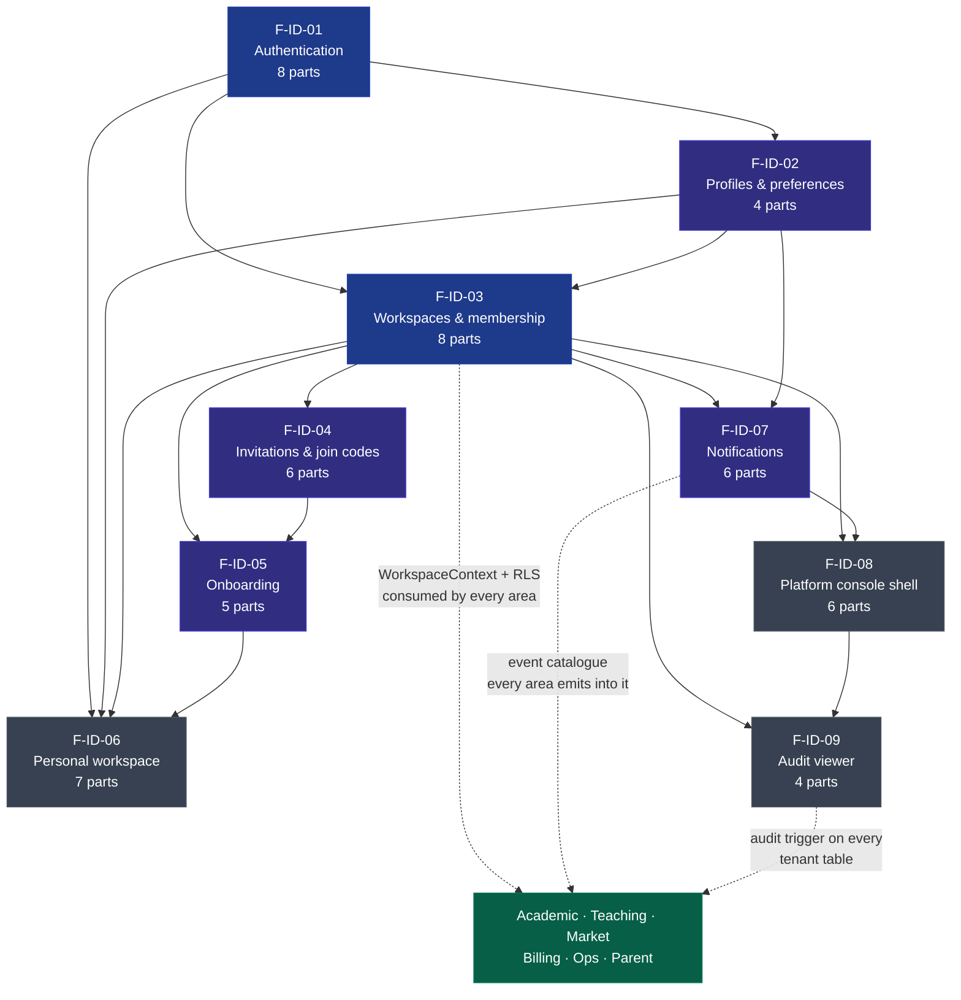

# Area 01 — Identity, tenancy, onboarding, personal workspace, notifications, platform console

**Owner area:** auth + platform · **Features:** 11 · **Build parts:** **64** (54 + F-ID-10's 4 + F-ID-11's 6) (each ≤ ~2 days, each with a demo criterion)
**Binding inputs:** [`docs/product/PRODUCT-DECISIONS.md`](../../product/PRODUCT-DECISIONS.md) §1, §5.5, §6.5, §6.8 · [`docs/architecture/ARCHITECTURE.md`](../../architecture/ARCHITECTURE.md) §2, §3, §4, §5, §6 · [`docs/reference/base44-inventory/01-auth-tenancy-personal.md`](../../reference/base44-inventory/01-auth-tenancy-personal.md) · [`docs/reference/base44-security-review.md`](../../reference/base44-security-review.md)
**Table names and columns:** proposed in each spec's §3 and marked _"proposed; DATA-MODEL.md wins"_ — [`docs/architecture/DATA-MODEL.md`](../../architecture/DATA-MODEL.md) is authoritative.

---

## 1. What this area is

Everything downstream of this area depends on it for **who you are** and **which tenant you are in**. It is the area the Base44 security review reduced to a single sentence: _tenant isolation was anchored to a field the client writes to itself._ Rebuilding it correctly is the difference between a product that can hold children's records and one that cannot.

Concretely, the area owns:

- **Identity** — accounts, sessions, devices, account deletion (F-ID-01); profile, preferences, theme, English/বাংলা (F-ID-02).
- **Tenancy** — workspaces and school profiles, the five-role membership model, the last-owner invariant, ownership transfer, custom labels, module visibility, and the `WorkspaceContext` resolution that every repository call in the product takes as its first argument (F-ID-03).
- **Getting people in** — email/SMS invitations, the rotating join code and approval flow, guardian linking (F-ID-04); the registration → personal workspace → create-or-join funnel and the school wizard (F-ID-05).
- **The teacher's own space** — tuition students, personal attendance, fees, file vault, diary, CV, document-request consent (F-ID-06).
- **Telling people things** — the event taxonomy every other area emits into, the in-app centre, realtime, preferences, push/email hooks (F-ID-07).
- **Running the platform** — the `/platform` shell, schools list and inspector, impersonation-free support grants, feature flags, plans-editor entry (F-ID-08); and the append-only audit viewer that makes all of it accountable (F-ID-09).

**The five properties this area must be able to demonstrate on demand:**

1. A forged `x-workspace-id` returns 403 and leaves a `tenancy.context_rejected` row. _(F-ID-03)_
2. No client can insert a `workspace_members` row as `owner/active`. _(F-ID-03)_
3. A removed member loses access on their very next request. _(F-ID-03)_
4. No audit row can be edited or deleted by any application role. _(F-ID-09)_
5. Platform staff read no tenant content without an owner-granted, time-boxed, logged grant. _(F-ID-08)_

Each is an acceptance criterion with a pgTAP or Playwright test behind it.

## 2. Feature list

| ID                                                 | Feature                                        | Parts | Depends on     | One-line scope                                                                                                                                                                            |
| -------------------------------------------------- | ---------------------------------------------- | ----- | -------------- | ----------------------------------------------------------------------------------------------------------------------------------------------------------------------------------------- |
| [F-ID-01](./F-ID-01-authentication.md)             | Authentication, sessions and account lifecycle | 8     | —              | Email+password, phone OTP, magic link, verify, reset, sessions/devices, deletion with a 30-day grace                                                                                      |
| [F-ID-02](./F-ID-02-profiles-and-preferences.md)   | Profiles and preferences                       | 4     | 01             | Profile, avatar, `user_preferences` sync, theme/palette with no flash, en/bn                                                                                                              |
| [F-ID-03](./F-ID-03-workspaces-and-membership.md)  | Workspaces, membership and tenancy             | 8     | 01, 02         | `workspaces`/`school_profiles`/`workspace_members`, roles, status lifecycle, ownership transfer, labels, module visibility, `WorkspaceContext` + `x-workspace-id`                         |
| [F-ID-04](./F-ID-04-invitations-and-join-codes.md) | Invitations and join codes                     | 6     | 01, 03         | Email/SMS invites, rotating `ACD-XXXX-XXXX` code + approval, accept/decline, expiry, resend, guardian invites, audit                                                                      |
| [F-ID-05](./F-ID-05-onboarding.md)                 | Onboarding                                     | 5     | 01, 03, 04     | Register → auto personal workspace → create school (5-step wizard) or join with code → landing shell by type ∧ role                                                                       |
| [F-ID-06](./F-ID-06-personal-workspace.md)         | Personal workspace                             | 7     | 01, 02, 03, 05 | Dashboard, tuition students, personal attendance, fees, file vault, diary, CV, document-request consent                                                                                   |
| [F-ID-07](./F-ID-07-notifications.md)              | Notifications                                  | 6     | 01, 02, 03     | Event taxonomy, in-app centre, realtime, preferences, push/email hooks, `action_url` on every event                                                                                       |
| [F-ID-08](./F-ID-08-platform-console-shell.md)     | Platform console shell                         | 6     | 01, 03, 07     | `is_platform_admin`, `/platform` layout, schools list + inspector, impersonation-free support grants, feature flags, plans entry, broadcasts                                              |
| [F-ID-09](./F-ID-09-audit-viewer.md)               | Audit viewer                                   | 4     | 01, 03, 08     | Append-only `audit_events` viewer for owners and platform staff, filters, diff, correlation, export                                                                                       |
| [F-ID-10](./F-ID-10-basic-mode.md)                 | Basic mode                                     | 4     | 02, 03         | Per-user simple layout for older teachers: class-by-class home and class hubs, 56 px targets, text size (both modes), plain confirmations, help + call school office, voice hints (D-403) |
| [F-ID-11](./F-ID-11-offline.md)                    | Offline (platform-wide)                        | 6     | 01, 03         | Read cache + one IndexedDB outbox replaying through the same server actions; everything except generating/sending works offline; conflicts, purges, shared phones (D-71)                  |

## 3. Dependency graph

Soft dependencies worth knowing, which the graph does not show as hard edges:

- **F-ID-04 → F-ID-07**: invitations notify both sides. Parts can ship before notifications exist by writing the payload and enabling delivery when F-ID-07 Part 1 lands; the specs name the events either way.
- **F-ID-06 → F-ID-04**: the personal area renders the invitation inbox that F-ID-04 feeds.
- **F-ID-01 → F-ID-09**: account-level audit rows need `app.log_audit_event`, which F-ID-09 Part 1 introduces. Until then F-ID-01 emits through the same function signature and the rows appear retroactively once the function exists — the call sites do not change.
- **Everything → F-ID-03**: no other area can begin until `WorkspaceContext`, the permission matrix and the RLS policy template exist.

## 4. Suggested build order, with reasons

| #   | Chunk                                                                                                                                                             | Parts | Why here                                                                                                                                                                                                                                                                                                                                              |
| --- | ----------------------------------------------------------------------------------------------------------------------------------------------------------------- | ----- | ----------------------------------------------------------------------------------------------------------------------------------------------------------------------------------------------------------------------------------------------------------------------------------------------------------------------------------------------------- |
| 1   | **F-ID-01 Parts 1–4** — Supabase Auth wiring, `profiles`, register + verify, sign in/out, reset                                                                   | 4     | Nothing is testable without a session. Part 1 also establishes `withServiceRole`, the middleware and the generated types that every later part imports.                                                                                                                                                                                               |
| 2   | **F-ID-03 Parts 1–3** — tenancy tables, RLS template, `WorkspaceContext`, permission matrix and nav engine                                                        | 3     | This is the single highest-risk work in the repository and it must land while the codebase is small enough to test exhaustively. Building any feature screen before the context resolver exists guarantees rework, because every repository signature changes. Part 1's pgTAP suite is the proof that the four security-review attack paths are dead. |
| 3   | **F-ID-02 Parts 1–3** — `user_preferences`, no-flash theming, profile + avatar, appearance                                                                        | 3     | Cheap, unblocks the design system's token work, and the server-rendered theme decision has to be made before layouts proliferate. Bangla (Part 4) is deliberately deferred one chunk so the catalogue is written against real screens.                                                                                                                |
| 4   | **F-ID-05 Part 1 + F-ID-03 Part 4 + F-ID-05 Parts 2–5** — auto personal workspace, switcher and landing resolution, the chooser, the school wizard, the join path | 6     | The first end-to-end journey a human can use: register → school. It forces `resolveLandingRoute` and the switcher to be correct early, which is where the prototype had three contradictory answers. The school wizard also seeds `grade_levels` and `academic_years`, which the academic area needs before it can start.                             |
| 5   | **F-ID-03 Parts 5–8** — roster, role changes, labels, removal, ownership transfer, module visibility, settings                                                    | 4     | Depends on having more than one user, which chunk 4 makes possible. "Removed member loses access on the next request" is the acceptance criterion that closes security-review finding 6.                                                                                                                                                              |
| 6   | **F-ID-04 Parts 1–6** — invitations and join codes end to end                                                                                                     | 6     | Needs the roster (chunk 5) to approve into and the wizard (chunk 4) to generate a code. Ships the second real user journey: a principal onboards twelve teachers.                                                                                                                                                                                     |
| 7   | **F-ID-07 Parts 1–4** — taxonomy, `app.notify`, centre, realtime, preferences                                                                                     | 4     | Deliberately after invitations, so the catalogue is written against events that already have real emitters rather than imagined ones. Part 1's catalogue-parity test then becomes the contract every later area codes against — this is the single most reused artefact the area produces.                                                            |
| 8   | **F-ID-09 Parts 1–3** — append-only substrate, triggers on every tenant table, owner viewer, correlation                                                          | 3     | Must land before the academic area starts writing student records, because retrofitting audit triggers across dozens of tables is far more expensive than attaching them to eight. Part 1 also unblocks F-ID-01's account-level rows.                                                                                                                 |
| 9   | **F-ID-06 Parts 1–7** — the personal workspace                                                                                                                    | 7     | The first area that is purely product rather than plumbing, and the best proving ground for the phone-first primitives (`DataList`, `FormSheet`, the offline queue) that the academic area will reuse at scale. Personal attendance is the dress rehearsal for school attendance.                                                                     |
| 10  | **F-ID-07 Parts 5–6 + F-ID-02 Part 4** — push, email digest, broadcast, retention, Bangla                                                                         | 3     | Delivery channels and localisation are best done once the screens they describe are stable. Bangla parity across this area's catalogues is the gate for showing the product to a BD school.                                                                                                                                                           |
| 11  | **F-ID-08 Parts 1–6 + F-ID-09 Part 4** — platform console and audit export                                                                                        | 7     | Last in the area because it needs real workspaces, real flags and a real audit trail to be worth anything. Support grants and the audit export are what make the console defensible rather than a back door.                                                                                                                                          |
| 12  | **F-ID-01 Parts 5–8** — phone OTP, magic link, sessions/devices, account deletion, hardening                                                                      | 4     | Deferred deliberately: phone OTP is blocked on an SMS provider decision (OQ below), and account deletion's sole-owner guard needs ownership transfer (chunk 5) to exist so the block has somewhere to send people. The hardening/a11y pass belongs at the end of the area, not the middle.                                                            |

**Total: 54 parts.** Chunks 1–4 (16 parts) deliver the first demonstrable product. Chunks 1–8 (33 parts) deliver everything the academic area needs to begin. Chunks 9–12 (21 parts) complete the area.

**Parallelisation:** after chunk 3, two people can work without collisions — one on the tenancy/invitation line (chunks 4–6), one on preferences/notifications/audit substrate (chunks 3, 7, 8). F-ID-06 (chunk 9) is the cleanest parallel slice in the area: it touches no table another chunk writes.

## 5. Cross-cutting artefacts this area produces

Other areas consume these; they are the reason this area goes first.

| Artefact                                                                                                             | Where                             | Consumed by                                   |
| -------------------------------------------------------------------------------------------------------------------- | --------------------------------- | --------------------------------------------- |
| `WorkspaceContext` + `resolveWorkspaceContext`                                                                       | `packages/db`                     | every repository call in the product          |
| `app.current_user_id()`, `app.is_platform_admin()`, `app.member_role()`, `app.has_role()`, `app.is_guardian_of()`    | `supabase/migrations`             | every RLS policy                              |
| The RLS policy template + the pgTAP isolation/escalation suite                                                       | `supabase/tests`                  | every tenant table in every area              |
| `PERMISSIONS` matrix and `can(role, key)`                                                                            | `packages/domain/permissions.ts`  | every server action and the nav engine        |
| `app.next_id(workspace_id, kind)`                                                                                    | `supabase/migrations`             | student IDs, employee numbers, resource codes |
| `app.notify(...)` + the notification event catalogue                                                                 | migrations + `packages/contracts` | every area that tells anyone anything         |
| `app.audit_row_change()` trigger + `app.log_audit_event()` + the action catalogue                                    | migrations + `packages/contracts` | every tenant table                            |
| `files` + `/api/files/[id]` signed-URL issuance + `file_access_log`                                                  | F-ID-06                           | resources, reports, marketplace, hiring       |
| Feature flags via `app.workspace_flags(workspace_id)`                                                                | F-ID-08                           | any area shipping behind a flag               |
| Phone-first primitives: `AppShell`, `BottomNav`, `DataList`, `FormSheet`, `ConfirmSheet`, the offline mutation queue | `packages/ui`                     | every screen in the product                   |

## 6. Conflicts and gaps found while writing these specs

Each is recorded in the owning spec's §11; collected here because several need an owner or an architecture decision before the affected part is built.

| #    | Conflict                                                                                                                                                                                                                                                                                                                                                                                                                                 | Where                                                | Default assumed                                                                                                                                                                                          | Needs                                                                                           |
| ---- | ---------------------------------------------------------------------------------------------------------------------------------------------------------------------------------------------------------------------------------------------------------------------------------------------------------------------------------------------------------------------------------------------------------------------------------------- | ---------------------------------------------------- | -------------------------------------------------------------------------------------------------------------------------------------------------------------------------------------------------------- | ----------------------------------------------------------------------------------------------- |
| C-1  | **Shell resolution is type ∧ role, not type alone.** PRODUCT-DECISIONS §1.1 says the workspace `type` decides the shell, but §1.13 puts `parent` memberships inside `school` workspaces and ARCHITECTURE §2 defines a separate `(parent)/family/` shell. A parent whose active workspace is a school must land on `/family`, never `/app`.                                                                                               | F-ID-03 §4.4 / §11 OQ-1                              | Role is the tie-break                                                                                                                                                                                    | Amend PRODUCT-DECISIONS §1.1                                                                    |
| C-2  | **`audit_events` needs a non-trigger writer and a nullable `workspace_id`.** ARCHITECTURE §4 describes the table as trigger-filled per tenant table, but sign-in, session revocation, exports, support reads, flag changes and broadcasts are not row changes and have no tenant.                                                                                                                                                        | F-ID-09 §11 OQ-1, F-ID-01 §11 OQ-5, F-ID-07 §11 OQ-5 | Add `app.log_audit_event()` (SECURITY DEFINER, no application insert grant — D-05 still holds) and make `workspace_id` nullable; same for `notifications.workspace_id`                                   | Amend ARCHITECTURE §4 + a DECISION-LOG entry                                                    |
| C-3  | **Phone OTP and SMS invitations need an SMS provider that PRODUCT-DECISIONS §7 defers.** §1.3 requires SMS invites and the auth spec offers phone OTP, yet "SMS/WhatsApp providers" are listed as out of scope.                                                                                                                                                                                                                          | F-ID-01 §11 OQ-1, F-ID-04 §11 OQ-1                   | `adapters/sms` with a console driver in dev; the Phone tab and SMS channel sit behind the `auth.phone_otp` / `invites.sms` flags and stay hidden until a provider is funded                              | **Owner decision** — this changes the launch funnel for BD teachers                             |
| C-4  | **Platform-admin data access is much narrower here than ARCHITECTURE §3 implies.** §3 says "platform admin has a bypass policy on the tables the console needs (read)"; these specs give staff the overview view, platform tables and `audit_events` only, with tenant content reachable solely under an owner-granted, time-boxed, logged grant — and never for notifications, diary entries, personal-workspace data or private files. | F-ID-08 §11 OQ-1, F-ID-06 §11 OQ-6                   | The narrow reading                                                                                                                                                                                       | Amend ARCHITECTURE §3, or decide explicitly that an ambient bypass is wanted (it should not be) |
| C-5  | **No i18n strategy exists in ARCHITECTURE**, yet PRODUCT-DECISIONS §1.10 makes `language` a synced preference and the product is for Bangladesh.                                                                                                                                                                                                                                                                                         | F-ID-02 §4.3, §11 OQ-1                               | `next-intl`-style catalogues, `NEXT_LOCALE` cookie, CI key-parity, Bengali font shared with the PDF renderer; `bn` ships complete for this area at Release 1 and other areas add catalogues as they land | Add an i18n section to ARCHITECTURE; owner to confirm the `bn` scope                            |
| C-6  | **`app.next_id` is defined as per-workspace** (PRODUCT-DECISIONS §2.6) but `workspaces.short_code` (`WS-000214`) must be unique per **platform**.                                                                                                                                                                                                                                                                                        | F-ID-03 §11 OQ-5                                     | `app.next_id` accepts a null workspace id for platform-scoped sequences                                                                                                                                  | DATA-MODEL to settle                                                                            |
| C-7  | **Seat limits on plan downgrade are undefined.** §5.1 sets per-plan caps and §5.2 makes over-limit _data_ read-only, but says nothing about over-limit _members_.                                                                                                                                                                                                                                                                        | F-ID-03 §11 OQ-2                                     | Existing members are never auto-removed; new approvals and invitations are blocked with `SEAT_LIMIT_REACHED` + an over-cap banner                                                                        | Billing area to confirm                                                                         |
| C-8  | **Personal workspaces need a plan for storage limits but have no subscription.** §5.5 says only school workspaces have subscriptions, yet the storage meter reads `plans.storage_gb`.                                                                                                                                                                                                                                                    | F-ID-06 §11 OQ-2                                     | Personal workspaces sit permanently on Free (1 GB, 20 credits/day) with no `subscriptions` row                                                                                                           | Billing area + DATA-MODEL                                                                       |
| C-9  | **Custom label assignment has no table in PRODUCT-DECISIONS.** §1.4 names `custom_labels` but the Base44 `UserLabel` join was unused.                                                                                                                                                                                                                                                                                                    | F-ID-03 §3                                           | `workspace_members.custom_label_id` — one label per member, no join table                                                                                                                                | DATA-MODEL to confirm                                                                           |
| C-10 | **No account-level route group.** ARCHITECTURE §2 lists no `(account)` group, so sessions, devices and account deletion render inside each shell's settings.                                                                                                                                                                                                                                                                             | F-ID-01 §11 OQ-3                                     | Shell-local routes (`/app/settings/security`, `/personal/settings`) sharing one component set                                                                                                            | Confirm, or add `(account)` to ARCHITECTURE §2                                                  |
| C-11 | **Grade-level presets and the section handover are unspecified.** The wizard seeds `grade_levels` but not `sections`, which PRODUCT-DECISIONS §2.3 makes the enrolment unit — a school is not usable until sections exist.                                                                                                                                                                                                               | F-ID-05 §11 OQ-1, OQ-2                               | The first-run checklist drives the owner into the academic area's section setup; madrasah stage presets (Ebtedayee/Dakhil/Alim) appear when `board='madrasah'`                                           | Academic-area spec to confirm the handover point; owner to confirm madrasah naming              |
| C-12 | **Two undecided durations**, chosen here for consistency: account-deletion grace **30 days** (matching §1.15's document-consent window) and invitation expiry **14 days** staff / **30 days** guardian.                                                                                                                                                                                                                                  | F-ID-01 §11 OQ-2, F-ID-04 §11 OQ-2                   | As stated                                                                                                                                                                                                | Owner to confirm                                                                                |

Two smaller things worth recording, which are not conflicts but are decisions these specs made in the absence of guidance: **workspace admins do not read the audit trail by default** (PRODUCT-DECISIONS §6.8 names owners and platform staff only — F-ID-09 §11 OQ-2), and **there is no impersonation anywhere in the platform console**, its absence being a tested property rather than an omission (F-ID-08 §2).

## 7. Definition of done for the area

Per DECISION-LOG D-14, no feature moves on without all of: spec in this folder ✔ · migrations + RLS tests ✔ · server logic unit-tested ✔ · UI verified at 360×800 **and** 1280×800 ✔ · Playwright journey ✔ · axe check ✔ · test report in `docs/test-reports/F-ID-nn.md` ✔ · PR merged ✔.

The area is done when the five properties in §1 are demonstrable in CI, `bn` renders every screen in this folder without overflow at 360 px, and a new engineer can create a school, invite a teacher, have them join, remove them, and read the whole story in the audit viewer — on a phone.
