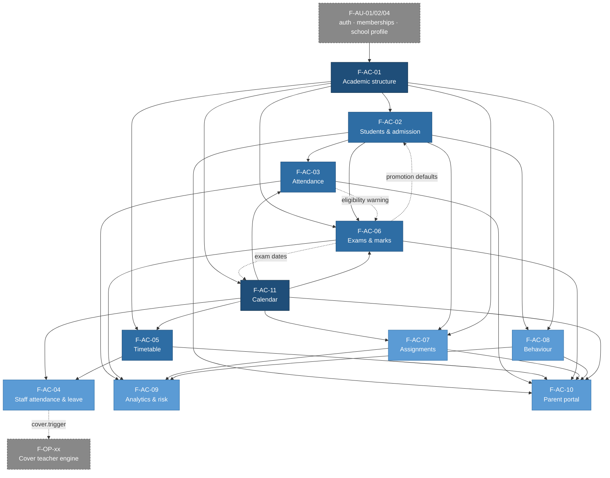

# Area 02 — Academic core

The part of Acadigma Campus a Bangladeshi K-12 school touches every single day: the structure of the school year, the students in it, who was present, who taught what when, what they scored, what they were set to do, how they behaved, who needs help, and what their parents can see.

**11 features · 64 parts · every part ≤ ~2 days with its own demo criterion.**

| #                                                | Feature                    | Parts | What it owns                                                                                                                                                               |
| ------------------------------------------------ | -------------------------- | ----- | -------------------------------------------------------------------------------------------------------------------------------------------------------------------------- |
| [F-AC-01](F-AC-01-academic-structure.md)         | Academic structure         | 6     | `academic_years`, `terms`, `grade_levels`, `sections`, `subjects`, `section_subjects` (+ assistants), `rooms`, the bulk setup wizard, BD defaults Play–Class 12            |
| [F-AC-02](F-AC-02-students-and-admission.md)     | Students and admission     | 8     | `students`, `admissions` (draft wizard), `guardians`, `guardian_users`, `enrollments`, private documents, sequential `STU-`/`ADM-` ids, CSV import, ID card with signed QR |
| [F-AC-03](F-AC-03-attendance.md)                 | Student attendance         | 7     | `attendance_sessions`, `attendance_records`, one-thumb roll call, the `%` rule, monthly register, low-attendance alerts, offline queue, scan-event hook                    |
| [F-AC-04](F-AC-04-staff-attendance-and-leave.md) | Staff attendance and leave | 5     | `staff_attendance` (with `half`), `leave_types`, `leave_requests`, `leave_balances`, monthly summary, the `cover.trigger` contract                                         |
| [F-AC-05](F-AC-05-timetable.md)                  | Timetable                  | 6     | `bell_schedules`, `bell_periods`, `timetable_slots`, versions, clash detection, teacher/room views, ICS export, print                                                      |
| [F-AC-06](F-AC-06-exams-and-marks.md)            | Exams, marks, GPA, results | 8     | `grade_scales`, `exams` (`regular`/`aggregate`), `exam_components`, `exam_subjects`, `marks`, `results`, GPA + rank in SQL, publishing, mark sheet                         |
| [F-AC-07](F-AC-07-assignments-and-homework.md)   | Assignments and homework   | 5     | `assignments` (handouts included), `assignment_submissions`, attachments, distribution to portal/print/message                                                             |
| [F-AC-08](F-AC-08-behaviour.md)                  | Behaviour                  | 4     | `behaviour_categories`, `behaviour_logs`, follow-ups, per-term conduct scores and leaderboard                                                                              |
| [F-AC-09](F-AC-09-student-analytics-and-risk.md) | Analytics and risk         | 5     | `analytics_*` views, `risk_policies`, `student_risk_scores`, `student_flags`, `risk_interventions`, AI-phrased suggestions                                                 |
| [F-AC-10](F-AC-10-parent-portal.md)              | Parent portal              | 6     | The `/family` shell, child switcher, and the thirteen guardian-scoped `security definer` views every other feature reads parents through                                   |
| [F-AC-11](F-AC-11-calendar.md)                   | School calendar            | 4     | `holidays`, `calendar_events`, `working_day_overrides`, and `app.is_school_day` — the denominator behind half the area                                                     |

## Tables this area owns

Per the ops ruling, F-OP-07 specifies only the _settings screens_ that edit these; the tables, their RLS, constraints and server actions live here.

- `academic_years`, `terms` → **F-AC-01**
- `grade_scales`, `grade_scale_bands` → **F-AC-06**
- `holidays` (+ `holiday_scopes`, `working_day_overrides`) → **F-AC-11**

## Dependency graph

Solid arrows are hard build dependencies (the target cannot ship without the source). Dotted arrows are runtime couplings between features that can be built in either order.

## Build order, and why

**1. F-AC-01 — Academic structure (6 parts).** Nothing else has a foreign key to point at. Years, terms, grades, sections and section_subjects are the spine; the bulk setup wizard is what makes a demo school exist in ten minutes instead of an afternoon.

**2. F-AC-11 — Calendar (4 parts).** Deliberately second, not last. `app.is_school_day` is the denominator behind attendance percentages, leave day counts, ICS `EXDATE`s, pacing and every analytics chart. Building it after attendance means rewriting attendance's denominators; the Base44 prototype's "holiday plots as 0 %" bug exists precisely because no holiday concept was ever built.

**3. F-AC-02 — Students and admission (8 parts).** The second spine. Enrollments make "who is in this section on this date" answerable, which attendance, marks, assignments and behaviour all need. Guardians and `app.is_guardian_of` land here too — every parent-facing policy in the product depends on that one helper.

**4. F-AC-03 — Attendance (7 parts).** The daily-use feature and the fastest route to a school feeling the product is real. It needs sections (01), school days (11) and enrollments (02), and nothing else. Its `app.attendance_pct` becomes the single percentage implementation the parent portal and the risk engine both read.

**5. F-AC-05 — Timetable (6 parts).** Before staff attendance, because the cover engine's question ("who is free at period 3?") and the leave-approval impact preview ("affects 7 periods") are both timetable queries. Also unlocks the teacher's "now / next period" card, which is the cheapest way to make the app feel alive.

**6. F-AC-04 — Staff attendance and leave (5 parts).** Needs the timetable for impact and free-teacher ranking, and the calendar for leave day counts. Emits `cover.trigger` with its `half`, which is the handover point to the operations area's cover engine.

**7. F-AC-06 — Exams, marks, GPA and results (8 parts).** The largest feature and the one with the most arithmetic. Built after attendance so the eligibility warning has data, and after the calendar so exam dates project cleanly. Everything downstream — report cards, promotion defaults, the parent results tab, the risk engine's academic components — waits on it.

**8. F-AC-07 — Assignments and homework (5 parts).** Small, high daily value, and supplies the missing-submission input the risk engine needs. Reuses the roll-call primitive from 03 and the marks-entry primitive from 06, which is why it is cheap by this point.

**9. F-AC-08 — Behaviour (4 parts).** Also small, also a risk input, and it introduces the parent-visibility pattern (`parent_visible` + seen-stamp) that the portal then consumes.

**10. F-AC-09 — Analytics and risk (5 parts).** Cannot be built earlier: all four of its inputs must exist and be correct first. Building it last also means the dashboard is populated from real tables on day one, which is the PRODUCT-DECISIONS 3.9 requirement that no mock data ships.

**11. F-AC-10 — Parent portal (6 parts).** Last by necessity — it is a projection of everything above — and last by design: shipping it before the underlying data is trustworthy is exactly what the prototype did, and it is how a parent ends up seeing "C" for a 72 % that the teacher's screen calls "B+".

**Earliest demo-able slice:** F-AC-01 Parts 1–3 + F-AC-11 Part 1 + F-AC-02 Parts 1–2 + F-AC-03 Parts 1–2 — a school with sections, a calendar, students, and one-thumb attendance that produces a correct percentage. Roughly 10 parts, and it is already more than the Base44 prototype ever managed, because in the prototype nothing ever wrote an attendance row.

## Conventions this area holds itself to

- **One formula, one owner.** Attendance % lives in F-AC-03, grade bands and GPA in F-AC-06, missing-work rate in F-AC-07, behaviour points in F-AC-08. Every other feature imports a selector; nobody re-implements. Each has a SQL↔TS parity test, because the prototype's four disagreeing grade-letter implementations are the failure mode this convention exists to prevent.
- **Phone-first at 360×800.** Attendance roll call, marks entry, behaviour logging and homework recording all use the same right-aligned status-pill row with a sticky bottom action, so the muscle memory transfers between them.
- **Set-based writes.** Every bulk save (attendance, marks, submissions, staff grid) is one statement with an idempotency key — never the prototype's one-request-per-student loop.
- **RLS is the boundary.** Every parent-visible fact is reached through F-AC-10's guardian-scoped views; every claim about who can see what has a pgTAP test with a matching negative case.
- **No fake data, no fake labels.** No mock arrays ship (PRODUCT-DECISIONS 3.9), and nothing is labelled "AI" unless it calls a model (F-AC-09 §5.10).
