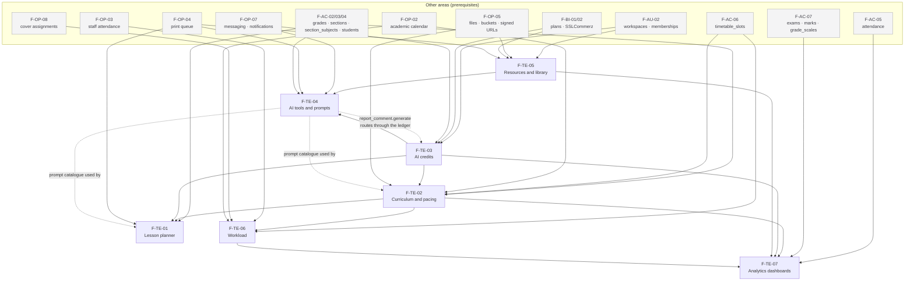

# 03 — Teaching intelligence

Feature specifications for the "teacher brain" of Acadigma Campus: everything between _what I am supposed to teach_ and _what I actually taught_, the AI that assists it, the credit economy that pays for that AI, the resource estate it produces, and the dashboards that measure all of it.

Source of truth for scope: `docs/product/PRODUCT-DECISIONS.md` §3 (and §2.2, §2.4, §2.6, §5.1–5.4 for the settings these features read).
Binding technical contract: `docs/architecture/ARCHITECTURE.md`.
Prototype audit these specs replace: `docs/reference/base44-inventory/03-teaching-intelligence.md`.

Every table and column proposed in these files is marked **"proposed; DATA-MODEL.md wins"** — `docs/architecture/DATA-MODEL.md` is authored concurrently and is authoritative on schema.

---

## 1. The features

| #       | File                                                                   | What it is                                                                                                                                                                                                                                                                                                                                         | Parts |
| ------- | ---------------------------------------------------------------------- | -------------------------------------------------------------------------------------------------------------------------------------------------------------------------------------------------------------------------------------------------------------------------------------------------------------------------------------------------- | ----- |
| F-TE-01 | [`F-TE-01-lesson-planner.md`](F-TE-01-lesson-planner.md)               | One structured lesson planner — manual, template, or "Generate with AI" into the same canonical shape. Links to `section_subject` and a syllabus topic. Status `draft → ready → taught`. Share to colleagues, print.                                                                                                                               | 5     |
| F-TE-02 | [`F-TE-02-curriculum-and-pacing.md`](F-TE-02-curriculum-and-pacing.md) | The curriculum spine: syllabi → units → topics per grade + subject + year; `lesson_logs` per section-subject; the pacing view (topics remaining vs periods remaining from the timetable and calendar); syllabus PDF → AI extraction → human review table → commit; a templates library.                                                            | 7     |
| F-TE-03 | [`F-TE-03-ai-credits.md`](F-TE-03-ai-credits.md)                       | The append-only credit ledger, plan grants, the daily reset at 00:00 Asia/Dhaka via pg_cron, shared pool vs per-teacher allocation, the `ai_actions` price list, the reserve → call → settle flow, hard block at zero, credit requests to the owner, SSLCommerz top-up packs, usage analytics. **Every AI call in the product goes through this.** | 7     |
| F-TE-04 | [`F-TE-04-ai-tools.md`](F-TE-04-ai-tools.md)                           | Seven one-shot tools (worksheet, quiz, parent message, notice, rubric, differentiation, illustration) **and the prompt catalogue for the whole area** — ten versioned prompts with system text, user templates, Zod output schemas, model ids, costs, timeouts and persistence targets. Plus the PII redaction rules.                              | 6     |
| F-TE-05 | [`F-TE-05-resources-and-library.md`](F-TE-05-resources-and-library.md) | Personal resources and the school library: folders, sequential per-type identifiers, sharing to colleagues, private files with signed URLs, previews, orphaning on member removal and reassignment, a real storage quota meter, bulk download as a ZIP job and bulk print.                                                                         | 7     |
| F-TE-06 | [`F-TE-06-workload.md`](F-TE-06-workload.md)                           | Scheduled vs logged periods per teacher, balance suggestions naming a specific slot and a specific target, burnout thresholds as school settings, the variance report. Every join on `user_id`, every window explicitly dated.                                                                                                                     | 4     |
| F-TE-07 | [`F-TE-07-analytics-dashboards.md`](F-TE-07-analytics-dashboards.md)   | Five dashboards (school overview, attendance, academics, staff/workload, AI usage) and the **metric dictionary** — every number defined once as a SQL view with its exact definition. No mock data, phone-first cards.                                                                                                                             | 6     |

**Total: 42 parts.** Each part is scoped to ≤2 days with its own tests and a demo criterion.

---

## 2. Dependency graph

Two things the graph is saying that are easy to miss:

- **F-TE-03 is a hard gate.** No AI work anywhere in the product — this area or the report-card comments in F-OP-06 — can start before F-TE-03 Parts 1–4 are merged. A CI rule makes that mechanical (F-TE-03 §5.14): only `packages/adapters/ai` may import the Anthropic SDK.
- **F-TE-04 is both a feature and a shared library.** Its §4 prompt catalogue holds the prompts that F-TE-01 and F-TE-02 call, so F-TE-04 Part 1 (prompts, schemas, redaction) must land before _their_ AI parts, even though the rest of F-TE-04 comes later.

---

## 3. Build order

Ordered so that each step is demoable and nothing is built against a dependency that does not exist yet.

| Step | Work                                                                                                | Parts | Why here                                                                                                                                           |
| ---- | --------------------------------------------------------------------------------------------------- | ----- | -------------------------------------------------------------------------------------------------------------------------------------------------- |
| 1    | **F-TE-05 Parts 1–3** — resource schema, identifiers, upload, quota, browse                         | 3     | No AI, no credits, no curriculum. Fixes the worst tenancy defect in the prototype first and gives every later feature somewhere to persist output. |
| 2    | **F-TE-03 Parts 1–4** — ledger, `invoke()` pipeline, cron jobs, balance UI                          | 4     | The gate. Nothing AI-shaped may start until this is merged.                                                                                        |
| 3    | **F-TE-04 Part 1** — prompt catalogue, output schemas, PII redaction                                | 1     | Shared library for steps 4–6.                                                                                                                      |
| 4    | **F-TE-02 Parts 1–4** — syllabus schema, editor, lesson logs, pacing maths                          | 4     | The curriculum spine. Parts 1–4 involve no AI, so they can run in parallel with step 2 if capacity allows.                                         |
| 5    | **F-TE-01 Parts 1–5** — lesson planner, manual through AI generation                                | 5     | First user-visible AI feature, and the smallest one — a good first proof that reserve/settle works end to end.                                     |
| 6    | **F-TE-02 Parts 5–7** — syllabus import, review/commit, AI pacing plan                              | 3     | The highest-value AI feature in the area, built once the cheaper one has proven the pipeline.                                                      |
| 7    | **F-TE-04 Parts 2–6** — the seven tools, SVG hardening, history                                     | 5     | Breadth on top of proven plumbing.                                                                                                                 |
| 8    | **F-TE-05 Parts 4–7** — sharing, preview/download, orphaning, bulk jobs                             | 4     | Now that AI output is landing in resources, the library's governance layer matters.                                                                |
| 9    | **F-TE-06 Parts 1–4** — workload views, teacher cockpit, balance, suggestions                       | 4     | Needs a term of `lesson_logs` to be meaningful; depends on F-TE-02 Part 3.                                                                         |
| 10   | **F-TE-07 Parts 1–6** — the metric dictionary and five dashboards                                   | 6     | Last by definition: it measures everything above. Building it earlier would mean measuring empty tables.                                           |
| 11   | **F-TE-03 Parts 5–7** — credit requests, billing model and allocations, top-ups and usage analytics | 3     | The governance half of credits. Deferrable because step 2 already enforces the block; this is what an owner does _about_ it.                       |

**42 parts total.** Steps 1–5 (17 parts) are the minimum for a teacher to plan, log and generate — that is the natural first release of this area.

---

## 4. Cross-cutting rules these specs all obey

1. **Tenant key is `workspace_id`.** Not `school_id`, never `'default'`, never a client-supplied value. (PRODUCT-DECISIONS 1.6.)
2. **Role and sharing targets come from `workspace_members`,** status `active` — never a `users.role` column. That single mistake made sharing and reassignment impossible in the prototype.
3. **Every AI call is server-side, metered, and typed:** prompts in `packages/domain/ai/prompts`, credits reserved before the call and settled after, structured output validated with Zod, and nothing charged when the failure is ours.
4. **Nothing generated is thrown away.** Every artefact has a persistence target named in its spec.
5. **Every number on a dashboard is a SQL view** with its definition written down in F-TE-07 §4. No mock arrays, no hardcoded percentages, enforced by a lint rule and an anti-mock CI grep.
6. **Phone-first at 360×800.** Sheets over dialogs, chips over trees, bar lists over hover charts, primary actions in the thumb arc, ≥44 px targets.
7. **Every part carries tests and a demo criterion,** and every feature has pgTAP isolation + escalation coverage on the tables it owns.

---

## 5. Conflicts and decisions needed from the owner

These are carried up from the individual specs. Each has a default assumed so nothing blocks.

| #   | Issue                                                                                                                                                                                                                             | Where                       | Default assumed                                                                                             |
| --- | --------------------------------------------------------------------------------------------------------------------------------------------------------------------------------------------------------------------------------- | --------------------------- | ----------------------------------------------------------------------------------------------------------- |
| 1   | **Claude has no image generation API**, but the area needs an "image" tool. Spec delivers **SVG illustrations via Claude** (sanitised, stored privately). A photoreal image tool means a new vendor and a new DECISION-LOG entry. | F-TE-04 §4.10, §11.1        | SVG only                                                                                                    |
| 2   | **`syllabus.extract` uses `claude-sonnet-5`, deviating from D-08** ("haiku for cheap classification/extraction"). A mis-extracted topic list propagates into every downstream number. Needs a DECISION-LOG entry.                 | F-TE-02 §11.3, F-TE-04 §4.6 | sonnet-5                                                                                                    |
| 3   | **`syllabus.extract` at 10 credits loses money above ~18 pages** (~৳21.6 cost vs ৳10 retail at 40 pages).                                                                                                                         | F-TE-03 §5.12               | Flat 10 credits; recommended `10 + ceil(max(0, pages−10)/2)` capped at 40                                   |
| 4   | **Worksheet/quiz/rubric/differentiation/illustration prices sit on or below cost** at current token estimates.                                                                                                                    | F-TE-03 §5.12               | PRODUCT-DECISIONS placeholders stand; recommended 4/4/3/3/5                                                 |
| 5   | **Free plan AI exposure** ≈ ৳420/month of model cost per free school at 20 credits/day, uncapped by revenue.                                                                                                                      | F-TE-03 §5.12               | All actions on Free; recommended restricting Free to haiku-backed actions + lesson plan via `min_plan_tier` |
| 6   | **Personal workspaces have no stated AI allowance** (PRODUCT-DECISIONS 5.5 gives them credit packs but no subscription).                                                                                                          | F-TE-03 §11.5               | 0 daily credits, purchased only                                                                             |
| 7   | **Syllabus topics have no `term_id`**, so pacing runs to the year end rather than the term end for schools that split a syllabus across terms.                                                                                    | F-TE-02 §11.1               | No term column in v1                                                                                        |
| 8   | **Two of Base44's eight AI tools are dropped** (essay prompts, flashcards) — the brief names seven.                                                                                                                               | F-TE-04 §11.5               | Dropped to FUTURE.md                                                                                        |
| 9   | **`SchoolBook` is folded into `resources`** as `resource_type='book'` rather than kept as a catalogue with ISBN/copies/lending.                                                                                                   | F-TE-05 §11.7               | Folded in                                                                                                   |
| 10  | **Marketplace purchases do not count against the buyer's storage quota.**                                                                                                                                                         | F-TE-05 §11.4               | Not counted                                                                                                 |
| 11  | **Co-taught sections do not auto-share lesson plans**; assistants must be shared to explicitly.                                                                                                                                   | F-TE-01 §11.2               | Explicit sharing only                                                                                       |
| 12  | **Assistant teachers' periods do not count toward burnout banding** by default (`workload_count_assistants = false`).                                                                                                             | F-TE-06 §5.3, §11.3         | Excluded from banding, shown at 0.5                                                                         |
| 13  | **Workload uses one school-wide threshold**, not per-teacher targets — a head of department legitimately teaches less.                                                                                                            | F-TE-06 §11.4               | One threshold; `staff_records.target_periods_per_week` flagged as the likely v1.1 addition                  |
| 14  | **School _purchasing_ spend is not on these dashboards** (Base44 mixed it in); assumed to belong on billing. Needs the commerce-area author to confirm.                                                                           | F-TE-07 §11.6               | Billing screen                                                                                              |
| 15  | **No retention policy stated for `ai_generations` or `analytics_daily_snapshots`** in ARCHITECTURE §10.                                                                                                                           | F-TE-07 §11.5               | Generations 24 months then aggregate-only; snapshots indefinite                                             |

### Ownership overlaps flagged to other area authors

- **`timetable_slots` and `academic_calendar_days`** are named and shaped here (F-TE-02 §3.8, F-TE-06 §3.1, F-TE-07 §4.4) but owned by **F-AC-06** and **F-OP-02**. If their real shapes differ, the pacing capacity formula and the workload views change; nothing else does.
- **`section_subjects.role ∈ primary | assistant`** is required by PRODUCT-DECISIONS 3.8 and assumed throughout F-TE-06. **F-AC-03** owns it.
- **Cover-teacher candidate ranking (F-OP-08) and workload balance suggestions (F-TE-06 §5.9)** share most of their eligibility logic. They should share one `packages/domain/eligibility.ts` rather than diverge.
- **`report_comment.generate` (F-OP-06)** must route through F-TE-03's ledger. It is in the `ai_actions` price list already; the ops author should not add a second AI path.
- **`lesson_plan_resources`** is proposed in F-TE-01 §3.4 but may belong in F-TE-05's schema section. DATA-MODEL.md decides.
- **The parent portal** should read F-TE-07's views with an `app.is_guardian_of` predicate rather than computing its own attendance and grade figures. **F-AU** owns that surface.
