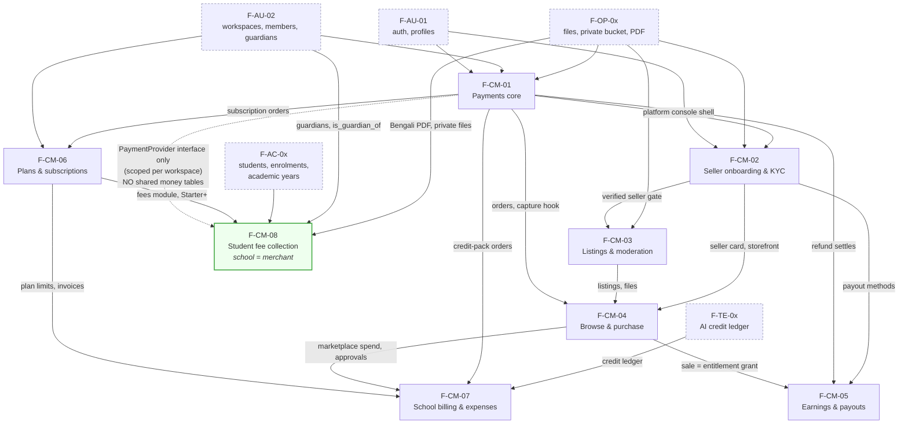

# 04 — Commerce: marketplace, selling, payments, billing

Eight feature specs covering every path money takes through or past Acadigma Campus: buyers paying, sellers being paid, schools subscribing, schools tracking what they spend — and **parents paying school fees into the school's own merchant account, which Acadigma never touches**.

Binding inputs: [`docs/product/PRODUCT-DECISIONS.md`](../../product/PRODUCT-DECISIONS.md) §4 (marketplace) and §5 (billing) · [`docs/architecture/ARCHITECTURE.md`](../../architecture/ARCHITECTURE.md) · the area inventory [`docs/reference/base44-inventory/04-commerce-billing.md`](../../reference/base44-inventory/04-commerce-billing.md) · the market research [`docs/product/research/COMPETITORS.md`](../../product/research/COMPETITORS.md) §1, §6.4, §6.5, §7a (which is why F-CM-08 exists).

> **Every table and column in these specs is marked "proposed".** `docs/architecture/DATA-MODEL.md` is authoritative and wins on any conflict. A data-model agent is writing it concurrently; §11 of each spec lists what it should resolve.

---

## 1. The eight features

| Id                                                    | Feature                                                     | What it owns                                                                                                                                                                                                                                                                                                                                      | Parts |
| ----------------------------------------------------- | ----------------------------------------------------------- | ------------------------------------------------------------------------------------------------------------------------------------------------------------------------------------------------------------------------------------------------------------------------------------------------------------------------------------------------- | ----- |
| [F-CM-01](F-CM-01-payments-core.md)                   | **Payments core**                                           | `PaymentProvider` interface, SSLCommerz adapter, `orders → order_lines → payments`, IPN Edge Function + validation API, refunds, reconciliation, receipts PDF, sandbox/live config                                                                                                                                                                | 11    |
| [F-CM-02](F-CM-02-seller-onboarding-and-kyc.md)       | **Seller onboarding & KYC**                                 | `seller_profiles`, KYC submissions as private files, platform review queue with a 2-business-day SLA, pgsodium-encrypted payout methods, public storefront, verified badge                                                                                                                                                                        | 7     |
| [F-CM-03](F-CM-03-listings-and-moderation.md)         | **Listings & moderation**                                   | Listing lifecycle and freeze-on-review, `listing_files` in a private bucket, baked-in watermarked previews, taxonomy catalogues, re-review on material edits, bulk CSV+ZIP upload                                                                                                                                                                 | 7     |
| [F-CM-04](F-CM-04-marketplace-browse-and-purchase.md) | **Browse & purchase**                                       | Server-side search/facets/pagination, listing detail, buy-now, school-funded request→approve→pay, `entitlements`, signed-URL download with PDF watermarking, download log, reviews                                                                                                                                                                | 8     |
| [F-CM-05](F-CM-05-earnings-and-payouts.md)            | **Earnings & payouts**                                      | `seller_earnings` state machine, 7-day hold job, signed `seller_adjustments`, monthly payout runs with transfer references, statement PDF, refund clawback, reconciliation invariants                                                                                                                                                             | 7     |
| [F-CM-06](F-CM-06-plans-and-subscriptions.md)         | **Plans & subscriptions**                                   | `plans`/`plan_limits`/`plan_modules` editable in `/platform`, 14-day Pro trial, limit enforcement + read-only over-limit mode, proration, invoices with BIN/VAT, dunning                                                                                                                                                                          | 8     |
| [F-CM-07](F-CM-07-school-billing-and-expenses.md)     | **School billing & expenses**                               | Billing overview from `billing_summaries_v`, unified invoice/receipt list, marketplace spending, AI credit packs, manual expense ledger with receipts and a real purge job                                                                                                                                                                        | 6     |
| [F-CM-08](F-CM-08-fee-collection.md)                  | **Student fee collection** _(school is merchant of record)_ | Fee heads and versioned structures, discounts/waivers, arrears-aware per-student ledger, invoice runs with a mandatory preview, office cash/bank recording, **per-workspace encrypted gateway credentials**, online pay by student ID, Bengali receipts, late fees, defaulters, metered SMS reminders, refunds, accountant exports, parent portal | 13    |

**Total: 67 parts**, each scoped to ≤ ~2 days, each with an ordered demo criterion.

> **F-CM-08 is the odd one out and deliberately so.** Every other feature here moves _Acadigma's_ money. F-CM-08 moves _the school's_ money and Acadigma is never the merchant of record, never holds a taka, and takes **no commission** (COMPETITORS.md §6.4 pt 4 and §7a rec 1: being in the flow of funds would make us a payment aggregator). It reuses F-CM-01's `PaymentProvider` interface with per-workspace credentials, and deliberately does **not** reuse its `orders`/`payments` tables. Its §12 listed nine amendments F-CM-01 needed; **all nine were accepted as D-31 and have landed in F-CM-01**, including the scope-aware provider factory, which is now **F-CM-01 Part 11** rather than a part of F-CM-08.

---

## 2. Dependency graph

**Read the graph as three chains converging on F-CM-01, plus one that deliberately does not:**

- **Selling chain:** CM-02 → CM-03 → CM-04 → CM-05. Nothing can be listed before a seller is verified; nothing can be bought before it is listed; nothing can be earned before it is bought; nothing can be paid out before it is earned.
- **Subscription chain:** CM-06 → CM-07.
- Both depend on CM-01, which owns the only code that takes **Acadigma's** money.
- **Fee chain:** CM-08 stands apart. The dotted edge is the whole point — it borrows F-CM-01's **interface, adapters and IPN discipline** and shares **none** of its tables. School fee money never enters `orders`, `order_lines` or `payments`, so it cannot pollute `billing_summaries_v`, the platform finance totals, or the F-CM-05 reconciliation invariants. Its real upstream dependencies are students, guardians and Bengali PDFs, not commerce.

**Two ordering exceptions.**

1. F-CM-06 **Parts 1–3** (`plans`/`plan_limits`/`plan_modules`, `subscriptions` + trial, and the limits engine with read-only over-limit mode) are needed by _every other area of the product_ — they gate student admission, file upload, AI actions and module nav. They belong in the platform foundation chunk, **ahead of F-CM-01**. Called out in F-CM-06 §8.
2. F-CM-08 is a **🔴 ship-blocker for the mid-market** (COMPETITORS.md §7a rec 1) and is scheduled at **R1.5, ahead of the marketplace chunks** (CM-02 → CM-05). A school will not replace its existing system with one that cannot collect money, however fast attendance is; the marketplace, by contrast, is the highest-risk unproven assumption in the product (§3.4 of the research). Fees ship first.

---

## 3. Build order

Fee collection is a 🔴 ship-blocker for the mid-market (COMPETITORS.md §7a rec 1) and the marketplace is the product's highest-risk unproven assumption (§3.4), so fees precede the whole selling chain.

| #   | Chunk                                                                | Parts | Why here                                                                                                                                                                                                                                                                                                        |
| --- | -------------------------------------------------------------------- | ----- | --------------------------------------------------------------------------------------------------------------------------------------------------------------------------------------------------------------------------------------------------------------------------------------------------------------- |
| 0   | **F-CM-06 Parts 1–3** — plans, subscriptions + trial, limits engine  | 3     | Foundation. Every area needs `assertWithinLimit` and `hasModule`; `hasModule('fees')` gates chunk 2.                                                                                                                                                                                                            |
| 1   | **F-CM-01 Parts 1–11** — payments core                               | 11    | The only code that takes money, and the interface CM-08 borrows. **Part 11** (scope-aware provider factory, D-31) lands last here and gates chunk 2's online half.                                                                                                                                              |
| 2   | **F-CM-08 Parts 1–13** — student fee collection                      | 13    | 🔴 Ship-blocker (COMPETITORS.md §7a rec 1). Parts 1–7 are school-side only and need nothing from chunk 1; Parts 8–13 need F-CM-01 Part 11. Parts 1–6 (heads → structures → discounts → runs → cashier → late fees) are pure school-side work with no gateway dependency and can start as soon as chunk 0 lands. |
| 3   | **F-CM-02 Parts 1–7** — seller onboarding & KYC                      | 7     | Closes the worst inherited security hole; produces the verified-seller gate.                                                                                                                                                                                                                                    |
| 4   | **F-CM-03 Parts 1–7** — listings & moderation                        | 7     | Produces the catalogue.                                                                                                                                                                                                                                                                                         |
| 5   | **F-CM-04 Parts 1–8** — browse & purchase                            | 8     | First marketplace money flow.                                                                                                                                                                                                                                                                                   |
| 6   | **F-CM-05 Parts 1–7** — earnings & payouts                           | 7     | Needs real sales to test.                                                                                                                                                                                                                                                                                       |
| 7   | **F-CM-06 Parts 4–8** — trial expiry, plan change, invoices, dunning | 5     | Needs CM-01's checkout.                                                                                                                                                                                                                                                                                         |
| 8   | **F-CM-07 Parts 1–6** — billing hub, credit packs, expenses          | 6     | Assembles everyone else's figures, so genuinely last.                                                                                                                                                                                                                                                           |

**Sequencing notes for parallel work.**

- F-CM-08 Parts 1–6 are school-side only (schema, structures, discounts, invoice runs, the cashier screen, late fees) and depend on nothing in F-CM-01. They can run fully parallel to chunk 1.
- The provider-scoping refactor (`getPaymentProvider(provider, scope)`) is **F-CM-01 Part 11**, not an F-CM-08 part — per D-31 it is owned by whoever built F-CM-01 Parts 1–10, because handing an adapter refactor to a fee-team developer cold is how a payments regression gets written. It lands after F-CM-01 Part 10 and gates F-CM-08 Parts 8–13.
- F-CM-02 and F-CM-03 can run alongside the back half of chunk 1: CM-02's KYC queue needs only F-CM-01's `/platform` shell (Part 9), and CM-03's taxonomy and editor need only F-CM-01 Part 1. Chunks 5 and 6 are strictly serial behind them.
- F-CM-08 Part 12 (metered SMS) shares `sms_credits_ledger` with the messaging area — coordinate ownership before either starts.

---

## 4. Cross-cutting rules these specs share

These were decided once and are restated in each file rather than cross-referenced, so that a single spec can be implemented without reading the other seven.

**Money.** `bigint` paisa + `currency char(3)` (always `BDT`). Rates in basis points. Integer arithmetic only; the divisions in F-CM-01 §5.2, F-CM-05 §5.5 and F-CM-08 §§5.3/5.5/5.7 are the _only_ ones in the area, every one a `floor`, and each puts the rounding remainder on the platform or the school so the parts always sum to the whole. `packages/domain/money.ts` owns every conversion; a lint rule bans money arithmetic in `apps/web/**` — the direct fix for the prototype's hardcoded `* 0.7` in two seller components. F-CM-08 adds `formatBDTBengali` for Bengali numerals with lakh/crore grouping.

**Commission.** `floor(gross_paisa * commission_bps / 10000)`, `seller_paisa = gross_paisa - commission_paisa`, `commission_bps = 3000` from `platform_settings`, **snapshotted on every order line** and copied unchanged into the earning. Never recomputed downstream. **F-CM-08 is exempt in the strongest sense**: Acadigma takes 0 % of school fees, and a CI test asserts no file in that feature reads `commission_bps`.

**Merchant of record.** F-CM-01 through F-CM-07 charge on **Acadigma's** SSLCommerz store. F-CM-08 charges on **the school's own** store or bKash merchant account, with credentials stored per workspace under pgsodium, readable only by the service role inside a payment operation — not by owners, not by admins, not by platform staff. The two never mix: `getPaymentProvider(scope)` resolves credentials at call time, and school fee money never enters `orders`/`order_lines`/`payments`.

**Amounts never come from a client.** No checkout schema in `packages/contracts` has an `amount` field, and a CI grep test asserts it. Prices are re-read from the database inside the order transaction.

**Entitlement only after a validated IPN.** SSLCommerz does not HMAC-sign its webhook, so `verify_sign` is recorded but authorises nothing. Capture requires the server-side **validation API** to return `VALID`/`VALIDATED` **and** a matching `tran_id`, **exact** paisa amount, and `BDT` currency. Provider credentials travel in query parameters, so every provider call is server-side only, never redirect-following, and always redacted before logging.

**Idempotency at three layers.** Client `idempotency_key` → `inbound_events.provider_event_id` unique per provider → database unique constraints (`payments.val_id`, `fee_payments.val_id`, `entitlements` partial uniques, `seller_earnings.order_line_id`, `fee_transactions.payment_id`). A replayed IPN produces one entitlement, one earning, one receipt — and in F-CM-08, one fee transaction with one set of allocations.

**Ledger rows are never edited or deleted.** `entitlements` are revoked, not deleted; `seller_earnings` are reversed or adjusted, not deleted; invoices are voided keeping their number; a wrong fee receipt is reversed by a compensating row, never edited. Every money-bearing table in this area denies `update` and `delete` to every role including platform staff, and the gapless numbering in F-CM-06 and F-CM-08 uses a locked counter table rather than a Postgres sequence, because a gap in an invoice or receipt series is an audit problem in Bangladesh.

**Private files, always.** KYC documents, listing source files, receipts, invoices, statements, expense receipts, fee invoices, fee receipts, deposit slips and waiver evidence all live in the `private` bucket and are reachable only through a short signed URL issued after a server-side check, logged to `file_access_log`. The only public objects in this area are watermarked preview images and listing covers — derivatives that are safe to be public. `listing_files` has **no buyer-readable RLS policy at all**; downloads go through a service-role lookup after an entitlement check, so an RLS mistake on entitlements still cannot leak a file path.

**Who can never see what.** Three deliberate blind spots, each asserted by a pgTAP persona test: a **school admin** never sees a member's selling income or KYC (F-CM-02, F-CM-05); a **teacher** never sees a single row of fee data (F-CM-08 §2) because knowing which family is behind is the fastest way to harm a child; and **platform staff** never see a school's fee ledger or gateway credentials (F-CM-08 §5.13) because under PDPA 2026 that is the school's data about children and no support scenario requires it.

**Phone-first at 360×800.** Every primary action is in a sticky bottom bar within thumb reach, ≥ 44 px. Filters, forms and confirmations are bottom sheets; multi-step flows involving the camera are full pages (sheets lose state on an OS round-trip). Status is conveyed by text and icon, never colour alone. Every screen is axe-tested at 360×800 and 1280×800.

**Nothing is ever deleted by a billing event.** A lapsed trial, a downgrade, a suspension, a takedown and a refund all preserve data. Downgrades enter read-only over-limit mode (read, update, delete and export allowed; create blocked). A test snapshots every tenant table's row count before and after a downgrade and asserts they are identical.

**No fake numbers.** Every figure on every screen in this area reads a view or a table. `billing_summaries_v` tile components take a value with no default, so there is nowhere to put a placeholder; a CI grep test bans hardcoded currency and quota strings in billing components — the exact regression the prototype shipped as _"AI Usage Cost ৳ 0"_, _"Marketplace Spending ৳ 0"_ and _"Storage Used 34 GB of 100 GB"_.

---

## 5. SSLCommerz facts that shaped the design

Researched against `developer.sslcommerz.com/doc/v4`. Each of these changed a rule rather than an implementation detail.

| Fact                                                                                                                                                                                                  | Consequence                                                                                                                                                                                                                                                                                                                                                                                                                               |
| ----------------------------------------------------------------------------------------------------------------------------------------------------------------------------------------------------- | ----------------------------------------------------------------------------------------------------------------------------------------------------------------------------------------------------------------------------------------------------------------------------------------------------------------------------------------------------------------------------------------------------------------------------------------- |
| Minimum transaction **৳10.00**, maximum **৳500,000.00**                                                                                                                                               | Listing, plan and pack prices must be `৳0` or `≥ ৳10`; ৳0 orders bypass the gateway entirely and fulfil in-transaction. Orders over ৳500k are refused, which keeps Enterprise contact-only. **In F-CM-08 the ceiling stops being an edge case** — Dhaka admission fees reach ৳500,000+ and elite annual fees run to ৳10–15 lakh — so fee payments implement a real **split-payment** flow instead of a refusal.                           |
| No HMAC signature on the IPN; only a weak MD5 `verify_sign` + an **out-of-band validation API**                                                                                                       | The validation API is the sole authority for capture. Four checks (status, `tran_id`, exact paisa amount, currency) must all pass.                                                                                                                                                                                                                                                                                                        |
| Store credentials are sent as **request parameters**                                                                                                                                                  | Every provider call is server-side only, no redirect-following, and the store password is redacted from all logs and error paths.                                                                                                                                                                                                                                                                                                         |
| `val_id` is stable and `VALIDATED` means "already validated"                                                                                                                                          | `val_id` is the idempotency anchor and `VALIDATED` is treated as success, not as an error.                                                                                                                                                                                                                                                                                                                                                |
| `store_amount` is **net of the gateway's own charge**                                                                                                                                                 | Never used for commission or earnings. Seller amounts come from `gross_paisa` only; the gateway fee is a platform cost, stated in the seller statement footer.                                                                                                                                                                                                                                                                            |
| `tran_id` must be unique per session                                                                                                                                                                  | Each retry creates a new `payments` row with a new `tran_id`; the order is the stable entity, not the payment.                                                                                                                                                                                                                                                                                                                            |
| Refund needs `bank_tran_id` (not `tran_id`) plus a fresh `refund_trans_id`, and is **asynchronous**                                                                                                   | `payments.bank_tran_id` is mandatory to capture; `refunds` has a `processing` state and a polling job against the refund-query API.                                                                                                                                                                                                                                                                                                       |
| A transaction-query-by-`tran_id` API exists                                                                                                                                                           | It is the reconciliation job, which recovers any IPN we dropped or 5xx'd.                                                                                                                                                                                                                                                                                                                                                                 |
| Hosted checkout gives no reusable card token in this flow                                                                                                                                             | Subscriptions renew by **invoice-and-pay with reminders and a 7-day grace**, not auto-charge. The prototype's dead auto-billing toggle is not recreated.                                                                                                                                                                                                                                                                                  |
| `value_a`…`value_d` are echoed back                                                                                                                                                                   | They carry `order_id`, `workspace_id`, `kind`, `payment_id` through the gateway.                                                                                                                                                                                                                                                                                                                                                          |
| Published IPN source IPs exist but can change                                                                                                                                                         | Checked and recorded as a signal; never the gate.                                                                                                                                                                                                                                                                                                                                                                                         |
| One store's credentials are one merchant's; there is no sub-merchant or split-settlement facility in the v4 hosted flow                                                                               | This is **why the school must hold its own store**, and why `getPaymentProvider(scope)` exists. There is no way to route a fee into a school's bank account from Acadigma's store without Acadigma becoming the merchant and therefore an aggregator.                                                                                                                                                                                     |
| SSLCommerz merchant onboarding costs **৳25,500 one-time** plus ~**2.5 %** per transaction (~3.5 % AmEx); bKash merchant reportedly ~1.5 % (_unverified_); settlement 2–5 business days (_unverified_) | Two consequences. (a) The ৳25,500 is a hard cash cost before the first taka of Acadigma revenue — budget it and start the merchant application early. (b) It is also a cost the **school** must bear for F-CM-08, so the merchant-setup screen states it plainly rather than letting a school discover it mid-onboarding. The 2–5 day settlement lag sits comfortably inside the 7-day earnings hold, which is how that number was sized. |
| Bengali SMS is **UCS-2: 70 characters per segment**, not 160                                                                                                                                          | F-CM-08's reminder composer counts segments and taka, not characters, and the estimate is mandatory before any send.                                                                                                                                                                                                                                                                                                                      |

---

## 6. What was deleted from the prototype, not ported

For reviewers who know the Base44 export: `MarketplaceTransaction` (open-`create` RLS, client-declared success), `SellerPublicProfile` (read by buyers, written by nothing), `IdentityVerification` (no RLS — world-readable NID scans), `CommissionEngine` (unreachable, second commission rate, second unit), `SchoolSubscription` **and** `SchoolSettings.subscription_plan` (two competing models, neither ever written), `BillingRecord` (never created, so payment history and school-funded approvals were both permanently empty), `PaymentMethod` (hand-typed card records with no PSP token), `AIBillingModel` and `DailyAILimit` (zero references), `IntegrationConfig` and all 23 fake connectors, the import/export placeholder blob, and the CSS-overlay "watermark".

Their intent survives; their tables do not.

**F-CM-08 has no prototype ancestor at all.** The Base44 export contained no student fee module, no fee ledger, no parent payment path and no receipt — the word "fee" appears there only as a marketplace commission. It is built entirely from the market research, and it is the one feature in this area whose absence would have lost the mid-market regardless of how good the rest is.

---

## 7. Open items for the coordinator

Each spec's §11 carries its own defaults. Items 2 and 4 are **closed by D-31** and kept here for traceability; items 1 and 3 remain open and need a decision outside this area.

1. **`workspace_member_capabilities`** — F-CM-08 needs a `fees.cashier` grant so a bursar can take cash without being an `admin`. That is a new authorisation primitive belonging to F-AU-02 and DATA-MODEL.md, not to commerce.
2. ~~**The nine F-CM-01 amendments**~~ — **all accepted as D-31 and landed in F-CM-01**: scope-aware provider factory (§5.5 + new Part 11), Acadigma-revenue-only scope note (§3), `inbound_events` nullable `workspace_id`/`merchant_account_id` (§3.5, §3.8), refund rules scoped to marketplace/subscription (§4.3), split-payment referenced (§5.8), per-merchant reconciliation (§4.4), bKash identifier widening (§5.5), `document_counters` (§5.8a), and the commission-unreachable CI test (§5.2). F-CM-08 §12 is retained as the rationale record.
3. **Tax withholding (AIT) on seller payouts** — F-CM-05 §11 Q3, still the highest-risk unmodelled item in the area, and now joined by **PDPA 2026 erasure vs 5-year financial retention** in F-CM-08 §11 Q7. Both need `docs/product/COMPLIANCE-PDPA.md` and legal input before first live use.
4. ~~**`document_counters` unification**~~ — **resolved by D-31 (8)**: `invoice_counters` and `fee_counters` are merged into one `document_counters(workspace_id nullable, kind, year, last_no)` with `app.next_document_no()`, specified in F-CM-01 §5.8a and referenced from F-CM-06 §5.8 and F-CM-08 §5.9. DATA-MODEL.md should carry it as specified.
