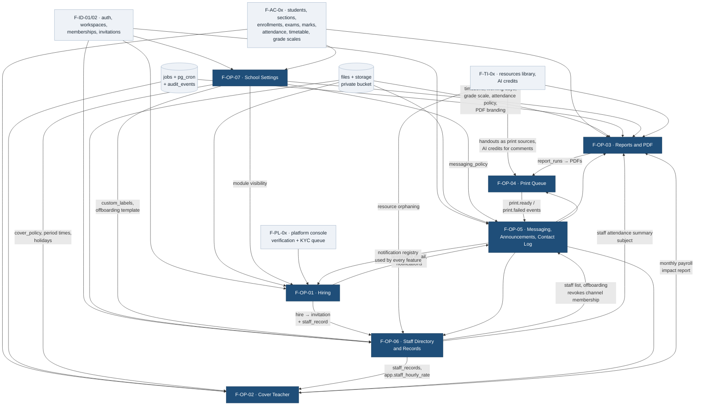

# 05 — Operations

The seven features that make Acadigma Campus a school's _operating system_ rather than a gradebook: hiring people, covering for them when they are out, producing the paper the school runs on, queueing it for the printer, talking to each other and to parents, keeping the records that prove who works here, and setting the rules that every other module obeys.

**Source of truth:** `docs/product/PRODUCT-DECISIONS.md` §6 (binding) · `docs/architecture/ARCHITECTURE.md` · `docs/architecture/DATA-MODEL.md` (**column proposals in these specs are marked "proposed; DATA-MODEL.md wins"**) · `docs/reference/base44-inventory/05-operations.md` (what the prototype had, and what was fake).

---

## 1. The features

| #                                                 | Feature                                   | Route(s)                                                                                                            | Parts | Plan gate          | What it replaces from Base44                                                                                                                                                                                                                                                                                                                      |
| ------------------------------------------------- | ----------------------------------------- | ------------------------------------------------------------------------------------------------------------------- | ----: | ------------------ | ------------------------------------------------------------------------------------------------------------------------------------------------------------------------------------------------------------------------------------------------------------------------------------------------------------------------------------------------- |
| [F-OP-01](F-OP-01-hiring.md)                      | **Hiring**                                | `/app/hiring`, `/jobs/[slug]`, `/jobs/[slug]/apply`, `/personal/cv`, `/personal/applications`, `/personal/requests` |     9 | Pro                | Three disconnected recruitment tracks (`Applicant` / `JobApplication` / `HiringPipeline`), none of which had a writer; the `/apply/:jobId` page that was never routed; the scorecard stored inside `AuditLog` and overwritten by the second interviewer; `DocumentRequest` with no candidate-side screen; `profile_score` that was never computed |
| [F-OP-02](F-OP-02-cover-teacher.md)               | **Cover Teacher**                         | `/app/cover`, `/app/cover/config`, `/app/cover/payroll`                                                             |     7 | Pro                | A fully-specified model with **no creator for `CoverAssignment` or `PayrollImpactLog`**; a priority list nothing ever read; payroll amounts with no rate to multiply; "today" computed in UTC                                                                                                                                                     |
| [F-OP-03](F-OP-03-reports-and-pdf.md)             | **Reports and PDF**                       | `/app/reports`, `/app/reports/runs`, `/app/reports/comments`, `/family/[student]/reports`                           |     8 | Starter            | Three unrelated report engines, four grade-band vocabularies, a hardcoded "TeachFlow Academy" header, `window.print()` with no print stylesheet, AI comments that vanished on navigate, no bulk generation                                                                                                                                        |
| [F-OP-04](F-OP-04-print-queue.md)                 | **Print Queue**                           | `/app/print`, `/app/print/printers`                                                                                 |     5 | Starter            | A "Print" button that only flipped a status, printer telemetry typed in by humans, a documented agent that did not exist, four of five "templates" with no generator, no `created_by`                                                                                                                                                             |
| [F-OP-05](F-OP-05-messaging.md)                   | **Messaging, Announcements, Contact Log** | `/app/messages`, `/app/messages/announcements`, `/family/announcements`                                             |     8 | Free               | Two chat implementations; `Message` with **no tenant column and no RLS**; an unguarded `/messaging` route letting parents into `#admin`; DMs leaking into `#general`; notification bodies that never rendered; parent outreach with zero record                                                                                                   |
| [F-OP-06](F-OP-06-staff-directory-and-records.md) | **Staff Directory and Records**           | `/app/staff`, `/app/staff/[id]`, `/app/staff/[id]/offboarding`, `/app/settings/labels`                              |     5 | Free (labels: Pro) | `HiredStaff` with no tenant field and no creator; no hourly-rate field anywhere (which is why cover payroll could not compute); removal semantics that left former staff with access; "Principal" as a role in three vocabularies                                                                                                                 |
| [F-OP-07](F-OP-07-school-settings.md)             | **School Settings**                       | `/app/settings/*`                                                                                                   |     6 | Free               | Settings that existed and were never read (`payroll_enabled`), grade bands living in four source files, a hardcoded work week, UTC "today", no surface for most rules                                                                                                                                                                             |

**Total: 48 parts**, each scoped to ≤ ~2 days with an explicit demo criterion.

---

## 2. Dependency graph

**Reading the graph.** F-OP-07 and F-OP-06 are the roots: settings supply the rules and F-OP-06 supplies the person-row (and the hourly rate) that cover payroll multiplies. F-OP-05 is a _horizontal_ — its notification event registry is what every other feature writes to, so its Part 3 has to land before any feature can claim its notifications work. F-OP-03 is the renderer everything paper-shaped depends on; F-OP-04 consumes its output. F-OP-01 is the least depended-upon and the most depending — it is safe to build late and unsafe to build early.

---

## 3. Build order

Ordered so that nothing is built against a dependency that does not exist, and so that something demoable ships every week.

| Wave                          | Build                                                     | Parts | Why here                                                                                                                                                                                                                  |
| ----------------------------- | --------------------------------------------------------- | ----: | ------------------------------------------------------------------------------------------------------------------------------------------------------------------------------------------------------------------------- |
| **1 — rules and people**      | F-OP-07 Parts 1–3 · F-OP-06 Parts 1–2                     |     5 | Nothing downstream can be correct without `resolve()`, the timezone, the attendance policy, and a staff record with a rate. F-OP-06 Part 1 also settles the `staff_compensation` question with the data-model agent.      |
| **2 — the school can talk**   | F-OP-05 Parts 1–3 · F-OP-06 Parts 3–4                     |     5 | Messaging is a Free module and the daily-use hook; its Part 3 delivers the **notification event registry** every later feature depends on. F-OP-06 Part 4 delivers `app.staff_hourly_rate`, which unblocks cover payroll. |
| **3 — the school can print**  | F-OP-03 Parts 1–3 · F-OP-07 Parts 4–5                     |     5 | The PDF foundation + run pipeline + the first real report card. The grade-scale editor and calendar land alongside because the report card is the thing that proves them.                                                 |
| **4 — reports at scale**      | F-OP-03 Parts 4–6 · F-OP-04 Parts 1–3                     |     6 | Comments with approval, bulk cards, register and mark sheet — then the print queue that carries them, with roster copy counts.                                                                                            |
| **5 — cover**                 | F-OP-02 Parts 1–5                                         |     5 | Needs settings (periods, holidays, policy), staff records (rates) and notifications — all present by now. Parts 1–2 (schema + pure ranking engine) can start in parallel with wave 4 because they have no UI dependency.  |
| **6 — cover closes the loop** | F-OP-02 Parts 6–7 · F-OP-03 Parts 7–8 · F-OP-04 Parts 4–5 |     7 | Missed-punch + auto-complete + payroll impact, whose monthly report needs F-OP-03 Part 7's renderer; staff summary, profile sheet and ID cards; uploads and bulk print actions.                                           |
| **7 — messaging completes**   | F-OP-05 Parts 4–8 · F-OP-06 Part 5                        |     6 | Threads, attachments, DMs, announcements, contact log and moderation. Offboarding lands here because its revoke step closes channel memberships (F-OP-05 Part 1) and orphans resources (F-TI).                            |
| **8 — hiring**                | F-OP-01 Parts 1–9 · F-OP-07 Part 6                        |    10 | Last, because hire → invitation → staff record needs F-OP-06 finished, candidate email needs F-OP-05, and the module toggle that hides it for non-Pro schools is F-OP-07 Part 6.                                          |

**Parallelism.** Waves are sequential in dependency, not in calendar. Three streams can run side by side: _settings + staff_ (F-OP-07, F-OP-06), _paper_ (F-OP-03, F-OP-04), and _comms_ (F-OP-05). Cover (F-OP-02) joins once both of the first two have landed their foundations; hiring (F-OP-01) is a single stream at the end.

**The three cross-feature gates** — build these first within their wave, because several features stall behind each:

1. `packages/domain/settings/resolve.ts` + defaults (F-OP-07 Part 1).
2. `app.staff_hourly_rate()` + `staff_compensation` (F-OP-06 Parts 1 and 4).
3. The notification event registry + its CI parity test (F-OP-05 Part 3).

---

## 4. Shared invariants across this area

Every spec here commits to the same seven rules; a reviewer can check any PR in this area against them.

1. **One tenant key.** `workspace_id` on every table, RLS on every table, pgTAP isolation **and** escalation tests per table. The Base44 area had three tenancy conventions and a literal `'default'` string; there is now one.
2. **No fake state.** No button claims an action it does not perform, and no column exists that only a human can type while pretending to be telemetry (F-OP-04 §3.2 is the explicit case). Where v1 cannot do a thing, the UI says so in one sentence.
3. **Nothing is silently discarded.** Override reasons, failure reasons, rejection reasons and audit before/after are persisted; errors surface with a code, never a swallowed `catch`.
4. **One formula per concept.** Grades and GPA come only from `app.compute_exam_result`; attendance percentage from one shared implementation tested in SQL and TS against one fixture; money is `bigint` paisa everywhere with one `MoneyText`.
5. **Time is the school's.** Every "today", month boundary and cron window is computed in `school_profiles.timezone`; `new Date().toISOString().split('T')[0]` is banned by lint.
6. **Consent and privacy are enforced server-side.** Candidate documents (F-OP-01 §5.6), message attachments (F-OP-05 §5.7), staff documents (F-OP-06 §5.7) each have exactly one SQL predicate, called from `/api/files/[id]`, with every access logged.
7. **Phone first, at 360×800.** Kanban on desktop is a list-plus-sheet on a phone; long forms are full-screen pages, not sheets; every destructive action is at least two deliberate steps from a thumb.

---

## 5. Open items carried to other agents

| Item                                                                                                                                                                                                    | Raised in                      | Needs                                                         |
| ------------------------------------------------------------------------------------------------------------------------------------------------------------------------------------------------------- | ------------------------------ | ------------------------------------------------------------- |
| `staff_compensation` as a **separate, period-versioned table** rather than an `hourly_rate` column on `staff_records` — RLS is row-level, and cover payroll needs the rate that was in force on the day | F-OP-06 §11 Q1, F-OP-02 §11 Q5 | **DATA-MODEL.md decision** (highest-impact call in this area) |
| jsonb policy blobs (`attendance_policy`, `academic_settings`, `cover_policy`, `messaging_policy`, `branding`) vs typed columns                                                                          | F-OP-07 §11 Q2                 | DATA-MODEL.md                                                 |
| Ownership of `academic_years` / `terms` / `holidays` (edited in settings, owned by academics)                                                                                                           | F-OP-07 §11 Q1                 | academics area                                                |
| A per-report-kind `data_version` SQL function for render caching                                                                                                                                        | F-OP-03 §11 Q3                 | DATA-MODEL.md                                                 |
| Report card unit: per exam, with "Annual" as an aggregate exam                                                                                                                                          | F-OP-03 §11 Q1                 | academics area                                                |
| Recruiter ↔ candidate messaging: candidates are not members, so DM RLS excludes them; v1 uses templated email + application notes                                                                       | F-OP-01 §11 Q1, F-OP-05 §11 Q2 | owner decision if in-app candidate chat is wanted             |
| Half-day absence granularity (which periods) for the cover trigger                                                                                                                                      | F-OP-02 §11 Q2                 | staff-attendance feature                                      |
| Exam-paper confidentiality in a shared print queue                                                                                                                                                      | F-OP-04 §11 Q3                 | security review                                               |
| Applicant CV storage attribution and 12-month retention                                                                                                                                                 | F-OP-01 §11 Q2                 | billing/storage area                                          |
