# Test Report — F-OP-07 School Settings, Part 1 (remainder)

|         |                                                                                          |
| ------- | ---------------------------------------------------------------------------------------- |
| Feature | F-OP-07 — School settings                                                                |
| Part    | 1 (remainder) — settings shell, school profile, branding preview                         |
| Spec    | `docs/features/05-operations/F-OP-07-school-settings.md` §4 W1-W2, §8 Part 1, §11 item 7 |
| PR      | #39                                                                                      |
| Status  | **PASS WITH KNOWN ISSUES**                                                               |
| Date    | 2026-09-25                                                                               |
| Run by  | Claude (operations lane builder)                                                         |

---

## 1. Scope

**What this Part is.** An owner or admin can open `/app/settings`, search it, and edit the school profile (legal name, EIIN, board, medium, type, motto, address, contacts, BIN/VAT) and the branding header (two header lines with `{token}`s, accent colour, footer). A live preview of the report-card header updates as they type. Two people saving the same settings cannot overwrite each other. Teachers and staff land on a read-only "How this school works" page instead. M0 had already shipped `resolve()` and the defaults.

**Acceptance criteria covered** (spec §9):

| #    | Criterion                                                                      | Covered by                                                                                                                                                                                                                   |
| ---- | ------------------------------------------------------------------------------ | ---------------------------------------------------------------------------------------------------------------------------------------------------------------------------------------------------------------------------- |
| AC1  | Missing setting resolves to the typed default                                  | M0 `resolve.test.ts` (unchanged); the overview page reads only through `resolve()`                                                                                                                                           |
| AC4  | Teacher sees the read-only overview; `updateSchoolProfile` returns `forbidden` | `profile-actions.test.ts` "refuses a teacher with forbidden before touching the database"; `e2e/journeys/school-settings.spec.ts` teacher test (redirect + 403 on `/app/settings/school`); RLS `school_profiles_update` (M0) |
| AC5  | Stale version returns a conflict and nothing is clobbered                      | `settings-profile.test.ts` "returns conflict and writes nothing when the version is stale"                                                                                                                                   |
| AC6  | "Changed X → Y by {name}, {date}" on the setting's screen                      | `settings-history.tsx` (owner only, see known issue 3). Not covered by an automated test.                                                                                                                                    |
| AC41 | Full-screen sub-page, save bar only when dirty, no horizontal scroll           | `school-settings.spec.ts` owner tests (live-only, see §5)                                                                                                                                                                    |

**Out of scope for this Part** (D-200): logo upload and variants, the `school_public_settings` view, the F-OP-03-rendered preview, the §5.1 key-parity CI test and `resolve()` lint rule, AC2/AC3. Part 2 (academic settings) is not started because the academics tables do not exist yet.

**Risk areas:** a role check that only lives in the UI (covered by action tests and RLS); a lost update when two admins save (covered by the concurrency test); an unknown header token printing blank on every PDF (refused server-side and flagged live).

---

## 2. Environment

|                |                                                          |
| -------------- | -------------------------------------------------------- |
| Branch         | `feat/F-OP-07-p1-p2-settings`                            |
| CI run         | see PR #39 checks                                        |
| Supabase       | none locally (no Docker); pgTAP and live e2e are CI-only |
| Migration head | no migration in this PR                                  |
| Node / pnpm    | v24.19.0 / 10.34.5                                       |

---

## 3. Unit and integration (Vitest)

Local run, `pnpm test` on Windows: **80 files, 901 tests, all passed** (whole repo, after merging origin/main with #32, #35 and #36, including review fixes). The new suites:

| Suite                                                        | Tests | Result |
| ------------------------------------------------------------ | ----- | ------ |
| `packages/domain/src/settings/header.test.ts`                | 5     | pass   |
| `packages/contracts/src/settings-profile.test.ts`            | 8     | pass   |
| `packages/db/src/repositories/settings-profile.test.ts`      | 7     | pass   |
| `apps/web/app/(school)/app/settings/profile-actions.test.ts` | 6     | pass   |
| `apps/web/app/(school)/app/settings/history-line.test.ts`    | 4     | pass   |

Coverage (local `vitest run --coverage`): all files 91.8 % lines / 83.61 % branches. `packages/db/src/repositories/settings.ts` 92.75 % statements, 87.75 % branches, 100 % functions.

### Notable cases proven

- Invalid input (5-digit EIIN, unknown board, blank city, unknown column) is rejected before the workspace is even resolved.
- A teacher gets `forbidden`, and neither `requireWritable` nor the UPDATE is reached.
- A read-only workspace gets `payment_required` and nothing is written.
- A save with a stale `updated_at` returns `conflict`, and the earlier save's value survives. **Proven only against an in-memory fake client**, not real Postgres: whether PostgREST's `eq(updated_at, <microsecond ISO string>)` round-trips exactly is not tested here (no local Postgres; live e2e gated on OQ-27).
- The audit history query asks for `table_name = 'public.school_profiles'`, the `schema.table` form the audit trigger stores (`history-line.test.ts`). A review caught that the first version asked for `school_profiles` and always got an empty list.
- History lines substitute in a single pass, so a stored `{name}` or `$&` prints literally.
- A `javascript:` website and a malformed version are validation errors.
- Branding merges onto the stored blob, so keys not being edited are kept.
- A duplicate EIIN (`23505`) comes back as a `conflict` on the `eiin` field.
- `{school_name}` in a header line is refused, and the error names the token.

---

## 4. Database (pgTAP)

No migration and no new table. `school_profiles` RLS isolation and escalation are already covered by `02_tenant_isolation.sql`, `09_tenancy.sql` and `22_school_eiin_availability.sql`. CI's `db` job result is in §9.

---

## 5. End to end (Playwright)

`e2e/journeys/school-settings.spec.ts` has three journeys (owner profile edit and search, owner branding preview, teacher read-only), each with axe and a horizontal-scroll check at both viewports. They carry the `E2E_LIVE_SUPABASE` skip guard (OQ-27), so **they were not run** locally or in CI. The only local environment file points at a live project, and running write journeys against it was judged unsafe.

### Screenshots

Taken by the lead reviewer against the demo school (local dev server), copied into `docs/test-reports/assets/op07-p1/`. These show the version from before the review fixes, so the selects are still narrower than the inputs; fix 6 (native-select `w-full`) addresses that.

| Screen                    | 360 × 800                                             | 1280 × 800                                              |
| ------------------------- | ----------------------------------------------------- | ------------------------------------------------------- |
| `settings`                | 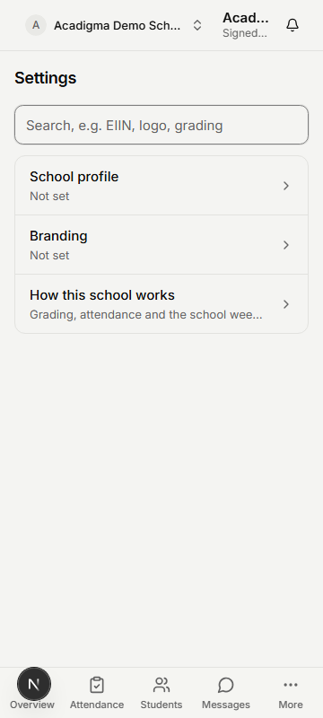                | 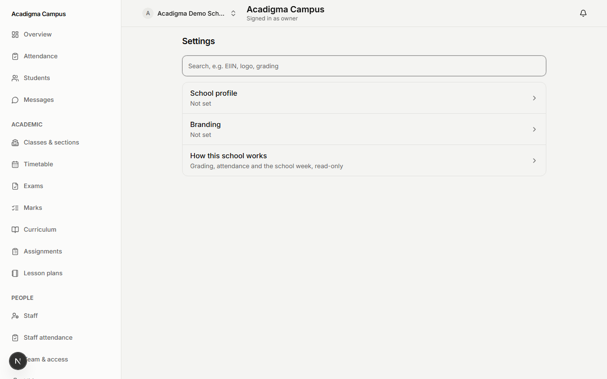                |
| `settings-overview`       | 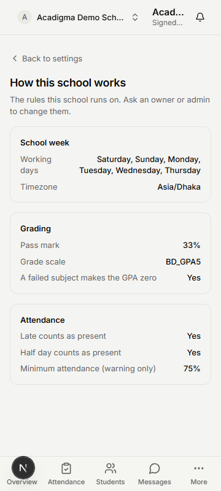       | 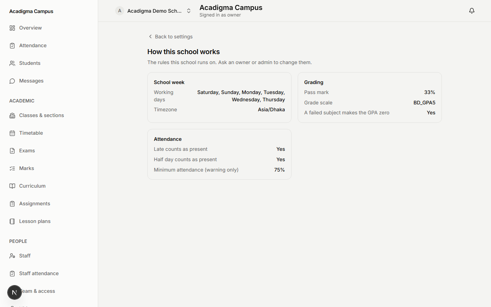       |
| `settings-school`         | 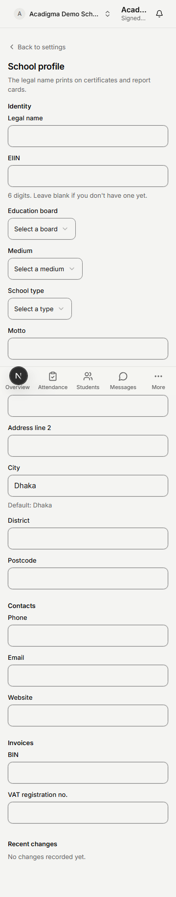         | 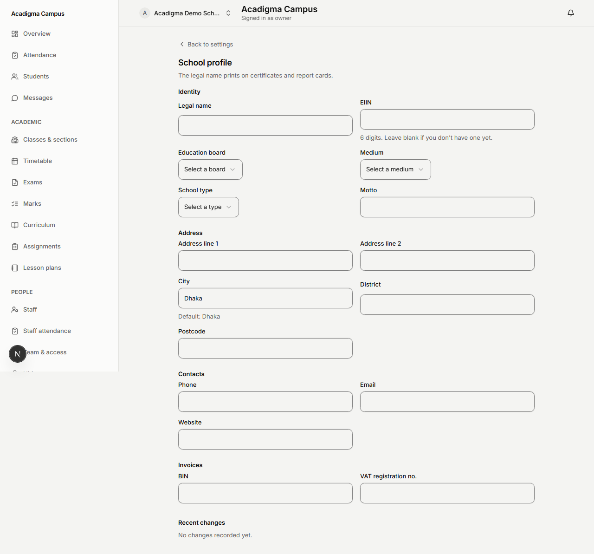         |
| `settings-school-dirty`   | 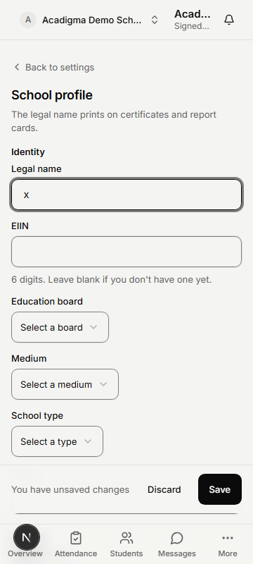   | 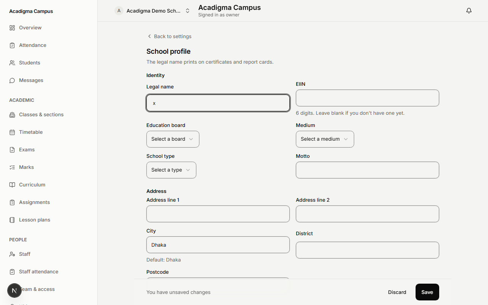   |
| `settings-branding`       | 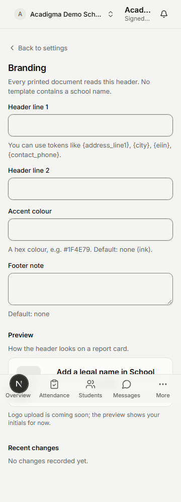       | 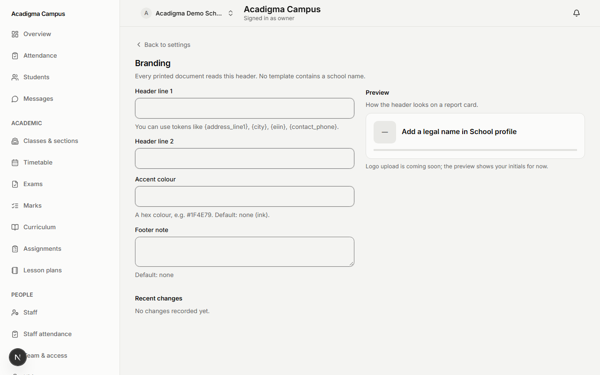       |
| `settings-branding-dirty` | 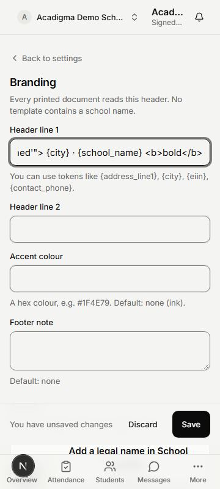 | 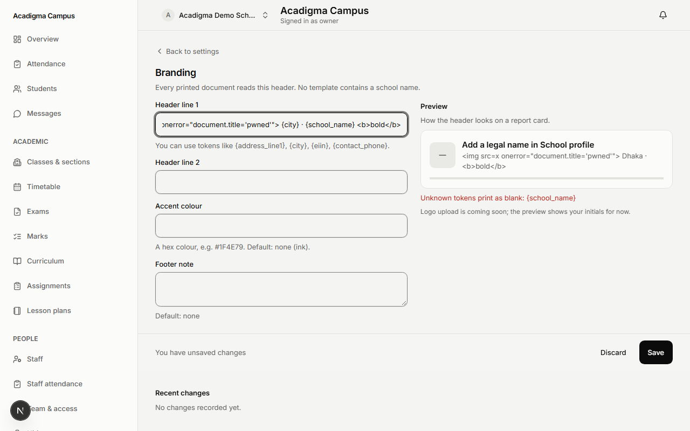 |

---

## 6. Performance

| Budget                                 | Target      | Measured (local `next build`, `check-bundle-budget`)                      | Result |
| -------------------------------------- | ----------- | ------------------------------------------------------------------------- | ------ |
| First-load JS `/app/settings`          | ≤ 250 kB gz | 196 kB                                                                    | pass   |
| First-load JS `/app/settings/school`   | ≤ 250 kB gz | 227 kB (was 260 kB with Radix Select, replaced by shadcn `native-select`) | pass   |
| First-load JS `/app/settings/branding` | ≤ 250 kB gz | 227 kB                                                                    | pass   |
| First-load JS `/app/settings/overview` | ≤ 250 kB gz | 184 kB                                                                    | pass   |

---

## 7. Security checks

Server actions follow parse → context → `can()` → `requireWritable` → repository. RLS (`school_profiles_update`, owner/admin) independently refuses a bypass. No new client-callable database function, grant or table. CI's `security` job result is in §9.

---

## 8. Known issues

| #   | Issue                                                                                                   | Severity | Ship anyway?                            |
| --- | ------------------------------------------------------------------------------------------------------- | -------- | --------------------------------------- |
| 1   | Logo upload not built (D-200)                                                                           | medium   | yes, needs a files pipeline first       |
| 2   | e2e journeys and axe are unproven until a live seeded project exists (OQ-27)                            | medium   | yes, same as every seeded journey today |
| 3   | Admins see no inline change history, because `audit_events` is owner-readable only                      | low      | yes, by design (F-ID-09 OQ-2)           |
| 4   | A conflict offers a reload but does not show the other person's value inline                            | low      | yes                                     |
| 5   | Overlap with F-ID-03 Part 8 `/app/settings/workspace` (same fields)                                     | medium   | yes, lead to decide the owner screen    |
| 6   | A stored legacy `board`/`medium` value ("BD National", "Bangla") shows as unset until someone picks one | low      | yes                                     |

**Deliberately not tested:** `settings-history.tsx` rendering (a thin read over `listAuditEvents`, which has its own tests).

---

## 9. Sign-off

| Definition of Done                           | Met                                   |
| -------------------------------------------- | ------------------------------------- |
| Spec written and matches the build           | yes (§11 item 7 lists the deviations) |
| Migration + pgTAP isolation and escalation   | n/a, no migration                     |
| Unit tests + coverage thresholds             | yes                                   |
| UI built and verified at both viewports      | built; not visually verified (§5)     |
| Playwright journey at both viewports         | written; skip-gated (OQ-27)           |
| a11y — zero serious/critical + manual checks | in the skip-gated journeys; not run   |
| This test report, with real numbers          | yes; CI numbers in the PR checks      |
| Docs updated in the same PR                  | yes                                   |

> Local numbers above come from real runs on 2026-09-25. Nothing marked "not run" was run.
