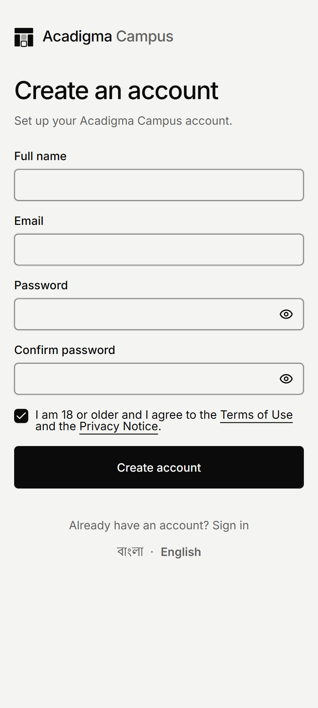
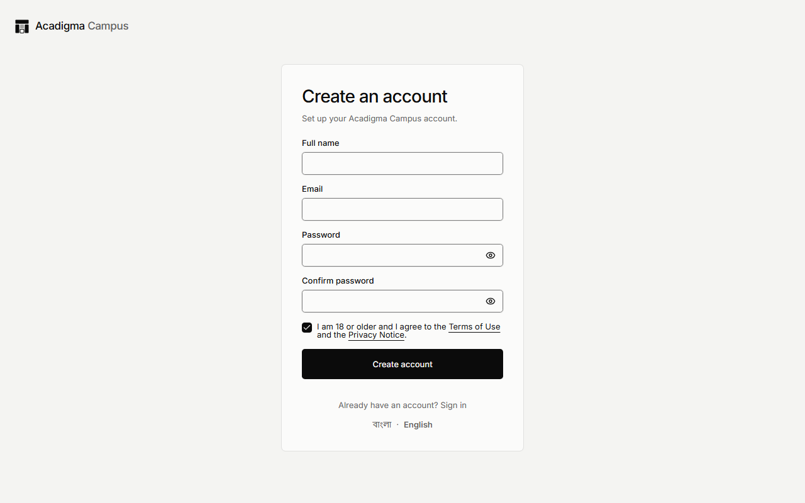
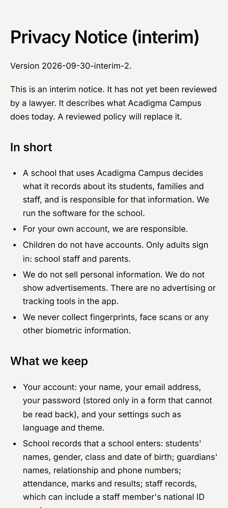
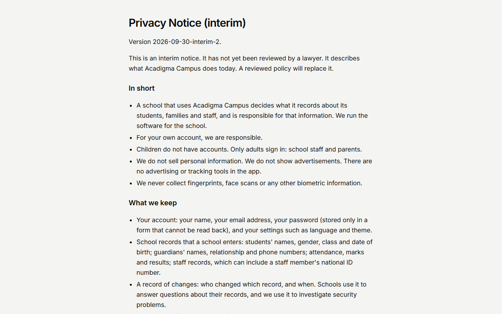

# Test Report — Legal acceptance and guardian consent (D-114)

|         |                                                                                                 |
| ------- | ----------------------------------------------------------------------------------------------- |
| Feature | F-ID-01 (sign-up), F-ID-05 (school creation), F-AC-02 (parent link) — legal audit items 4, 5, 6 |
| Part    | Consent + legal acceptance (D-114), taken ahead of F-ID-03 Part 8                               |
| Spec    | F-ID-01 / F-ID-05 / F-AC-02 §11 "2026-09-30" status notes; COMPLIANCE-PDPA §9.1 status          |
| PR      | #121                                                                                            |
| Status  | **PASS WITH KNOWN ISSUES**                                                                      |
| Date    | 2026-09-30                                                                                      |
| Run by  | Claude (identity lane)                                                                          |

## 1. Scope

Before this Part, people were asked to agree to documents that did not exist, and the agreement was thrown away. There was no DPA step, and parents gave no consent. Now:

- `/legal/terms`, `/legal/privacy` and `/legal/dpa` are public. Each is marked interim and unreviewed.
- Signing up records the Terms and Privacy versions agreed to, and the checkbox now also says "I am 18 or older".
- Creating a school requires the owner to accept the DPA on the school's behalf. The acceptance is recorded with the school.
- Accepting a parent link shows the consent text with the school and child named and requires "I agree". The consent is recorded in the language it was shown in.

| Criterion                                                                                                | Covered by                                                            |
| -------------------------------------------------------------------------------------------------------- | --------------------------------------------------------------------- |
| Sign-up writes `terms` + `privacy` with the published hash                                               | pgTAP `39f` A1-A2; `register-legal.test.ts`                           |
| No metadata → nothing; an unpublished version fails the sign-up                                          | pgTAP `39f` A3-A5                                                     |
| An unticked box creates no account                                                                       | `register-legal.test.ts`                                              |
| A school is created only with the owner's DPA row; a replay adds none                                    | pgTAP `39f` B1-B6; `(onboarding)/actions.test.ts`; `wizard.test.tsx`  |
| Parent consent is recorded once, with child, guardian, version, language hash                            | pgTAP `39f` C1-C6; `invite-accept.test.tsx`; `guardian-links.test.ts` |
| An unpublished version or language is refused and links nothing                                          | pgTAP `39f` C7-C9                                                     |
| A revoked link gets no consent; a second row for one invitation is refused                               | pgTAP `39f` C10-C11                                                   |
| Isolation and escalation                                                                                 | pgTAP `39f` D1-D9                                                     |
| Documents are public, readable, axe-clean, and linked from the sign-up checkbox; any other slug is a 404 | `e2e/journeys/legal-documents.spec.ts` (both viewports)               |
| Published strings equal the hashes the migrations stored                                                 | `apps/web/lib/legal/texts.test.ts`                                    |

**Out of scope:** the following are listed as not built in D-114:

- the re-acceptance screen
- counsel-reviewed texts and Bengali versions
- paper consent, assurance levels and withdrawal
- the staff privacy notice
- IP and user-agent evidence
- the contract migration that revokes the one-argument overloads

## 2. Environment

|                |                                                                                                                                                                                      |
| -------------- | ------------------------------------------------------------------------------------------------------------------------------------------------------------------------------------ |
| Branch         | `feat/identity-legal-consent`                                                                                                                                                        |
| Migration head | `20260930044136_legal_acceptance_review.sql`                                                                                                                                         |
| Node / pnpm    | v24.19.0 / 10.34.5 (local, Windows)                                                                                                                                                  |
| Database       | Local Supabase container (Postgres 17.6). The 21 migrations it lacked were applied inside one transaction with each test file, then rolled back. CI's `db` job is the run of record. |
| Browser        | Playwright Chromium, `next start` on port 3101                                                                                                                                       |

## 3. Unit and integration (Vitest)

| Suite                   | Result                                                                                                    |
| ----------------------- | --------------------------------------------------------------------------------------------------------- |
| `pnpm test` (all)       | 188 files passed, 11 skipped; 1888 tests passed, 36 skipped                                               |
| New/changed for this PR | 7 files, 69 tests passed (legal, register, invite, wizard, onboarding actions, school and guardian repos) |

Integration tests (`*.integration.test.ts`) need a live stack and were skipped locally. Coverage was not measured separately.

## 4. Database (pgTAP)

| File                                   | Plan | Passed | Notes                                             |
| -------------------------------------- | ---- | ------ | ------------------------------------------------- |
| `39f_legal_acceptance_and_consent.sql` | 32   | 32     | new                                               |
| `12_function_grants_invariant.sql`     | 12   | 12     | allowlist now includes the two new overloads      |
| `30_create_school_workspace.sql`       | 64   | 64     | regression: the wrapped function                  |
| `38_guardian_linking.sql`              | 66   | 66     | regression                                        |
| `39_guardian_followups.sql`            | 58   | 58     | regression                                        |
| `14_rls_known_gaps.sql`                | 65   | 65     | regression: `consent_records`/`legal_acceptances` |
| `25_security_audit_p2.sql`             | 40   | 40     | regression                                        |

**Isolation (D1-D5):** the parent, the owner and an outsider each see only their own rows, or only their own school's rows.

**Escalation:**

- No client role reads or writes `app.legal_documents`, and none calls the hash lookup or the trigger function (D6-D7).
- `anon` can call neither overload (B7, D8).
- A published hash cannot be changed (D9).

## 5. End to end (Playwright)

| Journey                                    | 360 × 800           | 1280 × 800          | Notes                                       |
| ------------------------------------------ | ------------------- | ------------------- | ------------------------------------------- |
| `legal-documents.spec.ts` (5 tests)        | PASS                | PASS                | axe on all three documents: 0 violations    |
| `smoke.spec.ts` (4 tests)                  | PASS                | PASS                | landing page with the new legal footer      |
| `create-school-wizard.spec.ts` (ticks DPA) | not run (live only) | not run (live only) | needs seeded accounts (`E2E_LIVE_SUPABASE`) |
| `guardian-invite.spec.ts` (ticks I agree)  | not run (live only) | not run (live only) | same                                        |

The first local run found a real bug. `dynamicParams = false` alone still rendered `/legal/cookies` in the production build, and the page threw a 500. The page now calls `notFound()` itself, and the 404 test passes.

### Screenshots

| Screen           | 360 × 800                                               | 1280 × 800                                                |
| ---------------- | ------------------------------------------------------- | --------------------------------------------------------- |
| `/register`      |  |  |
| `/legal/privacy` |   |   |

There are no screenshots of the wizard review step or the parent accept screen, because both need a signed-in seeded account. Component tests cover both screens.

## 6. Performance

- **`/legal/[document]`:** the page is 173 B and its first-load JS is 188 kB. It is prerendered as static HTML.
- **Bundle budget:** the two new contract schemas pushed `/app/students` 155 bytes over the limit (256,155 B against 256,000 B). After `packages/contracts` was marked `sideEffects: false`, the page measured 245 kB, and `check-bundle-budget` passes.

## 7. Security checks

**Reviews:**

- `security-reviewer` (Opus): no HIGH findings; 3 MEDIUM and 6 LOW. Each is fixed or documented in the D-114 section "Review of PR #121".
- `engineering-database-optimizer`: 1 MEDIUM, fixed with a unique index.
- `react-reviewer`: `noreferrer` added.
- `ponytail-review`: its simplifications were applied, except relying on `dynamicParams` alone, which was reverted after e2e showed the 500.

**Grants:** every new function and table is explicitly revoked or granted (D-54), and `12_function_grants_invariant` passes.

**Not run locally:** gitleaks, Semgrep and `pnpm audit` are left to CI. DAST is not applicable.

## 8. Known issues

| #   | Issue                                                                                                                                                | Severity | Ship anyway?                                                     |
| --- | ---------------------------------------------------------------------------------------------------------------------------------------------------- | -------- | ---------------------------------------------------------------- |
| 1   | `create_school_workspace(jsonb)` and `accept_guardian_invitation(text)` stay granted, so a direct API caller can skip the record                     | medium   | yes — expand-first; revoking them is the next identity follow-up |
| 2   | Accounts created before this change, or through the Auth API without the metadata, have no Terms/Privacy row. The re-acceptance screen is not built. | medium   | yes — only demo accounts exist today                             |
| 3   | The texts are interim and unreviewed; Terms, Privacy and DPA are in English only                                                                     | medium   | yes — OWNER-QUESTIONS 1-4                                        |
| 4   | The live journeys for the wizard and the parent link were not run locally                                                                            | low      | yes — they run in CI once #90 lands                              |
| 5   | The first-draft `privacy`/`guardian_consent` rows stay in the append-only `app.legal_documents`; they were never deployed                            | low      | yes — nobody accepted them                                       |
| 6   | `/legal/*` has no header link back to the app                                                                                                        | low      | yes                                                              |

## 9. Sign-off

Built and self-reviewed by Claude (identity lane). Awaiting the lead's review and CI.
