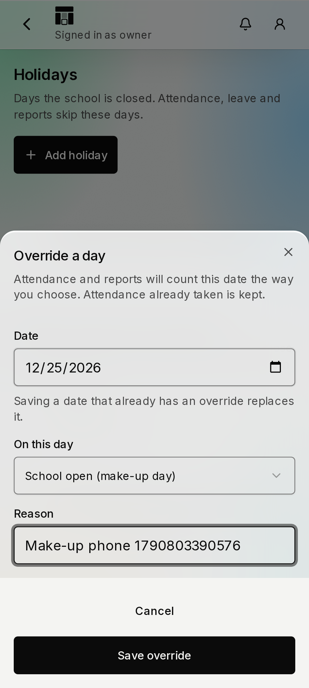
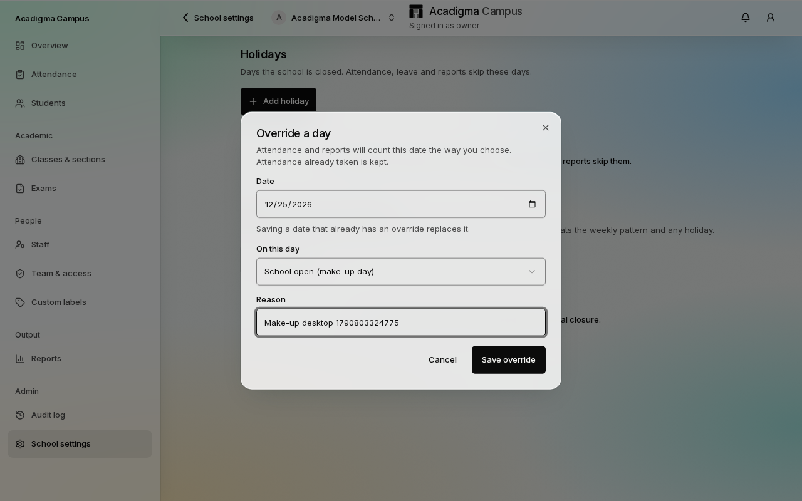
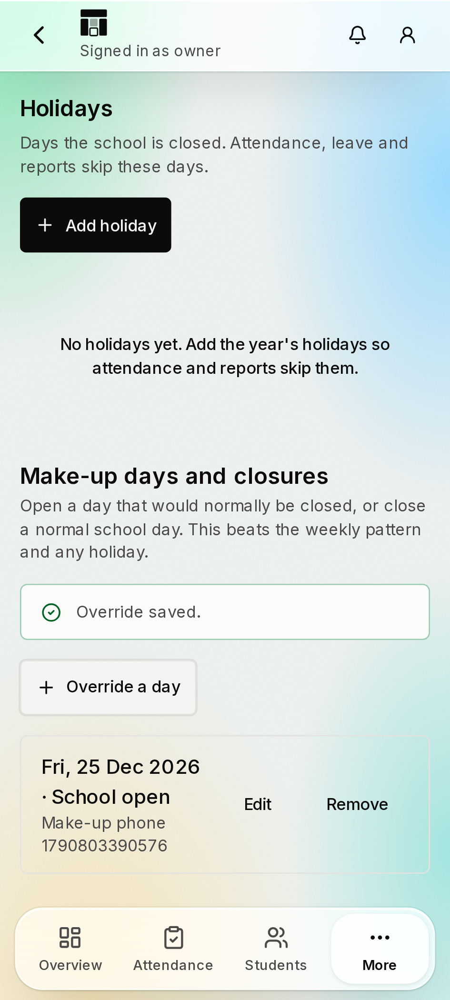
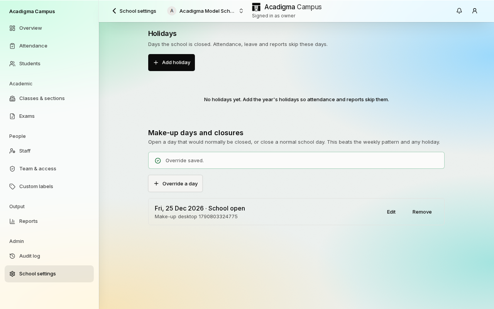
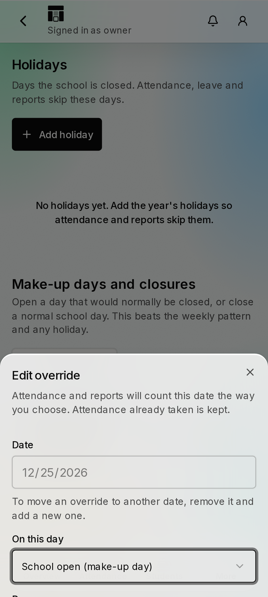
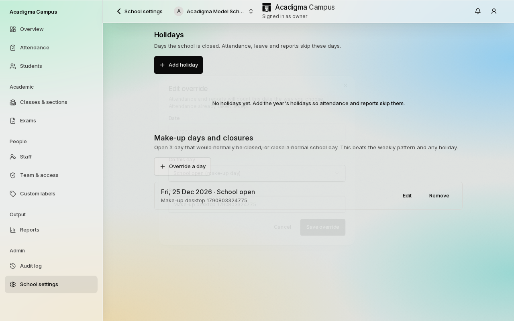
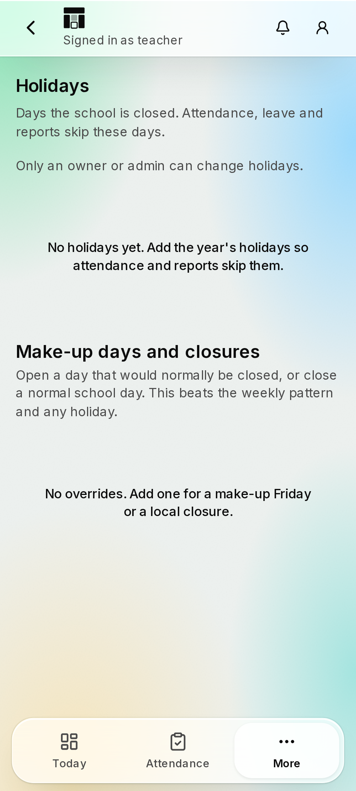
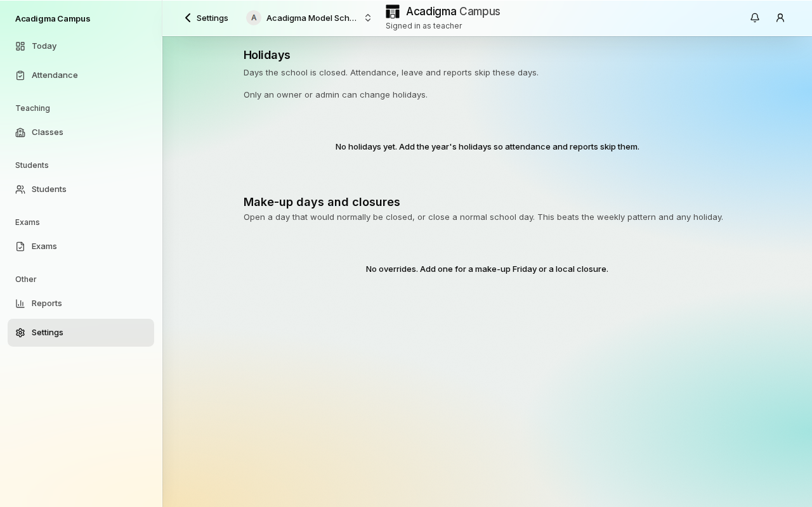

# Test Report — F-AC-11 working-day overrides screen (D-213)

|         |                                                                   |
| ------- | ----------------------------------------------------------------- |
| Feature | F-AC-11 — School calendar, §4.3 "Working-day override"            |
| Part    | Override screen on `/app/settings/calendar` (no migration)        |
| Spec    | `docs/features/02-academics/F-AC-11-calendar.md` §4.3, §11 item 8 |
| PR      | #131                                                              |
| Status  | **PASS WITH KNOWN ISSUES**                                        |
| Date    | 2026-10-01                                                        |
| Run by  | Claude (operations lane)                                          |

## 1. Scope

An owner or admin can force a date open (make-up Friday) or shut (local closure) with a required reason; saving a date again replaces the row; removal is confirmed. Other staff roles read the list. The table, RLS, audit trigger and `app.is_school_day` precedence were built and pgTAP-tested in PR #43 (`41_school_calendar.sql`, unchanged; no schema change, so no new pgTAP).

**Not built** (dependency missing): optional short bell schedule, reverse impact preview, `calendar.override.created` notification.

## 2. Environment

Branch `feat/calendar-overrides`; CI run 36775577013 (ubuntu); local Windows, Node 24, pnpm 10. No Docker locally: pgTAP and e2e ran only in CI.

## 3. Unit and integration

| Suite                                       | Result                                                                                              |
| ------------------------------------------- | --------------------------------------------------------------------------------------------------- |
| `pnpm test` local and CI `unit`             | 2045 passed, 36 skipped                                                                             |
| CI `db-integration`                         | 36 passed                                                                                           |
| New: contracts, repository, actions, domain | schema (reason required, strict), upsert/list/delete map, teacher/read-only refused, `can()` matrix |

## 4. Database (pgTAP)

Not re-run for this change: no migration. `db` job skipped by CI (no `supabase/` change). `41_school_calendar.sql` gains a staff-role insert refusal and an admin-of-School-A-into-School-B insert refusal (plan 52 to 54); it already asserts teacher cannot insert an override, reason required, isolation and precedence.

## 5. End to end (Playwright, CI `e2e-live` 4 shards)

Shards: 44 / 50 / 50 / 51 / 52 passed lines across `e2e` and `e2e-live`, 0 failed. `school-holidays.spec.ts` gained an owner journey (create, edit same date, remove) and a teacher read-only journey, at 360x800 and 1280x800, axe on the sheet and page.

## 6. Security checks

Write gate `can("calendar.override.write")` then `requireWritable`, then RLS (owner/admin) and `tg_require_writable`; contract `.strict()` so the client cannot send a workspace id; audit rows from the existing trigger.

## 7. Known issues

- CI `lighthouse` failed on `/login` LCP (3661 ms against a 3500 ms ceiling), a public page this PR does not touch; `/app` is not measured. Treated as runner noise; rerun recorded in the PR.
- `working_day_overrides.academic_year_id` (spec §3) is not added: deferred since D-202, confirmed by the lead; no schema change in this Part.
- The `/login` Lighthouse failure comes from the #128 auth-page restyle; the design lane is fixing it. This PR merges `origin/main` afterwards.

## 8. Sign-off

Awaiting lead review and owner approval.

## 9. Screenshots

Captured by the `school-holidays.spec.ts` journeys in CI `e2e-live` (run 36778264468), phone = 360 x 800, desktop = 1280 x 800.

| Screen                          | 360 x 800                                                                     | 1280 x 800                                                                      |
| ------------------------------- | ----------------------------------------------------------------------------- | ------------------------------------------------------------------------------- |
| Owner: add sheet                |             |             |
| Owner: list with an override    |        |        |
| Owner: edit sheet (date locked) |        |        |
| Teacher: read-only              |  |  |
