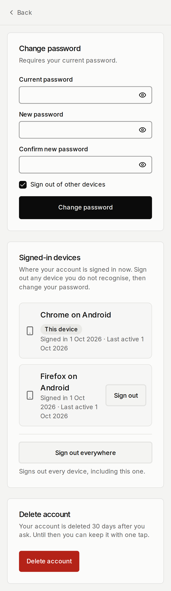
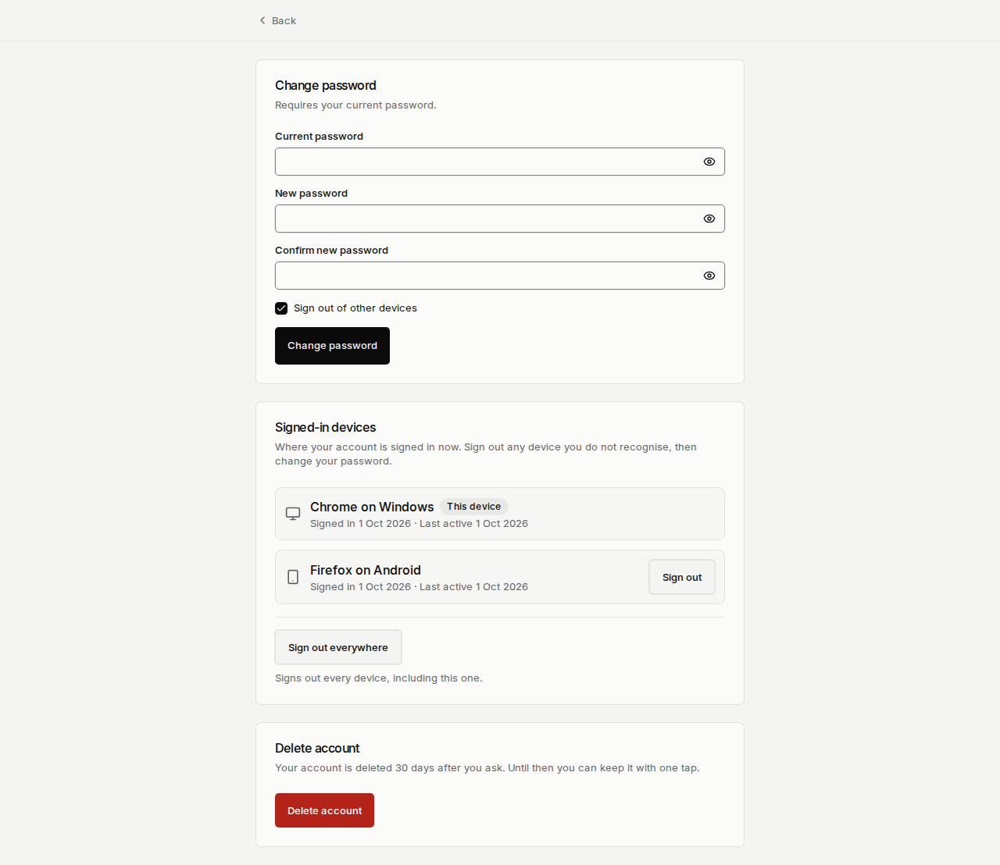

# Test Report — F-ID-01 Part 6: sessions and devices (D-116)

|         |                                                                         |
| ------- | ----------------------------------------------------------------------- |
| Feature | F-ID-01 — Authentication, sessions and account lifecycle                |
| Part    | 6 — Sessions and devices                                                |
| Spec    | `docs/features/01-identity/F-ID-01-authentication.md` §11, Part 6 entry |
| PR      | #132                                                                    |
| Status  | **PASS WITH KNOWN ISSUES**                                              |
| Date    | 2026-10-01                                                              |
| Run by  | Claude (identity lane)                                                  |

## 1. Scope

`/account/security` → **Signed-in devices**: every live Supabase session of the caller, the current one first and badged **This device**, a **Sign out** button on each other device, and **Sign out everywhere** (this device included). A password sign-in while another session is live raises the in-app `auth.new_device_signin` notification once. The list is `auth.sessions` itself (D-116); the server client forwards the browser's user agent so the label names the person's device.

| Criterion                                                                                                                       | Covered by                                                                                                     |
| ------------------------------------------------------------------------------------------------------------------------------- | -------------------------------------------------------------------------------------------------------------- |
| S1 lists every live session, current one first and marked; no expired session, no IP                                            | pgTAP `39h` A1-A5; `sessions.test.ts`; `signed-in-devices.test.tsx`; journey                                   |
| S2 signing out another device removes it, audits `session.revoked`; that browser → /login                                       | pgTAP `39h` C3, C6, C7; `session-actions.test.ts`; journey (two browsers, AC10)                                |
| S3 no one sees or revokes another person's session; anon calls nothing                                                          | pgTAP `39h` A5, C1, C5, D1-D3; `12_function_grants_invariant`                                                  |
| S4 Sign out everywhere asks first (Cancel changes nothing), then ends every session incl. this one, audited once with the count | pgTAP `39h` E1-E4; `session-actions.test.ts`; `signed-in-devices.test.tsx`; journey (cancel and confirm paths) |
| Focus moves to the next device after a sign-out                                                                                 | `signed-in-devices.test.tsx`                                                                                   |
| S5 axe clean at both viewports                                                                                                  | journey (`expectNoA11yViolations`)                                                                             |
| A failed revoke puts the card back (§6)                                                                                         | `signed-in-devices.test.tsx`                                                                                   |
| New-device notification once per session (unique index), only with another live session                                         | pgTAP `39h` B1-B5; `actions.test.ts` (called after sign-in; its failure is ignored)                            |
| The label comes from the browser's user agent, not the server's                                                                 | `deviceLabel.test.ts` (8 cases); journey asserts "Firefox on Android"                                          |

**Out of scope** (D-116 §8): Realtime disconnect broadcast, per-call rate limits, platform-staff force sign-out, "Remember this device", location.

## 2. Environment

|                |                                                                                                                                                                                                                                                              |
| -------------- | ------------------------------------------------------------------------------------------------------------------------------------------------------------------------------------------------------------------------------------------------------------ |
| Branch         | `feat/identity-sessions-devices`                                                                                                                                                                                                                             |
| Migration head | `20260930204524_sessions_and_devices.sql`                                                                                                                                                                                                                    |
| Node / pnpm    | local Windows (Node 24, pnpm 10); CI ubuntu                                                                                                                                                                                                                  |
| Database       | No local database in this session: pgTAP ran in CI's `db` job (plain Postgres + `supabase/ci/bootstrap.sql`). There is no hosted dev branch (`supabase branches list` is empty; the only project is production), so nothing was pushed to a hosted database. |
| Browser        | Playwright Chromium, CI `e2e-live` (real `supabase start` stack, real GoTrue `auth.sessions`), 4 shards                                                                                                                                                      |

## 3. Unit and integration (Vitest)

| Suite                                               | Result                                                                                                                                                                 |
| --------------------------------------------------- | ---------------------------------------------------------------------------------------------------------------------------------------------------------------------- |
| `pnpm verify` (local)                               | pass; 208 files passed, 11 skipped; 2056 tests passed, 36 skipped (before the component test was added)                                                                |
| CI `unit` (run 36786602599, after the review batch) | 209 files passed, 11 skipped; 2075 tests passed, 36 skipped                                                                                                            |
| New/changed for this PR                             | `deviceLabel.test.ts` (8), `sessions.test.ts` (7), `session-actions.test.ts` (6), `signed-in-devices.test.tsx` (6), `auth.test.ts` (+1), `(auth)/actions.test.ts` (+1) |

Coverage (CI `unit`, run 36777780817): all files 85.68 % statements, 88.89 % lines; `packages/db/src/repositories/sessions.ts` 100 % lines, 87.5 % branches; `packages/domain/src/auth/deviceLabel.ts` 100 %.

## 4. Database (pgTAP) — CI `db` job

| File                               | Plan | Result | Notes                                  |
| ---------------------------------- | ---- | ------ | -------------------------------------- |
| `39h_sessions_and_devices.sql`     | 24   | pass   | new                                    |
| `12_function_grants_invariant.sql` | —    | pass   | allowlist adds the four functions      |
| All files                          | —    | pass   | Files=63, Tests=1830 (run 36786602599) |

Two earlier runs failed and were fixed: the CI bootstrap shim had no `auth.sessions` (added with `auth.refresh_tokens`, before the default-privilege block so no client role is granted them, as on the live project), and assertion A2 read `auth.sessions` as `authenticated` (now reads only through `my_sessions()`). After the review batch one run (36785209831) failed `39h` on a quoting slip in B5, fixed in the next commit.

## 5. End to end (Playwright) — CI `e2e-live`, run 36786602599 (after the review batch)

| Journey                    | 360 × 800 | 1280 × 800 | Notes                                                                                                                                                               |
| -------------------------- | --------- | ---------- | ------------------------------------------------------------------------------------------------------------------------------------------------------------------- |
| `sessions-devices.spec.ts` | PASS      | PASS       | two browser contexts; confirm dialog cancel + confirm; axe 0 serious/critical on the page and the dialog                                                            |
| every live journey         | PASS      | PASS       | 4 shards: 203 passed, 2 flaky, 5 skipped, 0 failed. Flaky (passed on retry, not touched here): `staff-directory.spec.ts:25` and `take-attendance.spec.ts:30`, phone |

`e2e` (mock stack) and `lighthouse`: pass in the same run (Lighthouse failed once in 36781839877 and 36785209831 on the `/` LCP bound — pages this PR does not change — and passed on rerun / the next run). The first ready run (36778224226) failed this journey only, on an assertion that looked for the card title as a heading (it is not one); the device rows, both labels and the revoke had already been reached.

### Screenshots

Taken by the live journey in CI. The phone screenshot of run 36779374428 showed the other device's label cut to "Firefox on An…" next to its button; the label now wraps, and the phone image below is from run 36780630812 (after that fix; e2e-live 201 passed, 5 skipped, 0 failed). The screenshots predate the confirmation dialog, which the journey checks with axe.

| Screen                                 | 360 × 800                                   | 1280 × 800                                    |
| -------------------------------------- | ------------------------------------------- | --------------------------------------------- |
| `/account/security`, Signed-in devices |  |  |

## 6. Performance

- One extra RPC on `/account/security` (`my_sessions`, the caller's own rows in `auth.sessions`, capped at 50). No new table; one partial unique index on `notifications` (only `auth.new_device_signin` rows).
- `signInWithPassword` makes one extra RPC (`note_sign_in`) after a successful sign-in.

## 7. Security checks

- Four SECURITY DEFINER functions, `search_path = ''`, revoked from `public`/`anon`, granted to `authenticated` only (D-54); every one acts on `auth.uid()` only.
- `revoke_my_session` cannot touch another person's session or the current one, and answers `false` rather than an error, so it is not an oracle for session ids.
- The IP is never read; the user agent is returned only to its owner, turned into a label, never logged or audited (`39h` C7 checks the audit row carries no user agent or IP hash).
- `session.revoked` and `session.revoked_all` are written in the delete's transaction by the database, only when something was deleted; a failed Sign out everywhere writes no audit row and keeps the person signed in (`session-actions.test.ts`, `39h` E2/E4).
- `note_sign_in` is once per session by a unique index plus `on conflict do nothing` (`39h` B5), not a check-then-insert.
- `apps/web/app/api/offline/session/route.ts` was checked (review item): it uses `getSession()` only to read the user id after `getUser()` has already failed with `user_not_found`/`user_banned`, and returns only that id, never a token. A revoked session gets `session_not_found` from `getUser()` and is answered `signed_out`. No change needed.
- Hosted check of the function owner's privilege on the real `auth.sessions` (review item 5): **not run** — no hosted dev branch exists and pushing to the production project from a laptop is forbidden. The real-stack evidence is `e2e-live`: `my_sessions`, `revoke_my_session` and `revoke_all_my_sessions` ran as their owner against GoTrue's own `auth.sessions` in `supabase start` and signed the other browser out.
- A revoked session's next page load or server action fails at middleware's `getUser()` (`session_not_found`); a direct PostgREST call with its already-issued access token works until that token expires: 10 min locally and in CI (`jwt_expiry = 600`), up to 1 h on production until the owner sets the same value in the dashboard, D-116 §3.
- Gitleaks, Semgrep, `pnpm audit`: CI `security` pass. ECC reviewers: left to the lead's review round.

## 8. Known issues

| #   | Issue                                                                                                                                                                                                                                                                                                 | Severity | Ship anyway?                                                           |
| --- | ----------------------------------------------------------------------------------------------------------------------------------------------------------------------------------------------------------------------------------------------------------------------------------------------------- | -------- | ---------------------------------------------------------------------- |
| 1   | A password re-authentication (change password with "Sign out of other devices" unticked, ownership transfer) starts a new session, so the same browser can appear twice                                                                                                                               | low      | yes — the old entry can be signed out; D-116                           |
| 2   | A revoked device's already-issued access token still works for direct API calls until it expires: 10 min locally/CI; **production stays 1 h until the owner sets JWT expiry to 600 s in the Supabase dashboard**. A database check that the JWT's `session_id` still exists would close it; follow-up | medium   | yes — spec's "one refresh cycle"; D-116 §3                             |
| 3   | No Realtime disconnect broadcast (§4.8, `T-RT-02`): no Realtime subscription is live yet                                                                                                                                                                                                              | medium   | yes — belongs with the first subscription                              |
| 4   | The pgTAP shim's `auth.sessions` copies GoTrue's shape; that the functions may read and delete the real table is proven by `e2e-live` (real stack), not by pgTAP, and was not checked on a hosted database (none but production exists)                                                               | low      | yes — first production use is the check; the lead confirms after merge |
| 5   | The new-device notification is an in-app row only; no screen lists notifications yet, and email/push wait for F-ID-07                                                                                                                                                                                 | low      | yes — Part 6 scope says "emits the payload"                            |

## 9. Sign-off

Built and self-reviewed by Claude (identity lane). Awaiting the lead's review.
