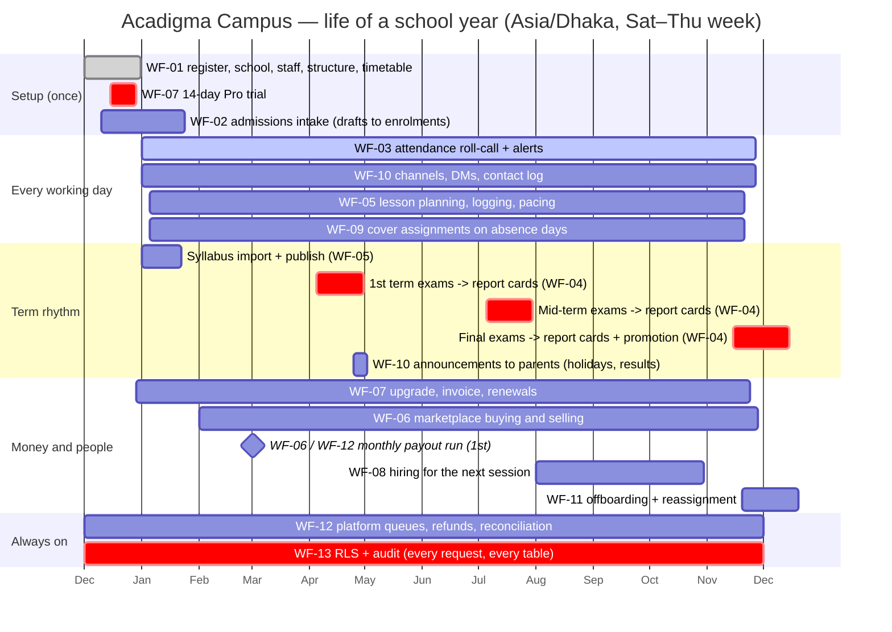
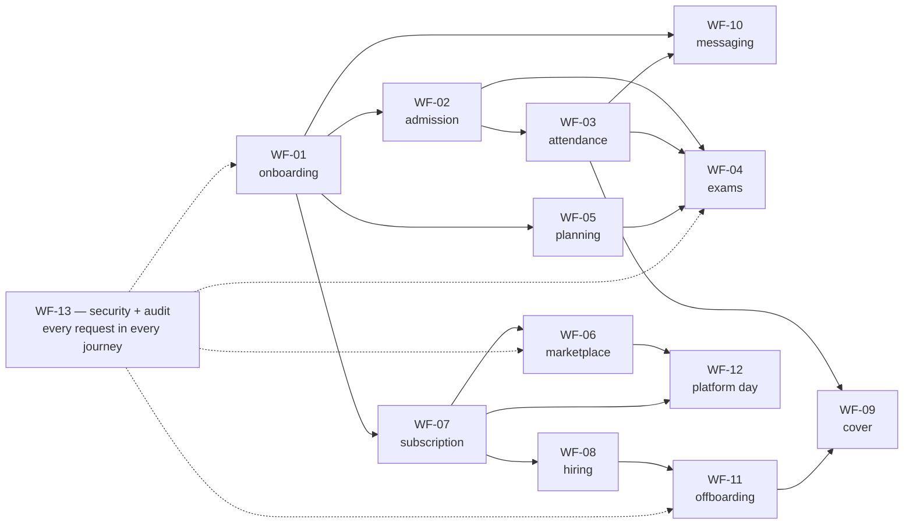

# Acadigma Campus — End-to-end workflows

Feature specs (`docs/features/`) describe **what one module does**. These documents describe **what happens when a real person does a real thing**, across modules: which screen they tap at 360×800, which server action runs, which tables are written, which events and notifications fire, what happens when it fails, and what the Base44 prototype did instead.

They are **derived documents**. Where they disagree with a binding source, the binding source wins, in this order:

1. `docs/product/PRODUCT-DECISIONS.md` — every resolved ambiguity (binding)
2. `docs/architecture/ARCHITECTURE.md` — how it is built (binding contract)
3. `docs/architecture/DATA-MODEL.md` — table and column names (wins over every "proposed" schema)
4. `docs/features/**` — per-feature detail
5. these workflows

Conflicts found while writing them are listed in §4 below and should be resolved in `docs/decisions/DECISION-LOG.md`.

---

## 1. Index

| #                                                    | Journey                                                                                                                                                                   | Primary actor           | Release           | Features                                      |
| ---------------------------------------------------- | ------------------------------------------------------------------------------------------------------------------------------------------------------------------------- | ----------------------- | ----------------- | --------------------------------------------- |
| [WF-01](WF-01-school-onboarding.md)                  | **School onboarding** — register → personal workspace → create school → invite staff (email + join code) → roles → academic structure → first timetable                   | School owner            | R0 → R1           | F-ID-01/02/03/04/05/07 · F-AC-01/05 · F-CM-06 |
| [WF-02](WF-02-student-admission-to-parent-access.md) | **Admission to parent access** — draft → complete → enrol → sequential IDs → guardian invite → parent sees the child                                                      | Admin                   | R1                | F-AC-02 · F-ID-03/04/07 · F-OP-04             |
| [WF-03](WF-03-daily-attendance.md)                   | **Daily attendance** — today's section → ≤2 taps/student → offline → idempotent save → low-attendance alert → parent → register → print                                   | Class teacher           | R1                | F-AC-03/01/05 · F-OP-03/04                    |
| [WF-04](WF-04-exam-cycle-to-report-card.md)          | **Exam cycle to report card** — create exam → marks (phone + desktop) → GPA/rank → publish → bulk Bengali PDFs → print queue → parent; AI comment approval                | Admin + teachers        | R1                | F-AC-06 · F-TE-03/04 · F-OP-03/04             |
| [WF-05](WF-05-lesson-planning-with-ai.md)            | **Lesson planning with AI** — syllabus PDF → extraction → topics → plan generate (reserve/settle) → teach → log → pacing; zero-credit → request → grant                   | Subject teacher         | R2                | F-TE-01/02/03/04 · F-AC-05                    |
| [WF-06](WF-06-marketplace-sell-and-buy.md)           | **Marketplace** — become seller → KYC → listing → moderation → purchase via SSLCommerz → IPN → entitlement → watermarked download → review; school-funded; refund; payout | Seller, buyer, platform | R3                | F-CM-01/02/03/04/05 · F-TE-05                 |
| [WF-07](WF-07-subscription-lifecycle.md)             | **Subscription lifecycle** — trial → limit warnings → upgrade → invoice → renewal/dunning → downgrade to Free, read-only over limits                                      | School owner            | R3                | F-CM-06/01 · F-ID-03                          |
| [WF-08](WF-08-hiring-a-teacher.md)                   | **Hiring a teacher** — post → public apply → pipeline → interviews → scorecards → offer → hire → invitation → staff record; document consent                              | Admin                   | R3                | F-OP-01/06 · F-ID-03/04                       |
| [WF-09](WF-09-cover-teacher-day.md)                  | **Cover teacher day** — absence / missed punch → ranked candidates → assign/override → acknowledge → complete → payroll impact → monthly report                           | Admin, cover teacher    | R3                | F-AC-04 · F-OP-02/06 · F-AC-05                |
| [WF-10](WF-10-messaging-and-announcements.md)        | **Messaging and announcements** — auto channels, DMs, realtime, receipts, announcements to parents, contact log                                                           | Teacher, principal      | R1 → R3           | F-OP-05 · F-ID-07                             |
| [WF-11](WF-11-offboarding-staff.md)                  | **Offboarding staff** — checklist → reassign teaching → orphan/reassign resources → revoke transaction → instant access loss → audit                                      | Admin                   | R1 → R3           | F-OP-06 · F-ID-03 · F-TE-05                   |
| [WF-12](WF-12-platform-staff-day.md)                 | **Platform staff day** — review queues (KYC, verification, listings) → payout run → refund → plan edit → audit viewer → school support                                    | Platform staff          | R3                | F-ID-08/09 · F-CM-01/02/03/05/06              |
| [WF-13](WF-13-security-and-audit.md)                 | **Security and audit** — a cross-tenant attempt blocked at UI, context, server policy and RLS; what the audit shows; what the owner sees                                  | (attacker)              | R0, every release | ARCHITECTURE §3/§5/§11                        |

**Reading order for someone new to the product:** WF-01 → WF-02 → WF-03 → WF-04 gives the whole school day. WF-13 explains why any of it is safe. WF-06 → WF-07 → WF-12 is the money. WF-05, WF-08, WF-09, WF-10, WF-11 are the modules that make a school stay.

### Conventions used in every document

- **Screens are specified at 360×800 first.** Sheets on phone, dialogs at ≥1024; primary actions in the bottom thumb zone at ≥44 px; `DataList` cards on phone, tables on desktop; no client-side filtering of whole tables.
- **"Writes" names real tables**; anything not yet fixed in `DATA-MODEL.md` is marked _proposed_.
- **"Events"** distinguishes three things: `audit_events` rows (trigger-written, append-only), `notifications` rows (event-typed, always with `action_url`), and `jobs` rows (email, PDF render, cron work).
- **Money is integer paisa (`bigint`), BDT only, computed server-side.** Percentages are basis points.
- **"Today" is always** `(now() at time zone school_profiles.timezone)::date`, computed in SQL.
- **Idempotency** is named wherever a retry is plausible: client keys in `idempotency_keys`, provider keys in `inbound_events`, and conditional DB updates as the final layer.

---

## 2. Life of a school year

The same product, viewed as a calendar. Vertical bands are the journeys above; a school touches almost all of them within one academic year.

### How the journeys chain

### The five moments that decide whether a school stays

| Moment                               | Journey       | Budget                     | Why it is the one that matters                                                         |
| ------------------------------------ | ------------- | -------------------------- | -------------------------------------------------------------------------------------- |
| First attendance taken on a phone    | WF-03         | **≤ 60 s** for 40 students | It happens 200 times a year. If it is slow, nothing else is used                       |
| First report card printed in Bengali | WF-04         | **≤ 2 min** for a section  | It is what the school shows parents; the prototype's was hardcoded "TeachFlow Academy" |
| First parent opens `/family`         | WF-02 → WF-04 | —                          | The moment the product stops being internal software                                   |
| First payment captured               | WF-06 / WF-07 | IPN p95 < 1.5 s            | Entitlements granted only from a validated IPN; everything else is bookkeeping         |
| First cross-tenant probe             | WF-13         | 403 + tripwire             | Zero cross-tenant access is a launch gate, proven by pgTAP, not asserted               |

---

## 3. Cross-cutting invariants (true in every journey)

1. **Tenancy comes from membership, never from the client.** `x-workspace-id` is an assertion, checked against `workspace_members` on every request; a forged header writes `audit_events: tenancy.context_rejected` (WF-13).
2. **Nothing is deleted that a human might need.** `workspace_members` moves to `status='removed'`; over-limit data becomes read-only, never deleted; `audit_events` has no UPDATE or DELETE grant for anyone (WF-07, WF-11, WF-13).
3. **Money is computed server-side in paisa, from the database's own copy of the price.** No checkout schema has an `amount` field (WF-06, WF-07).
4. **Entitlements come only from a validated provider event.** The browser return is cosmetic; reconciliation is the safety net (WF-06).
5. **AI is metered before it is called.** reserve → invoke → settle; every failure that is ours releases the reservation and charges nothing; every artefact is persisted (WF-04, WF-05).
6. **Human approval gates anything AI-authored that a parent will read.** `report_comments` must be `approved`; a syllabus extraction must be committed by a person (WF-04, WF-05).
7. **Private files are signed for 5 minutes, after a per-domain predicate, and every access is logged** — including denials (WF-06, WF-08, WF-10, WF-13).
8. **Idempotency is designed in, not retro-fitted**: attendance saves, AI generations, checkouts, IPNs, hires and offboardings all survive a double tap or a replay (WF-03, WF-05, WF-06, WF-08, WF-11).
9. **Notifications are event-typed, always carry `action_url`, and are deliberately sparse.** Ordinary channel messages create no notification row (WF-10).
10. **Every dashboard number is computed from real tables.** No mock arrays ship (PRODUCT-DECISIONS §3.9).

---

## 4. Conflicts and gaps found while writing these

Raise each in `docs/decisions/DECISION-LOG.md`; the workflows currently document the "default assumed" column.

| #        | Conflict                                                                                                                                                                                                                                                                                                                                                                                                                   | Sources                                                                    | Default assumed here                                                                                                                                                                                                                                       |
| -------- | -------------------------------------------------------------------------------------------------------------------------------------------------------------------------------------------------------------------------------------------------------------------------------------------------------------------------------------------------------------------------------------------------------------------------- | -------------------------------------------------------------------------- | ---------------------------------------------------------------------------------------------------------------------------------------------------------------------------------------------------------------------------------------------------------- |
| **C-1**  | `audit_events.workspace_id` must be **nullable** for account-level and platform-level rows (`account.registered`, `session.revoked`, `account.purged`, `platform.feature_flag_changed`), and those rows need a SECURITY DEFINER writer (`app.log_audit_event`) rather than a per-tenant table trigger. ARCHITECTURE §4 describes the table as trigger-filled on tenant tables only. **Raised independently by two specs.** | ARCHITECTURE §4 vs F-ID-01 §11 OQ-5 **and** F-ID-09 §11 OQ-1               | Nullable `workspace_id` + a definer writer with no insert grant to any application role (which still satisfies D-05). **Needs an ARCHITECTURE §4 amendment, a DECISION-LOG entry and a DATA-MODEL change.**                                                |
| **C-2**  | **SMS.** PRODUCT-DECISIONS §7 defers SMS/WhatsApp providers to post-v1, but §1.3 specifies SMS invitations and F-ID-01 specifies phone-OTP sign-in.                                                                                                                                                                                                                                                                        | PRODUCT-DECISIONS §1.3 vs §7                                               | Email is the launch path everywhere (WF-01 guardian and staff invites, WF-02, WF-08); phone OTP and SMS invites sit behind the `auth.phone_otp` flag. Owner decision needed.                                                                               |
| **C-3**  | **Extraction model.** D-08 assigns `claude-haiku-4-5` to "cheap classification/extraction"; F-TE-02 §11.3 proposes `claude-sonnet-5` for syllabus extraction because a mis-extraction propagates into every downstream number.                                                                                                                                                                                             | DECISION-LOG D-08 vs F-TE-02                                               | `claude-sonnet-5` for syllabus extraction (WF-05). **Needs a DECISION-LOG entry.**                                                                                                                                                                         |
| **C-4**  | **Account-settings route group.** ARCHITECTURE §2 defines no `(account)` group, so Security/Devices/Delete live inside each shell's settings.                                                                                                                                                                                                                                                                              | ARCHITECTURE §2 vs F-ID-01 §11 OQ-3                                        | Shell-local (`/app/settings/security`, `/personal/settings`), shared components. A canonical `/account/*` would require ARCHITECTURE §2 to change first.                                                                                                   |
| **C-5**  | ~~**Credit top-up packs** had no owning spec.~~ **Resolved while writing**: F-CM-07 (_School billing hub, AI credit packs and the expense ledger_) landed and owns `credit_packs`; F-TE-03 owns the ledger the pack grants into.                                                                                                                                                                                           | PRODUCT-DECISIONS §3.3 / F-CM-01 §3.2 · F-CM-07 · F-TE-03                  | Pack purchase = an `order_kind='credit_pack'` order through F-CM-01; the grant is an `ai_credit_ledger` row written only from a validated IPN (WF-05 stage E, WF-06). No action needed.                                                                    |
| **C-6**  | **Recruiter ↔ candidate messaging.** A candidate is not a workspace member, so they cannot appear in `conversation_participants` under F-OP-05's RLS, yet F-OP-01 needs candidate communication.                                                                                                                                                                                                                           | F-OP-01 §11.1 vs F-OP-05 §2/§11.2                                          | Templated email + `application_events` notes only, until hire (WF-08 stage C). Both specs already agree on the default; recording it here so it is not re-opened.                                                                                          |
| **C-7**  | **Announcements vs the "distribute a handout" decision.** PRODUCT-DECISIONS §2.8 defines distribution as "publish to sections → visible to those students' parents, optionally push to the print queue", which overlaps `announcements` + `announcement_recipients` in F-OP-05.                                                                                                                                            | PRODUCT-DECISIONS §2.8 vs F-OP-05 §3.5                                     | Handout distribution reuses the announcement audience resolver rather than a second fan-out mechanism (WF-10). Needs confirming when the handouts spec lands.                                                                                              |
| **C-8**  | **Parent portal has no owning spec.** `/family` is a route group in ARCHITECTURE §2 and its contents are specified piecemeal across F-AC-02/03/06/07/08 ("parent-visible" flags, published-exams-only, guardian-scoped reads), but nothing owns the shell, the child switcher, the guardian-scoped **views** themselves, or the parent landing route. Academics stops at F-AC-08.                                          | PRODUCT-DECISIONS §1.13 · ARCHITECTURE §2 vs `docs/features/02-academics/` | Referenced as **F-AC-0x (parent portal)** in WF-02/03/04. The view contract in WF-02 stage D — exactly the columns §1.13 lists, and no direct parent policy on `marks` or `attendance_records` — is what that spec must honour. **Needs a spec assigned.** |
| **C-9**  | ~~**Audit viewer ownership.**~~ **Resolved while writing**: F-ID-09 (_Audit viewer_) landed with the owner-scoped and platform-scoped viewers plus a self-read policy (`subject_user_id = current user`), so a teacher can always see that they were removed and by whom.                                                                                                                                                  | PRODUCT-DECISIONS §6.8 · D-05 · F-ID-09                                    | Referenced as **F-ID-09** (WF-11, WF-12, WF-13). No action needed beyond C-1.                                                                                                                                                                              |
| **C-10** | **Read-only enforcement over plan limits** needs a concrete mechanism. PRODUCT-DECISIONS §5.2 says over-limit data becomes read-only and is never deleted, but no spec defines where that flag lives.                                                                                                                                                                                                                      | PRODUCT-DECISIONS §5.2 vs F-CM-06                                          | WF-07 assumes `workspace_members.access='read_only'` plus per-action `PLAN_READ_ONLY` errors, cleared in one transaction on upgrade. Needs a DATA-MODEL decision.                                                                                          |
| **C-11** | **Attendance mode.** PRODUCT-DECISIONS §2.1 makes daily roll-call primary with an optional period, but does not name the setting that switches a school to per-period marking.                                                                                                                                                                                                                                             | PRODUCT-DECISIONS §2.1 vs F-AC-03                                          | WF-03 assumes `school_profiles.attendance_mode ∈ daily                                                                                                                                                                                                     | per_period`, default `daily`. |
| **C-12** | **Cover-teacher policy fields.** PRODUCT-DECISIONS §6.3 specifies the grace window, the credit rule and `unpaid_absence` as school settings without naming them.                                                                                                                                                                                                                                                           | PRODUCT-DECISIONS §6.3 vs F-OP-02                                          | WF-09 assumes `school_profiles.cover_policy` holding `missed_punch_grace_minutes` (30), `cover_credited` (true), `unpaid_absence` (false).                                                                                                                 |

**Non-conflicts worth recording** (checked, consistent): the 30 % commission as basis points snapshotted per order line; the 7-day hold and 7-day refund window; monthly payouts with a ৳1,000 minimum; the BD grade scale with F ⇒ GPA 0; late counting as present by default with a 75 % warning; Sat–Thu working days in `Asia/Dhaka`; one workspace = one campus; students not being users in v1.

---

## 5. Maintaining these documents

- A workflow changes when a **binding** source changes, not when an implementation detail moves. If a feature spec renames a table, update the workflow in the same PR.
- Every step must name a real table, action or event. If it names something that does not exist yet, mark it _proposed_ and add it to §4.
- The "what the Base44 prototype did instead" paragraph is deliberately specific and cites `docs/reference/base44-inventory/*` and `docs/reference/base44-security-review.md`. It exists so that a defect which was already found once is not rebuilt; do not soften it into generalities.
- When a journey ships, link its Playwright e2e specs and its `docs/test-reports/` entry from the journey's header table.
