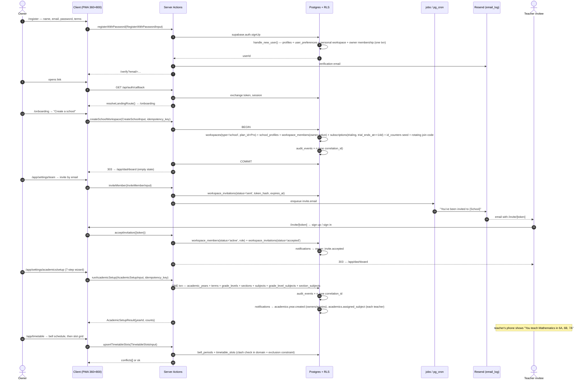

# WF-01 — School onboarding: register → workspace → staff → academic structure → first timetable

|                       |                                                                                                                                                                                                                                                                                 |
| --------------------- | ------------------------------------------------------------------------------------------------------------------------------------------------------------------------------------------------------------------------------------------------------------------------------- |
| Journey               | Zero to a school that can run tomorrow morning                                                                                                                                                                                                                                  |
| Primary actor         | School owner (proprietor/principal)                                                                                                                                                                                                                                             |
| Secondary actors      | Teacher / office staff invitee · Acadigma platform (trial grant)                                                                                                                                                                                                                |
| Features              | F-ID-01 (auth) · F-ID-02 (profiles/preferences) · F-ID-03 (workspaces & membership) · F-ID-04 (invitations & join codes) · F-ID-05 (onboarding) · F-ID-07 (notifications) · F-ID-09 (audit viewer) · F-AC-01 (academic structure) · F-AC-05 (timetable) · F-CM-06 (plans/trial) |
| Duration in the field | 25–40 minutes, of which the bulk-setup wizard is ~10                                                                                                                                                                                                                            |
| Exit state            | `workspaces` row (`type='school'`) with `school_profiles`, ≥1 `active` owner + n staff memberships, a current `academic_years` row, `sections` × `section_subjects` populated, `timetable_slots` for at least one week, 14-day Pro trial running                                |

---

## 1. Actors and preconditions

| Actor                       | Device                      | Enters with                                        | Leaves with                                              |
| --------------------------- | --------------------------- | -------------------------------------------------- | -------------------------------------------------------- |
| **Owner**                   | Windows PC or Android phone | An email address                                   | A school workspace, a running trial, a timetable         |
| **Teacher / staff invitee** | Android phone               | An email or a join code on WhatsApp                | An `active` `workspace_members` row and the `/app` shell |
| **Platform**                | —                           | `plans` table seeded (Free/Starter/Pro/Enterprise) | A `subscriptions` row in `trialing`                      |

**Preconditions**

- `plans` is seeded and `platform_settings` exists (F-CM-01 §3.6).
- `supabase/seed/bd-defaults.sql` can supply 16 grade levels + the NCTB subject catalogue as **copies into the workspace** (F-AC-01 §3 Seeds) — never cross-tenant references.
- Email delivery (Resend) is configured; SMS is behind the `auth.phone_otp` flag (F-ID-01 OQ-1), so the join-code path is the SMS-free fallback and is the one that must work at launch.

---

## 2. Sequence

---

## 3. Steps

### Stage A — Account (F-ID-01 §4.1–4.2)

1. **`/register`** — one screen, one scrolling column, sticky 44 px submit above the keyboard. Owner types full name, email, password (strength meter, zxcvbn ≥ 3), ticks Terms.
   _Writes:_ `auth.users`, and by the `handle_new_user()` trigger **in the same transaction**: `profiles`, `user_preferences`, `workspaces` (`type='personal'`), `workspace_members` (`role='owner'`, `status='active'`). This single-transaction guarantee is the direct fix for the prototype's swallowed `try/catch`.
   _Events:_ `audit_events`: `account.registered` (`workspace_id` null — see conflict C-1). `email_log` row for the verification mail. **No** `notifications` row (transactional email is not an in-app notification).
2. **`/verify`** — icon tile, masked address `n…@gmail.com`, **Resend** with a 60 s visible countdown, **Change email**. Tapping the emailed link hits `GET /api/auth/callback`, which validates `next` against the same-origin allowlist (`safeReturnTo`).
   _Writes:_ `auth.users.email_confirmed_at`, `device_registrations` (first row, `platform='web'`). _Events:_ `account.email_verified`.
3. `resolveLandingRoute()` sees exactly one membership, of a `personal` workspace, and `profiles.onboarding_completed_at is null` → **`/onboarding`**.

### Stage B — Create the school (F-ID-05)

4. **`/onboarding`** — two full-width 88 px cards, thumb-zone: **Create a school** · **Join with a code**. There is no third "create personal workspace" card; the personal workspace already exists and is never offered again (PRODUCT-DECISIONS §1.2).
5. **Create-school wizard**, one step per phone screen with a sticky Continue and a back-swipe guard:
   - **Step 1 Identity** — school name, short name, EIIN (optional), board (NCTB / Madrasah / Cambridge / Edexcel), school type.
   - **Step 2 Contact & logo** — address, phone, email, logo upload (`files`, `public` bucket). The logo **is** editable later in settings; the prototype promised this and never shipped the field.
   - **Step 3 Working rules** — timezone (default `Asia/Dhaka`), working days (default **Sat–Thu**), attendance cut-off time, date format, default language.
   - **Step 4 Review** — one screen, then **Create school**.
     _Writes (one transaction, `idempotency_key` required):_ `workspaces` (`type='school'`, `slug`, `plan_id` = Pro for the trial), `school_profiles` (1:1 — address, EIIN, board, timezone, `working_days`, `attendance_policy`, `grade scale pointer`), `workspace_members` (owner, active), `subscriptions` (`status='trialing'`, `trial_ends_at = now() + 14 days`, plan Pro), `id_counters` seeds for `student`/`admission`/`staff`/`order`/`job`, and a rotating join code on `workspaces`.
     _Events:_ `audit_events`: `workspace.created`, `school_profile.created`, `membership.created`, `subscription.trial_started` — **all sharing one `correlation_id`**. `notifications`: none to self. `email_log`: "Your 14-day Pro trial has started".
6. The `acx_ws` cookie is set to the new workspace id. Every subsequent request sends `x-workspace-id`; the server **never trusts it** — `packages/db` resolves `WorkspaceContext` by querying `workspace_members` for `(workspace_id, auth.uid(), status='active')` and sets `app.workspace_id` transaction-locally (ARCHITECTURE §3).

### Stage C — Invite staff (PRODUCT-DECISIONS §1.3 — both paths, one table)

7. **`/app/settings/team`** — `DataList` of members on phone, table at ≥1024. Two affordances:
   - **(a) Invite by email/phone.** Sheet: email or phone, base role (`admin | teacher | staff | parent`), optional custom label (e.g. "Vice-Principal"), optional department.
     _Writes:_ `workspace_invitations` (`workspace_id`, `email`/`phone`, `role`, `custom_label_id`, `token_hash`, `expires_at = now() + 14 days`, `status='sent'`, `invited_by`). _Jobs:_ `jobs{type:'invite.email'}` → Resend → `email_log`. _Events:_ `audit_events`: `invitation.sent`.
   - **(b) Join code.** The card shows `ACD-XXXX-XXXX` with a copy button and a **Rotate** action. Code lookup is rate-limited (the prototype's `Math.random()` code with no rate limit is replaced by a CSPRNG code + throttle).
8. **Invitee, email path:** `/invite/[token]` → if signed out, register or sign in first (`next` preserved); the invitation's email must match the authenticated address, otherwise `INVITE_EMAIL_MISMATCH`.
   _Writes:_ `workspace_members` (`status='active'`, role from the invitation), `workspace_invitations.status='accepted'`, `responded_at`. _Events:_ `notifications` → owner + admins: `invite.accepted`; `audit_events`: `invitation.accepted`, `membership.created`.
9. **Invitee, code path:** `/onboarding` → **Join with a code** → paste → confirm school name/logo → **Request to join**.
   _Writes:_ `workspace_members` (`status='pending'`). _Events:_ `notifications` → owner + admins: `invite.join_requested` with `action_url=/app/settings/team?tab=pending`. Admin approves → `status='active'`, `joined_at`; `notifications` → joiner: `invite.approved`. Both sides are notified — the prototype notified neither.
10. **Set roles and labels.** Admin taps a member row → sheet: base role select, custom label, employee no. (blank → generated by `app.next_id(workspace_id,'staff')`), department, work email/phone.
    _Writes:_ `workspace_members` (role, `custom_label_id`, `employee_no`, `work_email`, `work_phone`), `custom_labels` if new. _Events:_ `audit_events`: `membership.role_changed` with before/after. RLS forbids self-update of `role`/`status`; the change is only possible through the server action with `members.role.write`.

### Stage D — Academic structure (F-AC-01 §4.1)

11. **`/app/settings/academics/setup`** — seven full-screen steps with a progress bar, drafted both in `localStorage` and as a server-side draft row so a dropped connection loses nothing:
    1. **Year** — name (defaults to calendar year), start/end dates, board.
    2. **Terms** — preset picker (3-term / 2-term / custom), editable ranges. Overlaps are refused by an exclusion constraint, not by the UI alone.
    3. **Grades** — checkbox list of the 16 BD grade levels, Class 1–10 pre-ticked.
    4. **Sections** — a stepper per grade ("how many sections?"), names auto-fill A, B, C…
    5. **Subjects** — the seeded catalogue filtered by board, with a per-grade override sheet.
    6. **Teachers** _(skippable)_ — class teacher per section; bulk-assign a primary teacher by subject across sections.
    7. **Review** — "11 grades · 22 sections · 14 subjects · 308 section-subjects · 14 unassigned" → **Create**.
       _Writes (one transaction, `idempotency_key` **required**):_ `academic_years` (`status='active'`, `is_current=true`), `terms`, `grade_levels`, `sections`, `subjects`, `grade_level_subjects`, `section_subjects`, `section_subject_teachers`.
       _Events:_ `audit_events`: `academic_year.created`, `term.created`×n, `grade_level.created`×n, `section.created`×n, `subject.created`×n, `section_subject.created`×n — **one `correlation_id` across all of them**. `notifications`: `academics.year.created` to owners+admins; `academics.assigned_subject` to each teacher who received assignments, with `action_url=/app/classes`.
12. The app header now reads **"2026 · 1st Term"**, resolved by `app.current_term(workspace_id)` in SQL against `school_profiles.timezone` — never from a browser `new Date()`.

### Stage E — First timetable (F-AC-05)

13. **`/app/timetable/settings`** — bell schedule: number of periods, start time, period length, break positions. _Writes:_ `bell_periods` (proposed; F-AC-05 owns the name).
14. **`/app/timetable`** — phone renders **one day per screen** with a horizontal day strip (Sat–Thu from `school_profiles.working_days`); desktop renders the week grid. Tapping an empty cell opens a sheet: section, subject (filtered to that section's `section_subjects`), teacher (defaults to the section-subject's primary), room.
    _Writes:_ `timetable_slots` (`workspace_id`, `section_subject_id`, `weekday`, `period_number`, `room_id`, `effective_from`, `effective_to`).
    _Rules:_ clash detection in `packages/domain` **and** a DB exclusion constraint on (teacher, weekday, period) and (room, weekday, period) over the effective range. A clash renders inline: "Ms. Nadia already teaches Class 7 – B in period 3."
    _Events:_ `audit_events`: `timetable_slot.created`. `notifications`: `timetable.published` to affected teachers when the admin taps **Publish week**.
15. Teachers now see **My timetable** on their dashboard; `timetable_slots` immediately becomes the input for cover-teacher ranking (WF-09), pacing capacity (WF-05 §5.3) and workload (F-TE-06).

---

## 4. Failure and edge cases

| Case                                               | Detection                                                   | UI behaviour                                                                                                                      |
| -------------------------------------------------- | ----------------------------------------------------------- | --------------------------------------------------------------------------------------------------------------------------------- |
| Email already registered                           | `registerWithPassword` → `EMAIL_TAKEN`                      | Inline alert with a link to `/login` — registration is deliberately **not** enumeration-safe (rate-limited 5/h per IP instead)    |
| Verification link expired (24 h)                   | callback → `TOKEN_INVALID`                                  | Dedicated screen, not a toast: "Link expired — send a new one"                                                                    |
| Owner closes the browser mid-wizard                | Server-side draft row + `localStorage`                      | Reopening `/app/settings/academics/setup` resumes at the last completed step                                                      |
| `runAcademicSetup` replayed (double-tap, flaky 3G) | `idempotency_keys` on `(key, scope, request_hash)`          | Returns the first result; exactly one academic year exists                                                                        |
| Any validation failure inside the wizard           | Whole transaction aborts                                    | A **per-step error map** is returned; the user lands on the first bad step with fields marked; **no partial writes are possible** |
| Duplicate year name                                | Checked before the transaction opens                        | `YEAR_NAME_TAKEN` on the name field                                                                                               |
| Term ranges overlap                                | Exclusion constraint on `(academic_year_id, daterange)`     | `TERM_OVERLAP`, start-date field highlighted                                                                                      |
| Invitation token reused                            | `workspace_invitations.status != 'sent'`                    | "This invitation has already been used" + link to `/login`                                                                        |
| Invitee signs up with a different email            | Server compares invitation email to `auth.uid()`'s email    | `INVITE_EMAIL_MISMATCH` with "Ask {owner} to re-send to {your email}"                                                             |
| Join code rotated while a joiner holds the old one | Lookup returns 0 rows                                       | "That code is no longer valid — ask your school for a new one" (rate-limited, no enumeration of school names)                     |
| Assigning a removed member as class teacher        | Domain check + trigger                                      | `MEMBER_NOT_ACTIVE` (422)                                                                                                         |
| Same member set as class teacher of two sections   | Partial unique index `(academic_year_id, class_teacher_id)` | `CLASS_TEACHER_TAKEN`, unless `school_profiles.allow_multi_class_teacher` (then warn-and-confirm)                                 |
| Seat limit hit (plan `max_teachers`)               | `inviteMember` reads `plans` via `WorkspaceContext.plan`    | `SEAT_LIMIT_REACHED` with an upgrade sheet; the invitation is not created                                                         |
| Timetable clash                                    | Domain + exclusion constraint                               | Inline conflict list; the slot is not written                                                                                     |
| Trial expires before setup completes               | pg_cron `trial.expire`                                      | Plan drops to Free; data over Free limits becomes **read-only, never deleted**; banner + email 3 days before (WF-07)              |

---

## 5. What the Base44 prototype did instead

The prototype had every one of these screens and almost none of the wiring. Registration created the personal workspace inside three independent swallowed `try/catch` blocks (`TeacherRegister.jsx:95-112`), so a silent failure produced an account with no workspace at all; it then redirected to `/` — the _school_ shell — while `Login.jsx:37` sent the same user to `/personal` and the onboarding "Personal Workspace" button sent them to `/` again, so all three entry points disagreed about where a user belongs, and no route was ever keyed to `workspace_type` (inventory 01 §5.3 W16). `SchoolSettings` was simultaneously the workspace table, the school-settings table and the seller-store table, so personal rows carried ~20 irrelevant school columns. The email-invite path was a pure stub: `TeamManagement.handleInvite` toasted _"Invitation sent"_ while writing only a `WorkspaceMember{pending}` row — `base44.users.inviteUser` sat in a bare `try{}catch{}` and **no `SchoolWorkspaceInvitation` row was ever created anywhere in the codebase** (D9), even though the whole Accept/Decline inbox at `/personal/workspaces` was already built and therefore permanently empty. The invite-code path worked but notified nobody in either direction; the joiner's "Request Sent" screen's only button was Sign Out. Removal hard-deleted the membership row while the `status:'removed'` enum went unused, and because access was gated on the client-writable `active_workspace_id`, **removed staff kept full access** (security review finding 6). On the academic side there was no academic year, no term entity (terms were a hardcoded 5-value enum on `Mark`), no subject catalogue, no room entity and no delete; the single `Class` entity was schema-defined as a class-subject pair yet the only creation UI treated it as a homeroom and never sent the required `subject`, so every created row violated its own schema (`Classes.jsx:112-120`). The timetable was a permanent weekly routine with no teacher ownership (`Class.teacher_name` was free text), no room booking, no clash detection, a hardcoded 5-day week that ignored `SchoolSettings.work_week_days`, and a `day_of_week` enum with no Sunday — so a Sunday-start school wrote an out-of-enum value.
