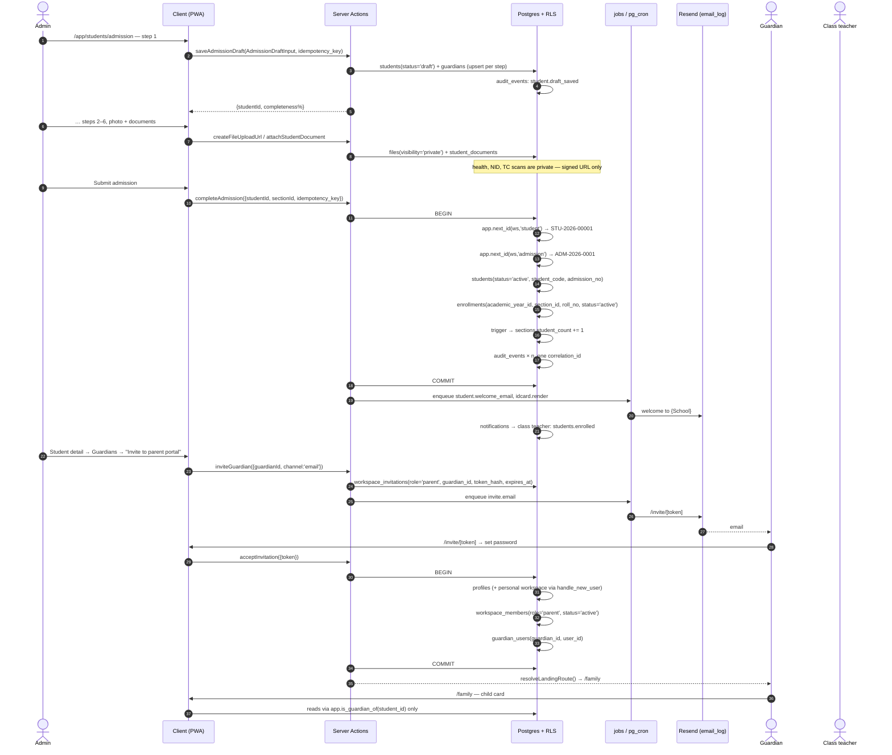

# WF-02 — Admission draft → enrolment → guardian invite → parent sees the child

|                       |                                                                                                                                                                                                                        |
| --------------------- | ---------------------------------------------------------------------------------------------------------------------------------------------------------------------------------------------------------------------- |
| Journey               | A walk-in family becomes a student record a parent can see on their phone                                                                                                                                              |
| Primary actor         | Admin / office staff                                                                                                                                                                                                   |
| Secondary actors      | Guardian (becomes a `parent` member) · Class teacher · Owner (audit)                                                                                                                                                   |
| Features              | F-AC-02 (students, admission, guardians, IDs, enrolment) · F-AC-0x (parent portal) · F-ID-03 (membership) · F-ID-04 (invitations) · F-ID-07 (notifications) · F-ID-09 (audit viewer) · F-OP-04 (print queue, ID cards) |
| Duration in the field | 6–10 min for the required fields; the rest is filled over days from the draft                                                                                                                                          |
| Exit state            | `students` row `active`, one `enrollments` row for the current year, sequential `STU-2026-00001` / `ADM-2026-0001`, ≥1 `guardians` row, a `guardian_users` link and a `parent` membership, `/family` renders one child |

---

## 1. Actors and preconditions

| Actor             | Device                                        | Needs                                                                          |
| ----------------- | --------------------------------------------- | ------------------------------------------------------------------------------ |
| **Admin**         | Windows PC (office) or phone (admission desk) | `students.write`, an **active** `academic_years` row and ≥1 `sections` (WF-01) |
| **Guardian**      | Android phone                                 | An email or a phone number that can receive the invite                         |
| **Class teacher** | Android phone                                 | Read-only visibility of their section roster                                   |

**Preconditions**

- `id_counters` seeded for `student` and `admission` (WF-01 stage B).
- `school_profiles.timezone` set — "today" and the admission year are computed in it.
- If the guardian invite is by SMS, the `auth.phone_otp` flag must be on (F-ID-01 OQ-1); **email is the launch path**.

**Required fields** (PRODUCT-DECISIONS §2.11 — everything else is optional and saved as a draft at any step): name, date of birth, gender, section, **at least one guardian with a phone number**.

---

## 2. Sequence

---

## 3. Steps

### Stage A — Admission draft (F-AC-02)

1. **`/app/students/admission`** — a 6-step wizard, one full-screen step per phone screen, sticky Continue, autosave every 3 s. The steps are **not** the prototype's nine; professional bulk is deferred to optional sections.
   1. **Child** — first/middle/last name, DOB (date picker defaulting to a plausible year for the chosen grade), gender, religion (optional), nationality (default Bangladeshi).
   2. **Placement** — academic year (defaults to `is_current`), grade level, section (capacity warning is advisory, never a block — PRODUCT-DECISIONS §2.7), preferred roll number.
   3. **Guardians** — at least one, each with relation (father/mother/guardian), name, **phone (required on the first)**, email, occupation, NID. The prototype's parallel 18-field father block and 18-field mother block collapse into rows on one `guardians` table.
   4. **Contact & address** — present/permanent address, emergency contact.
   5. **Health & previous school** — conditions, allergies, medications, blood group, previous school, TC number. All optional.
   6. **Documents & photo** — birth certificate, TC, immunisation card, photo.
      _Writes on every step:_ `students` (`status='draft'`), `guardians`, and for step 6 `files` (`visibility='private'`) + `student_documents` (proposed join). Photo goes to `files` with `visibility='workspace'` (it appears on rosters and ID cards, never publicly).
      _Events:_ `audit_events`: `student.draft_saved` with **changed field names only, never values** (children's PII in an indefinitely-retained table is not acceptable).
2. **Resume a draft.** `/app/students?status=draft` lists drafts with a completeness ring and a **Resume** action that deep-links back to the first incomplete step. (The prototype implemented the `?resume=` reader and never linked to it from anywhere.)

### Stage B — Complete and enrol

3. **Submit** is enabled only when the five required fields are present; missing ones are listed by name in the submit sheet ("Add a guardian phone number"), never marked with a decorative red asterisk.
4. `completeAdmission` runs **one transaction**:
   - `app.next_id(workspace_id,'student')` → `students.student_code = 'STU-2026-00001'`
   - `app.next_id(workspace_id,'admission')` → `students.admission_no = 'ADM-2026-0001'`
     Both are advisory-locked per-workspace counters with a school-editable pattern (PRODUCT-DECISIONS §2.6). Collisions are impossible.
   - `students.status = 'active'`, `admission_date` = today in `school_profiles.timezone`
   - `enrollments` (`student_id`, `academic_year_id`, `section_id`, `roll_no`, `status='active'`) — **one section per student per year** (PRODUCT-DECISIONS §2.3)
   - trigger maintains `sections.student_count`
     _Events:_ `audit_events`: `student.admitted`, `enrollment.created` under one `correlation_id`. `notifications`: `students.enrolled` to the section's class teacher, `action_url=/app/classes/{sectionId}`. `jobs`: `student.welcome_email` (→ `email_log`, retried, never fire-and-forget) and optionally `idcard.render`.
5. **`/app/students/[id]`** — student 360: header with photo, `STU-2026-00001`, section chip, status; tabs **Profile · Attendance · Marks · Assignments · Behaviour · Guardians · Documents**. On phone the tabs are a horizontally scrolling chip row; the sticky header keeps the name and ID visible.
6. **ID card** — overflow → _Print ID card_ renders a server-side PDF (`/api/pdf/id-card`) carrying a **signed QR token**, stores it in `files`, and either opens the browser print dialog or creates a `print_jobs` row with `copies = 1`. Bulk for a whole section sets `copies` from the active enrolment count (WF-03 §Print). Scanning that QR is a native-wrapper feature (PRODUCT-DECISIONS §3.10); issuing it costs nothing today.

### Stage C — Guardian invite → parent account (PRODUCT-DECISIONS §1.13)

7. **Guardians tab** → a guardian row → **Invite to parent portal**. Sheet shows which children this guardian will be able to see (all students linked to that `guardians` row — siblings are linked by adding the same guardian to each child, which is why `guardians` is per-student data with an explicit link table rather than a free-text parent email).
   _Writes:_ `workspace_invitations` (`role='parent'`, `guardian_id`, `email` or `phone`, `token_hash`, `expires_at = now()+14 days`, `status='sent'`). _Jobs:_ `invite.email` (or `invite.sms` when the flag is on). _Events:_ `audit_events`: `invitation.sent`.
8. **Guardian opens `/invite/[token]`** on their phone. If they have no account: name is pre-filled from `guardians.name`, they set a password (or request a magic link). One transaction creates `profiles`, their personal workspace (always exactly one — PRODUCT-DECISIONS §1.2), the `workspace_members` row with `role='parent'`, `status='active'`, and the `guardian_users(guardian_id, user_id)` link.
   _Events:_ `audit_events`: `invitation.accepted`, `membership.created`, `guardian.linked`. `notifications` → the inviting admin: `invite.accepted`.
9. **`resolveLandingRoute()`** sees a membership whose role is `parent` and routes to **`/family`** — not `/app`. A parent never renders the school shell.

### Stage D — What the parent actually sees

10. **`/family`** — a child switcher at the top (one 64 px card per linked student when there are several; no switcher for a single child), then tabs: **Today · Attendance · Results · Timetable · Homework · Behaviour · Notices**.
    Every read goes through security-definer views scoped by `app.is_guardian_of(student_id)` (ARCHITECTURE §3). The parent has **no direct policy** on `sections`, `subjects`, `marks` or `attendance_records`; the views project exactly the columns PRODUCT-DECISIONS §1.13 lists and nothing else.
    - **Attendance** — monthly grid of `attendance_records` for the child, with the school's own `%` rule applied (late and half-day count as present by default).
    - **Results** — only `exams` with `published_at is not null` (WF-04); an unpublished exam is invisible, not shown as zero.
    - **Behaviour** — only `behaviour_logs` with `parent_visible = true`.
    - **Notices** — announcements addressed to the parents of that child's section (WF-10).
11. The parent's default landing, theme and language come from their own `user_preferences`; the school can seed a default language but never overrides the parent's choice (F-ID-02 OQ-3).

---

## 4. Failure and edge cases

| Case                                                   | Detection                                                             | UI behaviour                                                                                                                                                                   |
| ------------------------------------------------------ | --------------------------------------------------------------------- | ------------------------------------------------------------------------------------------------------------------------------------------------------------------------------ |
| Duplicate child (same name + DOB in the same year)     | Server soft check before insert                                       | Non-blocking sheet: "A student with this name and date of birth is already enrolled in Class 6 – A. Continue anyway?" — admission is never hard-blocked                        |
| Section over capacity                                  | `capacityWarning()` in domain                                         | Amber inline warning with the current count; **save proceeds** (PRODUCT-DECISIONS §2.7)                                                                                        |
| Academic year closed                                   | `academic_years.status='closed'`                                      | `YEAR_CLOSED` — admission is refused with a link to the current year                                                                                                           |
| Submit double-tap on 3G                                | `idempotency_keys`                                                    | One student, one admission number, one enrolment                                                                                                                               |
| Guardian phone already belongs to another account      | Unique index on `profiles.phone`                                      | Invitation still sends; on accept the **existing** account gains the `parent` membership and the `guardian_users` link — no second account is created                          |
| Guardian invited twice                                 | Partial unique on `(workspace_id, guardian_id)` where `status='sent'` | "Invitation already sent on 12 Sep — Resend?"                                                                                                                                  |
| Invitation expires (14 days)                           | `expires_at < now()`                                                  | Accept page shows an expired state; the guardians tab shows **Resend invitation**                                                                                              |
| Guardian declines / never accepts                      | No `guardian_users` row                                               | The student record is unaffected; the guardian remains contact data. Contact still works via the contact log (WF-10)                                                           |
| Parent tries `/app/...` directly                       | `resolveLandingRoute` + middleware + RLS                              | 303 to `/family`; a hand-crafted server action returns `FORBIDDEN` and RLS returns zero rows (WF-13)                                                                           |
| Parent opens a sibling's record they are not linked to | `app.is_guardian_of(student_id)`                                      | Zero rows → not-found page, never a permission-shaped error that confirms the row exists                                                                                       |
| Student transferred to another section mid-year        | Transfer action                                                       | Old `enrollments` row → `status='transferred'` with `ended_on`; a new row is created. Marks and attendance keep their own FK and are never rewritten                           |
| Student leaves                                         | Withdraw action                                                       | `students.status='transferred'`/`'inactive'`, enrolment closed, guardian membership set to `removed` (access dies instantly — RLS checks `status='active'`)                    |
| Photo upload is a renamed PDF                          | Magic-byte check server-side                                          | Rejected before any storage write                                                                                                                                              |
| CSV bulk import row fails                              | Per-row validation with a results table                               | Valid rows are committed, failures are listed with row number and reason and downloadable as a corrections CSV — never an unguarded `await` loop that strands the whole import |

---

## 5. What the Base44 prototype did instead

The prototype's nine-step admission wizard collected a 100-field `Student` record whose red asterisks were purely decorative — Submit was never disabled on missing data (`StudentAdmission.jsx:629`) — and generated `student_id` as `STU-<year>-<5 random digits>` and `admission_number` as `ADM-<year>-<3 random digits>`, both random, neither checked for uniqueness, so three-digit admission numbers would collide within a single intake. Siblings were `JSON.stringify`'d into a string column. The welcome email was a real `Core.SendEmail` call on the create path only, wrapped in a silent `.catch(()=>{})` with no delivery record, and the draft→submit path sent nothing at all. The `?resume=` draft-reopen path was implemented and linked from nowhere; `?admitted=true` was written into the redirect and never read. There was no academic year and no enrolment table — a student's placement was `class_id` plus denormalised `grade_number`/`section` copied off the `Class` record, so a student could belong to exactly one `Class`, which contradicted the schema's own definition of `Class` as a class-_subject_ pair. Most consequentially, **parent linking did not exist**: `parent` was an assignable `WorkspaceMember.role` and `/parent-portal` was role-guarded, but there was no guardian entity, no invite, no child selection — the entire mechanism was an admin picking "parent" from a dropdown. The portal then downloaded **every student in the workspace** to the parent's browser and filtered by a case-sensitive email string match in React (`ParentPortal.jsx:42-47`), so the network response contained every other child's health data, parent NIDs and addresses, and a parent whose account email differed in case saw "No children linked". Its Attendance tab read the `Attendance` table, which nothing in the entire application ever wrote, so it was permanently empty; its Marks tab used a **different grade scale** from every other screen, so the same 72 % showed as "C" to the parent and "B+" to the teacher.
