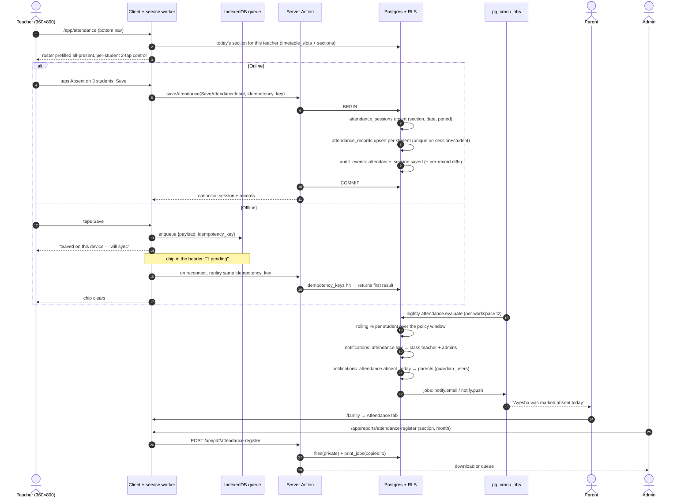

# WF-03 — Daily attendance: roll-call in ≤ 60 s → offline → alert → parent → register → print

|                  |                                                                                                                                                                                             |
| ---------------- | ------------------------------------------------------------------------------------------------------------------------------------------------------------------------------------------- |
| Journey          | The single most-used screen in the product, every working morning                                                                                                                           |
| Primary actor    | Class teacher (Android phone, often on 3G, sometimes with no signal)                                                                                                                        |
| Secondary actors | Admin (register, corrections) · Parent (notification) · Owner (dashboard)                                                                                                                   |
| Features         | F-AC-03 (attendance) · F-AC-01 (sections, section_subjects) · F-AC-05 (timetable, bell) · F-AC-0x (parent portal) · F-ID-07 (notifications) · F-OP-03 (reports/PDF) · F-OP-04 (print queue) |
| Budget           | ≤ **60 s** for a 40-student section at 360×800; attendance save p95 **< 300 ms** (PRD §3, §6)                                                                                               |
| Exit state       | One `attendance_sessions` row per (section, date[, period]) and one `attendance_records` row per enrolled student, idempotent under replay                                                  |

---

## 1. Actors and preconditions

| Actor             | Device        | Needs                                                                                                                    |
| ----------------- | ------------- | ------------------------------------------------------------------------------------------------------------------------ |
| **Class teacher** | Android phone | An active membership, a section they teach (`sections.class_teacher_id` or a `section_subjects` row), `attendance.write` |
| **Admin**         | Windows PC    | `attendance.write` for any section, `attendance.edit_past` beyond the edit window                                        |
| **Parent**        | Android phone | A `guardian_users` link (WF-02)                                                                                          |

**Preconditions**

- Active `academic_years`, `sections`, and `enrollments` with `status='active'` (WF-01, WF-02).
- `school_profiles.working_days` (default Sat–Thu), `timezone` (default `Asia/Dhaka`) and `attendance_policy` — the policy holds `late_counts_present` (default **true**), `half_day_counts_present` (default true), `minimum_attendance_percent` (default **75**, a warning not a block), and `edit_window_hours`.
- PWA installed or the Android wrapper, so the service worker and the IndexedDB queue exist.

---

## 2. Sequence

---

## 3. Steps

### Stage A — Open today's section (≤ 2 taps to the grid)

1. **Bottom nav → Attendance.** `/app/attendance` resolves the teacher's context server-side:
   - today = `(now() at time zone school_profiles.timezone)::date`, **never** `new Date()` in the browser;
   - if today is not in `school_profiles.working_days`, or is a `holiday` in `academic_calendar_days`, the screen says so and offers "Mark anyway" for make-up classes;
   - the default section is the one from the teacher's **current or next `timetable_slots` period**; if none, their class-teacher section; if none, the last section they marked.
2. Header: `Class 6 – A · Sat 20 Sep · Period 1`. Two chips beside it: a **section switcher** (sheet listing only sections this teacher may mark) and a **period switcher**, shown only when `school_profiles.attendance_mode = 'per_period'` (default is one daily roll-call — PRODUCT-DECISIONS §2.1).
3. The roster loads from `enrollments` where `status='active'`, ordered by `roll_no`. Every student is **pre-selected Present** — the common case costs zero taps.

### Stage B — Mark in ≤ 2 taps per student

4. Each row is a 56 px card: roll number, name, avatar initials, and a segmented control with **P · A · L** (44 px each). One tap sets the status. A **second** tap on **A** or **L** opens a 40 %-height sheet with `excused` / `half_day` and an optional note — so the two rare statuses cost the second tap and the three common ones cost one.
5. A sticky header bar shows live counts: `38 present · 2 absent · 0 late`, and a **Mark all absent** overflow action for the exam-hall case.
6. **Save** is a sticky 56 px full-width button in the thumb zone. It is enabled from the first render (saving an all-present roster is a legitimate one-tap action).
   _Writes:_ one `attendance_sessions` row (`workspace_id`, `section_id`, `date`, `period_number` nullable, `taken_by`, `taken_at`, `source='manual'`) and one `attendance_records` row per student (`session_id`, `student_id`, `status ∈ present|absent|late|excused|half_day`, `note`, `recorded_by`). Unique `(session_id, student_id)`; unique `(section_id, date, period_number)` on the session.
   _Events:_ `audit_events`: `attendance_session.saved` plus per-record before/after on edits (the generic trigger). **No notification on save** — notifications are the nightly job's business, so a teacher correcting a mis-tap 10 seconds later does not spam 40 parents.

### Stage C — Offline (ARCHITECTURE §6)

7. If `navigator.onLine` is false or the action times out, the payload plus its `idempotency_key` (a client-generated uuid v4, minted **when the form opens**, not when Save is pressed) is written to IndexedDB. The button returns **"Saved on this device"**, and a persistent chip in the top bar reads `1 pending`.
8. The service worker replays the queue on `online` and on next app focus. The server dedupes on `idempotency_keys(key, scope='attendance.save', request_hash)`:
   - same key **and** same hash → the stored response is returned, exactly one session exists;
   - same key, **different** hash (the teacher edited offline and the first attempt actually landed) → `IDEMPOTENCY_KEY_REUSED`; the client then re-sends as an explicit **edit** with a fresh key, and the last write wins with a full audit diff.
9. Roster data for the teacher's own sections is cached by the service worker so the screen renders offline. A student admitted while the teacher was offline appears after the replay with a one-line notice: "Rafiq Ahmed joined this section — mark him now."

### Stage D — Alerts (nightly, deterministic)

10. A pg_cron job runs at **19:30 Asia/Dhaka** (after the school day, before parents' evening) per workspace:
    - `attendance_percent(student, window)` = `count(status in policy-present set) / count(all records in window)` where the present set comes from `school_profiles.attendance_policy`. **Late and half-day count as present by default** (PRODUCT-DECISIONS §2.2).
    - A student below `minimum_attendance_percent` (default 75) over the term-to-date window raises `notifications`: `attendance.low` to the class teacher and admins, `action_url=/app/students/{id}?tab=attendance`. It is a **warning about exam eligibility, never a block**.
    - Each student marked `absent` today with no `excused` override raises `notifications`: `attendance.absent_today` to every linked `guardian_users` account, plus a `jobs` row for the email/push channel according to `notification_preferences`.
11. Deduplication: one `attendance.low` per student per **7 days**, one `attendance.absent_today` per student per day. Both are idempotent on `(event_type, subject_id, date)` so a job retry cannot double-notify.

### Stage E — Parent view

12. **`/family` → Attendance** shows a month grid for the child: one cell per working day, colour **and** glyph (P/A/L/E/H — colour alone never carries meaning), the running percentage with the school's rule spelled out in one line ("Late counts as present at this school"), and a tap-through to the day's note if one exists. Reads go through the guardian-scoped view; the parent has no direct policy on `attendance_records`.

### Stage F — Monthly register and print

13. **`/app/reports/attendance-register`** — pick section + month. Desktop renders the classic grid (students down, days across, totals right). Phone renders a per-student list with a compact 31-cell strip, because a 31-column table at 360 px is unusable.
14. **Generate** calls `POST /api/pdf/attendance-register` — React-PDF, A4 landscape, Bengali font embedded, header from `school_profiles` (name, address, EIIN, logo), footer with the class teacher and principal signature rules.
    _Writes:_ `files` (`visibility='private'`, path `reports/{workspace_id}/attendance-register-{section}-{yyyy-mm}.pdf`), and on **Send to print queue** a `print_jobs` row (`kind='attendance_register'`, `copies=1`, `file_id`, `status='queued'`).
    _Events:_ `audit_events`: `report.rendered`. `notifications`: `print.ready` to the requester when the render job completes.
15. In v1 the queue is printed from the browser or downloaded; the Tauri print agent and real `printers` status arrive in R4 (PRODUCT-DECISIONS §6.4). Nothing in the UI claims a printer is online until an agent reports it.

---

## 4. Failure and edge cases

| Case                                                    | Detection                                                | UI behaviour                                                                                                                                                                                               |
| ------------------------------------------------------- | -------------------------------------------------------- | ---------------------------------------------------------------------------------------------------------------------------------------------------------------------------------------------------------- |
| Session already exists for (section, date, period)      | Unique constraint → upsert                               | The screen loads the **existing** records for editing, with "Marked by Ms. Nadia at 08:14" in the header                                                                                                   |
| Teacher opens a section they no longer teach            | `WorkspaceContext` + RLS                                 | Section absent from the switcher; a direct URL returns not-found                                                                                                                                           |
| Membership removed mid-day                              | RLS checks `status='active'`                             | Next server action 403s; the client shows "You no longer have access to this school" and routes to the workspace switcher. Queued offline rows fail on replay and are surfaced, **never silently dropped** |
| Non-working day / holiday                               | `school_profiles.working_days`, `academic_calendar_days` | "Saturday is a holiday — Mark anyway?"                                                                                                                                                                     |
| Edit after the window (`edit_window_hours`, default 24) | Server-side check                                        | Teacher gets `EDIT_WINDOW_CLOSED` with "Ask an admin"; admins may edit with `attendance.edit_past`, and every change is audited with before/after                                                          |
| Two devices mark the same section at once               | Last write wins on `(session, student)`                  | The loser's toast names the other teacher and the grid refetches; the audit trail holds both versions                                                                                                      |
| Offline queue survives a sign-out                       | `signOut` clears the IndexedDB queue (F-ID-01 §4.10)     | The teacher is warned first: "2 attendance saves are still pending — sync before signing out?"                                                                                                             |
| Queue replay after 3 days offline                       | `idempotency_keys.expires_at = +24 h`                    | The key has expired; the replay is treated as a new **edit** with a diff shown to the teacher for confirmation before it lands                                                                             |
| Student enrolled mid-month                              | `enrollments.started_on`                                 | The register renders `—` (not absent) for days before enrolment; the denominator excludes them                                                                                                             |
| Student withdrawn mid-month                             | `enrollments.ended_on`                                   | Same, at the tail                                                                                                                                                                                          |
| Percentage over a month with zero sessions              | `NULLIF(denominator,0)`                                  | Renders `—`, never `NaN`, never 0 %                                                                                                                                                                        |
| Parent has push disabled                                | `notification_preferences`                               | In-app notification is always written; push/email follow preference. In-app is never optional                                                                                                              |
| PDF render fails                                        | `jobs` retry with backoff ×3                             | The print card shows "Couldn't generate — Retry"; no half-written `files` row is linked                                                                                                                    |
| Bengali glyphs missing in the PDF                       | Font embedding verified in R1 part 1 (PRD §8)            | A snapshot test on the text layer fails CI before it ever reaches a school                                                                                                                                 |

---

## 5. What the Base44 prototype did instead

Attendance was modelled **twice and the halves were never joined**. The intended model was `Attendance` (student + class + date + present/absent/late, tenant-scoped with RLS); the implemented screen wrote `AttendanceLog` — a gate-scanner event log with `checked_in`/`checked_out`, **no `class_id`, no `date`, no `workspace_id` and no RLS at all**, so every school's rows sat in one global table. `Attendance` was read by six screens (`StudentDetail`, `ParentPortal`, `StudentAnalytics`, `Dashboard`, `AttendanceAlerts`, `ProgressReportGenerator`) and written by **nothing**, which meant every attendance number, chart, alert and PDF section in the product was permanently empty. The roll-call screen itself required a filter before showing anything, and its grade dropdown mapped `students.map(s => s.grade)` against a field that does not exist on `Student` (it is `grade_number`), so the dropdown was always empty; it also rendered `student.student_code`, another non-existent field, falling back to `S-<first 4 chars of the row id>`. Beside the roster sat a pulsing green "Live" pill that was a static div and a "Live Feed" of five hardcoded scans (Ahmed Hassan, Mr. Johnson, Sara Ali…) that never changed. Marking a student absent opened a glassmorphism "Recovery Protocol" modal whose missed-work list and rescheduling slots were hardcoded literals and whose "Confirm & Print (3)" button called `setRecoveryModal(null)` — nothing printed, nothing queued, nothing saved. The percentage formula disagreed with itself across screens: `StudentDetail` counted late **against** the student over the last 60 rows, the parent portal counted late **as present** over the last 30, and analytics averaged over the last 1,000 rows and plotted holidays as 0 %. `SchoolSettings.attendance_cutoff` was collected in onboarding and in settings and read nowhere, so late was never computed from it. There was no offline path, no idempotency, no edit window, no register, and no attendance-sheet generator anywhere in the repository — `PrintQueue.print_type = 'Attendance Sheet'` was a label that required the user to paste a document URL by hand.
