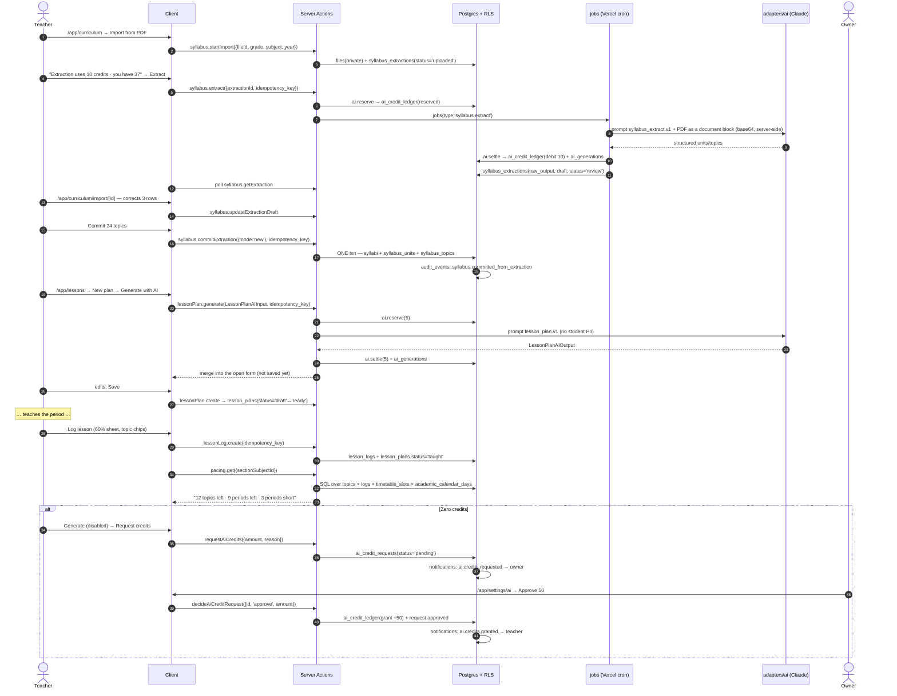

# WF-05 — Syllabus PDF → topics → AI lesson plan → teach → log → pacing (and the zero-credit path)

|                  |                                                                                                                                                                                                                                    |
| ---------------- | ---------------------------------------------------------------------------------------------------------------------------------------------------------------------------------------------------------------------------------- |
| Journey          | The teaching loop: what must be taught, what to teach tomorrow, what actually got taught, and whether the syllabus will finish                                                                                                     |
| Primary actor    | Subject teacher (Android phone)                                                                                                                                                                                                    |
| Secondary actors | Head of department / admin (pacing oversight) · Owner (credit grants) · Platform (credit packs)                                                                                                                                    |
| Features         | F-TE-01 (lesson planner) · F-TE-02 (curriculum spine, lesson logs, pacing) · F-TE-03 (AI credits) · F-TE-04 (AI prompts/generations) · F-AC-05 (timetable) · F-OP-07 (school settings, academic calendar) · F-CM-07 (credit packs) |
| Exit state       | A published `syllabi` with units and topics, `lesson_plans` in `draft                                                                                                                                                              | ready | taught`, `lesson_logs`per period, live pacing arithmetic, an`ai_credit_ledger` that balances |

---

## 1. Actors and preconditions

| Actor           | Device        | Needs                                                                                                    |
| --------------- | ------------- | -------------------------------------------------------------------------------------------------------- |
| **Teacher**     | Android phone | `syllabus.write` for a subject they teach, `lesson_log.write`, `ai.generate` + a positive credit balance |
| **Admin / HoD** | Windows PC    | `syllabus.publish`, `pacing.read.any`                                                                    |
| **Owner**       | Phone or PC   | `ai.credits.grant`, the workspace AI billing model toggle                                                |

**Preconditions**

- `section_subjects` populated with teachers (WF-01); `timetable_slots` exist (capacity maths reads them); `academic_calendar_days` marks holidays and exam days.
- `ai_actions` seeded with the fixed prices (PRODUCT-DECISIONS §3.3): **lesson plan 5 · worksheet 3 · quiz 3 · parent message 1 · pacing plan 8 · image 4 · syllabus extraction 10**.
- `plans.daily_ai_credits` grants the workspace's daily allowance; pg_cron resets at **00:00 Asia/Dhaka**.
- Billing model on the workspace is `shared_pool` (default) or `individual_allocation` with per-teacher daily caps, owner-changeable (PRODUCT-DECISIONS §5.3).

---

## 2. Sequence

---

## 3. Steps

### Stage A — Syllabus PDF → reviewable topics (F-TE-02 §4.2)

1. **`/app/curriculum` → Import from PDF.** Sheet: grade level, subject, academic year, then a `.pdf` (≤ 20 MB, ≤ 40 pages). The file lands in the **private** bucket as a `files` row with `visibility='workspace'`; the workspace's storage quota (`plans.storage_gb` vs `Σ files.size_bytes`) is checked **before** the upload is accepted.
   _Writes:_ `files`, `syllabus_extractions` (`status='uploaded'`, `page_count`).
2. **Cost gate.** The sheet reads _"Extraction uses 10 credits · you have 37"_. The number comes from the server; the client never computes or supplies a price. Below cost, the button is disabled with **Request credits**.
3. **Extract** reserves credits, then runs as a **background job** (a 40-page PDF exceeds a serverless request budget). The model receives the PDF as a base64 `document` content block read server-side from the private object — **never a URL**. Prompt `syllabus_extract.v1`, output validated against `SyllabusExtractionOutput`.
   _Writes:_ `ai_credit_ledger` (reserve then settle), `ai_generations` (model, prompt version, tokens, pages, status), `syllabus_extractions` (`raw_output`, `draft`, `status='review'`).
   The teacher may leave the page; the extraction card polls and shows stage text (Uploading → Reading pages → Extracting).
4. **Review is mandatory.** `/app/curriculum/import/[id]`: **tabs on phone** (Document | Topics) because a PDF preview and an editable table cannot share 360 px; split panes at ≥1024. Every row is editable — unit number, unit title, topic title, estimated periods — and rows can be added, deleted, merged upward or reordered. Rows the model flagged as low-confidence carry an amber left border and "check this". A counter reads _"24 topics · 41 estimated periods"_.
5. **Commit** runs one transaction: `syllabi` (`source='ai_extraction'`, `source_document_id`), `syllabus_units`, `syllabus_topics` in order; `syllabus_extractions.status='committed'`. **Nothing an AI extracts becomes curriculum without a human pressing Commit** — `raw_output` keeps the model's original for comparison.
   _Events:_ `audit_events`: `syllabus.committed_from_extraction` carrying the `ai_generation_id`.
6. Alternatives that cost nothing: **Start from a template** (platform NCTB templates or the school's own, `syllabus_templates`) opens the same review table pre-filled; or type units and topics inline in the editor. **Publish** (owner/admin) flips `status='published'`, which is what makes a syllabus selectable in lesson logging and countable in pacing.

### Stage B — Plan the lesson (F-TE-01 §4.1–4.2)

7. **`/app/lessons`** — `DataList` of plan cards (title, section-subject chip, date, status dot, AI pill), a **Mine · Shared · All** segmented filter, a horizontally scrolling date strip, and a FAB above the bottom nav.
8. **New plan** opens a full-height sheet with a sticky footer holding **Save** (right, primary) and **Generate with AI** (left, secondary), both ≥ 44 px inside the thumb arc. Header fields: title, section-subject (defaults to the teacher's most-used over 30 days, computed in SQL), date (today in workspace tz), duration, teaching style, syllabus topic (filtered to that section-subject's published syllabus).
9. **Generate with AI.** Cost line: _"Uses 5 credits · you have 37"_. The action takes **only typed fields** — `.strict()` Zod strips anything else; it never accepts a price, a model id or a prompt. `ai.reserve → invoke → ai.settle → ai_generations`.
   The prompt receives subject, topic, **grade-level label** ("Class 6"), duration, style, the teacher's own objectives and notes. It receives **no student names, no roster, no guardian data** (F-TE-01 §5.8).
   The result is merged **into the open form and not saved**: by default AI fills empty fields and appends to non-empty arrays; "replace my text" is an explicit tick. A "Generated by AI" pill offers **Undo** (restores the pre-generation snapshot) and **What was sent?** (the exact redacted inputs).
10. **Save.** `lesson_plans` with `objectives text[]`, `materials text[]`, `activities jsonb` (ordered `{phase, title, content, duration_minutes}`), **two separate differentiation columns**, `generated_by_ai`, `ai_prompt_version`, `ai_generation_id`. `workspace_id` and `created_by` come from `WorkspaceContext`, never from the form.
    A soft warning appears when `Σ activities.duration_minutes` differs from the header duration by > 5 min. It **never blocks saving**.
11. **Ready.** The teacher flips `status='ready'` manually. Sharing is a real row in `lesson_plan_shares` (`view|edit`) whose target list comes from `workspace_members` with role ∈ {teacher, admin, owner} and `status='active'` — so the recipient's "Shared with me" filter actually queries a table. Sharing to a `removed` member is rejected by a trigger.

### Stage C — Teach, then log (the 30-second flow)

12. After the period, the teacher taps **Log lesson** — from the dashboard quick action, from the finished timetable period, or from `/app/curriculum/logs`. A **60 %-height sheet** opens (so the timetable stays visible behind it), pre-filled with section-subject, today's date and the period number from the tapped slot.
13. The first row of the sheet is a horizontally scrollable strip of the **next 3 uncovered topics** in teaching order, each a one-tap chip (`lessonLog.nextTopics`). "Something else" opens a search over the whole syllabus plus a free-text field for off-syllabus lessons.
14. Coverage segmented control — **Completed · Partial · Skipped · Revision · Assessment**. Periods used: a stepper defaulting to 1, stepping by **0.5** (half periods are real in BD timetables). Optional note. Save.
    _Writes:_ `lesson_logs` (unique on `(section_subject_id, taught_on, period_number)`), and when a `ready` `lesson_plans` row matches that section-subject and date, that plan flips to `status='taught'` with `taught_at`.
    _Events:_ generic audit trigger only. **No notification** — logging must be frictionless.
    _Offline:_ the save queues in IndexedDB with an idempotency key and replays exactly like attendance (WF-03 stage C).

### Stage D — Pacing (arithmetic, not a model)

15. **`/app/curriculum/pacing`** — a stack of cards on phone with the headline number at 32 px. Everything is computed live from rows; there are no cached counters to drift:
    - **covered** — a topic is covered for a _section-subject_ when a `lesson_logs` row exists with that topic and `coverage='completed'`. Topic status is deliberately **not** a column, because 6-A can finish a topic 6-B has not started.
    - **estimated_remaining** — Σ `estimated_periods` over uncovered, non-optional topics; partially covered topics count at half, rounded up to 0.5.
    - **periods_remaining** — counted from `timetable_slots` × `academic_calendar_days` × `school_profiles.working_days` between tomorrow and the term/year end. Never a typed guess.
    - **period_balance** = remaining − estimated; bands **On track / At risk / Behind** from `school_profiles.pacing_thresholds`; **projected finish date** by walking the instructional calendar.
    - **off-syllabus** periods are surfaced honestly ("4 periods spent off-syllabus this term").
16. **Admin view** (`?scope=school`) is the head-of-department table: every section-subject, sortable by shortfall, filterable by grade/subject/teacher, CSV export.
17. **Optional: AI pacing plan** (8 credits). Inputs default from real data — start date = next instructional day, weeks = weeks to term end (capped 12), periods per week **pre-filled from the timetable**. The model receives remaining topics **with their estimated periods**, the real instructional dates (holidays already removed by SQL — the model is never asked to know the school calendar) and the computed capacity. The topic window is taken until cumulative estimates meet capacity, plus 3 lookahead — **not** the first N topics by count.
    _Writes:_ `pacing_plans` (**persisted**, so a refresh does not lose it), `ai_generations`, `ai_credit_ledger`.
    **Copy to lesson plans** turns a week into `draft` `lesson_plans` rows at **zero credit cost** — the plan becomes work, not a picture.

### Stage E — Zero credits → request → grant (PRODUCT-DECISIONS §3.3)

18. At a balance below the action price, every Generate button is **disabled with the reason on it**: _"Not enough credits (2 of 5) — Request credits"_. The UI check is convenience; the server check is authoritative and returns `INSUFFICIENT_CREDITS` with the current balance.
19. **Request credits** sheet: amount (stepper, presets 25/50/100), reason (free text, optional), and a line showing the teacher's usage this week.
    _Writes:_ `ai_credit_requests` (`workspace_id`, `requested_by`, `amount`, `reason`, `status='pending'`). _Events:_ `notifications`: `ai.credits.requested` → owner + admins, `action_url=/app/settings/ai?tab=requests`.
20. **Owner** at `/app/settings/ai` sees the request queue with each teacher's balance and 30-day usage (real numbers from `ai_credit_ledger` and `ai_usage_log` — no random charts). **Approve** with an editable amount, or **Reject** with a note.
    _Writes:_ `ai_credit_ledger` (`kind='grant'`, `+amount`, `granted_by`, `reason`), `ai_credit_requests` (`status='approved'|'rejected'`, `reviewed_by`, `reviewed_at`).
    _Events:_ `notifications`: `ai.credits.granted` / `ai.credits.rejected` → teacher. `audit_events`: `ai_credit.granted` with the amount.
21. If the school is out of plan credits entirely, the owner buys a **top-up pack** (placeholder ৳499 / 500 credits) — that is a `credit_pack` order through the same payment substrate as everything else (WF-06 §checkout, WF-07 §invoices). The entitlement is an `ai_credit_ledger` grant written **only** from a validated IPN.

---

## 4. Failure and edge cases

| Case                                              | Detection                                     | UI behaviour · ledger effect                                                                                                                                                                     |
| ------------------------------------------------- | --------------------------------------------- | ------------------------------------------------------------------------------------------------------------------------------------------------------------------------------------------------ |
| `AI_TIMEOUT` (60 s plan, 180 s extraction)        | `adapters/ai`                                 | Inline alert inside the sheet: "Claude took too long. Nothing was charged." Reservation released, **ledger unchanged**, Retry enabled. The button re-enables from `onSettled`, never `onSuccess` |
| `AI_SCHEMA_INVALID` after one retry               | Zod on structured output                      | "The generated plan came back malformed. Nothing was charged." Raw output stored on `ai_generations` for debugging, **never shown to the user**. Reservation released                            |
| `AI_REFUSAL` (`stop_reason='refusal'`)            | Provider                                      | "Claude declined this request." `ai_generations.status='refused'`, category logged, reservation released                                                                                         |
| `RATE_LIMITED` (10/min/user, 100/h/workspace)     | Server                                        | "Too many generations right now. Try again in a minute." Nothing charged                                                                                                                         |
| Extraction returns zero units (scanned image PDF) | Empty `units` array                           | "We couldn't find a topic list in this document — you can still enter it manually", manual editor pre-seeded with the file attached, **reservation released, nothing charged**                   |
| Regeneration                                      | Each press reserves and settles independently | There is no free retry **except** when the failure is ours (timeout, schema, refusal, 5xx)                                                                                                       |
| Undo after a successful generation                | Client-side snapshot                          | Fields restore; **credits are not refunded** — the call already happened, and the UI says so                                                                                                     |
| Duplicate `lessonPlan.generate` idempotency key   | `idempotency_keys`                            | Returns the first result; the ledger shows exactly **one** debit                                                                                                                                 |
| Duplicate period log                              | Unique `(section_subject, date, period)`      | `ALREADY_LOGGED` → "You already logged period 3 today — edit it?" with a link                                                                                                                    |
| Log edited after 7 days                           | `school_profiles.lesson_log_edit_days`        | `EDIT_WINDOW_CLOSED` for the teacher; admin can still edit, with before/after audit                                                                                                              |
| Syllabus still `draft`                            | `syllabi.status`                              | Pacing renders "Publish a syllabus to see pacing" and **no numbers** — never a misleading zero                                                                                                   |
| Two sections on different curricula               | Deliberate                                    | One syllabus per grade+subject+year. A genuinely different curriculum means a second `subjects` row ("Mathematics (Advanced)"), explained in the UI help text                                    |
| Commit fails partway                              | One transaction                               | Full rollback; no partial syllabus; the extraction stays in `review`                                                                                                                             |
| Commit replayed                                   | `idempotency_keys`                            | Exactly one syllabus                                                                                                                                                                             |
| Storage quota hit on upload                       | `plans.storage_gb` vs `Σ files.size_bytes`    | Upload refused **before** any credit reservation, with an upgrade prompt                                                                                                                         |
| Teacher removed from the workspace mid-flow       | RLS `status='active'`                         | Next action 403s; shared plans become unreadable; their school-library resources are marked `orphaned` for reassignment (WF-11)                                                                  |
| Daily reset during a long job                     | pg_cron at 00:00 Asia/Dhaka                   | A reservation opened before midnight settles against the **reserved** amount; the reset never voids an in-flight reservation                                                                     |

---

## 5. What the Base44 prototype did instead

The curriculum spine existed in full and **none of it was reachable**. `SyllabusTab.jsx` was the only file that could create a `Syllabus` row and it was imported by nothing, so every consumer of the spine was permanently empty; `LessonLogTab.jsx` (the only code that advanced a topic's status) and `PacingPlanTab.jsx` (the most product-valuable AI feature in the export) were likewise dead files, and the pacing Generate button was permanently disabled because `pendingTopics.length === 0` always. Two unrelated entities were both called "syllabus" — `Syllabus` (topic rows) and `SyllabusUpload` (a parked PDF) — with **no link between them and no extraction step**, even though `Core.ExtractDataFromUploadedFile` was already in use in the marketplace. Consumers disagreed on the join key: `grade_number + subject` in two files, `class_id` in a third. The pacing prompt sliced its topic window by _topic count_ while ignoring each topic's `estimated_periods`, so multi-period syllabi silently over-filled the plan, and it asked the teacher to **type** `periodsPerWeek` rather than counting timetable slots; its output was rendered and **never persisted**, so a refresh lost it. Lesson planning shipped as **two competing planners writing to one entity with incompatible field sets**: `/lesson-planner` wrote `title`/`content`/`materials_needed`, `/ai-planner` wrote `subject`/`topic`/`starter`/`main_activity`/… and **never wrote the required `title`**, so each list rendered the other's rows blank and every AI-saved plan violated its own schema. Neither writer set `workspace_id`, which `LessonPlan`'s own RLS required for read — saved plans disappeared. The AI planner flattened `objectives[]` and `materials[]` into newline strings and concatenated the two differentiation fields into one, then re-parsed them on load by string surgery (`differentiation.replace(/Support: /,'')…`), so any teacher who typed "Support:" corrupted their own plan; activity durations were dropped entirely on save. Three of the five AI calls in the area had **no `try/catch`**, so a network blip left the spinner spinning and the button permanently disabled. Above all, **the credit economy was entirely cosmetic**: five entities (`AIBillingModel`, `DailyAILimit`, `CreditAllocation`, `CreditRequest`, `AIUsageLog`) existed, `AIUsageLog` was never written, `DailyAILimit` and `AIBillingModel` were referenced by zero files, `CreditAllocation` rows were never created and never reset at midnight, `CreditRequest` had **no teacher-facing form** so the admin's whole approve/reject queue was unreachable, no Generate button was ever gated on balance, and the admin's three per-teacher usage charts were `Math.random()` with the comment `// Mock chart data`. A teacher could call the LLM an unlimited number of times, at unlimited cost, with nothing recorded — and all prompts ran client-side, so any future quota check placed there would have been trivially bypassable.
