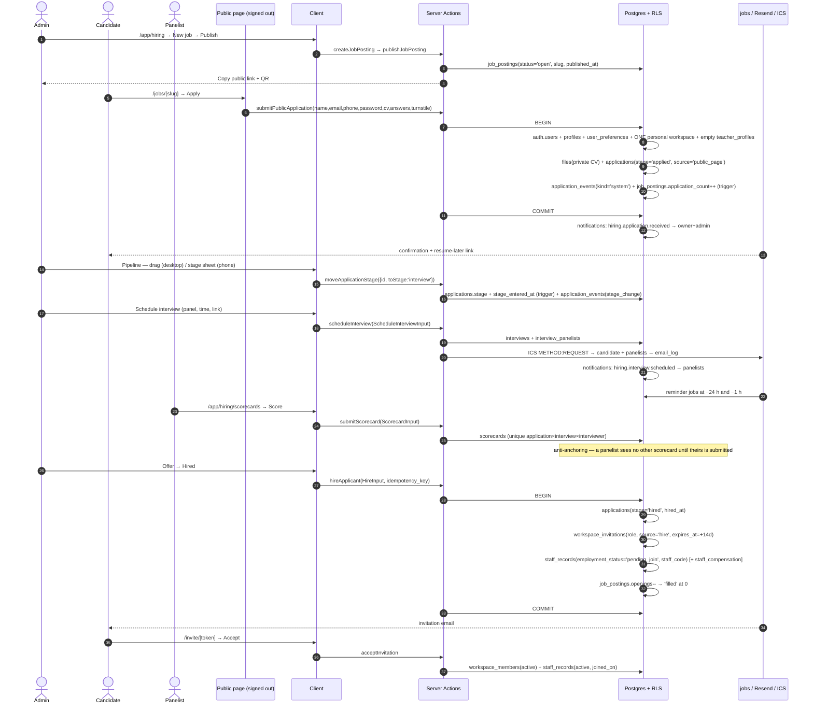

# WF-08 — Hiring a teacher: post → public apply → pipeline → interview → scorecards → offer → hire

|                  |                                                                                                                                                                                                   |
| ---------------- | ------------------------------------------------------------------------------------------------------------------------------------------------------------------------------------------------- |
| Journey          | A vacancy becomes a colleague with a staff record, without retyping anything                                                                                                                      |
| Primary actor    | School admin / owner                                                                                                                                                                              |
| Secondary actors | Candidate (stranger or Acadigma teacher) · Interview panelists · Platform staff (verification)                                                                                                    |
| Features         | F-OP-01 (hiring) · F-OP-06 (staff records) · F-ID-03 (membership) · F-ID-04 (invitations) · F-ID-07 (notifications/email) · F-AC-05 (timetable conflict check) · F-ID-08 (platform console shell) |
| Plan gate        | Hiring is a **Pro** entitlement. The teacher-side profile, applications and consent screens are **never** gated — they belong to the user, not a school plan                                      |
| Exit state       | `applications.stage='hired'`, a `workspace_invitations` row, a `staff_records` row at `pending_join` → `active` on accept                                                                         |

---

## 1. Actors and preconditions

| Actor                            | Device                                     | Needs                                                                                        |
| -------------------------------- | ------------------------------------------ | -------------------------------------------------------------------------------------------- |
| **Admin / owner**                | Windows PC (pipeline), phone (stage moves) | `hiring.*`, a Pro workspace                                                                  |
| **Candidate (stranger)**         | Android phone                              | Nothing — the public page creates a lightweight account                                      |
| **Candidate (Acadigma teacher)** | Android phone                              | A `teacher_profiles` row; applies from `/personal/jobs`                                      |
| **Panelist**                     | Android phone                              | An active membership **listed on that interview's panel** — enforced by RLS, not only the UI |
| **Platform staff**               | Windows PC                                 | `platform.verification.decide`                                                               |

**Preconditions**

- Pro entitlement (`plans.modules` includes `hiring`); otherwise `/app/hiring` is an upgrade card and `/jobs/[slug]` 404s.
- `subjects`, `grade_levels`, `custom_labels` populated (WF-01) — postings reference them by id, not by comma-separated strings.
- Resend configured; Turnstile keys set for the public form.

---

## 2. Sequence



---

## 3. Steps

### Stage A — Publish a vacancy (F-OP-01 W1)

1. **`/app/hiring` → Jobs → New job.** Sheet on phone, dialog on desktop, **autosaved every 3 s** as `draft`: title, department, employment type (`full_time | part_time | contract | substitute | volunteer`), subjects (**array of `subject_ids`**, not a comma string), grade levels, openings, salary range in **paisa** with a `salary_visible` toggle, location, closing date, description, up to **8 screening questions** (`short_text | long_text | single_select | yes_no`), and the two optional checks (`require_demo_lesson`, `require_background_check` — **checklist items on the application, not extra pipeline stages**).
2. **Publish** validates and sets `status='open'`, `published_at`, and generates a globally unique `slug` (`{workspace-slug}-{title-slug}-{code-suffix}`) plus a per-workspace `code` (`JOB-2026-0007`).
   _Writes:_ `job_postings`. _Events:_ `audit_events`: `job_posting.published`.
3. **Copy public link** hands over `https://…/jobs/{slug}`, plus a **QR** in the share sheet for printing on a notice board. The public page reads through the `public_job_postings` view — the anonymous role never touches the base table.

### Stage B — The ingress Base44 never built (F-OP-01 W2/W3)

4. **`/jobs/{slug}`** — one column on phone, hero + details + a sticky **Apply**, SEO metadata, the school's own name and logo from `school_profiles`. Closed or unpublished → "Applications closed" / 404.
5. **`/jobs/{slug}/apply`** — **four full-screen steps** with a progress bar and a sticky bottom CTA. Full-screen, not a sheet: this is a stranger on a phone, and sheets are the members' idiom.
   1. _Are you already on Acadigma?_ → Sign in (returns to the same step) or Continue as new.
   2. _Lightweight account_ — full name, email, phone, password or "email me a link", plus a **Turnstile** challenge. One transaction creates the Supabase Auth user, `profiles`, `user_preferences`, **exactly one personal workspace** and an empty `teacher_profiles` row. Email verification is sent but **does not block** the application; an unverified applicant is flagged in the dossier.
   3. _The application_ — CV upload (pdf/doc/docx ≤ 10 MB → `files`, private), cover note (≤ 2000 chars — the prototype's 200 could not hold a real letter), expected salary, available-from, screening answers.
   4. _Review + consent_ — an explicit tick: _"I agree that {School} may view this application and the documents I attach to it."_
      _Writes:_ `applications` (`stage='applied'`, `source='public_page'`, `cv_file_id`, `answers jsonb`), `application_events` (`kind='system'`), `job_postings.application_count` by trigger.
      _Events:_ `notifications`: `hiring.application.received` → owner + admins. Email: confirmation + a **resume-later link** sent after step 2, so a dropped connection never loses the CV.
6. **Acadigma teachers** apply from **`/personal/jobs`** (open postings across all schools). Identical from step 3, except the CV defaults to `teacher_profiles.cv_file_id` and `source='personal_area'`. The "your CV will be sent automatically" promise is **true** here because the file id is copied onto the application row.
7. Unique `(job_posting_id, applicant_user_id)` — one application per person per job.

### Stage C — Work the pipeline (F-OP-01 W4)

8. **Desktop ≥1024 — kanban.** Seven columns: Applied · Screening · Interview · Offer · Hired · Rejected · Withdrawn, with the three terminal columns collapsed behind a "Closed (14)" toggle. Drag to move, optimistic update, server confirms. Keyboard equivalent: select a card → `M` → stage menu.
9. **Phone 360 — list + stage sheet.** One vertical list grouped by stage with sticky headers and a horizontally scrolling stage-filter chip row in the thumb zone. Tapping a card opens a **stage sheet** with the legal next stages as 44 px rows. **There is no drag-and-drop on touch** — dragging at 360 px is a usability fiction.
10. **Stage machine** (`packages/domain/hiring/stageMachine.ts`): forward to any higher active stage; `hired` **only from `offer`**; backward is allowed and logged (hiring is not a ratchet); `rejected` from any active stage **requires a reason**; `withdrawn` is written **only by the candidate**; `rejected|withdrawn → screening` reopen is owner/admin with an audit event; `hired` is final (undo is offboarding, WF-11).
    _Writes:_ `applications.stage`, `stage_entered_at` (trigger), `application_events` (`kind='stage_change'`, `from_stage`, `to_stage`, `actor_id`).
11. **Time in stage** = `now() − stage_entered_at` in the workspace timezone: amber at ≥ 3 days and red at ≥ 7 in `applied|screening`, ≥ 5 / ≥ 10 in `interview|offer`, all from `hiring_policy.stale_days`.
12. **The candidate never sees internal stage names.** `/personal/applications` shows a three-state summary: **In review · Interviewing · Decision made**.
13. **Dossier** `/app/hiring/applications/[id]` — full-screen on phone with a segmented control (Profile · CV · Timeline · Scorecards · Emails) and a sticky bottom action bar; two panes on desktop. Notes and the timeline live in `application_events`, **not** in `audit_events` — the generic audit trail stays machine-written and non-user-editable.
14. **Templated candidate email** from the dossier: keys `application.received`, `interview.invite`, `interview.reminder`, `offer`, `rejection`, `document.request`, `hire.invitation`, with workspace-editable subject/body (`email_templates`) and **real signed attachments** (7-day links for offer letters).

### Stage D — Interviews (F-OP-01 W5)

15. **Schedule interview** from the dossier or from the stage sheet when moving into `interview`: kind (`phone | video | in_person | demo_lesson`), date + time in the **workspace timezone**, duration, panel (multi-select of active members), location or meeting URL, a note to the candidate.
    _Writes:_ `interviews` (`ics_uid`, `status='scheduled'`), `interview_panelists` (`is_lead`).
    _Jobs:_ an **ICS invite** (METHOD:REQUEST) emailed to the candidate and every panelist, logged in `email_log`; reminders at **−24 h and −1 h**.
    _Events:_ `notifications`: `hiring.interview.scheduled` → panelists. `application_events` (`kind='interview'`).
16. A **timetable conflict warning** is non-blocking and specific: _"Ms. Nadia teaches Class 7 – B at 10:30."_ It reads `timetable_slots`; it never refuses the save.
17. The candidate confirms through a **signed link** (`candidate_confirmed_at`) with no account action. Reschedule re-sends an ICS with a bumped `SEQUENCE`; cancel sends METHOD:CANCEL. Email failures are retried three times by the job runner and **surfaced on the interview card** — never silently swallowed.

### Stage E — Scorecards, one per interviewer (F-OP-01 W6)

18. When `starts_at` passes, each panelist gets _"Score Ayesha Rahman"_ in notifications and at `/app/hiring/scorecards`.
19. The sheet renders the workspace's default template as five criteria with 1–5 segmented controls **and an explicit N/A**, a recommendation selector (`strong_no | no | yes | strong_yes`), strengths and concerns.
    _Writes:_ `scorecards`, **unique `(application_id, interview_id, interviewer_id)`** — the constraint the prototype's in-place update violated. Editable by its author for **24 h**, then locked; an admin can unlock with an audit event.
20. **Scoring** (default weights: subject knowledge 30, communication 20, classroom management 20, culture fit 15, overall impression 15):
    ```
    rated = criteria where rating is not null
    score = Σ(rating_i × weight_i) / Σ(weight_i)      -- weights renormalise over the rated set
    ```
    A scorecard whose rated weights sum to **< 60** is `incomplete` and is **excluded from the panel average**, so a single 5★ cannot read as a perfect panel score. `score` is `null`, never `0`, when nothing is rated.
21. **Panel average** = the unweighted mean of submitted, non-incomplete scorecards — **each interviewer counts once**, displayed to 1 dp with "n of m filed". The recommendation tally is shown as counts and is **never** mapped to a number.
22. **Anti-anchoring**: an interviewer cannot see another's scorecard until they have submitted their own — enforced **in the query**, not in the UI.

### Stage F — Document consent (F-OP-01 W7 · PRODUCT-DECISIONS §1.15)

23. **Request documents** from the dossier or from a browsed profile: tick kinds (`cv | nid | degree | certificate | marksheet | reference | police_clearance`), optional message.
    _Writes:_ `document_requests` (`status='pending'`). _Events:_ `notifications` + email → candidate, deep-linked to `/personal/requests`.
24. The candidate's screen shows **who is asking, which school, which documents** and two 44 px buttons: **Approve for 30 days** / **Decline** (optional reason).
    Approve → `status='approved'`, `approved_until = now() + 30 days`. **Revoke** is available at any time and kills access on the next signed-URL request.
25. The school then sees documents as thumbnails behind `/api/files/[id]`, gated by **one** function, `app.can_open_candidate_file(file_id)`, which requires: an application linking that candidate to that workspace **or** an approved request; **plus**, for anything other than the CV attached to that application, a live approved `document_requests` row; **plus** `hiring.documents.open`. Every open is written to `file_access_log` and shown back to the candidate as _"Viewed by {School} on 12 Sep"_.
26. A nightly job expires approvals (`approved_until < now()` → `status='expired'`).

### Stage G — Browse opted-in candidates (Pro)

27. **`/app/hiring/candidates`** — server-side filters (subject, grade, experience, availability, work type, location, verified-only, minimum profile score) over `app.browse_teacher_profiles()`, a security-definer projection. **Only `open_to_work = true AND visibility = 'active'` profiles are visible, and the payload contains no email, no phone and no `file_id`.**
28. **Invite to apply** picks an open posting and notifies the candidate; an `applications` row with `source='invited_from_browse'` is created **only after the candidate accepts** — a school can never create an application on someone's behalf.
29. `profile_score` (0–100) is a pure, published function: 70 points of completeness (photo 5, bio ≥120 chars 10, subjects 10, education 10, CV 10, experience 5, grade levels 5, work preference 5, locations 5, languages 5) + 30 of verification (identity 10, degree 10, certificate 5, composite "teacher verified" 5), clamped at 100. It is **recomputed server-side** on profile save, file change, verification decision and the `open_to_work` toggle — and the UI always shows it **with its missing items** ("+10 — add your CV"), because an unexplained score is useless.
30. Badges come only from `profile_verifications`, decided by **platform staff** in the same `/platform` queue as seller KYC, same 2-business-day SLA. No school role can write that table — that is the entire meaning of the badge.

### Stage H — Hire (F-OP-01 W9)

31. Moving to **Hired** (legal only from `offer`) opens a confirm sheet: workspace role (`teacher | staff`), designation (a `custom_labels` entry, e.g. Principal), department, employment type, start date, and — only for actors with `staff.compensation.view` — hourly rate and/or monthly salary.
32. **One transaction**, `idempotency_key` required:
    a. `applications.stage='hired'`, `hired_at`;
    b. `workspace_invitations` (email = the candidate's, chosen role, `source='hire'`, `expires_at = +14 days`) + invitation email;
    c. `staff_records` (`employment_status='pending_join'`, `user_id`, `staff_code` from `app.next_id(workspace_id,'staff')`), linked back via `applications.staff_record_id`;
    d. optional `staff_compensation` (`hourly_rate_paisa`, `monthly_salary_paisa`) — **admin-only visibility**, and the input to cover-teacher payroll impact (WF-09);
    e. `job_postings.openings` decremented; at 0 → `status='filled'`, and the remaining candidates are offered a **bulk rejection action, never an automatic one**.
33. **On accept**: `workspace_members.status='active'`, `staff_records.employment_status='active'`, `joined_on` = the accept date, and the new member lands in `/app` with a welcome checklist.
    _Events:_ `audit_events`: `application.hired`, `invitation.sent`, `staff_record.created`, `membership.created` under one `correlation_id`. `notifications`: `hiring.hired` → owner + admins; `invite.accepted` on acceptance.

---

## 4. Failure and edge cases

| Case                                              | Detection                        | Behaviour                                                                                                                                      |
| ------------------------------------------------- | -------------------------------- | ---------------------------------------------------------------------------------------------------------------------------------------------- |
| Free/Starter workspace                            | `WorkspaceContext.plan`          | `/app/hiring` shows an upgrade card; publish is blocked; `/jobs/[slug]` 404s                                                                   |
| Duplicate application                             | Unique `(job, user)`             | "You already applied on 3 Sep" + a link to `/personal/applications`                                                                            |
| 6 public submissions from one IP in an hour       | Rate limit 5/h/IP, 3/day/email   | Refused **before** any user is created                                                                                                         |
| Posting closes between page load and submit       | Re-checked server-side           | Friendly closed state + "See other jobs at {School}"                                                                                           |
| Browser closed after step 2                       | Resume-later emailed link        | Returns to step 3 with the account already created                                                                                             |
| Concurrent stage move                             | Optimistic token → `stale_stage` | Loser's toast: "Rafiq moved this to Interview 2 s ago"; the board refetches                                                                    |
| Move to `rejected` without a reason               | Server                           | `reason_required` — the sheet refuses                                                                                                          |
| `screening → hired`                               | Stage machine                    | `illegal_transition`                                                                                                                           |
| Candidate withdraws mid-interview                 | Candidate-only update policy     | Stage `withdrawn`; the school's board updates on the next fetch; panelists' pending scorecards disappear                                       |
| Panelist leaves the workspace                     | RLS                              | A **submitted** scorecard is kept, attributed and immutable; an unsubmitted one is dropped from the average and the panel reads "2 of 3 filed" |
| Interview scheduled in the past                   | Server                           | `in_the_past`                                                                                                                                  |
| Non-member added to a panel                       | Server + RLS                     | `panelist_not_member`                                                                                                                          |
| ICS fails to send                                 | `jobs` retry ×3                  | Surfaced on the interview card with a Resend action                                                                                            |
| Document request to a candidate with no such file | Server                           | School sees "Not uploaded yet"; the candidate is prompted to upload                                                                            |
| Approval 31 days old                              | Nightly expiry job               | `expired`; the open 403s with a `file_access_log` denial row                                                                                   |
| Candidate revokes mid-review                      | `revoked_at`                     | The next signed-URL request 403s within a second                                                                                               |
| Hiring someone who is already an active member    | Server                           | Invitation skipped; the staff record is created/attached                                                                                       |
| Seat limit reached                                | `plans.max_teachers`             | `seat_limit_reached`; the whole hire transaction rolls back — no orphan staff record                                                           |
| Double-tap on Hire                                | `idempotency_key`                | Exactly one invitation                                                                                                                         |
| Invitation expires                                | 14-day `expires_at`              | `staff_records` stays `pending_join`; `/app/staff` offers **Resend invitation**                                                                |
| Parent member opens `/app/hiring`                 | Nav filter + server policy + RLS | Redirected; the action returns `forbidden`                                                                                                     |

---

## 5. What the Base44 prototype did instead

Recruitment was started **three times and finished zero times**. An ATS lived on `Applicant`, a teacher-initiated board on `JobApplication`, and a marketplace track on `HiringPipeline` — three tables, three incompatible status vocabularies, and no shared tenant column between them (`JobPosting`, `Applicant`, `InterviewSchedule`, `HiredStaff` and `TeacherPublicProfile` had **no tenant field at all**, so every school saw every school's vacancies). **Nothing anywhere in the codebase created an `Applicant`, a `HiredStaff` or a `TeacherPublicProfile`**, so the Kanban, the dossier, the onboarding tracker and Browse Candidates were fully built screens over tables with no writer — permanently empty. The advertised public ingress, `/apply/:jobId`, was linked from a "Copy Public Link" button and **was never added to the router**, so the link 404'd. The teacher-side application did write a row, but attributed it with `job.workspace_id || job.school_id` against a `JobPosting` that has neither field, producing `school_id: ''`; its status was never updated by anything, so an application froze at `submitted` forever; and its promise that _"your CV will be sent automatically"_ attached nothing at all. "Schedule Interview" wrote an `InterviewSchedule` row, flipped a status, and the row was **never read back** — the query that loaded them was assigned to a variable and never referenced; there was no email, no calendar event and no candidate notification. The hiring scorecard was stored **inside `AuditLog`** and **updated in place**, so a second interviewer silently overwrote the first and the evidence trail was destroyed — directly contradicting the audit module's own "read-only (no edit, no delete)" comment; its average was the unweighted mean of whatever was rated, so scoring one criterion 5★ produced a 5.0. `DocumentRequest` had **no candidate-side screen**, so every consent request stayed `pending_candidate_response` forever and `responded_at` was never written, while `TeacherPublicProfile`'s `cv_url`, `certificate_urls` and `marksheet_urls` — documented as private — had **no RLS**. `profile_score` was displayed everywhere and computed nowhere, defaulting to 0, and `profile_visibility` defaulted to `paused` with no publisher, so the browse screen's filter on `active` returned zero rows by construction. The one genuinely working piece was the templated candidate email — whose offer template referenced _"the offer details in the attachment"_ with no attachment mechanism in existence. The only "hire → workspace invite" logic in the repository lived in an **orphaned file that nothing imported** and called `base44.users.inviteUser`, an undocumented SDK namespace.
