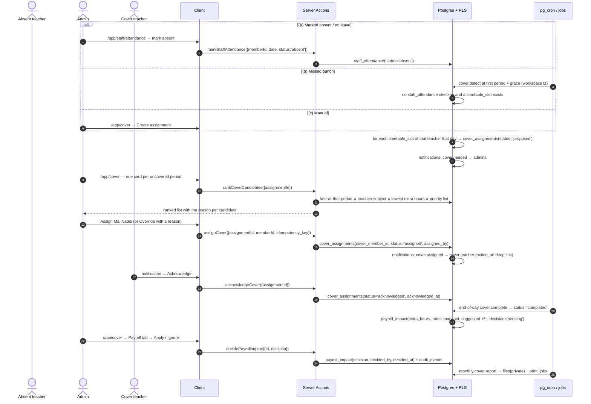

# WF-09 — Cover teacher day: absence → ranked candidates → assign → acknowledge → complete → payroll

|                  |                                                                                                                                                                                                |
| ---------------- | ---------------------------------------------------------------------------------------------------------------------------------------------------------------------------------------------- |
| Journey          | 07:40. A teacher is absent. Four periods need covering before the first bell                                                                                                                   |
| Primary actors   | Admin / office staff · Cover teacher                                                                                                                                                           |
| Secondary actors | Absent teacher · Owner (payroll policy, monthly report) · pg_cron (the missed-punch trigger)                                                                                                   |
| Features         | F-AC-04 (staff attendance & leave) · F-OP-02 (cover teacher & payroll impact) · F-OP-06 (staff records & compensation) · F-AC-05 (timetable) · F-ID-07 (notifications) · F-OP-03 (reports/PDF) |
| Plan gate        | Cover teacher is a **Pro** entitlement                                                                                                                                                         |
| Exit state       | One `cover_assignments` row per uncovered `timetable_slots` occurrence, each `completed` or `overridden`, with a `payroll_impact` row that an admin has explicitly applied or ignored          |

---

## 1. Actors and preconditions

| Actor              | Device                                    | Needs                                                                         |
| ------------------ | ----------------------------------------- | ----------------------------------------------------------------------------- |
| **Admin**          | Windows PC, sometimes a phone at the gate | `cover.assign`, `cover.override`, `staff_attendance.write`                    |
| **Cover teacher**  | Android phone                             | An active membership; only needs to read and acknowledge their own assignment |
| **Absent teacher** | Android phone                             | Self check-in, leave requests                                                 |
| **Owner**          | PC                                        | `payroll.policy.write`, `staff.compensation.view`                             |

**Preconditions**

- `timetable_slots` exist for the day (WF-01 stage E) — **the timetable is the entire input to the ranking engine**.
- `staff_records` with `employment_status='active'`, and `staff_compensation.hourly_rate_paisa` where payroll impact is wanted (admin-only visibility).
- `school_profiles.cover_policy` (proposed): `missed_punch_grace_minutes` (default **30**), `cover_credited` (default **true**, at the cover teacher's own rate), `unpaid_absence` (default **false**), `max_extra_periods_per_month`.
- `bell_periods` give each period's minute length — extra hours are `Σ period minutes / 60`, not a guess.

---

## 2. Sequence



---

## 3. Steps

### Stage A — Three triggers, one row shape (PRODUCT-DECISIONS §6.3)

1. **(a) Marked absent or on leave.** `/app/staff/attendance` is the daily staff sheet: a `DataList` of members with a P/A/L segmented control on phone, a grid on desktop. Marking `absent`, `on_leave` or `half_day` for a member who has `timetable_slots` today fires the cover engine for the remaining periods.
   _Writes:_ `staff_attendance` (`workspace_id`, `member_id`, `date`, `status ∈ present|absent|late|on_leave|half_day`, `check_in_at`, `check_out_at`, `leave_type`, `note`). Approved `staff_leave` rows pre-write the same state for future dates.
2. **(b) Missed punch.** Where self check-in is enabled, a pg_cron job runs at **first period + `missed_punch_grace_minutes`** in the workspace timezone. For each member with a `timetable_slots` occurrence today and **no** `staff_attendance` check-in, it raises cover with `trigger='missed_punch'` — a _provisional_ state, because the teacher may simply be late.
3. **(c) Manual.** `/app/cover → Create assignment` for the cases a system cannot see (a teacher called away mid-morning).
4. In all three cases the engine expands the absence into **one `cover_assignments` row per uncovered `timetable_slots` occurrence** for that date:
   `(workspace_id, date, timetable_slot_id, section_subject_id, period_number, absent_member_id, cover_member_id null, trigger ∈ marked_absent|missed_punch|manual, status='proposed', duties_note)`.
   Unique `(timetable_slot_id, date)` — a period cannot be covered twice.
   _Events:_ `notifications`: `cover.needed` → owner + admins, `action_url=/app/cover?date=today`, deduplicated to **one notification per absent teacher per day**, not one per period.

### Stage B — Ranking (computable from the timetable, not a config wish)

5. `rankCoverCandidates` scores every active member with role ∈ {teacher, admin, owner} for that specific period:

| Signal                             | Rule                                                                                      | Weight                                            |
| ---------------------------------- | ----------------------------------------------------------------------------------------- | ------------------------------------------------- |
| **Free at that period**            | No `timetable_slots` occurrence and no other `cover_assignments` for the same date+period | **Hard filter** — a busy teacher is never offered |
| **Not absent today**               | No `staff_attendance` absence for the date                                                | **Hard filter**                                   |
| **Teaches the subject**            | An active `section_subjects` row with the same `subject_id`                               | +40                                               |
| **Teaches the grade level**        | Any section at that `grade_level_id`                                                      | +15                                               |
| **Priority list**                  | Position in `cover_priority_lists(section_subject_id, member_id, position)`               | +30 / +20 / +10 by position                       |
| **Lowest extra hours this month**  | `Σ extra_hours` from this month's `cover_assignments`                                     | +25 scaled, inverted                              |
| **Is the section's class teacher** | `sections.class_teacher_id`                                                               | +10                                               |

The list renders **with its reasons** — "Free · teaches Mathematics · 0 extra hours this month" — so an admin can disagree with the engine on evidence. There is no black box. 6. **Priority lists** are configured at `/app/cover/settings` per `section_subject`, referencing **`workspace_members.id`**, never a display name.

### Stage C — Assign, acknowledge, complete

7. **`/app/cover`** on phone is a day view: one card per uncovered period showing `Period 3 · Class 6 – A · Mathematics · was Mr. Rahman`, with a 44 px **Assign** button opening the ranked sheet. Desktop shows the day grid with every absent teacher's row.
8. **Assign** writes `cover_assignments` (`cover_member_id`, `status='assigned'`, `assigned_by`, `assigned_at`). **Override** — picking someone the engine ranked lower, or nobody — requires a **typed reason**, which is stored on the row and audited.
   _Events:_ `notifications`: `cover.assigned` → the cover teacher with the period, section, subject and room, `action_url=/app/cover/mine`. `cover.reassigned` to a previously assigned teacher if they are replaced. `audit_events`: `cover_assignment.assigned` / `.overridden` with before/after and the reason.
9. **`/app/cover/mine`** is the cover teacher's screen: today's assignments as cards with a single **Acknowledge** button (44 px, thumb zone), the section, the subject, the room, and — when the absent teacher left one — a duties note and a link to the relevant `lesson_plans` row if it was shared.
   _Writes:_ `cover_assignments` (`status='acknowledged'`, `acknowledged_at`).
   Unacknowledged assignments raise a reminder notification **15 minutes before the period starts**.
10. **Completion** is automatic: an end-of-day pg_cron job moves `acknowledged` (and `assigned` that were never acknowledged) to `completed`, stamping `completed_at`. An admin can mark a row `not_needed` — the missed-punch case where the teacher turned up — which **cancels the cover and notifies the substitute** (`cover.cancelled`), and is the single most important thing the prototype's override flow was trying to do.

### Stage D — Payroll impact (suggested, never applied automatically)

11. On `completed`, a trigger writes `payroll_impact`:
    `(workspace_id, cover_assignment_id, cover_member_id, absent_member_id, extra_hours numeric(4,2), hourly_rate_cover_paisa, hourly_rate_absent_paisa, cover_addition_paisa, absent_deduction_paisa, decision ∈ pending|applied|ignored, decided_by, decided_at)`.
    **Arithmetic, in `packages/domain/payroll/coverImpact.ts`, integer paisa only:**
    ```
    extra_hours        = Σ bell_periods.duration_minutes for covered periods / 60
    cover_addition     = round(extra_hours × hourly_rate_cover_paisa)      -- when cover_policy.cover_credited
    absent_deduction   = round(extra_hours × hourly_rate_absent_paisa)     -- ONLY when cover_policy.unpaid_absence (default off)
    ```
    Rates are **snapshotted from `staff_compensation` at completion time**, so a later raise never rewrites last month's numbers.
12. **`/app/cover` → Payroll** lists pending impacts with the arithmetic spelled out (`1.5 h × ৳400/hr = ৳600`), and two actions per row: **Apply** or **Ignore**, both requiring nothing more than a tap but both permanently logged. The screen states plainly, once: _"Acadigma does not run payroll. These are suggestions you apply in your own payroll process."_
    _Writes:_ `payroll_impact.decision`, `decided_by`, `decided_at`. _Events:_ `audit_events`: `payroll_impact.decided` with before/after.
13. **Rate visibility** is gated on `staff.compensation.view` (owner/admin only). A teacher sees their own extra hours and never anyone's rate.

### Stage E — Monthly report

14. **`/app/reports/cover-summary`** — pick a month. Output per teacher: periods covered, extra hours, suggested additions, applied vs ignored; per absent teacher: days absent, periods needing cover, deductions suggested/applied; plus a school total.
    `POST /api/pdf/cover-summary` renders it server-side with the `school_profiles` header, stores it in `files` (private), and optionally creates a `print_jobs` row.
    _Events:_ `notifications`: `print.ready`. A pg_cron job can schedule the same report on the 1st and email owners.
15. The same numbers feed the workload view (F-TE-06), where **scheduled** periods (timetable) and **logged** periods (lesson logs, WF-05) are shown side by side with the variance — two different questions, both useful.

---

## 4. Failure and edge cases

| Case                                                     | Detection                                                                          | Behaviour                                                                                                                                                                                            |
| -------------------------------------------------------- | ---------------------------------------------------------------------------------- | ---------------------------------------------------------------------------------------------------------------------------------------------------------------------------------------------------- |
| Missed punch, teacher arrives at 08:20                   | Admin marks the assignment `not_needed`                                            | Cover cancelled, substitute notified (`cover.cancelled`), **no payroll impact is created**, and the cancellation reason is audited                                                                   |
| Teacher checks in after the grace job ran                | Job re-check on check-in                                                           | Any still-`proposed` assignments for that teacher auto-cancel; `assigned` ones need the admin's explicit `not_needed` (someone was already told to show up)                                          |
| No eligible candidate                                    | Ranking returns zero after hard filters                                            | The card reads "No one is free in period 3" and offers: assign anyway (override with a reason), merge sections, or cancel the period. It **never** silently leaves the period uncovered              |
| Cover teacher declines                                   | Assignment sheet → **Decline with reason**                                         | `status='declined'`, `notifications`: `cover.declined` → admins, and the ranked list reopens with the decliner excluded                                                                              |
| Never acknowledged                                       | Reminder at −15 min, then `completed` at end of day with `acknowledged_at is null` | The monthly report flags unacknowledged covers separately — an honest number, not a silent pass                                                                                                      |
| Cover teacher becomes absent themselves                  | The hard filter re-evaluates on the next ranking                                   | Existing assignments for them are surfaced as **at risk** on the day view for reassignment                                                                                                           |
| Same teacher assigned to two sections in the same period | Unique `(cover_member_id, date, period_number)`                                    | Refused with `COVER_CLASH`, naming the other section                                                                                                                                                 |
| Timetable changed after assignment                       | `timetable_slots.effective_to`                                                     | Assignments for a slot no longer effective are cancelled by the nightly job and the admin is notified                                                                                                |
| No `hourly_rate_paisa` on the staff record               | Null rate                                                                          | `payroll_impact` is created with `extra_hours` only and **null money**; the row reads "Add an hourly rate to see the amount" and links to the staff record. It is never computed from a made-up rate |
| Member removed mid-month                                 | RLS `status='active'`                                                              | Their future assignments are cancelled and reopened; **completed** rows and their payroll impacts stay, attributed (WF-11)                                                                           |
| Double-tap Assign                                        | `idempotency_keys`                                                                 | One assignment, one notification                                                                                                                                                                     |
| Absence on a non-working day or holiday                  | `school_profiles.working_days`, `academic_calendar_days`                           | No `timetable_slots` occurrences exist → no assignments created                                                                                                                                      |
| Half-day absence                                         | `staff_attendance.status='half_day'` + check-out time                              | Only periods after the check-out are expanded into cover rows                                                                                                                                        |
| Free/Starter plan                                        | `WorkspaceContext.plan`                                                            | `/app/cover` is an upgrade card; the detection job does not run for that workspace                                                                                                                   |
| "Today" near midnight                                    | `(now() at time zone school_profiles.timezone)::date` in SQL                       | Dhaka is UTC+6; a UTC-based date would have shown tomorrow's list from 06:00 local                                                                                                                   |

---

## 5. What the Base44 prototype did instead

The cover-teacher model was **the most clearly specified feature in the whole export and the least implemented**. The schemas described the full lifecycle — `trigger_reason ∈ marked_absent | missed_punch`, `status` walking `notified → acknowledged → confirmed_by_admin → active → overridden → completed`, an ordered `cover_priority_list` of up to three substitutes, `payroll_extra_hours`, and a `PayrollImpactLog` proposing `+X` for the substitute and `−Y` for the absent teacher with the UI stating explicitly that _"Payroll changes are never applied automatically"_. **Nothing anywhere created a `CoverAssignment` or a `PayrollImpactLog`**, so the Cover Assignments tab and the Payroll Impact tab were fully built screens over tables that could never hold a row. Only the four _middle_ steps had code: confirm, override, config CRUD and the payroll decide button. The trigger did not exist, the priority-list walk did not exist (nothing ever read `cover_priority_list`), the acknowledge step had no UI, and completion was never set. The rate lookup had **no possible source** — there was no hourly-rate field on `User`, `WorkspaceMember` or `SchoolSettings` anywhere in the schema — so `hourly_rate_cover` and `hourly_rate_primary` were displayed in a caption (`{extra_hours}h × ৳{rate}/hr`) whose multiplication was never performed in code. The config screen stored `class.teacher_name`, a **display string**, into the `primary_teacher_id` **FK** field, because `Class` had no teacher foreign key at all — the same root cause that made the workload balancer join teachers by name and count two spellings of "S. Rahman" as two people. Its "— None —" fallback was `<SelectItem value={null}>`, which Radix rejects, so the dropdown threw on open. "Today's assignments" was computed as `new Date().toISOString().split('T')[0]` — **UTC** — so a Bangladesh school at UTC+6 saw the next day's list from 06:00 local. The override flow — the one genuinely important action, cancelling a cover when the teacher turned out to be present — wrote its audit entry through `logAudit('cover.override', user?.id, {...})`, calling a function whose signature is `logAudit(user, action_type, entity_type, …)`, so the resulting row recorded `user_id: 'system'`, `action_type: <the actor's uuid>`, `entity_type: <a raw object>`, `school_id: 'unknown'`, and **silently discarded the override reason — the entire point of the audit** — inside a `catch` that surfaced nothing.
