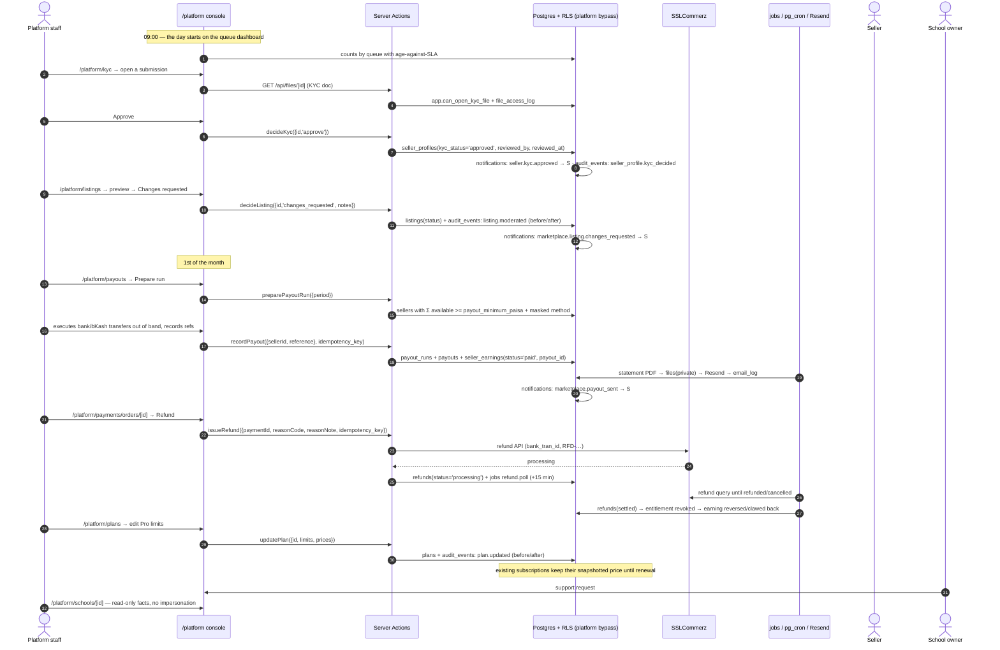

# WF-12 — A platform staff day: review queues → payouts run → refund → plan edit → audit → support

|                  |                                                                                                                                                                                                                                       |
| ---------------- | ------------------------------------------------------------------------------------------------------------------------------------------------------------------------------------------------------------------------------------- |
| Journey          | The Acadigma side of the product — the console that makes moderation, money and support real work rather than a promise                                                                                                               |
| Primary actor    | Platform staff (`profiles.is_platform_admin`)                                                                                                                                                                                         |
| Secondary actors | Seller · Teacher awaiting verification · School owner needing support · Buyer awaiting a refund                                                                                                                                       |
| Features         | F-ID-08 (platform console shell) · F-CM-02 (seller KYC) · F-CM-03 (listing moderation) · F-CM-05 (earnings & payouts) · F-CM-01 (refunds, reconciliation) · F-CM-06 (plans) · F-OP-01 (teacher verification) · F-ID-09 (audit viewer) |
| Hard rule        | `is_platform_admin` grants **`/platform` only**. It **never implies workspace membership** (PRODUCT-DECISIONS §1.21), and there is **no impersonation** (PRD §5.6)                                                                    |
| Exit state       | Empty review queues within SLA, a payout run with a transfer reference per seller, a reconciliation report with zero unexplained mismatches                                                                                           |

---

## 1. Actors and preconditions

| Actor                | Device     | Access                                                                                                                                     |
| -------------------- | ---------- | ------------------------------------------------------------------------------------------------------------------------------------------ |
| **Platform staff**   | Windows PC | `/platform` routes; **read** bypass policies on the tables the console needs, **write** only on moderation, payout, refund and plan tables |
| **Seller / teacher** | Phone      | Receives decisions as notifications and email                                                                                              |
| **School owner**     | PC         | Receives support outcomes; sees platform-initiated changes in **their own** audit viewer                                                   |

**Preconditions**

- `profiles.is_platform_admin` is set **by migration or direct DB only** — there is no app path to grant it, and a trigger rejects a row owner setting it on themselves (F-ID-01 §2).
- `platform_settings` singleton exists: `commission_bps`, `payout_minimum_paisa`, `earnings_hold_days`, `refund_window_days`, `vat_bin`, `receipt_footer`.
- SSLCommerz live credentials configured; `provider_mode` recorded on every `payments` row.

---

## 2. Sequence

---

## 3. Steps

### Stage A — The queue dashboard

1. **`/platform`** opens on a queue board, each tile carrying a count **and the oldest item's age against its SLA**, because a count without an age hides the only thing that matters:
   - **Seller KYC** — SLA **2 business days** (PRODUCT-DECISIONS §4.5)
   - **Teacher verification** (identity / degree / certificate) — same queue, same SLA (F-OP-01 W10)
   - **Listing review** — submitted and re-submitted listings
   - **Refund requests** and **disputed payments** (reconciliation mismatches)
   - **Payout run** — visible from the 1st
   - **Support** — schools flagged by owners
2. Every listing on this dashboard is **data, not authority**: opening a row still passes through the same policy checks, and every document open is logged.

### Stage B — KYC and verification review (WF-06 stage A, WF-08 stage G)

3. **`/platform/kyc`** shows the submission: storefront details, document type, and the ID scan + selfie behind `GET /api/files/[id]`, which checks `app.can_open_kyc_file()`, issues a **5-minute** signed URL and writes `file_access_log`. Platform staff are the only role for whom that predicate is ever true.
4. **Approve** → `seller_profiles.kyc_status='approved'`, `reviewed_by`, `reviewed_at`, `verified_at`. **Reject** requires a reason, which is shown verbatim to the seller. Resubmission **updates the same row** — `user_id` stays unique, so the duplicate-row problem cannot recur.
   _Events:_ `notifications`: `seller.kyc.approved` / `.rejected`. `audit_events`: `seller_profile.kyc_decided` with before/after.
   Approval **is** the `verified_seller` badge. There is no second badge in v1.
5. **Teacher verification** (`profile_verifications`, kinds `identity | degree | certificate`) runs in the same console with the same SLA. Approval sets the badge and triggers a `profile_score` recompute. **No school role can ever write this table** — that is the entire meaning of the badge.

### Stage C — Listing moderation (WF-06 stage B)

6. **`/platform/listings`** — queue of `submitted` listings with the rendered preview, price, seller and KYC status side by side. Three decisions: **Approve** · **Changes requested** (notes required) · **Reject** (reason required).
7. Approval renders the watermarked preview (`Preview — Acadigma`) and moves the row to `approved`; **the seller publishes**, so they control launch timing. Edits to price or files on a published listing re-enter this queue automatically.
   _Events:_ `audit_events`: `listing.moderated` with before/after and the notes. `notifications`: `marketplace.listing.approved` / `.changes_requested` / `.rejected` → seller.
8. Bulk-uploaded listings appear here like any other — there is **no moderation bypass** (PRODUCT-DECISIONS §4.10).

### Stage D — The monthly payout run (D-17)

9. On the **1st**, **`/platform/payouts` → Prepare run** lists every seller whose `Σ seller_earnings where status='available'` is **≥ ৳1,000**, with the masked payout method (`•••• 4821`, bKash / Nagad / bank), the amount, and any **negative adjustment** carried from a refund clawback (WF-06 stage F).
   Full payout details are decrypted for platform staff only, one row at a time, and each decryption is logged.
10. Staff execute the transfers **out of band** (there is no split-payout rail in SSLCommerz) and record a **transfer reference per seller**.
    _Writes:_ `payout_runs` (`period`, `run_by`, totals), `payouts` (`seller_user_id`, `amount_paisa`, `method_snapshot`, `transfer_reference`, `status='paid'`, `paid_at`), `seller_earnings.status='paid'` with `payout_id`.
    _Events:_ `notifications`: `marketplace.payout_sent` → seller. `jobs`: seller statement PDF → `files` → Resend → `email_log`. `audit_events`: `payout.executed`.
11. Sellers below the minimum roll into next month, and their earnings page says so with the exact shortfall — not a silent omission.

### Stage E — Refunds and disputed payments (WF-06 stage F/H)

12. **`/platform/payments/orders/[id]`** shows the order, its lines, every payment attempt and an events timeline built from `inbound_events` — all sharing one `correlation_id`.
13. **Refund** checks the 7-day window against `orders.paid_at`, the remaining refundable amount, a `reason_code` and a **≥ 10-character note**. `amountPaisa` appears on **exactly one** contract in the product — `issueRefund` — and only for platform staff, bounded by the server-read remaining amount.
14. Provider `processing` schedules `jobs{type:'refund.poll'}` every 15 minutes, up to 20 attempts over 5 days, then raises a platform alert. On `settled`: entitlement revoked, seller earning reversed if still `pending` or clawed back against the next payout, credit note emailed.
15. **Disputed payments** (reconciliation amount mismatches) are **never auto-corrected**. They sit in their own queue with our amount, the gateway's amount, and the raw validated payload, for a human to resolve against the merchant panel.
16. **Reconciliation** runs nightly at 03:00 Asia/Dhaka and on demand; `reconciliation_runs` records `checked`, `repaired` and `mismatches`. A `captured` payment with a null `validated_at` should be impossible — if one appears, the job pages, because that is a bug and not a business case.
17. A permanent **amber ribbon** appears across `/platform` whenever any payment in the last 24 hours has `provider_mode='sandbox'` in a production deployment.

### Stage F — Plans editor (D-18)

18. **`/platform/plans`** edits names, BDT prices, limits (`max_teachers`, `max_students`, `storage_gb`, `daily_ai_credits`) and module entitlements **without a deploy**.
    _Events:_ `audit_events`: `plan.updated` with before/after.
    **Existing subscriptions keep their snapshotted price until renewal**, so a price change never silently re-bills a school mid-cycle; limit changes take effect at the next entitlement resolution.
19. `platform_settings` — commission (3000 bps), payout minimum, hold days, refund window, VAT BIN, receipt footer — is edited on the same screen and audited identically. **Commission is stored once and snapshotted onto every order line**, so changing it never rewrites historical earnings.

### Stage G — Audit viewer

20. **`/platform/audit`** reads `audit_events` across all workspaces with filters for workspace, actor, table, action, row id, `correlation_id` and date range, plus CSV export. A school owner has the **same viewer scoped to their own workspace** at `/app/settings/audit`.
21. The table is append-only by grant: no UPDATE, no DELETE for any role including platform staff; rows are written by database triggers with the actor from `auth.uid()`. Platform staff can **read** an owner's workspace trail, and **their own actions are in it too** — a KYC approval, a plan edit and a refund all leave rows attributable to the named staff member.
22. Retention is indefinite for `audit_events`; `email_log` and `file_access_log` are kept for one year (ARCHITECTURE §10).

### Stage H — School support (without impersonation)

23. **`/platform/schools/[id]`** is a read-only facts page: plan and subscription state, usage against limits, member counts by role and status, storage, recent errors correlated by `correlation_id`, recent audit events, open orders and invoices.
24. There is **no impersonation and no "log in as"**. Support actions are explicit, named, audited operations: resend an invitation, re-run a failed job, re-render an invoice, unblock a throttled sign-in, suspend or reinstate an account (`profiles.status`), suspend or reinstate a workspace.
25. A suspended workspace returns 403 for every member with a dedicated owner-facing screen explaining why and how to contact support; an archived workspace is read-only. Both are audited, and the owner sees the platform action in their own audit viewer — **the platform is not invisible to the customer**.
26. Anything requiring the **service role** goes through `withServiceRole(reason)`, which logs the reason; a Semgrep rule fails the build if any route handler outside that wrapper imports the service-role client.

---

## 4. Failure and edge cases

| Case                                                  | Detection                                                   | Behaviour                                                                                                                                    |
| ----------------------------------------------------- | ----------------------------------------------------------- | -------------------------------------------------------------------------------------------------------------------------------------------- |
| Staff member opens a KYC document                     | Always logged                                               | `file_access_log` row; the seller's KYC page shows nothing (KYC opens are not surfaced to the seller, unlike candidate documents, which are) |
| SLA breach (KYC > 2 business days)                    | Age computed against a BD business-day calendar             | The queue tile turns red and the item sorts first; an email digest goes to the platform team                                                 |
| Approve clicked twice                                 | Conditional update `where kyc_status='pending'`             | Second call is a no-op returning the first result; one notification                                                                          |
| Refund outside the window                             | `platform_settings.refund_window_days`                      | `REFUND_WINDOW_CLOSED` — there is no override in the UI; a policy exception is a `reason_code` value, still inside the window                |
| Refund exceeds remaining                              | Server-read bound                                           | `REFUND_EXCEEDS_REMAINING`                                                                                                                   |
| Refund poll gives up after 5 days                     | 20 attempts                                                 | Platform alert; the refund stays `processing` and is never silently marked settled                                                           |
| Payout recorded twice                                 | `idempotency_key` + `seller_earnings.payout_id` conditional | One `payouts` row; earnings already `paid` are skipped                                                                                       |
| Seller's payout method changed mid-run                | `method_snapshot` on the payout row                         | The run records the method actually used                                                                                                     |
| Seller KYC revoked after earnings accrued             | `kyc_status` change                                         | Listings unlisted; **pending earnings are held pending review**, not forfeited; existing buyer entitlements are untouched                    |
| Amount mismatch found by reconciliation               | `reconciliation_runs.mismatches`                            | Payment `disputed`, staff notified, **never auto-captured**                                                                                  |
| Plan price edited while a checkout is in flight       | Amounts snapshotted at `createOrder`                        | The school is charged what they saw                                                                                                          |
| Platform staff tries a workspace write                | No membership; RLS has read bypass only on console tables   | Denied at the database — the console cannot, for example, edit a student record                                                              |
| Someone tries to grant themselves `is_platform_admin` | `BEFORE UPDATE` trigger on `profiles`                       | Rejected; the column is settable only by the service role or an existing platform admin                                                      |
| Platform staff account compromised                    | Same auth controls as any account + device list             | Sessions revocable; every console action is already attributable in `audit_events`                                                           |
| `SSLCOMMERZ_MODE=sandbox` on `main`                   | CI guard                                                    | Production deploy fails                                                                                                                      |
| Sandbox payment in a production window                | `payments.provider_mode`                                    | Permanent amber ribbon across `/platform`                                                                                                    |

---

## 5. What the Base44 prototype did instead

**There was no platform console at all** — which is why almost every queue in this journey describes a feature the prototype advertised and could not perform. Nothing in the codebase updated `IdentityVerification.status`, so `verified_by`, `verified_at` and `rejection_reason` could only ever be set by a direct database edit and **every seller was permanently pending**; two different submission flows promised two different SLAs (_"1–2 business days"_ in one, _"24–48 hours"_ in the other). The entity had **no RLS block at all**, so any authenticated user could list every seller's passport or NID scan and selfie — the fields whose schema comment reads _"INTERNAL ONLY — never expose to public, schools, or buyers"_ and whose UI promised they were _"only accessible by SchoolTroop internal staff"_. **No moderation UI existed** either: listings written as `pending_review` had no path to `approved` or `published`, and the browse screen filtered on `published`, so **no listing created through the app could ever appear in the marketplace**, while the seller-side UI already rendered all six statuses in anticipation. The only payout tool, `CommissionEngine`, was **structurally unreachable** — an `isAdmin`-gated panel nested inside a tab gated on `role === 'teacher'`, and `User.role`'s enum contains neither value — and when reached it inserted `SellerEarnings` rows with `status:'pending_payout'` while reporting _"N payouts processed successfully"_; nothing ever became `paid`, `MarketplaceTransaction.payout_processed` stayed false forever, no rail was called, and the payout destinations had been collected in the seller wizard and thrown away. `refunded` and `disputed` were enum values no code path could reach, with the UI explaining that _"Refunds are handled by SchoolTroop support only"_ — an out-of-band process with no tooling. Plans could not be edited because no plan prices existed anywhere in the code. And the audit trail, the one thing a support console exists to read, was unusable four ways over: it was written **from the browser**, best-effort, with failure logged as a `console.warn`; `AuditLog` had **no RLS**, so rows were writable and deletable by anyone; one screen called `AuditLog.update(...)` to overwrite a prior entry in place, contradicting the module's own "read-only" comment; and both real call sites passed arguments in the wrong order, producing rows with `user_id: 'system'`, `school_id: 'unknown'` and a raw UUID where the action name belonged. `logActivity()` had zero call sites. **There was no audit viewer page anywhere in the application**, despite a permission key existing for one.
