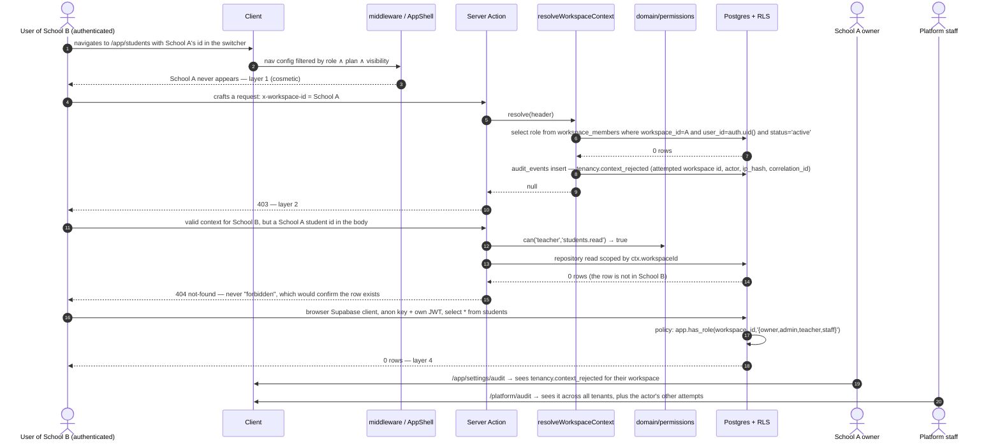

# WF-13 — A cross-tenant attempt, blocked at every layer: UI → server policy → RLS → audit

|                               |                                                                                                                                                                   |
| ----------------------------- | ----------------------------------------------------------------------------------------------------------------------------------------------------------------- |
| Journey                       | Not a user journey — an **attacker** journey, and the four walls it fails against                                                                                 |
| Primary actor                 | An authenticated user of School B attempting to read or write School A                                                                                            |
| Secondary actors              | School A's owner (sees the tripwire) · Platform staff (sees it across tenants) · CI (proves it before a human ever tries)                                         |
| Features                      | ARCHITECTURE §3 (tenancy), §5 (server layer), §11 (threat model) · F-ID-03 (WorkspaceContext, RLS helpers) · F-ID-09 (audit viewer) · every feature's pgTAP suite |
| Success metric                | **Zero cross-tenant data access**, proven by pgTAP isolation tests on every table and an authorized penetration test before launch (PRD §3.3)                     |
| Root cause being designed out | The prototype anchored tenancy to `user.data.active_workspace_id` — **a field the client writes to itself**                                                       |

---

## 1. The four layers

| #   | Layer                  | What it is                                                                                                                                                                                                                                                           | What it is _not_                                                                                              |
| --- | ---------------------- | -------------------------------------------------------------------------------------------------------------------------------------------------------------------------------------------------------------------------------------------------------------------- | ------------------------------------------------------------------------------------------------------------- |
| 1   | **UI guards**          | Nav filtered by `entitled(plan, module) ∧ visible ∧ can(role, key)`; hidden routes return 404                                                                                                                                                                        | **Not security.** They exist for experience only                                                              |
| 2   | **Context resolution** | `WorkspaceContext` resolved per request by querying `workspace_members` for `(workspace_id, auth.uid(), status='active')`; `x-workspace-id` is **never trusted directly**; the resolved id is set transaction-locally with `set_config('app.workspace_id', …, true)` | Not a token claim — tenancy is never in the JWT, so there is nothing to forge or to revoke                    |
| 3   | **Server policy**      | `domain/permissions.can(ctx.role, 'attendance.write')` **before** any repository write, plus Zod `.parse()` on every input and `Result<T, ApiError>` out                                                                                                             | Not a substitute for RLS. Tests assert both layers independently                                              |
| 4   | **RLS**                | A policy on **every** tenant table, generated from one template, using `SECURITY DEFINER` `STABLE` helpers with `search_path` pinned — all of which consider only `status='active'` memberships                                                                      | Not optional anywhere, and not bypassed by the browser client, which holds only the anon key + the user's JWT |

**One rule above all** (ARCHITECTURE §1): _the database and the server are the security boundary._

---

## 2. Sequence — the attempt and its four refusals



---

## 3. Layer by layer

### Layer 1 — UI (experience only)

1. The nav is one typed config per workspace type, filtered by `entitled(plan, module) ∧ (workspace_modules.is_visible ?? true) ∧ can(role, module.permission)`. A hidden or unentitled module's **route returns 404**, not a permission error, so the nav and the guards read the same matrix and cannot drift apart.
2. A workspace the user is not an active member of **never appears in the switcher**, because `listMyWorkspaces` is itself RLS-scoped. If a membership is revoked between render and tap, `switchWorkspace` returns `WORKSPACE_NOT_MEMBER` and the switcher refetches and greys the row.
3. None of this is security, and the codebase says so in the architecture document. It exists so that a teacher is not shown a Billing button they cannot use.

### Layer 2 — Context resolution (the root-cause fix)

4. The client sends `x-workspace-id`, set from the `acx_ws` cookie. `packages/db` resolves:
   ```
   WorkspaceContext = { workspaceId, userId, role, plan }
     ← select role from workspace_members
        where workspace_id = :header and user_id = auth.uid() and status = 'active'
   ```
   Missing → **403**. The header is an _assertion by the client about which tenant it wants_, and it is checked against the membership table on **every request**.
5. Resolution order when no header is present: `acx_ws` cookie → `user_preferences.default_workspace_id` → `profiles.last_workspace_id` → first active membership. A stale `default_workspace_id` pointing at a `removed` membership is treated as null and cleared on read.
6. The resolved id is written transaction-locally with `set_config('app.workspace_id', …, true)` so RLS policies and audit triggers read the same value the repository used — one source, one transaction.
7. **A forged `x-workspace-id` writes a tripwire**: `audit_events` gains a `tenancy.context_rejected` row with the attempted workspace id, the actor, an `ip_hash` and the request `correlation_id`. This is deliberately cheap and deliberately loud — it is the exact attack the security review described, and it is now an alarm instead of a silent success.
8. Because tenancy lives in **no token**, removing a member takes effect on their **next request** with nothing to revoke (WF-11 stage C).

### Layer 3 — Server policy and contracts

9. Every server action follows the same shape (ARCHITECTURE §5):
   `parse input (Zod) → resolve WorkspaceContext → can(ctx.role, key) → repository call with ctx → Result<T, ApiError>`.
   Nothing throws raw errors to the client; error codes are named and enumerable.
10. Every repository function takes `WorkspaceContext` as its **first parameter**, enforced by an ESLint/Semgrep rule that fails the build on any export that does not. There is no unscoped query surface for client code to reach.
11. **Money and identity are never accepted from a client.** Checkout actions take ids only; no `amount` field exists in any checkout schema and a CI grep test asserts that. `workspace_id` and `created_by` are always written from context, never from a form — the `with check` clauses say so as well.
12. **Enumeration is treated as a leak.** A row in another tenant returns **not-found**, not forbidden. Password reset, magic link and phone OTP responses are identical and identically timed whether or not the address exists.
13. The **service role** appears in exactly three places — webhooks, cron jobs and explicitly reviewed admin operations — each wrapped in `withServiceRole(reason)`, which logs the reason. A Semgrep rule fails CI if any route handler outside that wrapper imports the service-role client.

### Layer 4 — RLS (the wall that does not depend on our code being right)

14. Every tenant table carries `workspace_id uuid not null references workspaces` — **no exceptions**, including personal data and billing (PRODUCT-DECISIONS §1.6). One column name → one helper → one test.
15. Helpers are `SECURITY DEFINER`, `STABLE`, `search_path` pinned to `app, public`, and **all of them consider only `status='active'` rows**:
    `app.current_user_id()` · `app.is_platform_admin()` · `app.member_role(workspace_id)` · `app.has_role(workspace_id, roles[])` · `app.is_guardian_of(student_id)`.
16. The policy template, applied per table and tested per table:
    - **select** — `app.has_role(workspace_id,'{owner,admin,teacher,staff}')`, narrowed further where a feature requires it (a teacher sees only their own unshared lesson plans; a seller sees only their own order lines).
    - **insert** — role-gated with a `with check` that pins `workspace_id` to the resolved context and `created_by` to `auth.uid()`.
    - **update** — `workspace_id` is immutable; `workspace_members.role` and `.status` can never be self-updated by the row's own user.
    - **delete** — `{owner,admin}` where deletion is meaningful at all; **no delete grant** on `workspace_members`, `audit_events`, `orders`, `payments`, `inbound_events` or `idempotency_keys`.
17. **Parent policies are separate and student-scoped.** A `parent` membership never satisfies `app.has_role(ws,'{owner,admin,teacher,staff}')`; parents read through security-definer views filtered by `app.is_guardian_of(student_id)`, which project only the columns PRODUCT-DECISIONS §1.13 lists.
18. **Platform admin has a read bypass on the tables the console needs and write access only on moderation tables.** It never implies workspace membership, so the console cannot edit a student record.
19. **Private files are a separate wall.** `files.visibility ∈ private|workspace|public`; a download is a 5-minute signed URL issued by `/api/files/[id]` **after** a per-domain predicate (`app.can_open_candidate_file`, `app.can_open_message_file`, `app.can_open_kyc_file`, entitlement checks for marketplace downloads), and every access — allowed **and denied** — is written to `file_access_log`.
20. **Realtime is a read path only.** The browser subscribes with the anon key + user JWT; the publication is filtered by the same RLS, so a valid JWT subscribed to another workspace's channel yields nothing. The browser never writes through the anon key.

---

## 4. What the audit shows

21. `audit_events(id, workspace_id, actor_id, action, table_name, row_id, before, after, correlation_id, created_at)` is filled by a **generic trigger on every tenant table** — a client can skip a client-side call, it cannot skip a trigger (D-05). The table has **no UPDATE and no DELETE grant for any role**, including platform staff.
22. Account-level events (`account.registered`, `session.revoked`, `account.purged`) carry `workspace_id = null` and are written by a SECURITY DEFINER function rather than a table trigger — see conflict **C-1** in the README.
23. `correlation_id` comes from a request-scoped setting, so one user action that touches twelve tables reads as **one story**: a bulk academic setup, a payment capture and an offboarding each group under a single id.
24. **PII discipline in the trail.** `audit_events` is retained indefinitely, so writes touching personal data record **changed field names only, never values** (`profile.updated`, `student.draft_saved`). School settings, prices, roles and statuses do record before/after values — they are not personal data and they are exactly what a dispute needs.
25. **Who sees what**
    - **School owner** — `/app/settings/audit`, their own workspace only: filters for actor, table, action, row, `correlation_id` and date range; CSV export. They see platform-initiated actions against their workspace too (a suspension, a plan edit), because the platform is not invisible to the customer.
    - **Platform staff** — `/platform/audit`, all workspaces, same filters (WF-12 stage G). Their own actions are in it as well.
    - **Nobody** can edit or delete a row.
26. **Retention**: `audit_events` indefinite; `email_log` and `file_access_log` one year (ARCHITECTURE §10). Account deletion **anonymises `profiles` and keeps `audit_events` with the actor id intact** — stated in the deletion screen's fine print, because the trail is evidence and is explicitly out of scope for erasure.

---

## 5. How this is proven, not asserted

| Control                         | Proof                                                                                                                                                                   | Gate            |
| ------------------------------- | ----------------------------------------------------------------------------------------------------------------------------------------------------------------------- | --------------- |
| Tenant isolation per table      | **pgTAP**: cross-tenant select/insert/update/delete denied on **every** tenant table                                                                                    | CI blocks merge |
| Role escalation                 | pgTAP: a teacher cannot insert/update/delete structure; cannot self-promote; cannot set `is_platform_admin`; the last owner cannot be demoted or removed                | CI              |
| No delete grants                | pgTAP asserts the absence of DELETE on `workspace_members`, `audit_events`, `orders`, `payments`, `inbound_events`                                                      | CI              |
| Forged header                   | Integration test: a valid session + another school's `x-workspace-id` → 403 **and** a `tenancy.context_rejected` row                                                    | CI              |
| Unscoped repository             | ESLint/Semgrep rule: every repository export's first parameter is a `WorkspaceContext`                                                                                  | Build fails     |
| Service-role leakage            | Semgrep: no route handler outside `withServiceRole` imports the service-role client                                                                                     | Build fails     |
| Money from the client           | Grep test: no checkout schema contains an `amount` field; property test that `commission + seller == gross` over 1e5 inputs                                             | CI              |
| Payment authorisation           | Integration: an IPN with a forged body but a valid-looking `verify_sign` grants **nothing**, because the validation API is authoritative                                | CI              |
| Private files                   | Test: another user's receipt, KYC document, candidate document or message attachment returns 403 with a `file_access_log` denial row                                    | CI              |
| Enum drift                      | Contract/enum parity test between Postgres enums and `packages/contracts`; notification event registry parity                                                           | CI              |
| Injection / XSS                 | Zod on every input, React escaping, no raw HTML rendering, CSP; stored + reflected XSS attempts in message bodies, channel names, announcement titles and contact notes | CI              |
| Supply chain                    | `pnpm audit` + gitleaks + Semgrep + Dependabot + pinned actions                                                                                                         | CI              |
| Everything above, adversarially | **Authorized penetration test before launch** (PRD §6)                                                                                                                  | Release gate    |

Observability closes the loop: structured JSON logs carry `correlation_id`, `workspace_id` and `user_id` and **never PII beyond ids**; Sentry runs with PII scrubbing on; Supabase advisors run weekly in CI.

---

## 6. Failure and edge cases

| Case                                                     | Behaviour                                                                                                                                                |
| -------------------------------------------------------- | -------------------------------------------------------------------------------------------------------------------------------------------------------- |
| Valid session, forged `x-workspace-id`                   | 403 + `tenancy.context_rejected` audit row naming the attempted workspace                                                                                |
| Valid context, foreign row id in the body                | Repository is context-scoped → 0 rows → **404 not-found**, never "forbidden"                                                                             |
| Direct browser query with the anon key                   | RLS returns 0 rows; there is no unscoped table grant                                                                                                     |
| Membership revoked mid-session                           | Next request fails resolution → 403 + a dedicated screen; the offline queue surfaces its failures                                                        |
| Membership `pending`, not `active`                       | Every helper ignores it → no access until approval                                                                                                       |
| Parent guesses a sibling's student id                    | `app.is_guardian_of` → 0 rows → not-found                                                                                                                |
| Teacher opens an unshared colleague's lesson plan by URL | RLS narrows select to author ∨ share ∨ owner/admin → not-found                                                                                           |
| Seller queries another seller's order lines              | Policy allows only `seller_user_id = auth.uid()` on lines → 0 rows                                                                                       |
| Platform admin attempts a workspace write                | No membership, read-only bypass → denied at the database                                                                                                 |
| User attempts to set their own `is_platform_admin`       | `BEFORE UPDATE` trigger on `profiles` rejects it                                                                                                         |
| User attempts to change their own `role` or `status`     | RLS forbids self-update of those columns outright                                                                                                        |
| Someone attempts to update or delete an audit row        | No grant exists for any role                                                                                                                             |
| Crafted `next=https://evil.example/` on an auth callback | `safeReturnTo` allowlists same-origin, rejects `//`, backslash and encoded-scheme payloads, logs the rejection, falls back to the resolved landing route |
| Replayed webhook                                         | `inbound_events.provider_event_id` unique + conditional capture + unique entitlement → one effect                                                        |
| Brute-forced sign-in                                     | `auth_throttle`: 5 per email / 15 min, 30 per IP / 15 min, with the retry time shown                                                                     |
| Suspended account or workspace                           | Signed out / 403 with a dedicated screen; both audited                                                                                                   |
| Error report containing student data                     | PII scrubbing in Sentry; logs carry ids only                                                                                                             |

---

## 7. What the Base44 prototype did instead

The prototype's entire tenancy model reduced to one sentence from the security review: **tenant isolation was anchored to a field the client writes to itself.** Twenty-two of sixty-four entities had RLS, and nearly all of it was the same rule — `"read": { "data.workspace_id": "{{user.data.active_workspace_id}}" }` — while `switchWorkspace` set that value with `base44.auth.updateMe({ active_workspace_id: id }).catch(() => {})`, with **nothing verifying that the id belonged to a workspace the caller was in**; the membership check lived in React state. Combined with `SchoolSettings.rls.read` being `{}` — world-readable, so every school's id was enumerable — the documented takeover was **two SDK calls**: list every school, assert membership of one, then read its children's records, which `Student`'s RLS returned in full because it checked `workspace_id` and **no role predicate at all** — dates of birth, health conditions, medications, immunisation file URLs, national ID numbers and document scans for the child _and both parents_. `WorkspaceMember.create` was `{}`, so a user could mint themselves an `owner/active` row in any school, and its update rule checked the _target row's_ workspace but never the _caller's_ role, so a parent could self-promote. `IdentityVerification` — government ID scans and selfies — had **no RLS block at all**. Marketplace transactions and seller earnings were both `"create": {}`, so any user could mint a completed purchase or an earning payable to themselves at an amount of their choosing, and commission was computed in the browser at two contradictory rates. **Forty-two of sixty-four entities had no RLS block**, and four of them — `Handout`, `AttendanceLog`, `TeacherAttendance`, `SchoolBook` — had **no tenant field at all**, so they could not be scoped even in principle. The layer that was supposed to prevent all of this, `useScopedEntity.js`, was ninety-two lines documented as ensuring _"ZERO data leakage between workspaces"_ with **zero call sites**; the `PERMISSIONS` map was reachable only through `FeatureGuard`, `can()` and `hasRole()`, all three of which also had zero callers, so every real gate hardcoded its own role array inline and the two sources had already drifted; and `getUserRole()` failed **open**, returning `'teacher'` for any unrecognised role. The audit trail that would have recorded the damage was written from the browser on a best-effort basis into a table with no RLS, no delete protection, one screen that updated rows in place, and two call sites passing arguments in the wrong order — and there was no viewer for it anywhere in the application. The review's own conclusion is the shape of this document: **tenant context must never come from a client-writable field; RLS must check membership and role, not just the tenant id; and audit events must be written by the server, in the same transaction as the mutation.**
